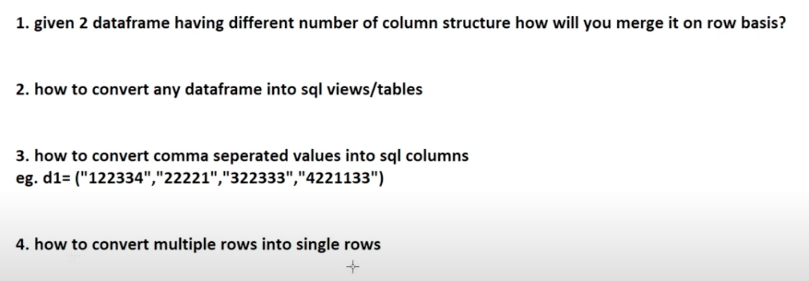
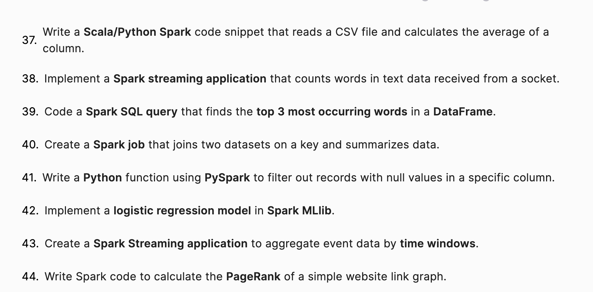
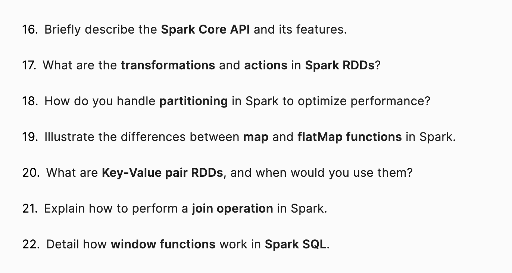
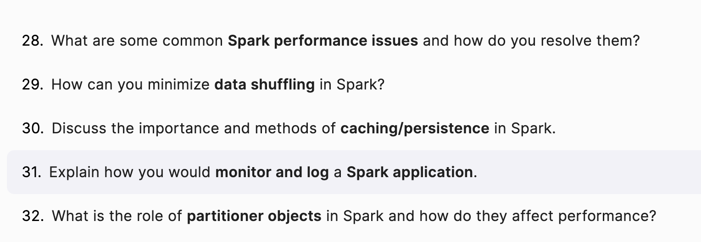

---

-   [55 Apache Spark interview questions: Devinterview.io - Apache Spark](https://devinterview.io/questions/machine-learning-and-data-science/apache-spark-interview-questions)

---

### Apache Spark Fundamentals

<details><summary style="font-size:18px;color:#C71585">What are the main components of Apache Spark architecture?</summary>

Apache Spark's architecture consists of several key components that work together to process large-scale data in a distributed manner. Here are the main components:

1. **Driver**:

    - The **Driver** program is the main control node of a Spark application.
    - It defines the `SparkContext` and schedules tasks on the worker nodes.
    - The driver is responsible for:
        - Converting a user’s application into directed acyclic graph (DAG) of stages and tasks.
        - Distributing tasks across the executor nodes.
        - Collecting and aggregating results from executors.

2. **Cluster Manager**:

    - The **Cluster Manager** is responsible for resource management across a Spark cluster.
    - Spark supports several types of cluster managers:
        - **Standalone mode**: Spark’s built-in cluster manager.
        - **YARN (Hadoop Cluster Manager)**: Often used in Hadoop ecosystems.
        - **Mesos**: A general-purpose cluster manager.
        - **Kubernetes**: For containerized deployments.
    - The cluster manager provides resources (CPU, memory) to run the executors.

3. **Executors**:

    - **Executors** are worker nodes responsible for running tasks assigned by the driver.
    - Each Spark application has its own set of executors.
    - They handle:
        - Executing code on worker nodes.
        - Storing data in memory or disk (RDDs, DataFrames, etc.).
        - Communicating results back to the driver.

4. **Tasks**:

    - A **task** is a unit of execution in Spark.
    - The driver divides the work (jobs) into multiple tasks, which are then distributed across the executors.
    - Tasks operate on partitions of data and perform transformations (like `map`, `filter`, `reduce`, etc.).

5. **Jobs and Stages**:

    - **Jobs** are triggered by an action (like `collect()`, `count()`, or `save()`).
    - Each job is broken down into multiple **stages**, where each stage is a set of parallel tasks that are executed across the cluster.

6. **RDD (Resilient Distributed Dataset) / DataFrame / Dataset**:

    - **RDD**: The core abstraction in Spark, which represents an immutable distributed collection of objects that can be processed in parallel.
    - **DataFrame**: Higher-level abstraction built on top of RDDs that provides optimized query execution through Spark’s Catalyst optimizer.
    - **Dataset**: Provides type-safe, object-oriented API, combining the benefits of RDDs and DataFrames.

7. **Transformations and Actions**:

    - **Transformations**: Operations that return a new RDD/DataFrame/Dataset. They are lazy, meaning they are not executed until an action is called (e.g., `map()`, `filter()`, `flatMap()`).
    - **Actions**: Operations that trigger execution and return results to the driver or save output to external storage (e.g., `collect()`, `count()`, `save()`).

8. **Storage Layer**:
    - Spark can persist RDDs/DataFrames in memory (as memory storage) or on disk (in the file system like HDFS, S3, etc.).
    - By caching data in memory, Spark can achieve high-speed iterative computation.

These components work together to enable Spark to process large datasets efficiently in a distributed manner.

</details>

<details><summary style="font-size:18px;color:#C71585">What is Apache Spark, and how does it differ from Hadoop MapReduce?</summary>

**Apache Spark** is an open-source, distributed computing framework for big data processing, known for its fast, in-memory data processing capabilities. Unlike Hadoop MapReduce, which writes intermediate data to disk between processing steps, Spark processes data in-memory, allowing for much faster computation for iterative algorithms and interactive queries. Spark also supports a wide range of workloads, including batch processing, streaming, machine learning, and graph processing, whereas MapReduce is primarily focused on batch processing.

Key differences:

-   **Performance**: Spark is generally much faster due to in-memory processing, whereas MapReduce involves more disk I/O.
-   **Ease of Use**: Spark supports high-level APIs (like DataFrames and Datasets) and provides interactive shells (Scala, Python, R), while MapReduce requires more low-level programming.
-   **Flexibility**: Spark supports various types of analytics (batch, streaming, etc.) in a unified framework, while MapReduce focuses primarily on batch jobs.

</details>

<details><summary style="font-size:18px;color:#C71585">What are RDDs in Spark, and why are they important?</summary>

**RDDs (Resilient Distributed Datasets)** are the core data structure in Spark, representing an immutable, distributed collection of objects that can be processed in parallel. They provide fault tolerance and efficient data processing by tracking lineage (the sequence of operations that produced the RDD).

Key properties of RDDs:

-   **Immutability**: Once created, RDDs cannot be changed; transformations create new RDDs.
-   **Distributed**: RDDs are partitioned across different nodes in the cluster.
-   **Fault tolerance**: Spark automatically recomputes lost partitions of RDDs using the lineage graph in case of node failures.
-   **Lazy evaluation**: Operations on RDDs are lazily evaluated until an action triggers their execution.

RDDs are important because they enable efficient parallel processing, fault tolerance, and provide the foundational abstraction for other higher-level APIs like DataFrames and Datasets.

</details>

<details><summary style="font-size:18px;color:#C71585">What is the difference between RDD, DataFrame, and Dataset in Spark?</summary>

| **Feature**           | **RDD**                                   | **DataFrame**                               | **Dataset**                             |
| --------------------- | ----------------------------------------- | ------------------------------------------- | --------------------------------------- |
| **Abstraction Level** | Low-level (closer to raw data)            | High-level (like a table in a database)     | High-level (typed, optimized DataFrame) |
| **Type Safety**       | No type safety                            | No type safety (Row objects)                | Type-safe (strongly-typed)              |
| **Optimizations**     | Minimal optimizations                     | Catalyst Optimizer for query optimization   | Catalyst Optimizer + Tungsten Engine    |
| **APIs**              | Scala, Java, Python                       | Scala, Java, Python, R                      | Scala, Java                             |
| **Transformations**   | Function-based (like `map()`, `filter()`) | SQL-like API (like `select()`, `groupBy()`) | SQL-like API with type safety           |

-   **RDD**: The core, low-level API for handling distributed data with minimal optimization.
-   **DataFrame**: A higher-level, tabular data structure, providing optimizations through the Catalyst Optimizer and allowing SQL-like operations.
-   **Dataset**: Combines the benefits of RDDs and DataFrames by providing both typed, object-oriented programming (like RDDs) and optimization (like DataFrames).

</details>

<details><summary style="font-size:18px;color:#C71585">Explain the concept of <b>lazy evaluation</b> in Spark and why it is useful.</summary>

**Lazy evaluation** means that Spark does not execute transformations (like `map()` or `filter()`) immediately when they are called. Instead, it builds a logical execution plan (lineage graph) and waits until an **action** (such as `count()` or `collect()`) is triggered to begin executing the plan.

**Why it is useful**:

-   **Optimization**: Lazy evaluation allows Spark to optimize the entire execution plan by combining transformations and minimizing data movement (e.g., combining `map()` and `filter()` into one step).
-   **Fault Tolerance**: Since Spark builds a lineage graph of transformations, it knows how to recompute data if parts of the computation fail.
-   **Efficiency**: It avoids unnecessary computations by only executing the required transformations when an action is called.

</details>

<details><summary style="font-size:18px;color:#C71585">What are <b>transformations</b> and <b>actions</b> in Spark?</summary>

-   **Transformations**: These are operations that create a new RDD or DataFrame from an existing one but are **lazy** (i.e., they don't immediately execute). Examples include:

    -   `map()`, `filter()`, `flatMap()`
    -   `groupBy()`, `distinct()`

    Transformations return a new RDD/DataFrame, and they build up the lineage graph until an action is called.

-   **Actions**: These trigger the execution of transformations and return results to the driver or write data to external storage. Examples include:
    -   `collect()`: Brings the data from distributed nodes to the driver.
    -   `count()`: Counts the elements in the dataset.
    -   `saveAsTextFile()`: Saves the dataset to an external file.

Actions execute the lazy transformations and are responsible for materializing the computation results.

</details>

<details><summary style="font-size:18px;color:#C71585">What is the role of the <b>Spark Driver</b> and <b>Spark Executors</b>?</summary>

-   **Spark Driver**: The driver program is responsible for:
    -   Defining and orchestrating the Spark job.
    -   Creating the **SparkContext**.
    -   Converting user transformations into a directed acyclic graph (DAG) of tasks.
    -   Scheduling tasks on different nodes (executors) in the cluster.
    -   Collecting results from the executors and reporting them to the user.
-   **Spark Executors**: These are the worker nodes in the cluster that:
    -   Execute tasks assigned by the driver.
    -   Store and manage data (either in-memory or on-disk, depending on caching).
    -   Report the status and results of computations back to the driver.

Together, the driver coordinates the job execution, while executors run the actual tasks on the data.

</details>

<details><summary style="font-size:18px;color:#C71585">How does Spark ensure <b>fault tolerance</b>?</summary>

Spark ensures fault tolerance using two main strategies:

1. **RDD Lineage**: Every RDD contains information about how it was derived from other RDDs through transformations. If a partition of an RDD is lost due to node failure, Spark can recompute the lost data by following the lineage of transformations, which ensures that the computation can continue even in the face of failures.

2. **Replication and Checkpointing**: In case of more complex applications where recomputation might be too costly, Spark allows data checkpointing. Checkpointing stores intermediate RDDs on a stable storage like HDFS, making them fault-tolerant.

</details>

<details><summary style="font-size:18px;color:#C71585">What is a <b>lineage graph</b> in Spark, and how does it help with fault tolerance?</summary>

A **lineage graph** (or RDD lineage) is a directed acyclic graph (DAG) that keeps track of the series of transformations that have been applied to an RDD to produce another RDD. It records the entire computation history, from the initial data source to the final RDD.

**How it helps with fault tolerance**:

-   If part of the RDD is lost (e.g., due to node failure), Spark uses the lineage graph to recompute the lost data from its original source or from intermediate RDDs, ensuring the computation can be completed without restarting the job.

The lineage graph is crucial for enabling Spark's ability to recover from failures without having to re-execute the entire job.

</details>

<details><summary style="font-size:18px;color:#C71585">What is <b>SparkContext</b>, and how does it relate to the Spark application?</summary>

**SparkContext** is the entry point for any Spark application. It represents a connection to a Spark cluster and coordinates the job execution on the cluster. Through the `SparkContext`, the driver program communicates with the cluster manager (YARN, Mesos, Kubernetes, etc.) to acquire resources and schedule tasks.

-   **Role in the Spark application**: The `SparkContext` is responsible for:
    -   Managing the cluster resources.
    -   Defining RDDs and transformations.
    -   Submitting tasks to the executors for processing.

In PySpark, `SparkSession` is a newer entry point that encapsulates the `SparkContext` along with other high-level APIs.

</details>

<details><summary style="color:magenta">What is a SparkSession in PySpark? How is it different from the SparkContext?</summary>

Introduced in Spark 2.0, SparkSession is the preferred entry point for creating PySpark applications. It acts as a unified interface, streamlining development by integrating and simplifying access to Spark's core functionalities:

-   `Structured Data Processing`: Work with DataFrames and Datasets, which offer higher-level abstractions for data manipulation compared to RDDs (Resilient Distributed Datasets) used in SparkContext.
-   `Spark SQL`: Execute SQL queries on structured data for efficient data analysis.
-   `Spark Streaming`: Process real-time data streams effectively.
-   `Machine Learning (MLlib)`: Leverage built-in machine learning algorithms and tools on your distributed data.

-   **Key Advantages of SparkSession**:

    -   `Unified Entry Point`: No need to create separate contexts (SparkContext, SQLContext, HiveContext) as in older Spark versions. This reduces boilerplate code and simplifies application structure.
    -   `Higher-Level APIs`: Structured data (DataFrames, Datasets) provide a more intuitive and SQL-like way to interact with your data, enhancing readability and maintainability.
    -   `Improved Efficiency`: SparkSession optimizes resource utilization and can perform some operations more efficiently under the hood.

-   **Differences from SparkContext**:

    -   `Lower Level vs. Higher Level`: SparkContext offers low-level access to Spark's internals, allowing for fine-grained control over RDDs and cluster management. SparkSession, on the other hand, provides a higher-level abstraction, focusing on working with structured data in a more user-friendly manner.
    -   `Focus`: SparkContext emphasizes working with RDDs for distributed data processing. SparkSession prioritizes DataFrames and Datasets, making it better suited for structured data analysis and machine learning tasks.
    -   `Use Cases`: While SparkSession is generally recommended, SparkContext might still be useful in a few scenarios:
        -   Advanced RDD operations or low-level optimizations not readily available with DataFrames/Datasets.
        -   Backward compatibility with older PySpark applications that relied on SparkContext.

-   **When to Use SparkSession vs. SparkContext**: In most cases, use SparkSession for modern PySpark development. It simplifies application development, offers higher-level abstractions, and is generally more efficient for structured data processing. However, if you have specific requirements involving RDDs or need to maintain compatibility with older code, SparkContext might be necessary.

</details>

<details><summary style="font-size:18px;color:#C71585">What is the difference between <b>batch processing</b> and <b>stream processing</b> in Spark?</summary>

-   **Batch processing**: Processes a large dataset that has been collected over time. In Spark, batch processing is done using RDDs, DataFrames, or Datasets, where operations like transformations and actions are applied to the entire dataset at once.
    -   **Use case**: Analyzing historical data, ETL jobs.
-   **Stream processing**: Processes data continuously as it arrives in real-time. In Spark, stream processing is handled by **Spark Streaming** or **Structured Streaming**, where data is processed incrementally and on-the-fly.
    -   **Use case**: Real-time analytics, monitoring, event detection.

In Spark, batch processing is ideal for static, historical data, while stream processing is used for handling real-time, continuous data streams.

</details>

### PySpark Specific Questions

<details><summary style="font-size:18px;color:#C71585">What is </b>PySpark</b>, and how is it different from other Spark APIs?</summary>

**PySpark** is the Python API for Apache Spark, allowing developers to leverage Spark’s distributed computing capabilities using Python. It provides Python bindings for Spark, which means you can write Spark applications using Python rather than Scala or Java (the native languages for Spark).

Key differences from other Spark APIs:

-   **Language**: PySpark uses Python, while the native Spark API is written in Scala, and Spark also has APIs for Java and R.
-   **Interoperability**: PySpark enables Python developers to utilize Spark’s powerful data processing engine without learning Scala or Java.
-   **Ease of Use**: PySpark provides a Pythonic interface for manipulating DataFrames, RDDs, and using machine learning libraries, making it more intuitive for Python users.

While PySpark provides the same functionality as the Scala or Java APIs, it has some performance overhead due to Python's dynamic nature and the need for data serialization between the Python and JVM runtimes.

</details>

<details><summary style="font-size:18px;color:#C71585">How do you create an RDD in PySpark, and what are the key methods for manipulating RDDs?</summary>

You can create an RDD in PySpark in several ways:

1. **Parallelizing a collection**:

    ```python
    rdd = spark.sparkContext.parallelize([1, 2, 3, 4, 5])
    ```

2. **Reading an external file**:
    ```python
    rdd = spark.sparkContext.textFile("path_to_file.txt")
    ```

Key methods for manipulating RDDs:

-   **Transformations** (lazy operations that return a new RDD):

    -   `map()`: Applies a function to each element in the RDD.
        ```python
        rdd.map(lambda x: x * 2)
        ```
    -   `filter()`: Filters elements based on a condition.
        ```python
        rdd.filter(lambda x: x % 2 == 0)
        ```
    -   `flatMap()`: Similar to `map()`, but flattens the result.
        ```python
        rdd.flatMap(lambda x: x.split(" "))
        ```
    -   `reduceByKey()`: Aggregates values by key for key-value pair RDDs.
        ```python
        rdd.reduceByKey(lambda x, y: x + y)
        ```

-   **Actions** (trigger the execution of transformations):
    -   `collect()`: Returns all elements of the RDD to the driver.
    -   `count()`: Returns the number of elements in the RDD.
    -   `reduce()`: Combines all elements using a specified function.
        ```python
        rdd.reduce(lambda x, y: x + y)
        ```

</details>

<details><summary style="font-size:18px;color:#C71585">How can you create a DataFrame in PySpark?</summary>

You can create a DataFrame in PySpark in several ways:

1. **From an existing RDD**:

    ```python
    rdd = spark.sparkContext.parallelize([("John", 28), ("Doe", 33)])
    df = rdd.toDF(["Name", "Age"])
    ```

2. **From a list of tuples**:

    ```python
    data = [("John", 28), ("Doe", 33)]
    df = spark.createDataFrame(data, ["Name", "Age"])
    ```

3. **From reading external files**:
    - **CSV**:
        ```python
        df = spark.read.csv("path_to_csv_file.csv", header=True, inferSchema=True)
        ```
    - **Parquet**:
        ```python
        df = spark.read.parquet("path_to_parquet_file.parquet")
        ```

DataFrames are the most commonly used data structure in PySpark due to their optimization features and ease of use.

</details>

<details><summary style="font-size:18px;color:#C71585">Explain the role of the <b>SparkSession</b> in PySpark.</summary>

The **SparkSession** is the entry point to any PySpark application. It provides a unified interface for interacting with Spark, including creating DataFrames, accessing SQL functionality, working with RDDs, and reading data from different sources (e.g., CSV, JSON, Parquet).

-   **Initialization**: In PySpark, the `SparkSession` object replaces the older `SparkContext` and `SQLContext` in newer versions of Spark.

    ```python
    from pyspark.sql import SparkSession
    spark = SparkSession.builder.appName("MyApp").getOrCreate()
    ```

-   **Role**: The `SparkSession` manages Spark’s resources and provides methods to create RDDs, DataFrames, and Datasets, as well as to interact with Hive, run SQL queries, and perform various other Spark operations.

</details>

<details><summary style="font-size:18px;color:#C71585">How do you read data from CSV, Parquet, and other formats in PySpark?</summary>

In PySpark, you can read data from various formats using the `spark.read` API:

-   **CSV**:

    ```python
    df = spark.read.option("header", "true").csv("file_path.csv")
    ```

-   **Parquet**:

    ```python
    df = spark.read.parquet("file_path.parquet")
    ```

-   **JSON**:

    ```python
    df = spark.read.json("file_path.json")
    ```

-   **Avro** (requires the avro package):
    ```python
    df = spark.read.format("avro").load("file_path.avro")
    ```

The `.read` API also allows you to specify additional options like schema inference, delimiter, and column data types.

</details>

<details><summary style="font-size:18px;color:#C71585">What is the difference between <b>select()</b>, <b>filter()</b>, and <b>withColumn()</b> in PySpark?</summary>

-   **select()**: Used to select specific columns from a DataFrame.

    ```python
    df.select("column1", "column2").show()
    ```

-   **filter()**: Used to filter rows based on a condition.

    ```python
    df.filter(df["age"] > 30).show()
    ```

-   **withColumn()**: Used to create a new column or modify an existing column. The new column can be derived using expressions.

    ```python
    from pyspark.sql.functions import col, lit

    df.withColumn("new_column", col("existing_column") * 2).show()
    ```

**select()** is for column projection, **filter()** is for row selection based on conditions, and **withColumn()** is used for creating or modifying columns.

</details>

<details><summary style="font-size:18px;color:#C71585">What is a <b>PySpark UDF</b>, and how do you define one?</summary>

A **UDF (User-Defined Function)** in PySpark is a way to define custom functions to apply to DataFrame columns. Since PySpark operates on distributed data, UDFs are needed to apply non-standard transformations or logic that isn't available in the built-in functions.

To define a UDF:

1. Import the necessary modules.
2. Use the `udf()` function to register the custom function as a UDF.

-   Example:

    ```python
    from pyspark.sql.functions import udf
    from pyspark.sql.types import IntegerType

    # Define a Python function
    def multiply_by_two(x):
        return x * 2

    # Register it as a UDF
    multiply_udf = udf(multiply_by_two, IntegerType())

    # Use it in DataFrame transformations
    df.withColumn("new_column", multiply_udf(df["existing_column"])).show()
    ```

</details>

<details><summary style="font-size:18px;color:#C71585">How do you handle <b>null values</b> in PySpark DataFrames?</summary>

You can handle **null values** in PySpark using a variety of methods:

-   **Drop null values**:

    -   Drop rows with any nulls:
        ```python
        df.na.drop().show()
        ```
    -   Drop rows if a specific column is null:
        ```python
        df.na.drop(subset=["column_name"]).show()
        ```

-   **Fill null values**:

    -   Fill all null values with a default value:
        ```python
        df.na.fill("default_value").show()
        ```
    -   Fill nulls in specific columns:
        ```python
        df.na.fill({"column1": "default1", "column2": "default2"}).show()
        ```

-   **Replace null values with expressions**:

    ```python
    from pyspark.sql.functions import when, col

    df.withColumn("column", when(col("column").isNull(), "default_value").otherwise(col("column"))).show()
    ```

</details>

<details><summary style="font-size:18px;color:#C71585">What is the role of <b>broadcast variables</b> in PySpark, and when would you use them?</summary>

**Broadcast variables** are used to efficiently distribute large read-only data (e.g., lookup tables) to all worker nodes in a PySpark application. By broadcasting the data, Spark ensures that the data is copied only once to each worker, instead of being sent repeatedly with every task.

**Use cases**:

-   When you have a small dataset (e.g., a lookup table) that needs to be used by all tasks in the cluster, broadcasting it prevents redundant data transfer and reduces overhead.

-   Example:
    ```python
    broadcasted_var = spark.sparkContext.broadcast(lookup_table)
    ```

</details>

<details><summary style="font-size:18px;color:#C71585">Explain how <b>accumulators</b> work in PySpark.</summary>

**Accumulators** are shared variables used for aggregating values across different tasks in PySpark. They are mainly used for counting or summing operations across a cluster.

Accumulators can only be modified by tasks, and the changes are automatically sent to the driver. However, they are write-only in the tasks, and the final value can only be accessed on the driver.

-   Example:
    ```python
    accum = spark
    ```

.sparkContext.accumulator(0)

def add_to_accum(x):
accum.add(x)

rdd.foreach(add_to_accum)
print(accum.value)

````

</details>

<details><summary style="font-size:18px;color:#C71585">How do you <b>join</b> DataFrames in PySpark, and what are the different types of joins?</summary>

You can join DataFrames in PySpark using the `join()` method, which supports different types of joins such as **inner**, **left**, **right**, and **outer** joins.

- Example:
```python
df1.join(df2, df1["id"] == df2["id"], "inner").show()
````

Different types of joins:

-   **Inner Join**: Returns rows that have matching values in both DataFrames.

    ```python
    df1.join(df2, "id", "inner").show()
    ```

-   **Left Join** (Left Outer Join): Returns all rows from the left DataFrame and matching rows from the right DataFrame.

    ```python
    df1.join(df2, "id", "left").show()
    ```

-   **Right Join** (Right Outer Join): Returns all rows from the right DataFrame and matching rows from the left DataFrame.

    ```python
    df1.join(df2, "id", "right").show()
    ```

-   **Full Outer Join**: Returns all rows when there is a match in either DataFrame.
    ```python
    df1.join(df2, "id", "outer").show()
    ```

</details>

<details><summary style="font-size:18px;color:#C71585">What is <b>Spark SQL</b>, and how does it differ from other components of Spark?</summary>

**Spark SQL** is a component of Apache Spark designed for processing structured and semi-structured data using SQL queries. It allows querying data stored in Spark using SQL syntax and provides a DataFrame API that offers a more concise, optimized way to interact with data compared to RDDs.

Key differences:

-   **Higher-level abstraction**: Spark SQL abstracts away the lower-level RDD API and provides a more user-friendly interface with DataFrames and Datasets, enabling users to write queries in SQL or DataFrame API.
-   **Optimizations**: Spark SQL employs the **Catalyst Optimizer** to optimize query execution plans automatically, making it more efficient than manually writing RDD operations.
-   **Interoperability**: Spark SQL allows seamless integration with a variety of data sources like Hive, JDBC, Parquet, JSON, and ORC, enabling SQL-style queries on various formats without needing to convert them into RDDs first.

</details>

<details><summary style="font-size:18px;color:#C71585">How does PySpark handle <b>schema inference</b> when reading data?</summary>

In PySpark, **schema inference** refers to the automatic detection of the data structure (i.e., the names and data types of columns) when reading structured data formats like CSV, JSON, Parquet, or ORC. This is particularly useful when the schema is not explicitly provided.

-   **CSV/JSON**: When reading CSV or JSON files using functions like `spark.read.csv()` or `spark.read.json()`, PySpark attempts to infer the schema by reading a sample of the data.

    -   Example:
        ```python
        df = spark.read.option("inferSchema", "true").csv("file.csv")
        ```
        In this case, PySpark will examine the first few rows of the file to infer the data types for each column.

-   **Parquet/ORC**: For formats like Parquet or ORC, schema information is embedded in the file format itself, so schema inference happens automatically without needing to analyze the data.

While schema inference is convenient, it can sometimes be slower for large datasets, and it's often recommended to define the schema explicitly for better performance and accuracy.

</details>

<details><summary style="font-size:18px;color:#C71585">How do you perform <b>groupBy</b> and <b>aggregate</b> operations in PySpark?</summary>

In PySpark, you can perform **groupBy** and **aggregate** operations using the DataFrame API's `groupBy()` and aggregation functions like `sum()`, `avg()`, `count()`, etc.

-   **groupBy()**: Groups the DataFrame by specified columns, which can then be followed by aggregate functions to compute metrics on the groups.
-   Example: Performing a `groupBy` operation and calculating the average value of a column:

    ```python
    df.groupBy("column1").agg({"column2": "avg"}).show()
    ```

    You can also use specific aggregation functions directly:

    ```python
    from pyspark.sql.functions import sum, avg

    df.groupBy("column1").agg(sum("column2").alias("total"), avg("column3").alias("average")).show()
    ```

**groupBy** creates a grouped DataFrame, and **agg** applies one or more aggregation functions like `sum()`, `count()`, `max()`, or `avg()` on the grouped data.

</details>

<details><summary style="font-size:18px;color:#C71585">What is <b>Catalyst Optimizer</b> in Spark SQL, and how does it work?</summary>

The **Catalyst Optimizer** is Spark SQL's query optimization framework designed to enhance the execution of SQL queries and DataFrame operations. It performs both logical and physical query plan optimizations.

**How it works**:

1. **Logical Plan Generation**: When you execute a query, Spark SQL first parses it into a **logical plan**, which describes the data processing steps without concern for how they will be executed.
2. **Optimization**: The logical plan is then optimized using a series of rules. These optimizations include:
    - **Predicate pushdown**: Pushes filters closer to the data source to reduce the volume of data read.
    - **Projection pruning**: Removes unnecessary columns from being read or processed.
    - **Join optimization**: Reorders joins to reduce data shuffling.
3. **Physical Plan**: After optimization, Catalyst generates multiple **physical plans** (how the query will be executed on the cluster) and selects the most efficient one based on cost metrics.
4. **Execution**: Spark executes the optimized physical plan on the cluster.

The Catalyst Optimizer ensures that SQL queries and DataFrame operations are executed efficiently, minimizing resource consumption and improving job performance.

</details>

<details><summary style="font-size:18px;color:#C71585">How do you use <b>SQL queries</b> within PySpark?</summary>

In PySpark, you can run **SQL queries** on DataFrames by registering them as **temporary views** or **global views** and then querying them using SQL syntax.

Steps to run SQL queries in PySpark:

1. **Register a DataFrame as a temporary view**:

    ```python
    df.createOrReplaceTempView("my_table")
    ```

2. **Execute SQL queries** using the `spark.sql()` method:

    ```python
    result = spark.sql("SELECT column1, SUM(column2) FROM my_table GROUP BY column1")
    result.show()
    ```

3. You can also run complex SQL queries that involve joins, aggregations, and window functions using the `spark.sql()` API.

This feature allows users to mix SQL with DataFrame API seamlessly within the same application, making it easier for users familiar with SQL to work with large datasets.

</details>

<details><summary style="font-size:18px;color:#C71585">What are <b>window functions</b>, and how are they used in Spark SQL?</summary>

**Window functions** in Spark SQL allow you to perform calculations across a set of rows related to the current row, providing more advanced aggregations and analysis over subsets of data (windows). Unlike standard aggregations that collapse rows, window functions allow you to retain all rows while applying the function.

**Common window functions**:

-   **Ranking functions**: `row_number()`, `rank()`, `dense_rank()`
-   **Aggregate functions**: `sum()`, `avg()`, `count()`, `min()`, `max()`
-   **Analytical functions**: `lead()`, `lag()`, `ntile()`

**Usage**:
Window functions are typically used with a `PARTITION BY` clause (to define the window or subset of rows) and an `ORDER BY` clause (to define the ordering within each partition).

-   Example: Using a `row_number()` window function to rank rows within each partition:

    ```python
    from pyspark.sql.window import Window
    from pyspark.sql.functions import row_number

    windowSpec = Window.partitionBy("column1").orderBy("column2")

    df.withColumn("rank", row_number().over(windowSpec)).show()
    ```

**Use cases**:

-   Calculating running totals or moving averages.
-   Ranking data within partitions (e.g., ranking sales by region).
-   Comparing current rows with previous or next rows using `lead()` and `lag()`.

Window functions are powerful for performing advanced data analysis while maintaining the structure of the original dataset.

</details>

### Spark Performance Optimization

<details><summary style="font-size:18px;color:#C71585"> What are some key strategies for optimizing Spark jobs?</summary>

1. **Avoid wide transformations**: Wide transformations (like `groupByKey`, `reduceByKey`) involve shuffling data across nodes, which is costly. Use narrow transformations (like `map`, `filter`) when possible.
1. **Reduce data shuffling**: Minimize shuffling by using appropriate joins, aggregations, and repartitioning strategies.
1. **Use caching**: Cache frequently accessed data (`persist()` or `cache()`) to reduce recomputation.
1. **Broadcast joins**: Use **broadcast joins** when one of the datasets is small to avoid shuffling the larger dataset.
1. **Tune partitioning**: Optimize the number of partitions for parallelism by using `repartition()` or `coalesce()` based on the size of the data and cluster resources.
1. **Avoid using too many UDFs**: User-defined functions (UDFs) can cause serialization overhead. Leverage Spark's built-in functions, which are optimized and distributed.
1. **Optimize serialization**: Use efficient serialization formats (Kryo) instead of default Java serialization for faster serialization/deserialization.
1. **Avoid skewed data**: If a few keys have much larger data, it can lead to skew and performance degradation. Use `salting` techniques or other partitioning strategies to balance data distribution.
1. **Manage garbage collection (GC)**: Tuning the GC parameters in JVM can improve memory management, especially for long-running Spark jobs.
1. **Use the Catalyst optimizer**: Ensure the logical plan for Spark SQL queries is optimized. This is automatically done by Spark’s Catalyst optimizer.

</details>

<details><summary style="font-size:18px;color:#C71585"> What is data shuffling, and how does it impact performance in Spark?</summary>

**Data shuffling** is the process of redistributing data across different partitions and nodes in the cluster, which happens during wide transformations like `groupByKey`, `join`, or `repartition`. When Spark shuffles data, it involves:

1. **Reading**: The output of each partition is read by all other partitions that need it.
2. **Sorting**: Data is sorted to ensure it ends up in the right partition.
3. **Writing**: The data is written to disk or transferred over the network.

**Impact on performance**:

-   **Network and disk I/O**: Since shuffling involves data transfer over the network or disk writes, it significantly increases execution time.
-   **Resource consumption**: It consumes additional CPU, memory, and disk resources, increasing overhead.
-   **Stragglers**: Some tasks may take much longer than others due to imbalanced data distribution, which can slow down the entire job.

Reducing shuffling is key to improving Spark job performance.

</details>

<details><summary style="font-size:18px;color:#C71585"> How can you minimize shuffling in Spark?</summary>

1. **Use reduceByKey instead of groupByKey**: `reduceByKey` combines values locally before sending them across the network, minimizing data transfer, whereas `groupByKey` shuffles all values.
1. **Use map-side reductions**: Perform local aggregations before shuffling data across the network. For example, using `combineByKey()` for local reductions can help reduce data movement.
1. **Partition your data intelligently**: Ensure data is partitioned in such a way that related data is on the same node to avoid unnecessary data movement. Use `partitionBy()` for RDDs and `repartition()` or `coalesce()` for DataFrames.
1. **Broadcast joins**: Broadcast smaller datasets to all nodes, avoiding shuffling for joins involving small datasets.
1. **Avoid using `distinct()` or `sortBy()` without necessity**: These operations require shuffling all the data across partitions, which can be expensive.
1. **Repartition data sparingly**: While repartitioning can help performance in some cases, unnecessary repartitioning can cause extra shuffles. Use it only when needed.
1. **Use efficient joins**: Instead of using a standard join, use specialized methods like `broadcast join` or `skew join` to handle skewed data and minimize shuffling.

</details>

<details><summary style="font-size:18px;color:#C71585"> How does Spark caching work, and when would you use it?</summary>

Spark caching (using `cache()` or `persist()`) stores intermediate RDDs or DataFrames in memory for reuse in later stages of the same job or future jobs. Caching helps avoid recomputing the same data multiple times.

-   **How caching works**: When you cache an RDD/DataFrame, Spark materializes it in memory (or optionally on disk) when it is computed for the first time. Future actions that refer to this data can retrieve it from memory, speeding up the job.
-   **When to use it**:
    -   When an RDD/DataFrame is used multiple times in a Spark job, caching prevents it from being recomputed each time.
    -   When there are iterative algorithms (like in machine learning) where intermediate results are repeatedly used across iterations.
    -   When working with large datasets that are expensive to recompute but fit within memory.

Caching improves performance by reducing CPU cycles and avoiding disk I/O or network communication.

</details>

<details><summary style="font-size:18px;color:#C71585"> Explain the role of the Tungsten engine in Spark.</summary>

The **Tungsten engine** is a major Spark optimization framework introduced in Spark 1.5 to improve the efficiency of Spark jobs by optimizing memory and CPU usage. Tungsten focuses on three areas:

1. **Memory management**: Tungsten uses **off-heap memory** management to allow fine-grained control of memory usage, minimizing Java garbage collection (GC) overhead. It manages memory allocation manually instead of relying on the JVM’s automatic memory management.
2. **Code generation**: Tungsten uses **whole-stage code generation** to compile transformations into a single optimized physical plan, generating Java bytecode at runtime, reducing the number of virtual function calls and thus increasing performance.
3. **Cache-aware computation**: Tungsten optimizes CPU usage by ensuring cache-friendly access patterns for operations, reducing the time spent waiting for data in memory.

By using these optimizations, Tungsten significantly boosts the performance of Spark, especially for computationally intensive jobs.

</details>

<details><summary style="font-size:18px;color:#C71585"> How do you optimize the number of partitions in Spark?</summary>

Optimizing the number of partitions in Spark ensures better parallelism and balanced workload across the cluster, improving performance.

1. **Too few partitions**: Results in under-utilization of cluster resources, as only a few cores may be used.
2. **Too many partitions**: Increases overhead in managing many small tasks, leading to unnecessary task scheduling overhead and slow performance.

**Guidelines for partitioning**:

-   **For HDFS files**: Spark typically creates partitions based on block sizes in HDFS (128 MB or 256 MB). You can tune it by specifying `repartition()` or `coalesce()`.
-   **Cluster resources**: The number of partitions should roughly match the number of cores in the cluster. For example, 2-4 partitions per CPU core is often a good starting point.
-   **Repartitioning**: Use `repartition()` to increase the number of partitions and `coalesce()` to reduce them when necessary. `repartition()` shuffles data, while `coalesce()` minimizes shuffling.
-   **Data size**: Larger datasets typically require more partitions to spread the data evenly across the cluster.

</details>

<details><summary style="font-size:18px;color:#C71585"> What is <b>speculative execution</b> in Spark, and when is it useful?</summary>

**Speculative execution** in Spark is a mechanism to handle straggler tasks, which are tasks that take much longer than others to complete. Speculative execution allows Spark to detect slow-running tasks and launch duplicate copies of those tasks on other nodes. The task that finishes first (original or speculative) will be taken as the result, and the slower-running task will be killed.

-   **When is it useful?**
    -   When there are uneven data distributions or **skewed data** that causes some tasks to run longer than others.
    -   In environments where hardware failures or network issues cause certain nodes to run slower, speculative execution helps ensure faster job completion.

Speculative execution improves the reliability and speed of Spark jobs by preventing a few slow tasks from dragging down the entire job completion time.

</details>

0. what is the difference between partition and bucketing.
1. How can **broadcast joins** help optimize performance in Spark?
2. Explain the concept of **narrow** and **wide transformations** in Spark.
3. What is the difference between **repartition()** and **coalesce()** in PySpark?

### Advanced Spark Concepts

1. How does Spark **fault tolerance** work at the RDD level?
2. What are **broadcast variables** and **accumulators** in Spark?
3. How do you handle **skewed data** in Spark jobs?
4. Explain **backpressure handling** in Spark Streaming.
5. What is the role of **Kafka** in Spark Streaming, and how do you integrate it with Spark?
6. How do you manage **stateful processing** in Spark Streaming?

### Cluster Management and Deployment

1. How do you deploy a Spark application on **YARN**, **Mesos**, or **Kubernetes**?
2. What is the role of the **cluster manager** in Spark?
3. How does **dynamic allocation** of resources work in Spark?
4. What is **local mode**, and when would you use it in Spark?
5. What is the significance of **parallelism** in Spark, and how do you control it?

### Spark Streaming

1. What is **Spark Streaming**, and how is it different from structured streaming?
2. What are **DStreams** in Spark Streaming, and how do they differ from RDDs?
3. How does **Spark Structured Streaming** work with DataFrames and Datasets?
4. What is **checkpointing** in Spark Streaming, and why is it important?
5. How do you handle **stateful operations** in Spark Structured Streaming?

### Data Sources and Integration

1. How do you integrate **Spark with Hive** for querying structured data?
2. How do you write data from Spark to a **JDBC data source**?
3. How do you connect Spark with **HBase** for NoSQL storage?
4. What is **Parquet**, and why is it a preferred format in Spark?
5. How do you load and process data from **AWS S3** in Spark?
6. What are the advantages of using **Delta Lake** with Spark?

<details><summary style="font-size:20px;color:Orange">Short Interview Questions and Answer</summary>

1.  <b style="color:magenta">What is PySpark?</b>

    -   PySpark is the Python API for Apache Spark, an open-source distributed computing system. It allows Python developers to leverage the power of Spark for large-scale data processing, machine learning, and analytics.

2.  <b style="color:magenta">Explain RDD in PySpark.</b>

    -   Resilient Distributed Datasets (RDDs) are the fundamental data structures in PySpark. They are fault-tolerant, immutable collections of objects distributed across a cluster, allowing parallel processing.

3.  <b style="color:magenta">What is the difference between DataFrame and RDD in PySpark?</b>

    -   RDDs are low-level abstractions representing distributed collections, while DataFrames are higher-level abstractions providing a more structured and optimized API for data manipulation.

4.  <b style="color:magenta">How to create a DataFrame in PySpark?</b>

    -   You can create a DataFrame from an existing RDD or by reading data from various sources like CSV, JSON, or Parquet files. Example:

        ```python
        from pyspark.sql import SparkSession
        spark = SparkSession.builder.appName("example").getOrCreate()
        df = spark.read.csv("file.csv", header=True, inferSchema=True)
        ```

5.  <b style="color:magenta">What is SparkContext in PySpark?</b>

    -   SparkContext is the entry point for any Spark functionality. It coordinates the execution of Spark jobs and provides access to the cluster.

6.  <b style="color:magenta">What is Lazy Evaluation in PySpark?</b>

    -   Lazy Evaluation means that the execution of operations is delayed until the result is actually needed. It helps optimize the execution plan and improve performance.

7.  <b style="color:magenta">Explain the concept of Partitions in PySpark.</b>

    -   Partitions are the basic units of parallelism in RDDs. They represent smaller, distributed subsets of data that can be processed independently across a cluster.

8.  <b style="color:magenta">How can you optimize PySpark jobs for better performance?</b>

    -   Optimization techniques include using broadcast variables, appropriate data partitioning, caching, and avoiding unnecessary shuffling operations.

9.  <b style="color:magenta">What is a Broadcast Variable in PySpark?</b>

    -   A broadcast variable is a read-only variable cached on each machine rather than shipping a copy of it with tasks. It is useful for efficiently sharing large, read-only variables across tasks.

10. <b style="color:magenta">Explain the concept of Shuffling in PySpark.</b>

    -   Shuffling is the process of redistributing data across partitions, typically during operations that require data exchange between partitions, such as grouping or joining.

11. <b style="color:magenta">What is a SparkSession in PySpark?</b>

    -   SparkSession is the entry point for reading data and executing SQL queries in Spark. It consolidates the functionalities of SparkContext, SQLContext, and HiveContext.

12. <b style="color:magenta">How can you run SQL queries on a DataFrame in PySpark?</b>

    -   You can register a DataFrame as a temporary SQL table and then run SQL queries on it. Example:

        ```python
        df.createOrReplaceTempView("my_table")
        result = spark.sql("SELECT \* FROM my_table WHERE age > 21")
        ```

13. <b style="color:magenta">Explain the concept of UDF (User-Defined Function) in PySpark.</b>

    -   UDFs allow you to define your own functions and apply them to columns in DataFrames. They enable custom processing of data within PySpark transformations.

14. <b style="color:magenta">How does PySpark handle missing or null values?</b>

    -   PySpark provides functions like dropna() to remove rows with null values and fillna() to fill null values with specified values. Handling null values depends on the use case.

15. <b style="color:magenta">What is Caching in PySpark and why is it important?</b>

    -   Caching involves storing the intermediate or final results of transformations in memory, reducing the need to recompute them. It improves the performance of iterative algorithms.

16. <b style="color:magenta">What is the purpose of the `repartition()` and `coalesce()` operations in PySpark?</b>

    -   `repartition()` and `coalesce()` are used to change the number of partitions in an RDD or DataFrame. `repartition()` reshuffles the data, while `coalesce()` tries to minimize data movement.

17. <b style="color:magenta">Explain the concept of Window Functions in PySpark.</b>

    -   Window functions allow you to perform calculations across a specified range of rows related to the current row. They are useful for tasks like ranking and cumulative sums.

18. <b style="color:magenta">What is the purpose of the collect() action in PySpark?</b>

    -   The collect() action retrieves all elements of an RDD or DataFrame from the cluster to the driver program. It should be used cautiously with large datasets as it brings data to the driver.

19. <b style="color:magenta">How can you handle schema evolution in PySpark?</b>

    -   PySpark supports schema evolution by allowing you to specify options like mergeSchema when reading data. It helps accommodate changes in the structure of data over time.

20. <b style="color:magenta">Explain the significance of the Catalyst optimizer in PySpark.</b>

    -   Catalyst is the query optimizer in PySpark that performs query analysis, logical optimization, and physical planning. It helps generate an optimized execution plan for Spark jobs.

21. <b style="color:magenta">How can you perform a join operation between two DataFrames in PySpark?</b>

    -   You can perform joins using the join() method. Example:

        ```python
        result = df1.join(df2, df1["key"] == df2["key"], "inner")
        ```

22. <b style="color:magenta">What is the purpose of the `repartitionByRange()` operation in PySpark?</b>

    -   `repartitionByRange()` is used to repartition data based on a specified range of values. It is particularly useful for optimizing range-based queries.

23. <b style="color:magenta">Explain the concept of Broadcast Hash Join in PySpark.</b>

    -   Broadcast Hash Join is an optimization technique where smaller tables are broadcasted to all worker nodes, reducing the need for shuffling during join operations.

24. <b style="color:magenta">How can you handle large files in PySpark?</b>

    -   PySpark supports reading and processing large files by distributing

</details>

---

---

<details><summary style="font-size:18px;color:#C71585"> What is Apache Spark and what are its main components?</summary>

**Apache Spark** is a fast, in-memory big data processing engine that's widely used for data analytics, machine learning, and real-time streaming. It boasts impressive scalability and advanced features that enable it to handle a wide range of applications.

-   Why Choose Apache Spark?

    -   **Ease of use**: Developers can write applications in Java, Scala, Python, R, or SQL. Spark also integrates with SQL environments and data sources.

    -   **Speed**: Due to its in-memory processing, Spark can be up to 100 times faster than Hadoop MapReduce for certain applications.

    -   **Generality**: The engine is suitable for a broad range of scenarios, supporting batch data processing, real-time data streaming, and interactive querying.

    -   **Fault Tolerance**: Built-in redundancy safeguards your data.

    -   **Compatibility**: Spark can run on various platforms like Hadoop, Kubernetes, and Apache Mesos.

-   Key Components: Spark primarily works with distributed datasets—collections of data spread across multiple compute nodes. These datasets can be loaded and processed using different components of Spark:

    1. **Resilient Distributed Datasets (RDD)**: The core data structure of Spark, representing a distributed collection of elements across a cluster. You can create RDDs through data ingestion (like from files or external databases), map/filter functions, or transformations (like groupByKey) on other RDDs.

    2. **DataFrame and Dataset API**: Provides a higher-level abstraction on top of RDDs, representing distributed collections of data organized as named columns. DataFrames and Datasets offer benefits of rich optimizations, safety typing, and extensibility. They also integrate cleanly with data sources like Apache Hive or relational databases.

    3. **Spark Streaming**: Focuses on processing real-time data by breaking it into micro-batches that are then processed by Spark’s core engine.

    4. **Spark SQL**: A module for **structured data processing**, facilitating interoperability between various data formats and standard SQL operations.

    5. **MLlib**: A built-in library for machine learning, offering various algorithms and convenient utilities.

    6. **GraphX**: A dedicated module for graph processing.

    7. **SparkR and Sparklyr**: These two packages bring Spark capabilities to R.

    8. **Structured Streaming**: Unifies streaming and batch processing through the use of DataFrames, allowing data processing in real time.

-   Code Example:

```python
from pyspark.sql import SparkSession, Row

# Initialize a Spark session
spark = SparkSession.builder.appName("example").getOrCreate()

# Define a list of tuples as data
data = [("Alice", 34), ("Bob", 45), ("Carol", 28), ("Dave", 52)]
rdd = spark.sparkContext.parallelize(data)

# Convert RDD to DataFrame
df = rdd.map(lambda x: Row(name=x[0], age=int(x[1]))).toDF()

# Register DataFrame as a SQL table
df.createOrReplaceTempView("people")

# Perform a SQL query
result = spark.sql("SELECT * FROM people WHERE age > 40")
result.show()
```

</details>

<details><summary style="font-size:18px;color:#C71585">Explain how Apache Spark differs from <b>Hadoop MapReduce</b>.</summary>

**Apache Spark** can handle a wider range of data processing workloads than **Hadoop MapReduce**, thanks to its in-memory processing capabilities, optimized engine, and user-friendly APIs.

#### Components and Speed

-   **Hadoop MapReduce**: Reads input from disk, performs calculations, and writes results back to disk, creating multiple disk I/O operations.
-   **Apache Spark**: Utilizes memory for intermediate data storage, reducing disk I/O operations. This in-memory processing makes Spark significantly faster, especially for iterative algorithms and intricate workflows.

#### API Flexibility

-   **Hadoop MapReduce**: Primarily leverages Java and, to a lesser degree, other languages through Hadoop Streaming. This could lead to lacking type-safety, verbosity, and a steeper learning curve for developers using non-Java languages.
-   **Apache Spark**: Offers high-level APIs in multiple languages like Python, Scala, and Java, as well as SQL and DataFrames, making it more approachable for diverse user bases.

#### Programming Models

-   **Hadoop MapReduce**: Governed by strict, two-step map-reduce actions that necessitate explicit definition of map and reduce steps. While it's powerful for numerous use-cases, the rigidity might not be ideal for all analytic tasks.
-   **Apache Spark**: Brings flexibility through RDDs, which let data be processed multiple times in various ways, without mandating intermediate disk storage. Additional abstraction layers such as DataFrames and DataSets provide structure, schema enforcement, and optimizations.

#### Job Perspective

-   **Hadoop MapReduce**: Executes jobs in batches, presenting results only after a complete batch operation. This can be limiting when real-time or interactive analytics are required.
-   **Apache Spark**: Supports both batch and streaming data processing, allowing real-time, incremental computations, enhancing its versatility.

#### Ease of Use

-   **Hadoop MapReduce**: Typically requires the setup of a Hadoop cluster, resulting in longer development cycles.
-   **Apache Spark**: Can operate in independent mode, outside a cluster, for easier local development. It also integrates seamlessly with existing Hadoop data, enabling hybrid workflows.

#### Fault Tolerance and Caching

-   **Hadoop MapReduce**: Regains state from the initial data source in the event of task failure, potentially contributing to slower execution.
-   **Apache Spark**: Recovers lost state from resilient distributed datasets (RDDs) or other mechanisms, usually facilitating faster fault tolerant operations. Caching data in memory or on disk further boosts efficiency.

#### Ecosystem Integration

-   **Hadoop MapReduce**: A component of a more extensive Hadoop ecosystem, often necessitating the use of additional tools for tasks like interactive analytics (Hive), real-time processing (HBase, Storm).
-   **Apache Spark**: Bundles modules for SQL (Spark SQL), machine learning (MLlib), graph analytics (GraphX), and real-time processing (Structured Streaming), providing a comprehensive multitool ecosystem.

#### Latency Considerations

-   **Hadoop MapReduce**: Typically aims for high throughput, which can result in higher latency for individual operations.
-   **Apache Spark**: Offers flexibility for operations that prioritize lower latency over higher throughput, such as exploratory data analysis and interactive queries.

</details>

<details><summary style="font-size:18px;color:#C71585"> Describe the concept of RDDs (Resilient Distributed Datasets) in Spark.</summary>

**RDDs (Resilient Distributed Datasets)** in Apache Spark are the primary abstraction for distributing data across a cluster. They offer **fault tolerance** and can be constructed in a variety of ways.

#### RDD Characteristics

-   **Distributed**: Data in RDDs is divided into partitions, with each partition being stored and processed across nodes in the cluster.
-   **Resilient and Fault-Tolerant**: RDDs automatically recover from failures, as each partition can be recomputed from its lineage.

-   **Immutable**: After creation, RDDs are read-only, meaning they cannot be changed. This characteristic ensures consistency and simplifies data management across nodes.

-   **Lazy-Evaluated**: Transformations and actions on RDDs are computed only when an action is called, improving efficiency.

-   **Type-Homogeneous**: RDDs are aware of the data type of elements within them, providing type safety.

-   **Cached in Memory**: For improved performance, RDDs can be cached in memory across the cluster.

#### Core Operations

1. **Transformation**: These operations create a new RDD from an existing one. Transformations are lazy and are only executed when an action is called. Some examples include `map`, `filter`, and `groupByKey`.
2. **Action**: These operations initiate the execution of the sequence of transformations on the RDD and convert them into a result. Actions are not lazy and are immediately executed when called. Examples of actions include `reduce`, `collect`, and `saveAsTextFile`.

#### Lineage and Fault Tolerance

RDDs maintain a historical record of transformations that were used to build each dataset or partition. This history is known as **lineage** and allows Spark to recover lost data partitions by recomputing them from their parent RDDs. This mechanism ensures that RDDs are resilient and fault-tolerant.

#### Key Takeaways

-   **Data Abstraction**: RDDs provide a clear separation between data and computing logic. This abstraction allows for streamlined data distribution and parallel processing.
-   **Interoperability**: RDDs integrate well with external data sources, providing a uniform interface for data operations.
-   **Performance Considerations**: While RDDs offer fault tolerance and in-memory data caching, more recent data abstractions in Spark, such as DataFrames and Datasets, are optimized for performance, especially when used with the Spark SQL engine.

Due to the introduction of more evolved APIs like **DataFrames** and **Datasets**, RDDs are now less commonly used directly. However, they continue to serve as the foundational data structure in Spark and are leveraged internally by both DataFrames and Datasets.

</details>

<details><summary style="font-size:18px;color:#C71585"> What are DataFrames in Spark and how do they compare to RDDs?</summary>

**DataFrames** in Apache Spark are more efficient, structured, and optimized than RDDs as they provide a unified interface for both batch and real-time data processing.

#### Features

-   **Schema-Driven**: DataFrames offer metadata about their structure, which means no calculations for the computation engine.
-   **Optimizations through Catalyst Engine**: Spark performs operations on DataFrames and Datasets more efficiently using the Catalyst Optimizer.
-   **Performance**: DataFrames harness the power of Catalyst and Tungsten for up to 100x faster processing.

#### DataFrame vs. RDD Transformation Approach

-   **DataFrame**: The Catalyst Optimizer translates the high-level operations into an optimized set of low-level transformations, leveraging schema information.
-   **RDD**: Each transformation is defined using functions that operate on individual records. Type safety is typically ensured through programming paradigms like Scala, Java, or Python.

#### Example: Map-Reduce Join

In this example, both DataFrames and RDDs are used. It showcases how Catalyst optimizations apply to DataFrames.

```python
# DataFrame Approach
result_df = employee_df.join(salary_df, "employee_id")
result_df.show()

# RDD Approach
employee_rdd = sc.parallelize(["1,John", "2,Alice"])
salary_rdd = sc.parallelize(["1,50000", "2,60000"])

result_rdd = employee_rdd.map(lambda line: line.split(",")) \
                          .map(lambda record: (record[0], record[1])) \
                          .leftOuterJoin(salary_rdd.map(lambda l: l.split(","))) \
                          .map(lambda x: (x[0], x[1][0], x[1][1] if x[1][1] else 0))
result_rdd.collect()
```

</details>

<details><summary style="font-size:18px;color:#C71585">What is the significance of Spark SQL in Apache Spark? How does it relate to DataFrame?</summary>

**Spark SQL** is a core component of **Apache Spark** that allows users to run **SQL queries** on structured and semi-structured data. It provides an abstraction for working with structured data through SQL-like queries and also enables a smooth integration with other Spark functionalities. Spark SQL significantly enhances Spark's capabilities by providing a unified way to work with both **relational (structured)** and **programmatic (unstructured)** data.

Here’s a detailed explanation of **Spark SQL's significance** and how it relates to **DataFrame**:

### 1. **Significance of Spark SQL:**

#### a. **Unified Data Processing**

-   Spark SQL allows you to perform **relational operations** (such as querying, filtering, aggregations, and joins) on data. It can handle a variety of data sources, including:
    -   **Structured data** like relational databases (e.g., PostgreSQL, MySQL, etc.).
    -   **Semi-structured data** like JSON, Parquet, Avro, or Hive tables.
    -   **Unstructured data** through DataFrame transformations.

#### b. **Familiar SQL Interface**

-   Spark SQL provides a **SQL interface** that allows users to query data using familiar **SQL syntax**, making it accessible for users who are comfortable with databases but not necessarily familiar with programming languages like Scala, Java, or Python.
-   Users can execute SQL queries directly on structured data stored in Spark through the `spark.sql()` function, making it easy for data analysts and developers to interact with data using traditional SQL.

#### c. **Optimization via Catalyst Optimizer**

-   **Spark SQL** comes with a **Catalyst optimizer**, a highly efficient query optimization engine that:
    -   Automatically optimizes SQL queries.
    -   Converts logical plans (user-written queries) into **optimized execution plans**, ensuring that the queries run efficiently.
    -   It can push down operations (like filters and joins) to the underlying data sources (e.g., databases, file systems) for better performance.

#### d. **Support for Various Data Formats**

-   **Spark SQL** can read from and write to various formats, including:
    -   **JSON, Parquet, ORC, Avro**: These are common formats for structured or semi-structured data.
    -   **Hive**: Spark SQL integrates seamlessly with Hive, allowing users to run SQL queries on Hive tables, use Hive metastore, and access Hive UDFs.
    -   **JDBC/ODBC**: It also allows querying data from external databases through JDBC/ODBC connectors.

#### e. **Interoperability with Other Spark Components**

-   Spark SQL integrates smoothly with other Spark components like **Spark Streaming**, **MLlib**, and **GraphX**. This interoperability allows data engineers and data scientists to easily blend SQL-based querying with advanced analytics, machine learning, and graph processing in the same application.
-   For example, after querying structured data using SQL, users can apply transformations in Spark’s DataFrame API or move data to machine learning pipelines in **MLlib**.

#### f. **Handling Complex Data**

-   Spark SQL can work with complex data types such as **arrays**, **maps**, and **structs**, making it very flexible for real-world applications where the data is not always in tabular form.

#### g. **Performance**

-   Spark SQL uses in-memory processing and optimized code generation to perform operations at scale. This leads to **high performance** for large-scale data processing tasks compared to traditional database systems or MapReduce jobs.

#### h. **Data Warehousing Capabilities**

-   Spark SQL can function as a distributed SQL engine, enabling data warehousing features like:
    -   **Ad-hoc querying**: SQL queries can be executed on distributed datasets for analysis.
    -   **ETL processing**: SQL can be used to extract, transform, and load (ETL) data in Spark workflows.

### 2. **How Spark SQL Relates to DataFrames:**

**DataFrame** is a key abstraction in Spark SQL, and both are tightly integrated.

#### a. **What is a DataFrame?**

-   A **DataFrame** in Spark is a **distributed collection of data** organized into named columns, similar to a table in a relational database or a data frame in **Pandas** (Python) or **R**.
-   It is an abstraction built on top of **Resilient Distributed Datasets (RDDs)** and represents structured data with columns of specific types.
-   **DataFrames** are optimized for performance using the **Catalyst optimizer** and are the primary API for working with structured data in Spark.

#### b. **Relation Between Spark SQL and DataFrames**:

-   **Spark SQL** allows users to run **SQL queries** and returns the result as a **DataFrame**.
    -   For example, the `spark.sql("SELECT * FROM table")` query returns a DataFrame of the result.
-   **DataFrames** provide a high-level API for working with structured data. Users can manipulate data using **DataFrame transformations** (like `select()`, `filter()`, `groupBy()`), and they can also use SQL queries on DataFrames.

    -   For example, a user can query a DataFrame using either DataFrame API methods or SQL statements interchangeably.

    ```python
    # Using DataFrame API
    df.select("column1", "column2").filter(df["column1"] > 10).show()

    # Using SQL
    df.createOrReplaceTempView("my_table")
    spark.sql("SELECT column1, column2 FROM my_table WHERE column1 > 10").show()
    ```

#### c. **Seamless Interchangeability**:

-   **SQL Queries** can be converted to **DataFrames**, and DataFrames can be registered as **SQL temporary views** or **tables**. This allows switching between **SQL** and **DataFrame** operations fluidly in the same Spark application.

    -   Example:

        ```python
        # SQL query resulting in a DataFrame
        df = spark.sql("SELECT * FROM some_table")

        # DataFrame transformed using DataFrame API
        df_filtered = df.filter(df["age"] > 21)

        # Registering DataFrame as a SQL view
        df_filtered.createOrReplaceTempView("filtered_table")

        # Querying the DataFrame again using SQL
        spark.sql("SELECT * FROM filtered_table").show()
        ```

#### d. **Optimization and Performance**:

-   Both **Spark SQL** queries and **DataFrame** transformations are optimized using the **Catalyst Optimizer** and **Tungsten Execution Engine**, which provide automatic query optimization and efficient code generation for faster execution.

#### e. **Schema Management**:

-   Spark SQL and DataFrames both work with **schemas** to manage structured data. The schema defines the structure of the data (e.g., names and data types of columns), which ensures that operations are performed on data in a structured, organized manner.

### Summary:

-   **Spark SQL** is the module in Spark that enables the execution of **SQL queries** on distributed data, making it possible to query data using familiar SQL syntax.
-   **DataFrames** are a key abstraction in Spark SQL and represent a distributed collection of structured data. DataFrames can be queried using SQL or manipulated using the **DataFrame API**.
-   Spark SQL and DataFrames are tightly integrated, allowing users to seamlessly switch between SQL queries and DataFrame transformations, while benefiting from the same performance optimizations provided by Spark's **Catalyst optimizer**.
-   Spark SQL’s power comes from its ability to handle structured data, integrate with various data sources, and provide a unified engine for **batch**, **streaming**, and **interactive queries**, while leveraging the familiar language of SQL.

</details>

<details><summary style="font-size:18px;color:#C71585">Differentiate between DataFrame and RDD in Apache Spark.</summary>

Apache Spark provides two main abstractions for handling and processing data: RDD (Resilient Distributed Dataset) and DataFrame. While both serve the purpose of distributed data processing, they have distinct features, advantages, and use cases. Here's a detailed differentiation between DataFrame and RDD:

-   **DataFrame**

    -   `Definition`: A DataFrame is a distributed collection of data organized into named columns, conceptually similar to a table in a relational database or a data frame in R/Pandas.
    -   `Schema`: DataFrames have a schema associated with them, which defines the structure of the data, including column names and data types.
    -   `API Level`: DataFrames provide a higher-level API compared to RDDs. They support domain-specific language (DSL) operations and SQL queries.
    -   `Optimization`: DataFrames benefit from Spark’s Catalyst optimizer, which performs logical and physical query optimizations, and the Tungsten execution engine, which enhances execution performance through advanced memory and CPU optimizations.
    -   `Ease of Use`: DataFrames offer more expressive and concise syntax, making it easier to perform complex data transformations and aggregations.
    -   `Interoperability`: DataFrames can be easily integrated with Spark SQL, allowing for seamless execution of SQL queries. They also provide better integration with various data sources like JSON, Parquet, Avro, JDBC, etc.
    -   `Performance`: DataFrames generally perform better than RDDs due to optimizations like predicate pushdown, columnar storage, and efficient execution plans.
    -   `Serialization`: DataFrames use optimized serialization formats like Arrow, improving performance for data transfer and processing.
    -   `Operations`: DataFrames support both transformations and actions, similar to RDDs, but with additional higher-level operations such as groupBy, aggregate, join, and window functions.

-   **RDD (Resilient Distributed Dataset)**

    -   `Definition`: An RDD is a distributed collection of objects that can be processed in parallel. It is the fundamental data structure in Spark.
    -   `Schema`: RDDs do not have a schema. They are just distributed collections of Java, Python, or Scala objects, and thus, do not enforce any structure.
    -   `API Level`: RDDs provide a lower-level API, with transformations and actions to perform data operations. They are more flexible but require more lines of code to achieve complex data manipulations.
    -   `Optimization`: RDDs do not benefit from the Catalyst optimizer or the Tungsten execution engine. Optimizations need to be manually implemented by the user.
    -   `Ease of Use`: RDDs require more boilerplate code and detailed handling of data transformations. They are less intuitive compared to DataFrames for most data processing tasks.
    -   `Interoperability`: RDDs do not integrate as seamlessly with SQL as DataFrames do. They are more suited for low-level transformations and computations.
    -   `Performance`: RDDs typically have lower performance compared to DataFrames due to lack of query optimization and advanced execution engine benefits.
    -   `Serialization`: RDDs use Java serialization or Kryo serialization, which are less efficient compared to the serialization methods used by DataFrames.
    -   `Operations`: RDDs support transformations (e.g., map, filter, flatMap) and actions (e.g., collect, count, reduce). They require more explicit handling of data processing logic.

-   **Summary Table**

| Feature           | DataFrame                                    | RDD                                         |
| :---------------- | :------------------------------------------- | :------------------------------------------ |
| Abstraction Level | Higher-level API                             | Lower-level API                             |
| Schema            | Schema with column names and types           | No schema                                   |
| Optimizations     | Catalyst optimizer, Tungsten engine          | No built-in optimizations                   |
| Performance       | Generally better due to optimizations        | Generally lower without manual optimization |
| Ease of Use       | More expressive and concise                  | Requires more boilerplate code              |
| SQL Integration   | Seamless integration with Spark SQL          | Limited SQL integration                     |
| Data Sources      | Better integration with various data sources | Basic integration with data sources         |
| Serialization     | Optimized serialization (e.g., Arrow)        | Java serialization, Kryo serialization      |
| Operations        | High-level DSL operations, SQL queries       | Transformations and actions                 |

</details>

<details><summary style="font-size:18px;color:#C71585">What are the advantages of using DataFrame over RDD in Apache Spark?</summary>

Apache Spark provides two main abstractions for working with data: RDD (Resilient Distributed Dataset) and DataFrame. While RDDs were the original Spark abstraction, DataFrames were introduced later and offer several advantages over RDDs. Here are the key advantages of using DataFrame over RDD in Apache Spark:

1. **Performance Optimization**:

    - `Catalyst Optimizer`: DataFrames benefit from Spark’s Catalyst optimizer, which performs advanced query optimization techniques such as predicate pushdown, constant folding, and logical plan optimization. This results in more efficient execution plans and faster query performance.
    - `Tungsten Execution Engine`: DataFrames leverage the Tungsten execution engine, which includes efficient memory management and code generation techniques, reducing the overhead of serialization and deserialization and improving CPU efficiency.

2. **Ease of Use and Expressiveness**:

    - `High-level API`: DataFrames provide a higher-level API compared to RDDs, allowing users to perform complex data operations using domain-specific language (DSL) functions similar to SQL. This makes it easier to write and understand data processing logic.
    - `SQL Integration`: DataFrames can be seamlessly integrated with Spark SQL, allowing users to run SQL queries on DataFrames and mix SQL and DataFrame API calls in the same application.

3. **Schema and Data Types**:

    - `Schema Enforcement`: DataFrames have a schema that defines the structure and data types of the columns, providing more predictable data handling and reducing runtime errors related to type mismatches.
    - `Automatic Data Type Inference`: When creating DataFrames from JSON, Parquet, or other data sources, Spark automatically infers the schema and data types, simplifying data ingestion and processing.

4. **Optimization Techniques**:

    - `Columnar Storage`: DataFrames store data in a columnar format, which is more efficient for read-heavy operations and enables optimizations such as vectorized processing and efficient compression.
    - `Predicate Pushdown`: DataFrames support predicate pushdown, allowing filters to be applied as early as possible in the data reading process, reducing the amount of data read and processed.

5. **Interoperability**:

    - `Integration with Data Sources`: DataFrames provide built-in support for various data sources like Parquet, ORC, Avro, Hive, JDBC, and more, making it easier to read and write data from/to different storage systems.
    - `Interoperability with Other Libraries`: DataFrames can be easily converted to and from Pandas DataFrames, enabling seamless integration with Python’s data analysis ecosystem.

6. **Structured and Semi-Structured Data Handling**:

    - `Handling of Structured Data`: DataFrames are well-suited for handling structured and semi-structured data. Operations like grouping, aggregation, and joins are more intuitive and performant with DataFrames.
    - `Support for Nested Data`: DataFrames support complex types and nested structures, allowing users to work with JSON, XML, and other semi-structured data formats efficiently.

7. **Catalyst Optimizations and Planning**:

    - `Logical and Physical Plans`: DataFrames go through a logical plan, optimization, and physical plan generation stages, ensuring that the most efficient execution strategies are chosen for the given data operations.
    - `Optimized Join Strategies`: DataFrames use optimized join strategies, such as broadcast joins, shuffle hash joins, and sort-merge joins, based on the data size and join conditions.

8. **Compatibility and Future-Proofing**:

    - `API Stability`: DataFrame API is more stable and less likely to change compared to RDD API, ensuring better compatibility and future-proofing for Spark applications.
    - `Community and Ecosystem`: DataFrames are the recommended API for Spark, receiving more attention and improvements from the community and the core development team.

Using DataFrame over RDD in Apache Spark offers numerous advantages, including performance optimization, ease of use, schema enforcement, advanced optimization techniques, better interoperability, and structured data handling. These benefits make DataFrames the preferred abstraction for data processing in Spark, enabling users to write efficient, maintainable, and scalable data processing applications.

</details>

<details><summary style="font-size:18px;color:#C71585"> What is lazy evaluation and how does it benefit Spark computations?</summary>

**Lazy evaluation** in Spark refers to the postponement of executing a set of operations until the results are genuinely needed. It plays a pivotal role in optimizing Spark workflows.

#### Key Characteristics

-   **Computed on Demand**: Transformations are executed only when an action requests output data.
-   **Automatic Optimization**: Spark logically organizes transformation chains to minimize disk I/O.

#### Benefits

-   **Efficiency**: Without lazy evaluation, every transformation would trigger immediate execution, leading to redundant computations.
-   **Optimization**: Spark automatically compiles and refines transformation sequences to improve efficiency, reducing the need for manual intervention.

#### Code Example: Lazy Evaluation

Here is the Python code:

```python
from pyspark.sql import SparkSession

# Create a Spark session
spark = SparkSession.builder.appName("LazyEval").getOrCreate()

# Create a simple DataFrame
data = [("Alice", 34), ("Bob", 45), ("Charlie", 28)]
df = spark.createDataFrame(data, ["Name", "Age"])

# Add transformations without actions
# Here we're adding a filter, map, and another filter
df_filtered = df.filter(df['Age'] > 30).select(df['Name']).filter(df['Name'].startswith('A'))

# Perform an action to trigger computations
# Here, we simply display the resulting DataFrame, and only then will the transformations be executed
df_filtered.show()
```

</details>

<details><summary style="font-size:18px;color:#C71585"> How does Spark achieve fault tolerance?</summary>

**Apache Spark** delivers robust fault tolerance through its unique methods of data storage and task management.

#### Methods for Achieving Fault Tolerance

1. **Lineage Tracking**: Spark **records transformations** performed on the initial RDD/Dataframe. If any data is lost due to a node failure, Spark can recompute it based on the lineage.

2. **RDD/Dataframe Persistence**: Spark allows users to **persist** intermediate data in memory or on disk, enabling quicker recovery in case of data loss.

#### Lineage and RDDs

-   **DAG Scheduler**: Spark builds a Direct Acyclic Graph (DAG) representing the transformations to be applied on the input data before computing the final result. If a task fails, Spark can revert back to the point of failure using the DAG.

-   **RDD Lineage Tracking**: Spark records the parent RDD(s) for each RDD, allowing it to rebuild a specific RDD if it's lost. This lineage information is used in tasks' processing and fault recovery.

#### RDD Fault Tolerance Options

-   **Replication**: Users can instruct Spark to create multiple in-memory copies of an RDD for redundancy. If one partition is lost, Spark can use the duplicate.

-   **Persist to Disk**: Data can be **written to disk** in addition to being held in memory, ensuring it can be recovered if there's not enough memory to keep the entire RDD in cache.

-   **Persist with Replication**: Data can be both persisted on disk and **replicated in memory**. This further reduces the chance of a loss due to a single node failure.

#### Consistency

Spark's fault tolerance ensures **consistency** in distributed computations. This means that every action performed on an RDD will yield a **consistent result**, even in the presence of failures.

</details>

<details><summary style="font-size:18px;color:#C71585"> What is the role of Spark Driver and Executors?</summary>

**Apache Spark** uses a **distributed computing** approach to manage operations on data. The **Driver** and **Executors** work in tandem to process tasks.

#### Key Components

-   **Driver**: The central point of control for the Spark Application.
-   **Executors**: Worker nodes that execute the tasks.

#### Data Flow in Spark

1. **User Programs**: These are the user-written programs, which often utilize the Spark API.

2. **Driver Program**: This is the entry point for the application, typically a JAR file or a Jupyter Notebook for Python applications. It contains the code that defines the Spark operations and context.

3. **Cluster Manager**: Manages resources across the cluster. Some popular options include YARN and Mesos.

4. **Distributed Storage Systems**: Data sources where the Spark engine reads from or writes to. Examples include HDFS, Amazon S3, or just the local file system.

#### The Role of the Spark Driver

The **Driver** is responsible for multiple tasks:

-   **Tracking the Application**: The Spark Context running on the Driver tracks the overall progress of the application.
-   **Splitting Tasks**: It splits the Spark operations and data into tasks and sends these to the **Executors** for processing.

-   **Memory Management**: The Driver maintains information about the various tasks and the state of the application, including necessary data in memory.

-   **Cluster Coordination**: The Driver acts as a primary point of contact with the Cluster Manager, requesting and controlling Executor nodes.

#### The Role of Spark Executors

Executors are the workhorses of the Spark application:

-   **Task Execution**: Once they receive tasks from the Driver, Executors execute these in parallel.

-   **Memory Management**: Each Executor has a segregated memory pool, divided into storage (for caching data) and execution (for computation).

-   **Data Caching and Undoing**: They manage cached or in-memory data, potentially saving time when data needs to be processed repeatedly.

-   **Reporting**: Executors transmit status updates and other pertinent information back to the Driver.

-   **Fault Tolerance and Reliability**: They participate in the mechanisms that ensure fault tolerance for the application, such as the re-computation of lost data partitions.

    Overall, this two-tiered architecture of Driver and Executors allows Spark to efficiently manage distributed resources for optimal task execution.

</details>

<details><summary style="font-size:18px;color:#C71585"> How does Spark's DAG (Directed Acyclic Graph) Scheduler work?</summary>

**Spark** achieves parallelism through directed acyclic graphs (**DAGs**). The mechanism, known as DAG scheduling, enables efficient and optimal task execution.

#### DAG Scheduling Basics

-   **Algorithm**: Spark employs a breadth-first search algorithm, dividing the graph into stages for task execution. This approach addresses dependencies and maximizes efficiency, as each stage pertains to a specific grouping of data.

    -   For instance, a **Map** transformation would typically constitute one stage, while a **Reduce** transformation might form another.

-   **Data Flow**: DAG scheduling leverages task execution orders to ensure data is processed consistently and accurately. This is particularly crucial in iterative computations, common in machine learning algorithms and graph processing applications.

#### When is It Useful?

DAG scheduling is particularly advantageous in scenarios where persistence or caching of data is vital. By ensuring lineage tracking and checkpointing can be mapped back, tasks can be re-executed as needed for data recovery, thereby maintaining accuracy.

#### Code Example: Pi Estimation with Caching

Here is the Python code:

```python
from pyspark.sql import SparkSession

spark = SparkSession.builder.appName("Pi").getOrCreate()

num_slices = 1000
total = 100000
points = spark.sparkContext.parallelize(range(1, total + 1), num_slices) \
    .map(lambda i: (i, 1)) \
    .cache()  # Caching the RDD for improved performance in iterations

def inside(p):
    x, y = random.random(), random.random()
    return x*x + y*y < 1

count = points.map(inside).reduce(lambda a, b: a + b)
print("Pi is roughly {}".format(4.0 * count / total))

spark.stop()
```

In this example, the RDD `points` is **cached** after the `map` transformation, which generates the data points. By doing so, we avoid dataset recalculation in each iteration, exemplifying one of the benefits of DAG scheduling.

</details>

<details><summary style="font-size:18px;color:#C71585"> Explain the concept of a Spark Session and its purpose.</summary>

The **Spark Session** is a unified entry point for interacting with Spark. It's part of the core Spark API and is particularly important for working within the Datasets API and DataFrame API.

#### Core Components

-   **SQLContext**: Initial entry point for working with structured data and the DataFrame API.
-   **HiveContext**: This specialized context allows you to write HiveQL queries and interact with Hive metastore.
-   **StreamingContext**: Key for Spark Streaming. It acts as an entry point for structured streaming tasks.
-   **SparkContext**: This was the original entry point to Spark, but with the introduction of the Spark Session in Spark 2.0, it's no longer the preferred one.

#### Key Functionalities

-   **DataFrame Access**: The Spark Session creates DataFrames from various data sources, both structured and semi-structured, and provides a high-level API to manipulate structured data.
-   **SQL Execution**: You can execute SQL queries using the Spark Session, accessing and manipulating data.
-   **UDF Registration**: It allows you to register custom user-defined functions, which can then be used within both SQL and DataFrame operations.
-   **Temp View Management**: Oversight of temporary views, making them available for use throughout the Spark application.
-   **Configuration Management**: This is particularly useful for setting options that are specific to the Spark application.

#### The SparkSession Object

Starting with Spark 2.0, the **SparkSession** object has brought together all these functionalities.

When it's used in a **Spark application**, it acts as a gateway to the various services and features of Spark.

##### Core Access

-   **Create Method**: This is the primary way to obtain a SparkSession in your Spark application. You can use it in an entry point, such as in a standalone application or in a Spark shell.
-   **Singleton Instance**: Once the SparkSession is created, it becomes a singleton instance within the Spark application, and you should not create more than one.

##### Data Access

-   **Read Method**: Provides access to DataStreamReader, allowing you to read data from various sources such as files or structured streaming sources, creating DataFrames. For example, `sparkSession.read().csv("path")`.
-   **Write Method**: It's the complementary method to Read. It allows you to write DataFrames to various sinks, as provided by DataStreamWriter. For example, `dataFrame.write().csv("path")`.

##### SQL and UDFs

-   **Sql Method**: It provides access to the SQLContext that's been unified under SparkSession. Using this method, you can execute SQL on DataFrames. For example, `sparkSession.sql("SELECT * FROM table")`.
-   **Udf Method**: This method allows you to register user-defined functions. Once registered, these functions can be used in SQL queries and DataFrame operations.

##### Views and Configuration

-   **CreateDataFrame Method**: This provides both inferred- and explicit-schema creation for DataFrames. It can be used to create DataFrames from various inputs, like RDD, a List or a pandas DataFrame (if you are using PySpark).
-   **CreateOrReplaceTempView Method**: Enables the creation or replacement of temporary views. Once created, these views are available to be used in SQL queries just as if they were a table.
-   **Catalog Method**: Starting with Spark 2.0, the Catalog is an entry point for managing the state of the current SparkSession, including access to the database.

##### Additional Utilities

-   **Stop Method**: It's always good practice to stop the SparkSession once you are done with the Spark application.
-   **AvailableForAdHocAnalysis**: In some cases, you might want to configure your SparkSession for better performance. This method is there to help with that.

##### Example: Creating a Spark Session

Here is the example code:

```python
from pyspark.sql import SparkSession

# Create the SparkSession
spark = SparkSession.builder.appName("my-app").getOrCreate()

# Read a CSV file
df = spark.read.csv("file.csv")

# Perform some actions
df.show()

# Stop the SparkSession
spark.stop()
```

</details>

<details><summary style="font-size:18px;color:#C71585"> How does Spark integrate with Hadoop components like HDFS and YARN?</summary>

**Apache Spark** can coexist and often leverages existing Hadoop components like **HDFS** and **YARN**. This approach provides the best of both worlds – Spark's in-memory processing and Hadoop's storage and resource management.

#### HDFS Interoperability

Spark clusters launched in _Standalone mode_ or _YARN_ can directly read from and write to HDFS using conventional file operations:

-   **Read**: Spark can load data from HDFS using `sparkContext.textFile()`.
-   **Write**: Data can be saved to HDFS from Spark using `DataFrame.write.save()`.

Spark works seamlessly with all Hadoop storage formats, such as **Hive**, **HBase**, and **HDFS**.

#### YARN Integration

##### Resource Management

YARN oversees resource management for both Spark and other Hadoop eco-system applications on the same cluster. This coordination ensures fairness and prevents resource contention between applications.

-   **Resource Negotiation**: Spark applications scheduled through YARN utilize YARN's resource manager for cluster-wide resource allocation.

##### Execution in Cluster Mode

Spark can tap into YARN to execute in **cluster mode**, allowing a stand-alone client to spin up the necessary processes in the YARN container.

-   **Client-Mode vs. Cluster-Mode**: In client mode, the submitter's machine hosts the Spark driver, whereas cluster mode deploys the driver to a YARN container.

##### Hadoop Configuration

To tap into Hadoop's environment and configuration, Spark relies on:

-   **Hadoop Configuration Files**: The `HADOOP_CONF_DIR` or `YARN_CONF_DIR` environment variables specify the location of essential configuration files.
-   **Remote Cluster Connection**: The `--master` or `sparkConf.setMaster()` option links Spark to the YARN resource manager, notifying it to run the job on the YARN cluster.

</details>

<details><summary style="font-size:18px;color:#C71585"> Describe the various ways to run Spark applications (cluster, client, local modes).</summary>

**Apache Spark** offers multiple deployment modes to cater to diverse computing environments.

#### Cluster Modes

In both **Spark Standalone** and **YARN**, Spark can operate in **cluster mode**, where the driver program runs on a separate node up to the resource manager.

##### Standalone Cluster

In this mode, Spark employs its own resource manager.

.png?alt=media&token=9ec2dfd9-7d6a-44b3-bb17-0a6071d7d595>)

##### YARN Cluster Mode

Here, YARN acts as the resource manager, coordinating cluster resources.

.png?alt=media&token=23d3a663-7df8-401e-bcef-5ee9f8b81c43>)

#### Client Mode

Across **YARN** and **Standlone**, you can select **client mode**. In this setup, the driver process runs on the client submitting the application. The client will then communicate with the cluster manager (either YARN or the Standalone cluster manager) to launch Spark Executors to run the actual Spark Workloads.

##### Standalone Client Mode

In this configuration, the client connects directly with the worker nodes to distribute work. While the driver runs on the submitting node, the master node does not host an executor.

##### YARN Client Mode

When using client mode, YARN provides the environment with the same benefits as Standalone but integrates with the YARN resource manager.

#### Local Mode

Spark offers a **local mode** for testing and debugging on a single machine. It's employed with or without threads.

##### Local Mode with Threads

In this config, the master runs on the submitting node, and the worker (executor) runs on separate threads. This is suitable for multi-core machines, where nodes correspond to CPU threads.

##### Local Mode without Threads

In this mode, the master and the worker run on the submitting node, simplifying setup on single-core machines.

##### Local vs. Production

Local mode is an excellent choice during development. However, different deployment strategies are best suited for local, single-node, and multi-node clusters.

#### Code Example: Configuring Standalone vs. Client Modes

Here is the Python code:

```python
# Standalone Mode
from pyspark import SparkConf, SparkContext

conf = SparkConf().setAppName("StandaloneExample").setMaster("spark://<IP>:<PORT>")
sc = SparkContext(conf=conf)

# Client Mode
from pyspark import SparkConf, SparkContext

conf = SparkConf().setAppName("ClientExample").setMaster("spark://<IP>:<PORT>").set("spark.submit.deployMode", "client")
sc = SparkContext(conf=conf)
```

</details>

<details><summary style="font-size:18px;color:#C71585"> What are Spark's data source APIs and how do you use them?</summary>

**Spark Data Source APIs** allow for seamless integration with diverse data formats and storage systems.

#### Three Key APIs

1. **DataFrameReader**: Loads data into a DataFrame.
2. **DataStreamWriter**: Writes data streams to external systems.
3. **DataFrameWriter**: Writes batch data to **external systems**.

Depending on the task at hand, one or more of these APIs might be used.

#### Common Data Formats and Sources

-   **Structured Data**: Parquet, JSON, JDBC, Hive, and ORC.
-   **Semi-Structured Data**: CSV and Avro.
-   **Unstructured Data**: Text files, and binary files.
-   **Streaming Data**: Kafka, Kinesis, and others.
-   **Custom**: RDBMS, NoSQL, Message Queues, and more.

#### Code Example: Reading a CSV and Writing as Parquet

Here is the code:

```python
# Import relevant libraries
from pyspark.sql import SparkSession

# Create a Spark session
spark = SparkSession.builder.appName("data_source_example").getOrCreate()

# Read data files using DataFrameReader
df = spark.read.csv("data.csv")

# Perform transformations, actions, etc.

# Write to Parquet using DataFrameWriter
df.write.parquet("data.parquet")
```

</details>

<details><summary style="font-size:18px;color:#C71585"> Discuss the role of accumulators and broadcast variables in Spark.</summary>

**Accumulators** and **Broadcast Variables** are special constructs designed for **efficiency** when using Apache Spark, especially in the context of **distributed computing**.

#### Use Cases

-   **Accumulators**: These are valuable when you need to aggregate information across the cluster. Common applications include counting elements, summing up values, or even debugging.
-   **Broadcast Variables**: Use them when you need to share **immutable** data among all tasks in a **read-only** manner. This is especially handy when you have large datasets or lookup-tables that you can benefit from sharing among worker nodes.

#### Benefits

-   **Efficiency**: Both Accumulators and Broadcast Variables help in optimizing data transfer and computation, minimize network overhead, and reduce redundant data serialization and deserialization across worker nodes.
-   **Ease of Use**: They provide a structured approach for sharing data across the cluster without the need to pass these variables explicitly in your code.

#### Code Examples: When to Use

Here is the Python code:

```python
from pyspark import SparkContext, SparkConf

# Initialize a SparkContext
conf = SparkConf().setAppName("SparkAccumulatorsAndBroadcastVariables").setMaster("local")
sc = SparkContext(conf=conf)

# Create an accumulator
num_acc = sc.accumulator(0)
data = [1, 2, 3, 4, 5]
rdd = sc.parallelize(data)

def accumulator_mapper(num):
    global num_acc  # Make accumulator available on the worker nodes
    num_acc += num  # Increment the accumulator
    return num

# Apply the accumulator through a transformation on the RDD
sum_rdd = rdd.map(accumulator_mapper)

# Perform an action to trigger the computation and the accumulator
sum_rdd.collect()
print("Accumulator total:", num_acc.value)

# Create a broadcast variable
data_list = [1, 2, 3, 4, 5]
broadcast_var = sc.broadcast(data_list)

# Define a broadcast variable-aware function to be executed on the worker nodes
def broadcast_mapper(elem):
    global broadcast_var  # Access the broadcast variable
    return elem + broadcast_var.value[0]  # Add the first element of broadcast_var to elem

# Use the broadcast-aware function in a transformation
result_rdd = rdd.map(broadcast_mapper)

# Collect the results to force the transformations and actions
print(result_rdd.collect())  # [2, 3, 4, 5, 6]

# Stop the SparkContext
sc.stop()
```

#### Key Considerations

-   **Immutability**: Broadcast Variables should be treated as read-only. Any attempts to modify them will lead to unexpected results.
-   **Lazy Computation in Spark**: Both Accumulators and Broadcast Variables need an initiating action, like calling a transformation or an action on the RDD, to be executed.

#### Partitioning Strategy

Accumulators and Broadcast Variables are inherently **distributed** and optimized for use across **multiple worker nodes** in the Spark cluster. They are designed to handle scaled and distributed workloads efficiently.

#### Relationship to In-Memory Computing

Accumulators and Broadcast Variables are integral components of Spark, contributing to its powerful in-memory computing capabilities, making tasks **memory-efficient**. They enable Spark to manage and optimize data distribution and computations across memory, reducing the need for repetitive data IO operations.

</details>

<details><summary style="font-size:18px;color:#C71585"> What is the significance of the Catalyst optimizer in Spark SQL?</summary>

The **Catalyst Optimizer** is a key component of **Apache Spark** that modernizes and optimizes SQL query execution. It outperforms traditional optimization strategies, such as rule-based optimization, and provides several advantages to improve computational efficiency.

#### Catalyst Optimizer Core Components:

1. **Query Plan Analysis**:

    - Parse and validate SQL queries using the structured nature of DataFrames and Datasets.
    - Employ the `Analyzer` to guarantee logical query plans.

2. **Algebraic Transformations**:

    - Leverage a comprehensive set of rules and heuristics to optimize logical plans.
    - Utilize an extensible rule-based engine to facilitate rule addition or modification.

3. **Physical Planning**:
    - Select appropriate physical plans for computations.
    - Opt for the most effective join algorithms.
    - Determine methods for data partitioning and distribution for better query parallelism.
    - Ensure plan stability for the designated execution engine.

**Statistical Enrichment**:

-   Acquire data statistics, such as data distributions, from source connectors or caches.
-   Leverage these statistics for more informed decisions in the query planner.

#### Performance Enhancements

-   **Disk and Memory Management**:

    -   The optimizer influences data shuffling and storage format, impacting disk and memory usage.
    -   It orchestrates in-memory caching to reduce RDD recomputation through the `Tungsten` component.

    -   The Catalyst Optimizer is particularly beneficial when managing data cached in the diverse memory regions provided by the intelligent in-memory computing of Apache Spark.

-   Beyond the traditional `on-heap` and `off-heap` storage units, Spark's managed memory structure also employs optimized data storage areas like `execution memory` with dedicated computations and `user memory` for greater control over algorithms. Additionally, it incorporates disk storage when memory is insufficient, ensuring efficient data processing.

-   The described memory management system improves overall computation time by reducing the need for potentially expensive `disk` I/O operations.

    -   The Catalyst Optimizer strategically places tasks in the appropriate memory tiers, leading to efficient mixed-utility of memory resources.

#### Code Example: Memory Management in Spark SQL

Here is the code:

```python
from pyspark.sql import SparkSession

spark = SparkSession.builder.appName("MemoryManagement").getOrCreate()

# Enabling dynamic allocation to manage memory effectively
spark.conf.set("spark.dynamicAllocation.enabled", "true")

# Creating Spark DataFrames for data manipulation
df1 = spark.read.format("csv").load("data1.csv")
df2 = spark.read.format("csv").load("data2.csv")

# Register DataFrames as SQL temporary views for executing SQL queries
df1.createOrReplaceTempView("dataset1")
df2.createOrReplaceTempView("dataset2")

# In-memory caching for improving performance of subsequent operations
spark.catalog.cacheTable("dataset1")
spark.catalog.cacheTable("dataset2")

# Performing join operation using Spark SQL query
joined_df = spark.sql("SELECT * FROM dataset1 JOIN dataset2 ON dataset1.key = dataset2.key")

# Dropping the temporary views and release the cache to free up memory
spark.catalog.uncacheTable("dataset1")
spark.catalog.uncacheTable("dataset2")
spark.catalog.dropTempView("dataset1")
spark.catalog.dropTempView("dataset2")

# Stopping the Spark session
spark.stop()
```

</details>

<details><summary style="font-size:18px;color:#C71585">What is Apache Spark, and how does it differ from Hadoop MapReduce?</summary>

Apache Spark is an open-source distributed computing framework designed for big data processing and analytics. It provides a unified and flexible platform for various data processing tasks, including batch processing, real-time stream processing, interactive querying, machine learning, and graph processing.

Here are some key differences between Apache Spark and Hadoop MapReduce:

-   **Processing Model**:
    -   `Hadoop MapReduce`: Hadoop MapReduce follows a two-stage processing model, consisting of a Map phase for data processing and a Reduce phase for aggregation and final computation. Each stage involves writing data to disk, which can result in high I/O overhead.
    -   `Apache Spark`: Apache Spark, on the other hand, introduces the concept of Resilient Distributed Datasets (RDDs) and a directed acyclic graph (DAG) execution engine. Spark performs computations in-memory whenever possible, reducing the need for disk I/O and improving overall processing speed.
-   **Execution Speed**:
    -   `Hadoop MapReduce`: Hadoop MapReduce processes data primarily from disk, which can lead to slower execution times, especially for iterative algorithms and interactive queries.
    -   `Apache Spark`: Apache Spark processes data in-memory, which significantly improves execution speed compared to Hadoop MapReduce. Spark's in-memory computing capability makes it suitable for iterative algorithms, real-time analytics, and interactive data exploration.
-   **Ease of Use**:
    -   `Hadoop MapReduce`: Writing and managing Hadoop MapReduce jobs often requires writing complex Java code and managing low-level details such as serialization, deserialization, and data distribution.
    -   `Apache Spark`: Apache Spark provides higher-level APIs and abstractions, including APIs in multiple languages like Java, Scala, Python, and R. Spark's high-level APIs make it easier for developers to write complex data processing applications without needing to manage low-level details.
-   **Advanced Analytics**:
    -   `Hadoop MapReduce`: Hadoop MapReduce primarily focuses on batch processing and is less suitable for advanced analytics tasks such as machine learning, graph processing, and real-time stream processing.
    -   `Apache Spark`: Apache Spark offers higher-level libraries and APIs for advanced analytics tasks, including MLlib for machine learning, GraphX for graph processing, and Structured Streaming for real-time stream processing. These libraries are built on top of Spark's core engine, making it a versatile platform for various analytics tasks.
-   **Fault Tolerance**:
    -   `Hadoop MapReduce`: Hadoop MapReduce achieves fault tolerance through data replication across multiple nodes, which can lead to increased storage overhead.
    -   `Apache Spark`: Apache Spark achieves fault tolerance through lineage information, which tracks the lineage of each RDD or DataFrame transformation. This lineage information allows Spark to recompute lost data partitions efficiently in case of node failures, without the need for costly data replication.

Overall, Apache Spark offers several advantages over Hadoop MapReduce, including faster execution speed, ease of use, support for advanced analytics, and improved fault tolerance. It has become the preferred choice for big data processing and analytics in many organizations due to its flexibility, scalability, and performance.

</details>

<details><summary style="font-size:18px;color:#C71585">What are the advantages of using Apache Spark over traditional MapReduce?</summary>

Apache Spark offers several advantages over Hadoop, making it a preferred choice for many big data processing and analytics tasks:

-   **Speed**: One of the most significant advantages of Apache Spark over Hadoop is its speed. Spark performs computations in-memory, which is much faster than the disk-based processing used in Hadoop MapReduce. This in-memory processing capability significantly reduces the overall processing time for complex data analytics tasks.
-   **Ease of Use**: Apache Spark provides higher-level APIs and abstractions compared to Hadoop MapReduce, making it easier for developers to write complex data processing applications. Spark offers APIs in multiple languages like Java, Scala, Python, and R, allowing developers to work in their preferred programming language.
-   **Versatility**: Apache Spark is not limited to batch processing like Hadoop MapReduce. It supports various data processing paradigms, including batch processing, real-time stream processing, interactive querying (SQL), machine learning, and graph processing. This versatility makes Spark suitable for a wide range of use cases, from simple ETL (Extract, Transform, Load) tasks to complex analytics and machine learning workflows.
-   **In-Memory Computing**: Spark stores intermediate data in memory, allowing for faster data access and processing. This in-memory computing capability enables Spark to handle iterative algorithms and interactive data exploration tasks more efficiently than Hadoop MapReduce, which relies heavily on disk I/O.
-   **Advanced Analytics**: Spark provides higher-level libraries and APIs for advanced analytics tasks, such as machine learning (MLlib), graph processing (GraphX), and streaming analytics (Structured Streaming). These libraries are built on top of Spark's core engine, allowing users to perform complex analytics tasks without needing to integrate separate tools or frameworks.
-   **Fault Tolerance**: Similar to Hadoop MapReduce, Apache Spark also offers fault tolerance. However, Spark achieves fault tolerance through lineage information, which tracks the lineage of each RDD or DataFrame transformation. This lineage information allows Spark to recompute lost data partitions efficiently in case of node failures, without the need for costly data replication.

Overall, Apache Spark's speed, ease of use, versatility, in-memory computing, advanced analytics capabilities, and fault tolerance make it a powerful and preferred choice for big data processing and analytics over traditional Hadoop MapReduce.

</details>

<details><summary style="font-size:18px;color:#C71585">Why we are not using mapreduce these days. what are similarities between spark and mapReduce.</summary>

While **MapReduce** was revolutionary in distributed data processing, it has been largely replaced by more advanced frameworks like **Apache Spark** due to its limitations. Let's first explore why **MapReduce** is less commonly used today, followed by the similarities between MapReduce and Spark.

#### Why MapReduce is Less Commonly Used These Days:

1. **Performance Issues (Disk I/O Bottleneck)**:

    - **MapReduce** is slow because it heavily relies on **disk I/O**. After each "map" and "reduce" stage, intermediate data is written to disk and read back before the next stage begins. This disk-based operation incurs significant overhead in terms of speed.
    - In contrast, **Apache Spark** minimizes disk I/O by performing most operations **in-memory**. Spark caches intermediate data in memory across different stages of computation, resulting in much faster performance, especially for iterative algorithms or tasks requiring multiple stages.

2. **Complexity in Writing Jobs**:

    - Writing a **MapReduce job** often requires a lot of boilerplate code, even for simple tasks. Developers need to define mapper and reducer functions, manage input/output formats, and handle data serialization.
    - **Spark** provides higher-level APIs in **Scala**, **Java**, **Python**, and **R**, making it much easier to write concise and efficient code. Spark’s API (especially the DataFrame and SQL APIs) abstracts much of the complexity, allowing users to focus on the logic rather than managing execution details.

3. **Lack of Support for Advanced Analytics**:

    - **MapReduce** is primarily suited for simple batch processing tasks but struggles with more advanced use cases like iterative machine learning algorithms, stream processing, and interactive queries.
    - **Apache Spark** extends its capabilities beyond batch processing to include **stream processing** (via **Spark Streaming**), **machine learning** (via **MLlib**), **graph processing** (via **GraphX**), and **SQL**-based querying (via **Spark SQL**). Spark’s unified engine allows users to perform different types of data processing using the same platform.

4. **Efficiency in Iterative Processing**:

    - Many modern workloads (e.g., machine learning) require **iterative processing**, where the same dataset is processed multiple times in a loop. MapReduce is inefficient for these tasks because each iteration writes data to disk.
    - **Spark’s Resilient Distributed Datasets (RDDs)** can persist data in memory across iterations, making iterative algorithms much faster.

5. **Resource Management**:

    - **MapReduce** jobs rely on **Hadoop YARN** for resource management, which introduces some overhead in managing distributed tasks and can be less flexible.
    - **Spark** can run in various cluster environments, including **Standalone**, **YARN**, **Mesos**, and **Kubernetes**, giving it more flexibility. Spark also has better **dynamic resource allocation**, meaning it can scale up and down more efficiently.

6. **Community and Ecosystem Shift**:
    - The broader data processing and analytics community has shifted toward frameworks like **Apache Spark**, which are more feature-rich, flexible, and performant.
    - The Spark ecosystem has rapidly grown with libraries for **machine learning (MLlib)**, **streaming (Spark Streaming)**, and **graph processing (GraphX)**, making it the go-to solution for many use cases.

#### Similarities Between MapReduce and Apache Spark:

Despite their differences, **MapReduce** and **Apache Spark** share several commonalities, as Spark was inspired by the concepts of MapReduce.

1. **Distributed Data Processing**:

    - Both **MapReduce** and **Spark** are designed to process large datasets across a cluster of machines.
    - They break down the computation into smaller tasks that are distributed across multiple nodes in a cluster, allowing for parallel processing of large-scale data.

2. **Map and Reduce Paradigm**:

    - **MapReduce** is based on two core operations:
        - **Map**: A function that processes input data and transforms it into key-value pairs.
        - **Reduce**: A function that processes the results of the map phase, combining the data based on keys.
    - **Spark** also implements similar **map** and **reduce** operations:
        - **Map**: In Spark, you can apply transformation functions like `map()`, `filter()`, or `flatMap()` on datasets.
        - **Reduce**: Spark provides actions like `reduce()`, which allows for combining results of transformations in a way similar to MapReduce.

3. **Fault Tolerance**:

    - Both **MapReduce** and **Spark** provide fault tolerance through data replication and task re-execution.
    - In **MapReduce**, data is written to disk between the map and reduce phases, so if a node fails, data can be re-read from disk.
    - In **Spark**, fault tolerance is provided via **RDDs** and **lineage graphs**. If a node fails, Spark can recompute lost partitions of data based on the lineage of transformations that produced the data.

4. **Cluster Manager Integration**:

    - **MapReduce** uses **YARN** as its resource manager for scheduling and managing resources across the cluster.
    - **Spark** can also run on **YARN**, but it can additionally run on **Mesos**, **Kubernetes**, or in **Standalone** mode, providing more flexibility in choosing a cluster manager.

5. **Batch Processing**:

    - Both frameworks excel at **batch processing**, where the entire dataset is processed at once in multiple stages. Spark’s original use case was to be a faster, more general-purpose alternative to MapReduce for batch jobs.

6. **Data Partitioning**:
    - In both frameworks, data is split into **partitions** that are distributed across nodes in the cluster. Each partition is processed in parallel to achieve distributed computation.
    - Spark’s **RDDs** are conceptually similar to MapReduce’s partitioned datasets.

#### Summary of Key Differences Between Spark and MapReduce:

| Aspect                         | **MapReduce**                              | **Apache Spark**                                  |
| ------------------------------ | ------------------------------------------ | ------------------------------------------------- |
| **Performance**                | Slower due to disk-based operations        | Faster with in-memory processing                  |
| **Ease of Use**                | More complex and requires boilerplate code | Easier to use with higher-level APIs              |
| **Advanced Analytics Support** | Limited to batch processing                | Supports batch, streaming, machine learning, etc. |
| **Fault Tolerance**            | Uses disk for fault tolerance              | Uses RDD lineage for recomputation                |
| **Data Iteration**             | Inefficient for iterative algorithms       | Efficient with in-memory persistence              |
| **Cluster Managers**           | Only supports YARN                         | Supports YARN, Mesos, Kubernetes, Standalone      |
| **Resource Efficiency**        | Fixed resource allocation                  | Dynamic resource allocation                       |

</details>

<details><summary style="font-size:18px;color:#C71585">Describe the stages of optimizing Apache Spark jobs for performance.</summary>

Optimizing Apache Spark jobs for performance involves multiple stages, each focusing on different aspects of the job execution process. These stages include understanding the application, optimizing the code, tuning Spark configurations, and efficient resource management. Here's a detailed overview of the stages:

#### Understanding the Application

-   **Profiling and Monitoring**
    -   `Use Spark UI`: The Spark web UI provides a detailed view of job execution, including stages, tasks, and resource usage. Analyze job and stage timings, shuffle operations, and task distribution.
    -   `Logging`: Enable detailed logging to capture more information about job execution. Use log4j.properties to configure logging levels.

#### Optimizing the Code

-   **Data Structures and Algorithms**
    -   `Efficient Data Structures`: Use appropriate data structures (e.g., DataFrame over RDD) to leverage Spark’s optimization capabilities.
    -   `Algorithm Choice`: Choose efficient algorithms for data processing. Avoid complex transformations that can be simplified.
-   **Transformations and Actions**
    -   `Reduce Shuffles`: Minimize data shuffling by using partitioning techniques and avoiding wide transformations like groupByKey. Use reduceByKey or aggregateByKey instead.
    -   `Combine Transformations`: Chain narrow transformations (e.g., map, filter) together to avoid intermediate shuffles and reduce the number of stages.
    -   `Avoid UDFs`: Where possible, use Spark’s built-in functions instead of user-defined functions (UDFs), which are less optimized.

#### Data Partitioning

-   **Proper Partitioning**
    -   `Input Partitioning`: Ensure data is partitioned correctly at the source (e.g., HDFS, S3). The number of partitions should match the cluster's resources.
    -   `Custom Partitioning`: Use custom partitioners if the default partitioning is not optimal for your workload.
-   **Partition Size**
    -   `Optimal Partition Size`: Aim for partition sizes of 128MB to 256MB. Too few partitions can lead to underutilized resources, while too many can increase overhead.
    -   `Repartition and Coalesce`: Use repartition() to increase and coalesce() to decrease the number of partitions as needed during different stages of the job.

#### Caching and Persistence

-   **Cache Frequently Used Data**
    -   `Caching`: Use cache() or persist() to store frequently accessed data in memory. This reduces recomputation and speeds up iterative algorithms.
    -   `Persistence Levels`: Choose the appropriate persistence level (e.g., MEMORY_ONLY, MEMORY_AND_DISK) based on memory availability and data size.

#### Tuning Spark Configurations

-   **Executor and Driver Settings**
    -   `Executor Memory`: Set executor memory (spark.executor.memory) based on your cluster’s capacity and the application’s needs.
    -   `Executor Cores`: Adjust the number of cores per executor (spark.executor.cores) to balance between parallelism and task execution time.
    -   `Driver Memory`: Allocate sufficient driver memory (spark.driver.memory) to handle the application’s control flow and metadata.
-   **Parallelism**
    -   `Default Parallelism`: Set the default parallelism (spark.default.parallelism) to a high enough value to utilize the cluster’s resources effectively.
    -   `SQL Shuffle Partitions`: Adjust the number of shuffle partitions (spark.sql.shuffle.partitions) to match the workload size and cluster capacity.
-   **Serialization**
    -   `Efficient Serialization`: Use Kryo serialization (spark.serializer=org.apache.spark.serializer.KryoSerializer) for better performance compared to the default Java serializer.

#### Resource Management

-   **Dynamic Allocation**
    -   `Enable Dynamic Allocation`: Use dynamic resource allocation (spark.dynamicAllocation.enabled=true) to adjust the number of executors based on the workload.
    -   `Resource Scheduling`: Configure resource scheduling and isolation (e.g., YARN or Kubernetes) to ensure fair resource distribution among jobs.

#### Optimizing Data Sources

-   **Data Formats**
    -   `Use Efficient Formats`: Choose columnar formats like Parquet or ORC over row-based formats like CSV for better performance and compression.
    -   `Pruning and Predicate Pushdown`: Ensure the data source supports pruning and predicate pushdown to reduce the amount of data read from the source.

#### Advanced Optimizations

-   **Broadcast Joins**
    -   `Broadcast Small Tables`: Use broadcast joins (broadcast(table)) for joining small tables with large tables to reduce shuffle overhead.
-   **Speculative Execution**
    -   `Enable Speculative Execution`: Turn on speculative execution (spark.speculation=true) to re-run slow tasks and mitigate straggler effects.

#### Monitoring and Iterative Optimization

-   **Continuous Monitoring**
    -   `Monitor Jobs`: Continuously monitor job performance using Spark UI, Ganglia, or other monitoring tools.
    -   `Iterative Tuning`: Iterate on the profiling results to continuously tune and optimize the Spark job configurations and code.

</details>
