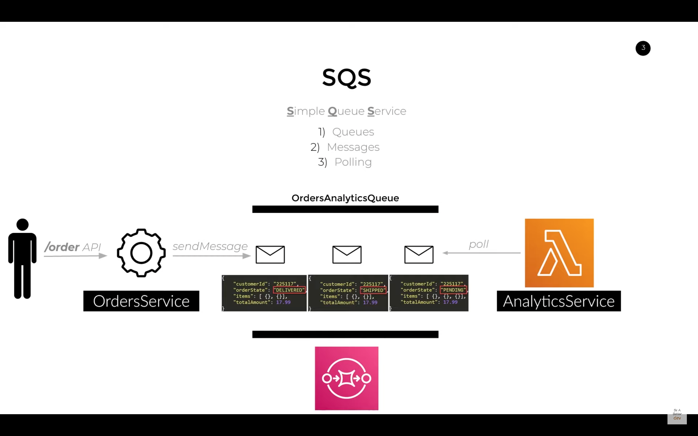

-   <details><summary style="font-size:25px;color:Orange">AWS Profile Management</summary>

    Maintaining multiple AWS accounts from a local machine involves managing credentials and configurations effectively. Here's a general approach to achieve this:

    1. **AWS CLI Configuration**:

        - `Install AWS CLI`: Ensure that you have the AWS Command Line Interface (CLI) installed on your local machine.

            - `$ brew install awscli`

        - `Configure AWS CLI Profiles`:

            - Use the aws configure command to set up AWS CLI profiles for each AWS account.
            - Run the command and follow the prompts to provide **Access Ke ID**, **Secret Access Key**, default region, and output format for each profile.
            - Specify a unique profile name for each account (e.g., `personal`, `work`, `testing`, etc.).

        - `Verify Profiles`: Use the `aws configure list` command to verify that the profiles have been configured correctly.

    2. **~/.aws/config**:

        - `Purpose`: The `~/.aws/config` file is used to specify AWS CLI configurations, such as the default region, output format, and additional named profiles.
        - `Format`: It is formatted as an INI file with sections for each named profile and configuration options within each section.
        - `Sample Configuration:`

            ```ini
            # ~/.aws/config
            [default]
            region = us-west-2
            output = json

            [profile personal] # Add a profile by the name of 'personal'
            region = us-east-1
            output = json
            ```

    3. **~/.aws/credentials**:

        - `Purpose`: The `~/.aws/credentials` file is used to store **aws_access_key_id**s and **aws_secret_access_key**s for named profiles.
        - `Format`: It is also formatted as an INI file with sections for each named profile and credential options within each section.
        - `Sample Configuration`:

            ```ini
            # ~/.aws/credentials
            [default]
            aws_access_key_id = YOUR_ACCESS_KEY_ID
            aws_secret_access_key = YOUR_SECRET_ACCESS_KEY

            [personal]
            aws_access_key_id = PERSONAL_ACCESS_KEY_ID
            aws_secret_access_key = PERSONAL_SECRET_ACCESS_KEY
            ```

    4. **config vs credentials**:

        - The `config` file stores configuration settings like the default region and output format, while the `credentials` file stores access keys and secret access keys for each profile.
        - The `config` file contains configuration options, whereas the `credentials` file contains sensitive authentication credentials.
        - The `~/.aws/config` and `~/.aws/credentials` files are both used by the AWS Command Line Interface (CLI) to manage AWS configurations and credentials, but they serve different purposes:

    5. **IAM Role Assumption (Optional)**:

        - `Cross-Account Access`:
            - If you need to access resources in one AWS account from another account, you can set up IAM roles and use role assumption.
            - Configure role assumption in the AWS CLI configuration or use temporary credentials obtained via the aws sts assume-role command.

    #### AWS CLI

    -   `$ aws configure list`
    -   `$ aws configure set output json` -> Set the output format: `json`, `text`, or `table`
    -   `$ aws configure get property_name [--profile profile_name]`
    -   `$ aws configure get aws_access_key_id`
    -   `$ aws configure get region --profile ht`
    -   `$ aws configure get output --profile ht`
    -   `$ aws configure set property_name value [--profile profile_name]`
    -   `$ aws configure set aws_access_key_id YOUR_ACCESS_KEY`
    -   `$ aws configure set default.region us-east-2` -> aws configure set <varname> <value> [--profile profile-name]
    -   `$ aws iam list-users` -> If you've just one profile set locally
    -   `$ aws iam list-users --profile <profile-name>` -> If you've multiple profiles set locally
    -   `$ `
    -   `$ aws s3 ls --profile personal` -> specify the desired profile using the `--profile` option.
    -   `$ export AWS_PROFILE=personal` -> Change the default profile by setting the `AWS_PROFILE` environment variable

    -   `$ aws configure set <option-name> "" --profile <profile-name>` -> Remove a specific configuration key

    1. **Configure MFA (Multi-Factor Authentication)**: Use the `--serial-number` flag to configure MFA for a session:

        ```bash
        aws sts get-session-token --serial-number arn:aws:iam::<account-id>:mfa/<user-name> --token-code <mfa-code>
        ```

    2. **Rotate Access Keys**: If your keys are compromised or need rotation, delete the old ones and add new ones:
        ```bash
        aws iam delete-access-key --access-key-id <old-key-id>
        aws iam create-access-key
        ```

    -   <details><summary style="font-size:20px;color:Tomato">How to Configure MFA for AWS Accounts Using AWS CLI (NOT TESTED YET)</summary>

            You can enable **Multi-Factor Authentication (MFA)** for your AWS account and IAM users using the AWS CLI. This ensures an extra layer of security by requiring both a password and a temporary authentication code.

            -   **Prerequisites**

                -   `Install AWS CLI`: If not already installed, download and install AWS CLI.
                -   `Configure AWS CLI`: Ensure you have the necessary credentials configured using:
                -   `IAM Permissions`: You must have permissions to manage MFA devices (`iam:CreateVirtualMFADevice`, `iam:EnableMFADevice`, etc.).

            -   **List Available MFA Devices**: Before setting up a new MFA device, you can check if one is already enabled:

                -   `$ aws iam list-mfa-devices --user-name <USERNAME>`

            -   **Create and Enable an MFA Device**

                -   **Option 1: Virtual MFA Device (TOTP-based)**

                    1. **Create a virtual MFA device** (e.g., Google Authenticator or Authy):

                        - `$ aws iam create-virtual-mfa-device --virtual-mfa-device-name <MFA_DEVICE_NAME>`
                        - This command generates a **QR code** or a **Base32 secret key**, which can be used to set up MFA in an authenticator app.

                    2. **Activate MFA for a User**: You need to enter two consecutive MFA codes generated by your app:
                        ```bash
                        aws iam enable-mfa-device --user-name <USERNAME> \
                            --serial-number arn:aws:iam::<ACCOUNT_ID>:mfa/<MFA_DEVICE_NAME> \
                            --authentication-code-1 <FIRST_MFA_CODE> \
                            --authentication-code-2 <SECOND_MFA_CODE>
                        ```
                        - `Replace`:
                        - `<USERNAME>` with your IAM user.
                        - `<MFA_DEVICE_NAME>` with your MFA device name.
                        - `<ACCOUNT_ID>` with your AWS account ID.
                        - `<FIRST_MFA_CODE>` and `<SECOND_MFA_CODE>` with codes from your authenticator app.

                -   **Option 2: Hardware MFA Device**: If using a physical **YubiKey or other hardware device**, first **attach the MFA device**:

                    ```bash
                    aws iam enable-mfa-device --user-name <USERNAME> \
                        --serial-number <SERIAL_NUMBER> \
                        --authentication-code-1 <FIRST_CODE> \
                        --authentication-code-2 <SECOND_CODE>
                    ```

                    -   `<SERIAL_NUMBER>` can be found on the device itself.

            -   **Set MFA as Required for CLI and Console Access**: Once MFA is enabled, you should enforce MFA for high-privilege actions by requiring users to use an MFA session.

                1. **Get a Session Token with MFA**

                    - `$ aws sts get-session-token --serial-number arn:aws:iam::<ACCOUNT_ID>:mfa/<MFA_DEVICE_NAME> --token-code <MFA_CODE>`

                2. **Use Temporary Credentials**

                -   The command above will return:
                    ```json
                    {
                        "Credentials": {
                            "AccessKeyId": "AKIA....",
                            "SecretAccessKey": "wJalrXUtn...",
                            "SessionToken": "IQoJb3Jp..."
                        }
                    }
                    ```
                -   Configure CLI with these temporary credentials:
                    ```bash
                    export AWS_ACCESS_KEY_ID=<AccessKeyId>
                    export AWS_SECRET_ACCESS_KEY=<SecretAccessKey>
                    export AWS_SESSION_TOKEN=<SessionToken>
                    ```

            -   **Remove or Deactivate MFA**: If you need to remove MFA for a user:

                -   `$ aws iam deactivate-mfa-device --user-name <USERNAME> --serial-number arn:aws:iam::<ACCOUNT_ID>:mfa/<MFA_DEVICE_NAME>`

            -   **Enforce MFA in IAM Policies**: To ensure MFA is always used for sensitive actions, attach a policy that denies access unless MFA is enabled:
                ```json
                {
                    "Version": "2012-10-17",
                    "Statement": [
                        {
                            "Effect": "Deny",
                            "Action": "*",
                            "Resource": "*",
                            "Condition": {
                                "BoolIfExists": {
                                    "aws:MultiFactorAuthPresent": "false"
                                }
                            }
                        }
                    ]
                }
                ```
                -   Apply this policy to IAM users or roles.

            </details>

        </details>

---

-   <details><summary style="font-size:25px;color:Orange">Terminology</summary>

    -   [The Most Important AWS Core Services That You NEED To Know About!](https://www.youtube.com/watch?v=B08iQQhXG1Y)

    ##### Services vs Resources

    -   **Services**: AWS Services refer to the various offerings and capabilities provided by Amazon Web Services, such as Amazon S3 (Simple Storage Service), Amazon EC2 (Elastic Compute Cloud), AWS Lambda, Amazon RDS (Relational Database Service), Amazon SQS (Simple Queue Service), and many others. Each of these services provides specific functionality, and customers can choose which services they want to use and in what combination, depending on their needs.
    -   **Resources**: AWS Resources, on the other hand, refer to specific instances of AWS services that have been created by customers or by other AWS services on their behalf. For example, if a customer creates an EC2 instance, that instance is an AWS resource. Similarly, if a customer creates an S3 bucket, that bucket is an AWS resource.

    ##### Permission vs Policy

    -   A **permission** is a statement that grants or denies access to a specific AWS resource or operation. Permissions are attached to an identity, such as a user, group, or role, and specify what actions that identity can perform on the resource. For example, a permission might allow a user to read objects from a specific S3 bucket, but not delete them.
    -   A **policy** is a set of permissions that can be attached to an identity to define its overall access to AWS resources. A policy can include one or more permissions and can be attached to multiple identities. For example, a policy might allow all members of a certain group to access a specific set of EC2 instances.

    ##### Provisioning vs Deploying

    -   **Provisioning**: Provisioning refers to the process of setting up and allocating the necessary infrastructure and resources required for an application to run. This includes computing power, storage, networking, and other cloud services.
    -   **Deploying**: Deploying refers to the process of releasing and running an application or service on the provisioned infrastructure. It involves pushing code, configuring runtime environments, and ensuring the application is available to users.

    ##### Rehydration

    In the context of AWS, **"rehydration"** typically refers to the process of **restoring or reinitializing data or resources** that were previously "dried out" or removed. This can apply to various AWS services where data or configurations might have been removed, suspended, or cached, and now need to be **reloaded or reactivated**. Common contexts where **rehydration** might be used in AWS:

    1. **Elastic Load Balancer (ELB)**: If an application or service experiences changes or updates, **rehydration** can refer to **restoring the configuration** or applying the latest configuration to resources like load balancers or target groups.

    2. **Amazon S3 Glacier (and Glacier Deep Archive)**:

        - **Rehydration** in this context refers to **retrieving archived data** from long-term storage (like Glacier or Glacier Deep Archive) back to more accessible storage (such as S3 standard or S3 infrequent access) before it can be used or processed.
        - `Example`: A file is archived in S3 Glacier for long-term storage. When the file needs to be used again, it undergoes "rehydration" to restore it to a more accessible state.

    3. **Elasticache**: For services like **Amazon ElastiCache**, **rehydration** may refer to **restoring the cache** after it is invalidated or cleared, either automatically or through manual intervention.
    4. **Data Pipelines**: In cases where there are **data transformations or ETL (Extract, Transform, Load) processes** in AWS (e.g., with AWS Glue), **rehydration** might refer to **reloading or refreshing data** from the source system back into the pipeline after a failure or cleanup event.
    5. **General Example**: If a **serverless function** was previously paused or removed and then restarted, rehydration would be the process of bringing the function back into a working state.

    ##### Bastion Host

    A bastion host is a specially designed server that acts as a secure gateway for accessing private network resources from an external network, typically the internet. It is commonly used in AWS and other cloud environments to provide controlled access to private infrastructure.

    -   **Key Characteristics of a Bastion Host**:

        -   `Publicly Accessible` – The bastion host has a public IP address or is accessible from a trusted external network.
        -   `Hardened Security` – It is configured with strict security policies, such as minimal open ports, strong authentication, and logging.
        -   `Single Entry Point` – Instead of exposing multiple private servers, only the bastion host is exposed, reducing attack surfaces.
        -   `Jump Server` – It serves as an intermediary, allowing users to connect securely to private instances within a **Virtual Private Cloud (VPC)** or **on-premises network**.

    -   **Common Use Cases**:
        -   `Secure Remote Access` – Admins use bastion hosts to access instances in private subnets.
        -   `Limiting Attack Surfaces` – Instead of exposing all private instances, only the bastion host is accessible.
        -   `Audit and Logging` – Activity on the bastion host can be logged for security audits.

    ##### Whitelist

    </details>

---

-   <details><summary style="font-size:25px;color:Orange">EC2</summary>

    -   [DigitalCloud: EC2](https://www.youtube.com/watch?v=8bIW7qlldLg&t=108s)

    Amazon Elastic Compute Cloud (Amazon EC2) is a web service provided by Amazon Web Services (AWS) that allows users to rent virtual servers on which they can run their applications. Below are some key terms and concepts associated with AWS EC2:

    Amazon EC2 (Elastic Compute Cloud) is a central service in AWS that provides scalable computing capacity in the cloud. It allows users to launch virtual servers (instances) with flexible configurations. Below is an explanation of all the components and concepts associated with AWS EC2:

    -   **EC2 Instance**: An instance is a virtual server in the cloud. It represents the computing resources (CPU, memory, storage, etc.) that you can rent from AWS. Instances are the fundamental building blocks of EC2.

        -   **Definition**: A virtual server that runs on the AWS cloud infrastructure. You can choose the hardware specifications, OS, and applications.
        -   **Purpose**: EC2 instances provide compute resources for running applications, processing data, or hosting services.
        -   **Key Attributes**:
            -   **vCPU**: Virtual CPU capacity.
            -   **RAM**: Memory for applications.
            -   **Network**: Networking performance (low, medium, or high bandwidth).

    -   **Amazon Machine Image (AMI)**: An AMI is a pre-configured template used to create instances. It contains the necessary information to launch an instance, including the operating system, application server, and applications.

        -   **Definition**: A pre-configured template containing the operating system, application server, and applications for launching EC2 instances.
        -   **Purpose**: AMIs allow you to create consistent EC2 instances based on a saved image.
        -   **Types**:
            -   **AWS-provided**: Amazon offers base AMIs (e.g., Amazon Linux, Ubuntu).
            -   **Custom**: Users can create custom AMIs with specific software configurations.
            -   **Marketplace AMIs**: Third-party vendors offer AMIs with specific software solutions.

    -   **Instance Types**

        -   **Definition**: Pre-defined combinations of CPU, memory, storage, and network performance. Different instance types suit different workloads.
        -   **Purpose**: Helps users choose the right compute power based on their application needs.
        -   **Categories**:
            -   **General Purpose (e.g., t2.micro, m5.large)**: Balanced compute, memory, and networking resources.
            -   **Compute Optimized (e.g., c5.large)**: Designed for compute-intensive tasks.
            -   **Memory Optimized (e.g., r5.xlarge)**: Ideal for memory-intensive applications.
            -   **Storage Optimized (e.g., i3.xlarge)**: High-performance for applications needing fast local storage.
            -   **Accelerated Computing (e.g., p3.xlarge)**: Instances with GPUs for machine learning and graphic-intensive tasks.

    -   **Elastic Block Store (EBS)**: EBS provides block-level storage volumes that you can attach to EC2 instances. It is used for data that requires persistent storage. EBS volumes can be used as the root file system or attached to an instance as additional storage.

        -   **Definition**: A block-level storage service used to attach persistent storage to EC2 instances.
        -   **Purpose**: Provides scalable, durable storage volumes that can be attached to instances. These volumes persist independently of the instance lifecycle.
        -   **Types**:
            -   **General Purpose SSD (gp2/gp3)**: Balanced performance and cost.
            -   **Provisioned IOPS SSD (io1/io2)**: High performance for I/O-intensive workloads.
            -   **Magnetic (st1/sc1)**: Cost-effective for sequential access workloads like logging or backup.

    -   **Elastic IP Address (EIP)**

        -   **Definition**: A static, public IPv4 address that you can allocate and associate with your EC2 instance.
        -   **Purpose**: Ensures your instance retains a consistent public IP address even if the instance is stopped and restarted.

    -   **Security Groups**: Security groups act as virtual firewalls for instances. They control inbound and outbound traffic based on rules that you define. Each instance can be associated with one or more security groups.

        -   **Definition**: Virtual firewalls that control inbound and outbound traffic to EC2 instances.
        -   **Purpose**: Security groups allow or block traffic based on rules defined by IP address, protocol, and port.
        -   **Stateful**: Security groups remember allowed traffic for responses without needing separate rules.

    -   **Key Pairs**: A key pair consists of a public key and a private key. It is used for securely connecting to an EC2 instance. The public key is placed on the instance, and the private key is kept secure.

        -   **Definition**: A public-private key pair used for SSH access to EC2 instances.
        -   **Purpose**: The public key is stored on the instance, and the private key is used by the user to securely connect to the instance.

    -   **Elastic Load Balancing (ELB)**: ELB automatically distributes incoming application traffic across multiple EC2 instances. It enhances the availability and fault tolerance of your application.

        -   **Definition**: A service that automatically distributes incoming traffic across multiple EC2 instances.
        -   **Purpose**: Ensures high availability and reliability by distributing incoming requests to healthy instances.
        -   **Types**:
            -   **Application Load Balancer**: Layer 7 load balancing (for HTTP/HTTPS traffic).
            -   **Network Load Balancer**: Layer 4 load balancing (for TCP/UDP traffic).
            -   **Gateway Load Balancer**: Enables third-party virtual appliances.

    -   **Placement Groups**

        -   **Definition**: Logical grouping of instances to influence how EC2 instances are placed on the underlying hardware.
        -   **Purpose**: Enhances performance for specific workloads.
        -   **Types**:
            -   **Cluster Placement Group**: Instances are grouped closely in a single Availability Zone for low-latency, high-throughput networking.
            -   **Spread Placement Group**: Instances are distributed across underlying hardware to reduce simultaneous failures.
            -   **Partition Placement Group**: Divides instances into partitions where they are placed on distinct sets of racks to minimize correlated failures.

    -   **Launch Template**

        -   **Definition**: A configuration template that defines how to launch EC2 instances.
        -   **Purpose**: Standardizes the instance creation process by including configurations like instance types, AMIs, key pairs, and security groups.

    -   **Elastic Network Interface (ENI)**

        -   **Definition**: A network interface that can be attached to an EC2 instance to manage multiple IP addresses.
        -   **Purpose**: Allows instances to have multiple private and public IP addresses, multiple security groups, and can be detached/reattached across instances.

    -   **Network Address Translation (NAT) Gateway**

        -   **Definition**: A managed gateway that allows instances in private subnets to connect to the internet while preventing incoming traffic from reaching them.
        -   **Purpose**: Enables private EC2 instances to download updates or access public internet resources securely.

    -   **Elastic GPUs**

        -   **Definition**: A feature that allows you to attach GPU resources to existing EC2 instances.
        -   **Purpose**: Adds GPU capability to instances for tasks like graphics rendering, machine learning, and other GPU-intensive operations.

    -   **IPv4 and IPv6 Addresses**

        -   **Definition**: Public and private IP addresses assigned to EC2 instances for communication.
        -   **Purpose**: IP addresses allow EC2 instances to communicate with other instances, on-premises networks, or the internet.

    -   **Region**: AWS divides the world into geographic areas called regions. Each region contains multiple Availability Zones. Examples of regions include us-east-1 (North Virginia), eu-west-1 (Ireland), and ap-southeast-2 (Sydney).
    -   **Availability Zone (AZ)**: An Availability Zone is a data center or a collection of data centers within a region. Each Availability Zone is isolated but connected to the others. Deploying instances across multiple Availability Zones increases fault tolerance.
    -   **Auto Scaling**: Auto Scaling allows you to automatically adjust the number of EC2 instances in a group based on demand. It helps maintain application availability and ensures that the desired number of instances are running.
    -   **Placement Groups**: Placement groups are logical groupings of instances within a single Availability Zone. They are used to influence the placement of instances to achieve low-latency communication.
    -   **Spot Instances**: Spot Instances are spare EC2 capacity that is available at a lower price. You can bid for this capacity, and if your bid is higher than the current spot price, your instances will run. However, they can be terminated if the spot price exceeds your bid.
    -   **On-Demand Instances**: On-Demand Instances allow you to pay for compute capacity by the hour or second with no upfront costs. This is a flexible and scalable pricing model suitable for variable workloads.
    -   **Reserved Instances**: Reserved Instances offer significant savings over On-Demand pricing in exchange for a commitment to a one- or three-year term. They provide a capacity reservation, ensuring availability.

    -   <details><summary style="font-size:20px;color:Magenta">Auto Scaling Groups</summary>

        AWS **Auto Scaling Groups (ASG)** is a key component of AWS Auto Scaling that ensures the right number of Amazon EC2 instances are running to handle application load efficiently. ASG helps maintain availability, improve performance, and optimize costs by automatically scaling instances based on demand.

        #### Components of ASGs

        1. **Launch Template or Launch Configuration**

            - Defines the settings for EC2 instances within the Auto Scaling Group.
            - Includes:
                - **AMI (Amazon Machine Image):** The base image for instances.
                - **Instance Type:** The hardware specifications (CPU, RAM, etc.).
                - **Key Pair:** SSH key for remote access.
                - **Security Groups:** Controls inbound/outbound traffic.
                - **IAM Role:** Grants permissions to instances.
                - **User Data Script:** Custom startup commands.

        2. **Auto Scaling Group**

            - Manages the group of EC2 instances based on policies.
            - Key properties:
                - **Minimum Capacity:** Minimum number of instances that must run.
                - **Desired Capacity:** The ideal number of instances at a given time.
                - **Maximum Capacity:** The upper limit of instances that can be launched.

        3. **Scaling Policies**

            - Determines when and how ASG should scale in or out.
            - Types of Auto Scaling Policies:
                - **Dynamic Scaling**: Adjusts instances based on real-time metrics.
                    - **Target Tracking Scaling**: Maintains a CloudWatch target metric (e.g., CPU usage at 50%).
                    - **Step Scaling**: Scales in increments (e.g., add 2 instances if CPU > 70%) and out decrement.
                    - **Simple Scaling**: Adds/removes a fixed number of instances based on a single alarm.
                - **Predictive Scaling**: Uses machine learning to anticipate scaling needs.
                - **Scheduled Scaling**:

        4. **Health Checks**

            - Ensures that unhealthy instances are terminated and replaced.
            - Types:
                - **EC2 Health Check:** Checks if instance responds to system status checks.
                - **ELB Health Check:** Checks if the instance is responsive to an Elastic Load Balancer.
            - **Health Check Grace Period**:

        5. **Load Balancer Integration**

            - **Elastic Load Balancer (ELB)** ensures traffic is distributed among instances.
            - Auto Scaling Group automatically registers/deregisters instances.

        6. **Termination Policies**

            - Determines which instance is terminated first during scale-in.
            - Options include:
                - **Default (Oldest Launch Template First):** Terminates instances from the oldest launch template.
                - **Oldest Instance:** Terminates the longest-running instance first.
                - **Newest Instance:** Terminates the most recently launched instance.
                - **Closest to Billing Hour:** Optimizes cost by terminating instances nearing their next billing hour.
            - Termination Protection

        7. **Lifecycle Hooks**

            - Allows custom actions before an instance is launched or terminated.
            - Common use cases:
                - Pre-installing software before making the instance active.
                - Sending logs before terminating an instance.

        8. **Warm Pools**

            - Keeps pre-initialized instances on standby to speed up scaling.
            - Reduces boot time by allowing instances to be launched partially configured.

        #### Key Concepts of AWS Auto Scaling Groups

        9. **Cooldowns**:
        10. **Standby State**:
        11. **Lifecycle Hooks**:

        12. **Elasticity**

            - Automatically adjusts capacity to meet traffic demands.
            - Ensures availability during peak times and cost savings during low traffic.

        13. **High Availability**

            - Auto Scaling Group distributes instances across multiple **Availability Zones (AZs)**.
            - Prevents application downtime due to hardware failure.

        14. **Cost Optimization**

            - Ensures that only the necessary number of instances are running.
            - Uses **Spot Instances** for cost savings when appropriate.

        15. **Fault Tolerance**

            - Automatically replaces failed instances to maintain application health.

        16. **Region and Availability Zone Awareness**

            - ASG can span multiple **Availability Zones (AZs)** but remains within a single **AWS Region**.

            - **Web Applications:** Scale based on incoming HTTP traffic.
            - **Batch Processing:** Scale based on queued jobs.
            - **Big Data Analytics:** Scale based on compute needs.
            - **Microservices:** Adjusts instances for each service independently.

        </details>

    -   <details><summary style="font-size:20px;color:Magenta">Load balancer</summary>

        A Load Balancer is a managed service provided by Elastic Load Balancing (ELB) that automatically distributes incoming application traffic across multiple targets, such as EC2 instances, containers, IP addresses, and Lambda functions, in one or more Availability Zones. This ensures high availability, fault tolerance, and scalability for your applications. AWS provides the following types of load balancers, each suited to different use cases:

        1. **Application Load Balancer (ALB)**

            - Designed for HTTP and HTTPS traffic.
            - Operates at **Layer 7** (Application Layer) of the OSI model.
            - `Features`:
                - Content-based routing (e.g., route based on URL path or hostname).
                - WebSocket and HTTP/2 support.
                - Authentication using OIDC, Cognito, or other mechanisms.
                - Advanced request-routing capabilities (e.g., based on headers or query strings).
                - Integration with AWS Web Application Firewall (WAF).

        2. **Network Load Balancer (NLB)**

            - Designed for **TCP, UDP, and TLS** traffic.
            - Operates at **Layer 4** (Transport Layer).
            - `Features`:
                - High-performance handling of millions of requests per second.
                - Static IP addresses or Elastic IPs for the load balancer.
                - Ability to preserve client source IP addresses.
                - Ideal for low-latency, high-throughput workloads.

        3. **Gateway Load Balancer (GWLB)**

            - Designed for deploying and managing third-party virtual appliances (e.g., firewalls, monitoring tools).
            - Operates at **Layer 3** (Network Layer).
            - `Features`:
                - Scalable and elastic traffic distribution for appliances.
                - Integrates with Virtual Private Cloud (VPC) Ingress Routing.

        4. **Classic Load Balancer (CLB)**

            - Legacy load balancer that supports both **Layer 4** and **Layer 7** traffic.
            - Limited features compared to ALB and NLB.
            - `Features`:
                - Basic routing and health checks.
                - Supports legacy applications.

        5. **Listeners**

            A listener is a process configured on the load balancer to check for incoming client connection requests. It listens for connections using a specified protocol and port and forwards these requests to the appropriate targets based on the rules configured.

            - **Protocols Supported**:
                - HTTP/HTTPS (Application Load Balancer)
                - TCP/TLS/UDP (Network Load Balancer)
            - **Ports**:
                - Common ports include **80** (HTTP) and **443** (HTTPS).
                - You can define custom ports if needed.
            - **Rules**: Define how the load balancer routes traffic to different target groups.

                - Criteria: Rules can be based on various criteria.
                    - Path: Route traffic based on the path of the incoming request (e.g., /api, /images).
                    - Host Header: Route traffic based on the host header in the request (e.g., www.example.com).
                    - HTTP Headers: Route traffic based on specific HTTP headers in the request.
                    - Query Parameters: Route traffic based on query parameters in the request URL.
                - Example: In ALB, rules can include host-based routing (e.g., `www.example.com`) or path-based routing (e.g., `/api`).

            - **Use Cases**:
                - For ALB: You can configure a listener to route traffic for multiple services running on different paths or domains.
                - For NLB: Use listeners to route traffic at a network level for high-throughput applications.

        6. **Target Groups**

            A target group is a logical grouping of the targets that the load balancer routes traffic to. Targets can be **EC2 instances**, **IP addresses**, **containers (ECS tasks)**, or **AWS Lambda functions**.

            - **Types of Targets**:

                - **Instances**: Routes traffic to specific EC2 instances.
                - **IP Addresses**: Targets specific IP addresses. Useful for hybrid architectures.
                - **Lambda Functions**: ALB supports invoking Lambda functions for serverless applications.

            - **Health Checks**:

                - Automatically perform health checks on the targets to ensure only healthy ones receive traffic.
                - Parameters include the protocol, ping path, interval, and thresholds.

            - **Routing**:

                - You can associate multiple target groups with different listeners and rules to route traffic intelligently.

            - **Example**:

                - A web app running on multiple EC2 instances can have a target group configured with all those instances.
                - A microservices architecture could have separate target groups for APIs, user interfaces, and static content.

            - **NOTE**:
                - API Gateway is not designed to function behind a load balancer.
                - API Gateway itself is designed to manage traffic, apply security policies, rate limiting, and integrate with AWS services. A Load Balancer in front of API Gateway is redundant.

        7. **Load Balancer Nodes**

            Load balancer nodes are the actual physical or virtual machines that handle the traffic within AWS. They are managed by AWS and operate behind the scenes to distribute traffic effectively.

            - **Distributed Across AZs**:
                - ELB automatically deploys load balancer nodes in multiple Availability Zones (AZs) for high availability and fault tolerance.
            - **Scaling**:
                - Load balancer nodes automatically scale to handle increases in traffic.
                - When traffic reduces, nodes are scaled down.
            - **Connection Handling**:

                - These nodes terminate client connections and forward requests to the target.

            - **How It Works**:
                - A DNS name (e.g., `my-load-balancer-12345.elb.amazonaws.com`) is provided by AWS.
                - This name resolves to the IP addresses of the load balancer nodes.
                - Clients connect to these nodes, which distribute the traffic to healthy targets.

        8. **Health Checks**

            Health checks are critical for ensuring that traffic is only sent to healthy targets. ELB continuously monitors the health of targets in a target group and routes traffic to only those that are healthy.

            - **Health Check Configuration**:

                - **Protocol**: HTTP, HTTPS, TCP, or UDP.
                - **Port**: The port on which the health check is performed.
                - **Path**: The specific path for HTTP/HTTPS checks (e.g., `/healthcheck`).

            - **Interval and Timeout**:

                - The interval defines how often the health check is performed.
                - The timeout specifies the time allowed for the target to respond.

            - **Thresholds**:

                - Healthy threshold: Number of consecutive successful responses required to mark the target as healthy.
                - Unhealthy threshold: Number of consecutive failures required to mark the target as unhealthy.

            - **Example**: A target is considered healthy if it returns a `200 OK` HTTP response for 3 consecutive health check requests within the interval.

        9. **Security Groups**

            Security groups act as virtual firewalls that control inbound and outbound traffic for the load balancer.

            - **Inbound Rules**: Specify the type of traffic allowed to reach the load balancer (e.g., allow HTTP traffic on port 80 or HTTPS on port 443).
            - **Outbound Rules**: Define the type of traffic that the load balancer can send to targets.
            - **Granular Control**: You can restrict access to specific IP ranges, CIDR blocks, or other AWS resources.

            - **Example**:
                - For an internet-facing ALB, configure a security group to allow public traffic on ports 80 and 443.
                - For an internal-only NLB, restrict traffic to your VPC CIDR range.

        10. **Access Logs**

            Access logs provide detailed information about requests processed by the load balancer. These logs are invaluable for debugging, analyzing traffic patterns, and monitoring security.

            - **Stored in S3**: Logs are automatically saved in an S3 bucket that you specify.
            - **Log Contents**: Includes information like the request time, client IP, target details, response status, latency, and more.
            - **Analysis**: Can be analyzed using tools like Amazon Athena, AWS Glue, or third-party log analysis tools.

            - **Use Cases**:
                - Troubleshoot issues with specific clients or requests.
                - Monitor and analyze application performance.

        11. **Elastic IPs (NLB Only)**

            Elastic IPs (EIPs) are static IP addresses that can be assigned to the Network Load Balancer for predictable and consistent access.

            - **Static IPs**:
                - NLB can assign Elastic IPs to its nodes in each AZ.
            - **Use Cases**:
                - Simplifies DNS management when clients require fixed IPs.
                - Useful for firewall configurations and hybrid environments.

        12. **DNS Name**

            AWS ELB provides a DNS name for each load balancer, which clients use to send requests. The DNS name is associated with the IPs of the load balancer nodes.

            - **Dynamic Resolution**:
                - The DNS name resolves to the IP addresses of the load balancer nodes.
                - AWS handles changes in the underlying infrastructure automatically.
            - **Example**: `my-load-balancer-12345.us-west-2.elb.amazonaws.com`.

        13. **Sticky Sessions (Session Affinity)**

            Sticky sessions, Also known as **session affinity**, ensure that requests from the same client are routed to the same target for the duration of the session.

            - **Session Duration**: Controlled by cookies (either AWS-generated or custom).
            - **Use Cases**: Applications that maintain session state (e.g., user login or shopping cart).

        14. **Cross-Zone Load Balancing**

            - Distributes traffic evenly across all targets in all enabled AZs, regardless of the AZ in which the load balancer node resides.

        15. **Host-Based and Path-Based Routing (ALB)**

            - Host-based routing: Route requests to different target groups based on the **Host** header (e.g., `api.example.com` vs. `app.example.com`).
            - Path-based routing: Route requests based on the URL path (e.g., `/api` vs. `/login`).

        16. **SSL/TLS Termination**

            - Load balancers can terminate SSL/TLS connections, offloading the encryption and decryption process from the targets.
            - Managed using **AWS Certificate Manager (ACM)** or custom certificates.

    </details>

    </details>

---

-   <details><summary style="font-size:25px;color:Orange">VPC (Virtual Private Cloud)</summary>

    -   [Linux Academy: AWS Essentials: Project Omega!](https://www.youtube.com/watch?v=CGFrYNDpzUM&list=PLv2a_5pNAko0Mijc6mnv04xeOut443Wnk)
    -   [DogitalCloud: AWS VPC Beginner to Pro - Virtual Private Cloud Tutorial](https://www.youtube.com/watch?v=g2JOHLHh4rI&t=2769s)
    -   [VPC Assignments](https://www.youtube.com/playlist?list=PLIUhw5xEbE-UzGtDn5yBfXBTkJR6QgWIi)
    -   [3.Terraform : Provision VPC using Terraform | Terraform Manifest file to Create VPC and EC2 Instance](https://www.youtube.com/watch?v=wx7L6snkrTU)

    Amazon VPC (Virtual Private Cloud) is a service that enables you to launch Amazon Web Services (AWS) resources into a virtual network that you define. Here are some common terms and concepts related to AWS VPC:

    -   **VPC**: AWS VPC (Amazon Virtual Private Cloud) is a service provided by Amazon Web Services (AWS) that allows you to create a virtual network in the AWS cloud. It enables you to define a logically isolated section of the AWS cloud where you can launch AWS resources such as EC2 instances, RDS databases, and more. Here are some key aspects and features of AWS VPC:

        -   `Isolation`: A VPC provides network isolation, allowing you to create a virtual network environment that is logically isolated from other networks in the AWS cloud. This isolation helps enhance security and control over your resources.
        -   `Customization`: You have full control over the IP address range, subnets, route tables, and network gateways within your VPC. This allows you to design and configure the network according to your specific requirements.
        -   `Subnets`: Within a VPC, you can create multiple subnets, each associated with a specific availability zone (AZ) within an AWS region. Subnets help organize and segment your resources and allow you to control network traffic between them.
        -   `Internet Connectivity`: By default, instances launched within a VPC do not have direct access to the internet. To enable internet connectivity, you can configure an internet gateway (IGW) and route internet-bound traffic through it.
        -   `Security`: VPC provides several features to enhance network security, including security groups and network access control lists (ACLs). Security groups act as virtual firewalls, controlling inbound and outbound traffic at the instance level, while network ACLs provide subnet-level security by controlling traffic flow.
        -   `Peering and VPN Connections`: VPC allows you to establish peering connections between VPCs within the same AWS region, enabling inter-VPC communication. Additionally, you can establish VPN (Virtual Private Network) connections between your on-premises network and your VPC, extending your network securely into the AWS cloud.
        -   `VPC Endpoints`: VPC endpoints enable private connectivity to AWS services without requiring internet gateway or NAT gateway. This enhances security and can reduce data transfer costs.
        -   `VPC Flow Logs`: VPC Flow Logs capture information about the IP traffic flowing in and out of network interfaces in your VPC. This data can be used for security analysis, troubleshooting, and compliance auditing.

    -   **Subnet**: In AWS, a subnet (short for sub-network) is a segmented portion of an Amazon VPC (Virtual Private Cloud). Subnets allow you to divide a VPC's IP address range into smaller segments, which can be associated with specific availability zones (AZs) within an AWS region. Here are some key points to understand about AWS subnets:

        -   `Public and Private Subnets`: Subnets can be categorized as public or private based on their routing configuration:
            -   `Public Subnets`: Public subnets have routes to an internet gateway, allowing instances within the subnet to communicate directly with the internet. They are typically used for resources that require public accessibility, such as web servers.
            -   `Private Subnets`: Private subnets do not have direct internet access. Instances in private subnets can communicate with the internet or other AWS services through a NAT gateway, VPC endpoint, or VPN connection. Private subnets are commonly used for backend services or databases that should not be directly exposed to the internet.
        -   `Segmentation`: Subnets enable you to logically segment your VPC's IP address space. Each subnet is associated with a specific CIDR (Classless Inter-Domain Routing) block, which defines the range of IP addresses available for use within that subnet.
        -   `Routing`: Each subnet has its own route table, which defines how traffic is routed within the subnet and to other subnets or external networks. You can customize route tables to control traffic flow, including specifying routes to internet gateways, virtual private gateways, NAT gateways, and VPC peering connections.
        -   `Availability Zones`: Subnets are tied to specific availability zones within an AWS region. Each subnet exists in exactly one availability zone, and you can create subnets in multiple AZs within the same region to achieve high availability and fault tolerance for your applications.
        -   `Traffic Isolation`: Instances launched in different subnets within the same VPC are isolated from each other at the network level. By controlling the routing and network access policies within subnets, you can control the flow of traffic between resources.
        -   `Associated Resources`: Subnets can be associated with various AWS resources, including EC2 instances, RDS databases, Lambda functions, and more. When launching resources, you can specify the subnet in which the resource should reside.

    -   **CIDR (Classless Inter-Domain Routing)**: `CIDR` is a notation for representing a range/block of IP addresses with their associated `Network Prefix`. It allows for a more flexible allocation of IP addresses than the older class-based system (Class A, B, and C networks). `CIDR` notation includes both the IP address and the length of the network prefix, separated by a slash (`/`). For example, `10.0.0.0/16` indicates a network with a 16-bit prefix and represents a `CIDR` block with a range of IP addresses from `10.0.0.0` to `10.0.255.255`. The size of a `CIDR` block is $2^{32 − Prefix Length} = 2^{32 − 16} = 2^16$

        -   In AWS, when you create a VPC, you define its IP address range using `CIDR` notation. `CIDR` notation is a compact representation of an IP address range, expressed as a base address followed by a forward slash and a numerical value representing the prefix length. For example, `10.0.0.0/16` indicates a network with a 16-bit network-prefix and represents a `CIDR` block with a range of IP addresses from 10.0.0.0 to 10.0.255.255.

        -   `Network Prefix`: A network prefix refers to the part of an IP address that identifies the network or subnet itself. It is specified by a `CIDR` (Classless Inter-Domain Routing) notation, which consists of an IP address followed by a slash (`/`) and a number (the prefix length). The prefix length defines how many bits of the IP address are dedicated to identifying the network. For example, in the `CIDR` block `192.168.1.0/24`, the `/24` is the network prefix length, meaning the first 24 bits (or the first three octets) of the IP address represent the network itself, and the remaining bits are available for host addresses within that network. The first 24 bits (or the first three octets) are reffered as the `Network Prefix`.

    -   **Route Table**: A Route Table in AWS VPC is a set of rules that controls how network traffic is directed within the VPC. It determines where traffic from your subnets is routed, such as to the internet, other VPCs, or within the same VPC. **Each subnet in a VPC must be associated with a route table**, and the table specifies the paths traffic can take, like sending internet-bound traffic through an internet gateway or directing traffic to other private resources.

        -   `Main Route Table`: The default route table that is automatically created when a VPC is set up. All subnets not explicitly associated with a custom route table use this table.

            -   Acts as the fallback route table for all subnets in the VPC unless overridden by custom route tables.

        -   `Route`: A Route Table contains a set of rules, known as routes, that determine the path of network traffic. Each route specifies a destination `CIDR` (Classless Inter-Domain Routing) block and a target, indicating where traffic destined for that `CIDR` block should be forwarded.

            -   `Default Route`: Every Route Table includes a default route, which typically directs traffic with an unspecified destination (`0.0.0.0/0`) to a target, such as an internet gateway (`IGW`) or a virtual private gateway (VGW). This default route allows instances within the VPC to communicate with resources outside the VPC, such as the internet or other VPCs.
            -   `Custom Routes`: In addition to the default route, you can add custom routes to a Route Table to define specific paths for traffic destined for particular CIDR blocks. For example, you can create custom routes to route traffic to a VPN connection, Direct Connect gateway, or VPC peering connection.
            -   `Example Route Table Entries`:

                | Destination      | Target           | Purpose                                                    |
                | ---------------- | ---------------- | ---------------------------------------------------------- |
                | `0.0.0.0/0`      | Internet Gateway | Route internet-bound traffic from public subnets.          |
                | `10.0.0.0/16`    | local            | Default route for intra-VPC communication.                 |
                | `10.0.1.0/24`    | VPC Endpoint     | Direct traffic to AWS services like S3 using VPC Endpoint. |
                | `0.0.0.0/0`      | NAT Gateway      | Route internet-bound traffic from private subnets.         |
                | `192.168.1.0/24` | VPC Peering      | Route traffic to a peered VPC.                             |

        -   `Associations`: Each subnet in a VPC is associated with one Route Table for inbound traffic and one Route Table for outbound traffic. This association determines how traffic is routed to and from instances within the subnet. By associating subnets with different Route Tables, you can control the flow of traffic and implement network segmentation.
        -   `Propagation`: Route Tables can be associated with virtual private gateways (`VGW`) for VPN connections or transit gateways for inter-VPC communication. In such cases, routes learned from these gateways are automatically propagated to the associated Route Table.
        -   `Prioritization`: Routes in a Route Table are evaluated in priority order, with more specific routes taking precedence over less specific routes. If multiple routes match a destination CIDR block, the most specific route (i.e., the route with the longest prefix length) is chosen.
        -   `Multi-Subnet Routing`: In a multi-subnet VPC architecture, different subnets can be associated with different Route Tables, allowing you to implement distinct routing policies based on subnet requirements. This enables you to enforce security policies, direct traffic to specific gateways, or implement advanced networking configurations.

    -   **Internet Gateway**: An AWS Internet Gateway (IGW) is a horizontally scaled, redundant, and highly available VPC component that allows communication between instances within your VPC and the internet. It serves as a gateway to facilitate inbound and outbound internet traffic for resources within your VPC. Here are the key points to understand about AWS Internet Gateways:

        -   `Public Subnets`: Internet Gateways are typically associated with public subnets within your VPC. Public subnets have routes to the Internet Gateway in their route tables, enabling instances within those subnets to communicate directly with the internet.
        -   `Routing`: To enable internet access for instances within your VPC, you need to add a route to the internet gateway in the route table associated with the subnet. This route directs traffic destined for the internet to the Internet Gateway.
        -   `High Availability`: Internet Gateways are designed to be highly available and redundant. They are automatically replicated across multiple Availability Zones within the same AWS region to ensure resilience and fault tolerance.
        -   `Stateful`: Internet Gateways are stateful devices, meaning they keep track of the state of connections and allow return traffic for outbound connections initiated by instances within the VPC. This enables bidirectional communication between instances and external hosts on the internet.
        -   `Security`: Internet Gateways do not perform any security functions on their own. Security is primarily managed using AWS security groups and network access control lists (NACLs) associated with the instances and subnets within the VPC.
        -   `Billing`: While there is no charge for creating an Internet Gateway, you are billed for data transfer out of your VPC to the internet based on the volume of data transferred.

    -   **NAT Gateway**: An AWS NAT Gateway (Network Address Translation Gateway) is a managed AWS service that enables instances within private subnets of a VPC (Virtual Private Cloud) to initiate outbound traffic to the internet while preventing inbound traffic from reaching those instances. Here are the key aspects of AWS NAT Gateway:

        -   `Outbound Internet Access`: NAT Gateway allows instances in private subnets to access the internet for software updates, patching, or downloading dependencies. It achieves this by performing network address translation (NAT), replacing the private IP addresses of the instances with its own public IP address when communicating with external hosts on the internet.
        -   `Private Subnets`: NAT Gateway is typically deployed in a public subnet within the VPC, allowing instances in private subnets to route their outbound traffic through it. Private subnets do not have direct internet connectivity and rely on NAT Gateway to access the internet.
        -   `Security`: Since NAT Gateway resides in a public subnet, it is exposed to the internet. However, it does not allow inbound traffic initiated from external sources to reach instances in private subnets. This enhances security by preventing direct access to instances from the internet.
        -   `High Availability`: NAT Gateway is a managed service provided by AWS and is designed for high availability and fault tolerance. It automatically scales to handle increased traffic volumes and is replicated across multiple Availability Zones within the same AWS region to ensure resilience.
        -   `Elastic IP Address`: Each NAT Gateway is associated with an Elastic IP (EIP) address, which provides a static, public IP address for outbound traffic. The EIP remains associated with the NAT Gateway even if it is replaced due to scaling or maintenance activities.
        -   `Usage Costs`: While there is no charge for creating a NAT Gateway, you are billed for the data processing and data transfer fees associated with outbound traffic routed through the NAT Gateway. Pricing is based on the volume of data processed and the AWS region where the NAT Gateway is deployed.
        -   `Automatic Failover`: AWS NAT Gateway automatically detects failures and redirects traffic to healthy instances. This ensures continuous availability and minimizes disruption to outbound internet connectivity.

    -   **Network Access Control List (NACL)**: AWS Network Access Control Lists (NACLs) are stateless, optional security layers that control inbound and outbound traffic at the subnet level in an Amazon VPC (Virtual Private Cloud). They act as a firewall for controlling traffic entering and leaving one or more subnets within a VPC. Here's an explanation of the key aspects of AWS NACLs:

        -   `Subnet-Level Security`: NACLs are associated with individual subnets within a VPC. Each subnet can have its own NACL, which allows you to customize the network security policies for different parts of your VPC.
        -   `Stateless Inspection`: Unlike security groups, which are stateful, NACLs are stateless. This means that they evaluate each network packet independently, without considering the state of previous packets. As a result, you must explicitly configure rules for both inbound and outbound traffic in both directions.
        -   `Rule Evaluation`: NACLs are evaluated in a numbered order, starting with the lowest numbered rule and proceeding sequentially. When a network packet matches a rule, the corresponding action (allow or deny) is applied, and rule evaluation stops. If no rule matches, the default action (allow or deny) specified for the NACL is applied.
        -   `Rules`: NACL rules consist of a rule number, direction (inbound or outbound), protocol (TCP, UDP, ICMP, etc.), port range, source or destination IP address range, and action (allow or deny). You can create rules to permit or deny specific types of traffic based on criteria such as IP addresses, ports, and protocols.
        -   `Ordering`: The order of rules in an NACL is crucial because rule evaluation stops after the first matching rule is found. Therefore, it's essential to organize rules effectively to ensure that traffic is permitted or denied according to your security requirements.
        -   `Default Rules`: By default, every newly created NACL allows all inbound and outbound traffic. You can modify the default rules to restrict or permit traffic as needed. It's important to understand the default rules when configuring custom rules to avoid unintended consequences.
        -   `Association`: Each subnet in a VPC must be associated with one NACL for inbound traffic and one NACL for outbound traffic. If no custom NACLs are explicitly associated with a subnet, the default NACL is applied automatically.
        -   `Logging`: You can enable logging for a NACL to capture information about the traffic that matches the rules. This can be helpful for troubleshooting network connectivity issues, monitoring traffic patterns, and auditing security configurations.

    -   **Network Interface**: An AWS network interface is a virtual network interface that can be attached to an EC2 instance in a VPC (Virtual Private Cloud). It acts as a network interface for an EC2 instance, providing connectivity to the network and allowing the instance to communicate with other resources within the VPC and the internet. Here are some key points about AWS network interfaces:

        -   `Virtual Network Interface`: An AWS network interface is a virtual entity that represents a network interface card (NIC) in a traditional server. It provides networking capabilities to an EC2 instance.
        -   `Flexible Attachment`: Network interfaces can be attached to or detached from EC2 instances as needed. This allows for flexibility in networking configurations, such as adding additional network interfaces for specific purposes like high availability or security.
        -   `Multiple Network Interfaces`: An EC2 instance can have multiple network interfaces attached to it. Each network interface operates independently, with its own private IP address, MAC address, and security groups.
        -   `Private IP Address`: Each network interface is assigned a private IP address from the subnet to which it is attached. This IP address allows the instance to communicate with other resources within the same VPC.
        -   `Public IP Address`: A network interface can also be associated with a public IP address or an Elastic IP address (EIP), allowing the instance to communicate with the internet.
        -   `Security Groups`: Network interfaces can be associated with one or more security groups, which act as virtual firewalls, controlling the traffic allowed to and from the instance.
        -   `Traffic Monitoring and Control`: AWS provides tools for monitoring and controlling traffic through network interfaces, such as VPC Flow Logs, which capture information about the IP traffic going to and from network interfaces.

    -   **VPC Endpoint**: An `VPC Endpoint` allows you to privately connect your VPC to supported AWS services and VPC endpoint services, without using an internet gateway, NAT device, VPN connection, or AWS Direct Connect. These endpoints provide secure access to services by keeping traffic within the AWS network, avoiding exposure to the public internet.

        1. **Interface Endpoints**: Elastic Network Interfaces (ENI) with private IP addresses that act as entry points to services such as S3, DynamoDB, SNS, or your own AWS-hosted services.

            - `Purpose`: Provides private connectivity between your VPC and AWS services through the private IPs of the endpoints.
            - `Example Use Case`: Accessing Amazon S3 or Amazon DynamoDB from within your VPC without exposing traffic to the internet.
            - `Cost`: There's a cost for creating and using interface endpoints because they rely on AWS PrivateLink.

        2. **Gateway Endpoints**: A gateway that you specify in your route table to route traffic privately to Amazon S3 or DynamoDB It does not use PrivateLink.

            - `Purpose`: Provides a direct route from your VPC to these services without an intermediate NAT or VPN.
            - `Supported Services`: Currently, only Amazon S3 and DynamoDB are supported.
            - `Cost`: Free to use, but only available for a limited set of services.

    -   **PrivateLink**: AWS PrivateLink is a networking service that enables secure, **private connectivity** between Virtual Private Clouds (VPCs), AWS services, and on-premises networks without exposing traffic to the public internet. It simplifies network architecture by allowing **direct communication** between services while maintaining security and reducing the need for complex VPC peering or NAT gateways.

        -   **How AWS PrivateLink Works**

            1. `Service Provider and Consumer Model`

                - A **Service Provider** (AWS services or a custom application in a VPC) **creates a PrivateLink service** (also called a VPC endpoint service).
                - A **Service Consumer** (another VPC, on-premises network, or AWS account) **connects to the PrivateLink service** via an **interface VPC endpoint**.
                - The communication remains within AWS's private network, avoiding the **public internet**.

            2. `Uses Elastic Network Interfaces (ENIs)`
                - PrivateLink **creates ENIs in the consumer VPC**, acting as an access point to the provider service.
                - These ENIs have **private IP addresses**, ensuring all communication stays within AWS.

        -   **Components of AWS PrivateLink**

            1. `Interface VPC Endpoints*`: Allows private connectivity to AWS services or PrivateLink-enabled services from a VPC.

                - Creates an **ENI** in the VPC consumer subnet.
                - The ENI gets a **private IP address** and serves as the entry point to the service.
                - The endpoint is reachable **only within the consumer's VPC**.
                - Connecting to AWS services like **S3, DynamoDB, SNS, SQS, Lambda, KMS, and API Gateway** privately.
                - Accessing **third-party SaaS applications** privately via AWS Marketplace.

            2. `VPC Endpoint Services (PrivateLink Services)*`: Enables a VPC to **offer services privately** to other VPCs using PrivateLink.

                - The **service provider** creates a **VPC endpoint service**.
                - The **service consumer** requests a connection to that service.
                - Once accepted, the consumer can access the service **via a private endpoint**.
                - Private access to **AWS services like Amazon RDS, Amazon S3, or custom applications**.
                - Secure connectivity between **multi-account AWS environments**.

            3. `NLB (Network Load Balancer) Integration*`

                - PrivateLink services **must be exposed via a Network Load Balancer (NLB)**.
                - The NLB forwards traffic from the service consumer’s VPC to the **backend instances, containers, or Lambda functions**.

            4. `AWS PrivateLink for On-Premises*`
                - **Direct Connect or VPN** can be used to route **on-premises traffic to AWS PrivateLink** services.
                - Allows **hybrid cloud** architectures with **secure, low-latency** connectivity.

    -   `Egress-only Internet Gatway`:
    -   `NAT Instanc`:
    -   `Virtual Private Gateway`:
    -   `Customer Gateway`:

    -   `Elastic IP Address`: A static IP address that you can associate with your instance, even if it is stopped or started.
    -   `Peering`: A connection between two VPCs that enables instances in one VPC to communicate with instances in the other VPC as if they were on the same network.
    -   `VPN`: Virtual Private Network, a connection between your on-premises network and your VPC that enables secure communication.
    -   `AWS Direct Connect`: A dedicated network connection between your on-premises data center and your VPC.
    -   `VPC Flow Logs`: A feature that enables you to capture information about the IP traffic going to and from network interfaces in your VPC.

    #### Availability Zone

    An **Availability Zone (AZ)** in Amazon Web Services (AWS) is a distinct, isolated location within an AWS Region. Each AZ is a fully independent data center (or a cluster of data centers) with its own power, cooling, and networking infrastructure. However, Availability Zones within a region are connected to each other through low-latency, high-speed private networking.

    -   **Key Features of Availability Zones**

        1. `Isolation`: Each AZ is physically separated from others in the same region, reducing the likelihood of a single point of failure affecting multiple AZs.

        2. `Low Latency`: The network connections between AZs within a region are designed to have very low latency, making it possible to build high-availability applications across multiple AZs.

        3. `Redundancy`: By using multiple AZs, you can design fault-tolerant applications. If one AZ goes down, your application can continue running from another AZ.

        4. `Proximity`: AZs are located close enough to ensure fast data transfer between them but far enough to avoid being impacted by the same physical disasters.

    -   **Use Cases of Availability Zones**

        1. `High Availability`: Deploy resources (like EC2 instances, RDS databases, etc.) in multiple AZs to ensure high availability and disaster recovery.

        2. `Scalability`: Distribute workloads across multiple AZs to scale applications and balance traffic.

        3. `Disaster Recovery`: In case of an AZ failure, applications can fail over to another AZ in the same region.

        4. `Fault Tolerance`: Applications designed with redundancy across AZs can remain operational even if one AZ experiences issues.

    -   **Availability Zones vs. Regions**

        | **Feature**    | **Region**                            | **Availability Zone (AZ)**               |
        | -------------- | ------------------------------------- | ---------------------------------------- |
        | **Definition** | Geographical location (e.g., US East) | Isolated data center(s) within a region  |
        | **Scope**      | Contains multiple AZs                 | Subset of a region                       |
        | **Redundancy** | Achieved across AZs within the region | Achieved across resources in the same AZ |
        | **Examples**   | `us-east-1`, `ap-south-1`             | `us-east-1a`, `ap-south-1b`              |

    -   **Why Use Multiple AZs?**

        -   `Fault tolerance`: Your app can survive an AZ failure.
        -   `Improved latency`: Load balancers can distribute traffic across AZs.
        -   `Better disaster recovery`: Resources in one AZ can back up those in another.

    </details>

---

-   <details><summary style="font-size:25px;color:Orange">AWS Identity</summary>

    AWS Identity refers to the **authentication and authorization** framework used in AWS to manage **users, roles, groups, and permissions**. It ensures **secure access control** to AWS resources using various identity management services. AWS provides multiple identity and access management solutions, including **IAM (Identity and Access Management), AWS Organizations, AWS SSO (IAM Identity Center), Cognito, and AWS STS**.

    -   **AWS IAM (Identity and Access Management)**: IAM is the core AWS service for managing **users, groups, roles, and policies** that define access permissions.

        -   **IAM Users**: Represents an individual identity in AWS (e.g., a developer or administrator).

            -   Can be assigned **access keys** and **passwords** for authentication.
            -   Can have **permissions** defined by **IAM policies**.

        -   **IAM Groups**: A collection of **IAM users** that share the same permissions.
        -   **IAM Roles**: A temporary identity assigned to **AWS services or external users**.
        -   **IAM Policies**: Policies are attached to **users, groups, or roles** to control access.
        -   **IAM Authentication Methods**:
            -   **Access Keys** → Used for programmatic access (e.g., AWS CLI, SDKs).
            -   **Password** → Used for AWS Management Console login.
            -   **MFA (Multi-Factor Authentication)** → Enhances security by requiring an additional authentication step (e.g., TOTP, SMS, hardware MFA).

    -   **AWS Organizations**: AWS Organizations is a service for managing **multiple AWS accounts centrally**. It enables:

        -   **Consolidated Billing**

            -   Allows all accounts under the organization to share a single billing method.

        -   **Service Control Policies (SCPs)**

            -   Organization-wide policies that restrict permissions across all AWS accounts.
            -   Example: Preventing any user from deleting S3 buckets across all accounts.

        -   **Account Management**
            -   Enables grouping AWS accounts into **Organizational Units (OUs)**.
            -   Example: Separating accounts for **Development, Testing, and Production**.

    -   **AWS IAM Identity Center (Formerly AWS SSO)**: IAM Identity Center provides **single sign-on (SSO)** access to AWS accounts and business applications.

        -   **Centralized User Management**: Users log in once and gain access to **multiple AWS accounts** and **third-party applications**.
        -   **Integration with Active Directory (AD) & External Identity Providers**: Supports **Microsoft AD, Okta, Google Workspace, and SAML 2.0 providers**.

    -   **AWS Cognito**: AWS Cognito is a managed identity service for **user authentication** in web and mobile applications.

        -   **User Pools** → Used for managing authentication (e.g., sign-up, sign-in, and user profiles).
        -   **Identity Pools** → Grants temporary AWS credentials to authenticated users.
        -   **Federation Support** → Supports **Google, Facebook, Apple, and SAML authentication**.
        -   **Example**: A mobile app authenticates users via Cognito and grants them access to an S3 bucket.

    -   **AWS STS (Security Token Service)**: AWS STS issues **temporary credentials** for users and applications.

        -   **Federated Access**
        -   Allows external users (e.g., from Active Directory) to assume AWS roles.

        -   **Assume Role**
        -   Enables cross-account access without sharing permanent credentials.

        -   **Session Tokens**
        -   Temporary credentials expire after a configurable duration (e.g., 1 hour).

        Example: An **on-premises developer assumes an IAM role** to access an AWS account securely.

    </details>

---

-   <details><summary style="font-size:25px;color:Orange">IAM (Identity and Access Management)</summary>

    -   [AWS IAM Core Concepts You NEED to Know](https://www.youtube.com/watch?v=_ZCTvmaPgao)
    -   [AWS IAM Guides](https://www.youtube.com/playlist?list=PL9nWRykSBSFjJK9mFrIP_BPWaC0hAL9dZ)

        **AWS IAM (Identity and Access Management)** is a service that enables you to manage access to AWS resources securely. IAM allows you to create and manage users, groups, roles, and permissions that define what actions are allowed or denied for AWS resources. Here are the key components of AWS IAM:

    -   `Entities`: In AWS, an entity refers to any object or resource that can be managed by AWS services. Entities can include a wide variety of resources, including IAM users, EC2 instances, S3 buckets, RDS databases, Lambda functions, and more. AWS entities can be created, configured, and managed using AWS management tools such as the AWS Management Console, AWS CLI, and AWS SDKs. Depending on the type of entity, different AWS services may be used to manage it.
    -   `Identity`: In the context of AWS (Amazon Web Services), "identity" refers to the concept of uniquely identifying and authenticating users or entities within the AWS ecosystem.
    -   `Users`: IAM users are entities that you create to represent people, applications, or services that need access to AWS resources. Each user has a unique name and credentials.
    -   `Groups`: IAM groups are collections of users. You can apply policies to groups to grant or deny access to AWS resources. Instead of assigning permissions directly to individual users, you can assign permissions to groups. This simplifies access management, as you can grant and revoke permissions for multiple users by managing group memberships.
    -   `Roles`: IAM roles are similar to users but are intended for use by AWS services, applications, or other AWS accounts. Roles allow you to grant temporary access to resources across different accounts and services without having to create long-term credentials like access keys. IAM roles are a way to delegate permissions to entities that you trust. A role does not have any credentials, but instead, it is assumed by an entity that has credentials. This entity could be an AWS service, an EC2 instance, or an IAM user in another account. IAM roles can be used for a variety of purposes, such as granting permissions to AWS services or resources, allowing cross-account access, or providing permissions to an external identity provider (IdP).
    -   `Permissions`: Permissions are the actions that users, groups, and roles are allowed or denied to perform on AWS resources. They are defined by IAM policies.

    #### IAM Policies

    **IAM policies** are documents that define permissions. They are attached to users, groups, and roles to determine what actions they can perform on AWS resources. A policy is a set of permissions that can be attached to an identity to define its overall access to AWS resources. A policy can include one or more permissions and can be attached to multiple identities. For example, a policy might allow all members of a certain group to access a specific set of EC2 instances.

    The file `policy` is a JSON document in the current folder that grants read only access to the shared folder in an Amazon S3 bucket named my-bucket:

    ```json
    {
        "Version": "2012-10-17",
        "Id": "default",
        "Statement": [
            {
                "Sid": "lambda-a75c4b44-4416-4229-91af-350e53bb044c",
                "Effect": "Allow",
                "Principal": {
                    "Service": "events.amazonaws.com"
                },
                "Action": "lambda:InvokeFunction",
                "Resource": "arn:aws:lambda:us-east-1:554116157557:function:lambda_canary",
                "Condition": {
                    "ArnLike": {
                        "AWS:SourceArn": "arn:aws:events:us-east-1:554116157557:rule/canary"
                    }
                }
            }
        ]
    }
    ```

    -   **Common Attributes of AWS Policy Documents**:

        -   `Version`: The "Version" field specifies the version of the AWS policy language being used. It is required and indicates the syntax and structure of the policy. The version is typically specified as a date, such as "2012-10-17" or "2016-10-17."
        -   `Id`: The optional "Id" field is used to give a unique identifier to the policy. It is often used for managing and organizing policies in the AWS Management Console.
        -   `Statement`: The "Statement" field is the most important part of an AWS policy document. It contains an array of individual statements, each of which defines a permission or access control rule. A policy can have multiple statements.
        -   `Sid`: The optional "Sid" (Statement ID) field is used to provide a unique identifier for each statement within a policy. It is helpful for referencing or managing specific statements within the policy.
        -   `Effect`: The "Effect" field specifies whether the statement grants ("Allow") or denies ("Deny") permissions. It is a required field in each statement.
        -   `Principal`: The "Principal" field identifies the AWS identity (user, group, role, or AWS service) to which the permissions are granted or denied. It can also specify the **\*** wildcard to apply the permission to all identities.
        -   `Action`: The "Action" field defines the AWS service actions that are allowed or denied by the statement. It can specify a single action or a list of actions. AWS actions are typically named using a combination of the service name and the action name (e.g., "s3:GetObject," "ec2:CreateInstance").
        -   `Resource`: The "Resource" field specifies the AWS resources to which the actions are applied. It defines the scope of the permissions and can use Amazon Resource Names (ARNs) to identify specific resources.
        -   `Condition`: The optional "Condition" field allows you to define additional conditions that must be met for the permission to take effect. You can use various condition operators to check attributes like time, IP address, encryption status, and more.
        -   `NotAction, NotResource, NotPrincipal`: These fields are used to specify exceptions or negations in the policy. For example, "NotAction" can be used to allow all actions except the ones listed.
        -   `Resources and Actions ARN Format`: When specifying resources or actions in a policy, Amazon Resource Names (ARNs) are used. ARNs uniquely identify AWS resources and follow a specific format.
        -   `IAM Policies and Resource Policies`: AWS policy documents can be attached to IAM users, groups, and roles to manage access control. They can also be used as resource policies to manage permissions on individual AWS resources (e.g., S3 bucket policy).

    -   **Managed Policy**: A managed policy in AWS is a standalone policy that you can attach to multiple IAM (Identity and Access Management) users, groups, or roles. Managed policies allow you to create and maintain a single policy that you can reuse across different entities, simplifying policy management and ensuring consistency in permissions across your AWS environment.

        -   `AWS Managed Policies`: Created and maintained by AWS, these policies are designed to provide permissions for common use cases, such as full access to a specific AWS service or read-only access to certain resources.
        -   `Customer Managed Policies`: Created and maintained by the user, these policies provide custom permissions tailored to specific organizational needs.

    -   **Inline Policy**: An inline policy in AWS is a policy that's embedded directly within a single IAM (Identity and Access Management) user, group, or role. Unlike managed policies, which can be attached to multiple entities and reused, an inline policy is specific to the entity to which it is attached.

        ```json
        {
            "Version": "2012-10-17",
            "Statement": [
                {
                    "Effect": "Allow",
                    "Action": ["s3:GetObject", "s3:ListBucket"],
                    "Resource": [
                        "arn:aws:s3:::example-bucket",
                        "arn:aws:s3:::example-bucket/*"
                    ]
                }
            ]
        }
        ```

    -   **Trust Policy** (Assume Role Policy): A trust policy in AWS is a JSON document that specifies which principals (users, accounts, services, etc.) are allowed to assume a specific role. It defines the conditions under which a role can be assumed and the actions that are allowed as a result.

        ```json
        {
            "Version": "2012-10-17",
            "Statement": [
                {
                    "Effect": "Allow",
                    "Principal": { "Service": "lambda.amazonaws.com" },
                    "Action": "sts:AssumeRole"
                }
            ]
        }
        ```

    -   **Principle-Based Policy**: A principal-based policy is a policy that is designed to allow or restrict actions based on the **principal** (i.e., the AWS account, user, role, or service) that is making the request. These policies specify what actions a specific principal can perform on a resource. Principals are at the center of AWS Identity and Access Management (IAM) policies, defining "who" has permission to do "what" on "which" resources. Following are key types of principal-based policies:

        1. `Identity-Based Policies`:

            - `Attached to Users, Groups, or Roles`: Identity-based policies are created to allow or deny access to AWS resources by attaching them directly to an IAM user, group, or role.
            - `Defines Permissions of the Principal`: These policies specify which actions and resources the principal (user, group, or role) can interact with.
            - `Flexible Scope`: You can make identity-based policies broad (like granting S3 access to a role) or specific (like restricting certain S3 actions).

        2. `Service-Control Policies (SCPs)`:

            - `Applied at the Organization Level`: In AWS Organizations, SCPs set boundaries for accounts within the organization or organizational units (OUs), limiting or allowing actions for all IAM users, groups, and roles within those accounts.
            - `Permissions Boundary`: SCPs act as a boundary layer, meaning even if a user has broader permissions in their IAM policy, SCPs can restrict certain actions, effectively setting the upper limit of permissions.

        3. `Resource-Based Policies`:
            - `Attached Directly to AWS Resources`: Some resources (like S3 buckets, Lambda functions, etc.) allow policies to be attached directly to them, defining who can access them. These policies also define the allowed actions on the resource.
            - `Granting Cross-Account Access`: Resource-based policies are often used to grant cross-account access, specifying who (in another account) can access a resource.

    -   **Trust Relationship**: In Amazon Web Services (AWS), a "trust relationship" refers to the trust established between two entities, typically between an AWS Identity and Access Management (IAM) role and another entity, such as an AWS account or an external identity provider (IdP). The trust relationship defines who can assume the IAM role and under what conditions.

        -   `IAM Roles`: IAM roles are AWS identities that you can create and manage. They are not associated with a specific user or group, making them suitable for cross-account access, applications, and services. Trust relationships are commonly used with IAM roles.
        -   `Trusting Entity`: This is the entity that defines the IAM role and grants permissions to the role. The trusting entity specifies who is allowed to assume the role. This can be an AWS account or an external entity, like an external IdP.
        -   `Trusted Entity`: This is the entity or entities that are allowed to assume the IAM role. Trusted entities can assume the role to access AWS resources, services, or perform specific actions.
        -   `Conditions`: Trust relationships often include conditions that must be met for an entity to assume the role. Conditions can be based on various factors, such as time of day, source IP address, or other context-specific criteria.

        -   Common use cases for trust relationships in AWS include:

            -   `Service-to-Service Access`: Allowing AWS services, such as AWS Lambda, to assume roles with specific permissions to interact with other AWS services and resources securely.
            -   `Cross-Account Access`: Allowing entities from one AWS account to access resources in another AWS account. For example, you might use a trust relationship to allow a production account to access resources in a development or testing account.
            -   `Federated Access`: Enabling users from an external identity provider (e.g., Active Directory, SAML-based IdP) to assume IAM roles in AWS accounts. This is useful for single sign-on (SSO) scenarios.
            -   `Temporary Permissions`: Granting temporary permissions to entities. When an entity assumes a role, it receives temporary security credentials, and these credentials expire after a specified duration.

    #### Role

    An AWS IAM Role is a set of permissions that define what actions are allowed (or denied) in AWS. It is not associated with a specific user or group, but instead, it can be assumed by any trusted entity (like an AWS service, user, or application).

    In simple terms, an IAM role allows you to grant temporary access to AWS resources to other services or users without sharing long-term credentials like access keys. The role specifies:

    -   Who can assume the role (the trusted entity).
    -   What permissions are granted to that entity while they use the role.

    -   A role is an IAM identity that you can create in your account that has specific permissions. An IAM role has some similarities to an IAM user. Roles and users are both AWS identities with permissions policies that determine what the identity can and cannot do in AWS. However, instead of being uniquely associated with one person, a role can be assumed by anyone who needs it. A role does not have standard long-term credentials such as a password or access keys associated with it. Instead, when you assume a role, it provides you with temporary security credentials for your role session. You can use roles to delegate access to users, applications, or services that don't normally have access to your AWS resources.

    -   **service role**: A service role is an IAM role that a service assumes to perform actions on your (users, groups, identities) behalf. Service roles provide permissions to AWS services so that they can interact with other AWS services and resources. The Key Characteristics of Service Roles are following.

        -   `Trust Relationship`: Service roles have a trust policy that specifies which services are allowed to assume the role. This policy grants the service permission to use the role.
        -   `Permissions Policies`: These roles also have permission policies that define what actions the service can perform and on which resources.
        -   `Temporary Security Credentials`: When an AWS service assumes a role, it uses temporary security credentials to make requests to other AWS services.

    -   **assume-role-policy-document**: An assume-role-policy-document is a policy attached to an IAM role that defines who (which entities) can assume the role. This policy, also known as a trust policy, specifies the conditions under which the role can be assumed and the permissions granted to those entities.

        ```json
        {
            "Version": "2012-10-17",
            "Statement": [
                {
                    "Effect": "Allow",
                    "Principal": {
                        "Service": "ec2.amazonaws.com"
                    },
                    "Action": "sts:AssumeRole"
                }
            ]
        }
        ```

        -   `Version`: Specifies the version of the policy language.
        -   `Statement`: Contains one or more statements that define the principals and the actions allowed.
        -   `Effect`: Specifies whether the statement allows or denies access (usually "Allow").
        -   `Principal`: Specifies the AWS account, user, role, or service that can assume the role.
        -   `Action`: Specifies the action that is allowed (usually "sts ").
        -   `Condition`: (Optional) Specifies conditions under which the role can be assumed.

    -   **Example**:

        -   Let's say we have an ec2 instance (which is a service as opposed to a user) where softwares are running and that softwares nees to access information that is in an s3 bucket. So we have one AWS service trying to communicate and talk with another AWS service. You may just think, well, let's just assign the s3 policy and that will grant access to the s3 bucket. But with AWS services you can't directly assign policies to other AWS services.
        -   First you need to attach a role to a service and then to the role you could attach policies. What the role does in essence is give permissions to another AWS service to almost act as a user. So we can assign a role to an EC2 instance that has the s3 full access policy attached to it, thus granting the ec2 instance access to s3. So you can almost think of roles as a group but for other AWS services as opposed to AWS users.

        -   Create Role:

            ```bash
            aws iam create-role
            --role-name Test-Role
            --assume-role-policy-document file://Test-Role-Trust-Policy.json
            ```

    #### Security Group:

    In Amazon Web Services (AWS), a security group is a virtual firewall that controls the inbound and outbound traffic for one or more instances. A security group acts as a set of firewall rules for your instances, controlling the traffic that is allowed to reach them. When you create an instance in AWS, you can assign it to one or more security groups. The following are some key terms and concepts related to AWS Security Groups:

    -   `Inbound rules`: Inbound rules are used to control incoming traffic to an EC2 instance. Each rule specifies the source IP address, protocol (TCP/UDP/ICMP), port range, and action (allow/deny) for incoming traffic.
    -   `Outbound rules`: Outbound rules are used to control outgoing traffic from an EC2 instance. Each rule specifies the destination IP address, protocol (TCP/UDP/ICMP), port range, and action (allow/deny) for outgoing traffic.
    -   `IP address`: An IP address is a unique identifier assigned to devices on a network. In the context of AWS Security Groups, IP addresses can be used to specify the source or destination of traffic in inbound and outbound rules.
    -   `CIDR block`: A Classless Inter-Domain Routing (`CIDR`) block is a range of IP addresses. It is used to specify a range of IP addresses in an inbound or outbound rule.
    -   `Security Group ID`: A Security Group ID is a unique identifier assigned to an AWS Security Group. It is used to reference the Security Group in other AWS resources, such as EC2 instances.
    -   `Stateful`: AWS Security Groups are stateful, which means that any traffic that is allowed in is automatically allowed out, and any traffic that is denied in is automatically denied out.
    -   `Default Security Group`: Every VPC comes with a default security group. This security group is applied to all instances that are launched in the VPC if no other security group is specified.
    -   `Port`: A port is a communication endpoint in an operating system. In the context of AWS Security Groups, it is used to specify the network port number for incoming or outgoing traffic.
    -   `Protocol`: Protocol is a set of rules that govern how data is transmitted over a network. In the context of AWS Security Groups, it is used to specify the transport protocol (TCP/UDP/ICMP) for incoming or outgoing traffic.
    -   `Network ACLs`: Network Access Control Lists (ACLs) are another layer of security at a VPC subnet level that can be used to control inbound and outbound traffic to the subnet. Unlike Security Groups, Network ACLs are stateless and can be used to filter traffic based on source/destination IP addresses, protocol, and port number.

    -   **Security Groups**:

        -   `Ingress`: Security groups define inbound rules to control incoming traffic to your instances.
        -   `Egress`: Security groups also define outbound rules to control outgoing traffic from your instances.

    -   **Network Access Control Lists (NACLs)**:

        -   `Ingress and Egress`: NACLs operate at the subnet level and provide additional control over inbound and outbound traffic. They are stateless, meaning rules for ingress and egress must be defined separately.

    -   **Application Load Balancers (ALB) and Network Load Balancers (NLB)**:

        -   `Ingress`: Load balancers handle incoming traffic and distribute it across multiple instances. ALBs are used for routing HTTP/HTTPS traffic, while NLBs handle TCP/UDP traffic.
        -   `Egress`: Load balancers themselves don't generate egress traffic, but instances behind load balancers might generate egress traffic.

    -   **Amazon VPC (Virtual Private Cloud)**:

        -   `Ingress and Egress`: VPCs allow you to define routing tables, which control the flow of traffic within and outside the VPC. Ingress and egress routes can be specified to direct traffic to specific destinations.

    #### STS (Security Token Service)

    AWS Security Token Service (STS) is a web service that enables you to request temporary, limited-privilege credentials for AWS Identity and Access Management (IAM) users or for users that you authenticate (federated users). These temporary security credentials work almost identically to long-term access key credentials, with the following differences:

    -   **Temporary**: Temporary security credentials are short-lived. You configure expiration from a few minutes to several hours. After the credentials expire, AWS no longer recognizes them or allows any kind of access from API requests made with them.

    -   **Dynamic**: These credentials are dynamically generated and can be used to provide access to AWS resources for a limited amount of time, making them a secure way to grant access to resources.

    -   **Key Use Cases for STS**:

        1. `Identity Federation`: Allows users to access AWS resources using credentials from an external identity provider (IdP), such as Microsoft Active Directory, Facebook, or any other supported IdP.
        2. `Cross-Account Access`: Enables users to access resources in a different AWS account without having to create additional user identities.
        3. `IAM Roles for EC2 Instances`: Grants EC2 instances temporary security credentials to access AWS resources.
        4. `Temporary Elevated Access`: Allows you to provide users with temporary elevated access to resources without having to modify their long-term credentials.

    -   **Main STS API Operations**

        -   `AssumeRole`: Requests temporary security credentials and associates them with a specified IAM role.
        -   `AssumeRoleWithSAML`: Returns temporary security credentials for users who have been authenticated via a SAML authentication response.
        -   `AssumeRoleWithWebIdentity`: Returns temporary security credentials for users authenticated via a web identity provider, such as Login with Amazon, Facebook, Google, or any OpenID Connect-compatible provider.
        -   `GetFederationToken`: Returns temporary security credentials for a federated user.
        -   `GetSessionToken`: Returns temporary security credentials for an AWS account or IAM user.

    #### Instance Profile

    An instance profile is an AWS Identity and Access Management (IAM) entity that allows EC2 instances to obtain temporary AWS credentials and interact with other AWS services. It acts as a bridge between an IAM role and an EC2 instance, facilitating secure access to AWS resources.

    An instance profile is a container for an IAM role that you can use to pass role information to an EC2 instance when it is launched.
    An instance profile is associated with only one IAM role, and it allows EC2 instances to assume the role and obtain temporary credentials.

    -   **Create an Instance Profile**:

        -   An instance profile is created in IAM and is associated with the IAM role.
        -   You can create an instance profile using the AWS Management Console, AWS CLI, or AWS SDKs.

    -   **Associate the Instance Profile with an EC2 Instance**:

        -   When launching an EC2 instance, specify the instance profile.
        -   The instance profile enables the EC2 instance to assume the IAM role and obtain temporary credentials from the AWS Security Token Service (STS).

    -   **Access AWS Services**:

        -   Once the EC2 instance has assumed the role through the instance profile, it can use the temporary credentials to access AWS services based on the permissions defined in the role's policies.

    #### IAM Users

    An **IAM user** is an identity with specific permissions within an AWS account. IAM users are used to represent individuals or services that need to interact with AWS resources.

    -   **Attributes**:
        -   **Login credentials**: Users can have a username and password for the AWS Management Console and access keys for API access.
        -   **Permissions**: Users can be assigned policies that define what actions they are allowed to perform.
        -   **Best practice**: For individuals, create IAM users instead of sharing the root account credentials.
    -   **Federated Users**: Federated users are users that are authenticated by an external identity provider (IdP). AWS supports various IdPs, such as Active Directory, Google, or Facebook to grant temporary access to AWS resources. This allows you to integrate existing authentication systems with AWS, reducing the need to create separate IAM users for each individual. Federated users can be granted access to AWS resources using IAM roles.

    #### IAM Groups

    An **IAM group** is a collection of IAM users. You can attach policies to groups to apply common permissions to multiple users at once. Users in a group inherit the permissions assigned to the group.

    -   **Attributes**:
        -   Simplifies the management of permissions.
        -   Commonly used to assign permissions based on job functions (e.g., Admins, Developers, and Read-Only Users).

    #### IAM Access Keys

    **Access keys** are credentials that IAM users or roles use to make programmatic requests to AWS APIs. These consist of:
    Access keys consist of an access key ID and a secret access key. They are used to authenticate an AWS API request made by an IAM user, an AWS service, or an application.

    -   **Access Key ID**: A unique identifier.
    -   **Secret Access Key**: A secret key that is used with the access key ID to sign requests securely.

    -   **Attributes**:
        -   **Best practice**: Rotate keys regularly, and avoid embedding them directly into code (use tools like AWS Secrets Manager).
        -   **Usage**: Typically used for CLI or API access to AWS services.

    #### IAM Identity Providers

    **IAM identity providers** allow users from an external identity system (such as corporate directories or web identity providers) to access AWS resources without creating an IAM user for each one.

    -   **Types of Identity Providers**:
        -   **SAML 2.0**: Integrates with corporate directories like Microsoft Active Directory for single sign-on (SSO).
        -   **Web Identity Federation**: Supports providers like Google, Facebook, and Amazon for web identity-based authentication.
        -   **OIDC (OpenID Connect)**: Allows external identity providers that support the OIDC standard to be used for access to AWS.

    #### IAM Permissions Boundaries

    A **permissions boundary** is a feature that allows you to define the maximum permissions an IAM role or user can have. Even if the user or role has broader permissions in their assigned policies, they cannot exceed the permissions set in the boundary.

    -   **Attributes**:
        -   Useful for limiting permissions that roles or users can grant to themselves or others.
        -   Helps prevent privilege escalation attacks.

    #### Multi-Factor Authentication (MFA)

    MFA adds an extra layer of security by requiring users to enter a second form of authentication (e.g., one-time passcode) in addition to their credentials.

    Multi-Factor Authentication (MFA) adds an extra layer of security to your AWS account. It requires users to provide a second form of authentication, such as a one-time password generated by a hardware or software token.

    -   **Attributes**:
        -   **Virtual MFA devices**: Can be implemented using applications like Google Authenticator.
        -   **Hardware MFA devices**: AWS supports physical MFA devices like hardware tokens.

    #### Best Practices for AWS IAM

    -   Use **IAM roles** instead of IAM users for accessing AWS resources when possible.
    -   Implement **Multi-Factor Authentication (MFA)** for all privileged accounts.
    -   Follow the **principle of least privilege**: Assign only the permissions necessary for the task.
    -   Regularly rotate **access keys** and monitor usage with IAM credential reports.
    -   Use **permissions boundaries** to limit the scope of permissions assigned to roles and users.

    </details>

---

<details><summary style="font-size:25px;color:Orange">Lambda Function</summary>

AWS Lambda is a serverless computing service provided by Amazon Web Services (AWS) that allows users to run their code without having to manage servers or infrastructure. Here are some key terms and concepts related to AWS Lambda:
AWS Lambda is a serverless computing service that automatically runs code in response to events, managing the underlying compute infrastructure. It allows you to execute your code without provisioning or managing servers, enabling you to focus solely on your application logic. Here are the main concepts and components of AWS Lambda:
A **Lambda function** is the core concept of AWS Lambda. It is a piece of code that you write and deploy, which AWS Lambda automatically executes in response to events or triggers.

-   **Components**:

    -   **Code**: Written in supported languages (Python, Node.js, Java, Go, Ruby, C#, etc.).
    -   **Handler**: The entry point of the Lambda function, where the execution begins.
    -   **Deployment Package**: Includes your code and any dependencies in a zip file or a container image (if using container-based Lambda).

#### Function Configuration

Each Lambda function has a set of configurations that define how it behaves, including memory, timeout, and concurrency settings.

1. **Basic Settings**

    - **Function Name**:

        - The name assigned to the function, which must be unique within an AWS Region and account.

    - **Runtime**:

        - Specifies the programming language and version that the Lambda function will use (e.g., Python 3.9, Node.js 18.x, Java 11).
        - AWS Lambda manages and updates runtimes, but deprecated versions eventually lose support, so updating periodically is crucial.

    - **Execution Role & Policies**:

        - Lambda functions require an **Identity and Access Management (IAM) role** with permissions to interact with AWS resources.
        - The role grants the function access to resources such as S3 buckets, DynamoDB tables, or the CloudWatch Logs service where function logs are stored.
        - Following the principle of least privilege, the role should have the minimum permissions needed.
        - `Resource-Based Policies`: Lambda functions can have resource-based policies to control which AWS accounts or services can invoke the function. This is especially useful for cross-account or cross-service access, like allowing an S3 bucket from another account to trigger a Lambda function.

    - **Handler**:
        - Defines the entry point of the function. The handler is a function within your code that AWS Lambda calls to start execution.
        - The format is typically `filename.method_name` (e.g., `lambda_function.lambda_handler`), where `lambda_function` is the filename and `lambda_handler` is the method name.

2. **Memory and Timeout**

    - **Memory Allocation**:

        - The memory (in MB) allocated to a Lambda function can range from 128 MB to 10 GB, in increments of 1 MB.
        - More memory usually results in more CPU and network bandwidth allocation, which can speed up execution but also increase costs.
        - Lambda pricing is based on memory and execution time, so optimizing memory for performance and cost balance is essential.

    - **Timeout**:

        - The maximum time that a Lambda function can run per invocation, with a range from 1 second to 15 minutes (900 seconds).
        - If the function exceeds the timeout, it is terminated, so setting an appropriate timeout based on expected execution duration is critical to prevent early termination.
        - Specifies the maximum duration for function execution. Lambda terminates the function if it exceeds this time, ensuring resource cleanup and preventing long-running executions.

    - **Retry Policies**:
        - You can configure retry policies for asynchronous invocations and event source mappings. These are useful for automatically handling transient failures, allowing your function more opportunities to complete.

3. **Concurrency and Scaling**

    - **Reserved Concurrency**:

        - Allows reserving a portion of account-level concurrency for the function. It ensures that the function has dedicated capacity but limits the maximum concurrent executions it can have.
        - Useful for protecting other resources from being overwhelmed by excessive function executions.

    - **Provisioned Concurrency**:
        - Keeps a pre-warmed pool of instances ready to handle requests, reducing cold starts and improving response times for latency-sensitive applications.
        - This is ideal for API backends, interactive applications, or high-traffic functions where fast execution is critical.

4. **Environment Variables**

    - Key-value pairs used to store configuration data or secrets needed by the function, such as API keys, database credentials, or resource configurations.
    - **Environment Variable Encryption**: By default, Lambda encrypts environment variables using AWS Key Management Service (KMS). You can also specify a custom KMS key for added security.

5. **Networking**: AWS Lambda can be configured to run inside a **Virtual Private Cloud (VPC)**, allowing your function to access private resources like RDS or EC2 instances.

    - When you configure a Lambda function to connect to a VPC, you specify subnets and security groups to control network access.
    - Note that adding VPC connectivity may impact Lambda’s cold start time because it requires additional network setup.
    - `VPC Subnets`: Functions running in VPC can interact with private subnets and on-premises resources through a VPN or Direct Connect.
    - `VPC Endpoints`: Can be used to access AWS services privately without internet access.

6. **Dead Letter Queue (DLQ)**

    - Specifies an Amazon SQS queue or an Amazon SNS topic as a **Dead Letter Queue** for asynchronous invocation errors.
    - When a Lambda function cannot process an event after a certain number of retries, the event is sent to the DLQ for later analysis or reprocessing.
    - Useful for handling errors gracefully, ensuring events aren’t lost.

7. **Error Handling and Retry Policies**

    - **Asynchronous Invocation**: Lambda automatically retries asynchronous invocations (e.g., from S3, SNS, CloudWatch) up to two times if there’s an error. You can configure the retry attempts to 0, 1, or 2.
    - **Event Source Mapping**: For sources like SQS, Kinesis, and DynamoDB streams, Lambda retries until the message expires, is processed successfully, or is moved to a **destination** or **DLQ** after a set number of attempts.
    - **Destinations**: With **AWS Lambda destinations**, you can route successful or failed asynchronous invocations to an SNS topic, SQS queue, EventBridge, or another Lambda function, which allows for advanced error handling and processing workflows.

8. **Logging and Monitoring**: AWS Lambda integrates with **Amazon CloudWatch** for logging, monitoring, and observability.

    - `CloudWatch Logs`: Every function invocation produces logs, which can be viewed and monitored through CloudWatch. Lambda sends logs of function execution (including errors, timeouts, and custom logs) to Amazon CloudWatch by default. These logs are useful for debugging, monitoring, and performance tuning.
    - `X-Ray Tracing`: AWS X-Ray provides insights into function performance and latency by tracing requests as they pass through the application. It helps pinpoint bottlenecks, understand dependencies, and monitor overall performance.

    - `Invocations`: The number of times a function is called.
    - `Errors`: The number of errors that occurred during function execution.
    - `Duration`: The time it took for the function to execute.
    - `Throttles`: The number of times the function was throttled due to reaching the concurrency limit.

9. **File System (EFS) Configuration**

    - **Amazon EFS (Elastic File System)**:
        - Allows Lambda functions to access a persistent file system across function invocations. This is helpful for functions that require shared storage, such as large models or datasets.
        - EFS can be mounted on Lambda functions configured within a VPC, and it’s useful for stateful workloads or functions with large code dependencies that exceed Lambda’s 10 GB limit.

10. **Function Code Configuration**

-   **Deployment Package**:
    -   A Lambda function’s deployment package contains the function code and dependencies, packaged in a `.zip` file or container image.
    -   **Layers**: Lambda layers let you share code, libraries, or binaries across multiple Lambda functions without including them in each function’s deployment package. Up to 5 layers can be used per function, reducing package size and simplifying maintenance.
-   **Container Images**:
    -   Lambda supports container images up to 10 GB, allowing you to package code and dependencies in Docker images for more complex applications or specific runtime requirements.
    -   Images are stored in Amazon ECR and provide a way to deploy large applications with custom runtimes or dependencies.

11. **Aliases and Versions**

-   **Versions**: Lambda functions can be versioned, with each published version being immutable. Versions allow you to reference specific function code and configuration states, providing stability for production applications.
-   **Aliases**: An alias is a pointer to a specific function version, often used to manage different environments (e.g., `dev`, `test`, `prod`). Aliases allow routing traffic between versions and enable canary deployments by splitting traffic to different versions.

#### Concurrency and Scaling

**Concurrency** in AWS Lambda refers to the number of instances (or executions) of a function that can run simultaneously. AWS Lambda is inherently scalable and can handle multiple invocations in parallel, but understanding how concurrency works is crucial for ensuring predictable scaling behavior. You can manage concurrency to control costs and limit resource usage. AWS Lambda’s concurrency and scaling capabilities are essential for building scalable, serverless applications. Here’s a breakdown of key terms and concepts related to concurrency and scaling in AWS Lambda:

1. **Concurrency Limit**:

    - AWS Lambda has default concurrency limits, which can be adjusted within AWS account settings. This limit is important for managing the maximum number of concurrent executions your account can have across all Lambda functions.
    - Concurrency settings help ensure that Lambda functions don't overwhelm downstream services, databases, or other resources by invoking too many instances at once.

2. **Reserved Concurrency**:

    - Reserved concurrency is the maximum number of concurrent executions that a specific Lambda function can handle. This is an optional configuration that isolates a portion of account-wide concurrency for a specific Lambda function.
    - For example, if you reserve concurrency of `50` for one Lambda function, AWS guarantees that up to 50 concurrent executions of that function will run, while preventing it from using more than 50 concurrent executions and consuming resources that other functions need.

3. **Provisioned Concurrency**:

    - Provisioned concurrency is a feature designed to reduce the latency of Lambda functions. It pre-warms a specific number of instances to ensure they are immediately available when requests arrive, preventing cold starts (the delay from initializing resources when a function is first invoked).
    - This is particularly useful for applications where low latency is critical, such as interactive applications or APIs that require consistent response times.

4. **Cold Start**

    - A **cold start** occurs when AWS Lambda needs to initialize a new environment for an incoming request. When a Lambda function is invoked, AWS must set up resources such as the execution environment, runtime, and dependencies.
    - Cold starts can lead to latency in the initial request. For functions that require low latency, cold starts can be mitigated by using **Provisioned Concurrency** or by periodically invoking the function to keep it "warm."

5. **Auto Scaling**

    - AWS Lambda automatically scales based on the number of incoming requests and concurrency limits. When more requests arrive than existing Lambda instances can handle, AWS Lambda automatically scales up by creating new instances.
    - This process is automatic and can handle bursts of traffic efficiently, but scaling is limited by concurrency configurations, reserved concurrency, and account-wide concurrency quotas.

6. **Burst Concurrency**

    - **Burst concurrency** is the initial scaling capacity that AWS Lambda provides within a short time for functions within a particular AWS Region.
    - AWS Lambda can initially handle a burst of 500 to 3000 concurrent requests per second (depending on the Region). After this burst, Lambda gradually scales up at a rate of 500 additional concurrent invocations per minute until it reaches the maximum concurrency limit of the AWS account.

7. **Throttling**

    - Throttling occurs when AWS Lambda exceeds its maximum concurrency limit (either at the account level or at the function level through reserved concurrency).
    - When throttling happens, additional requests to a Lambda function are rejected with a `429 TooManyRequests` error. To handle this, the calling service (like API Gateway or SQS) can implement retry logic, or you can increase concurrency limits if throttling is frequent.

8. **Scaling Behavior and Invocation Model**

    - **Synchronous Invocations**:
        - In synchronous invocations (like those triggered by API Gateway, AWS SDK, or application integrations), Lambda returns the response immediately after execution, and the caller waits for the function to complete.
        - When the request rate exceeds the function’s concurrency limit, new synchronous invocations are throttled.
    - **Asynchronous Invocations**: For asynchronous invocations (like those triggered by S3 or CloudWatch Events), Lambda queues the events. It then retries these events if they fail or are throttled until they succeed or until Lambda exhausts the retry limit.
    - **Event Source Mapping**: When integrating Lambda with services like Amazon SQS or Kinesis (stream-based services), Lambda reads and processes events as they arrive in the source. The scaling of Lambda for these integrations is determined by the event source's processing characteristics and partitioning.

9. **Lambda Scaling with Event Sources**

    - **Amazon SQS**: Lambda can process up to 10 messages at a time from a single Amazon SQS queue and scales horizontally as the number of messages increases, limited by concurrency.
    - **Amazon Kinesis and DynamoDB Streams**:
        - Lambda scaling with Kinesis or DynamoDB streams is partitioned. AWS Lambda processes records from each shard or partition concurrently, but only one Lambda instance can process data from a specific shard at a time.
        - The number of shards defines the maximum concurrency Lambda can achieve with these sources, so you may need to increase the shard count if the function requires greater concurrency.

10. **Concurrency Scaling Considerations**: Concurrency affects costs, latency, and performance, so configuring concurrency properly is key to balancing efficiency and cost in AWS Lambda:

    - **Cost**: Each instance adds cost, so unbounded concurrency can lead to high expenses. Reserved and provisioned concurrency options give finer control over costs.
    - **Latency**: Low-latency applications may need provisioned concurrency to avoid cold starts.
    - **Throttling Impact**: Throttling at peak times can cause delays or errors in applications, making it important to monitor concurrency usage and plan capacity according to traffic patterns.

11. **Monitoring and Scaling Metrics**: AWS provides metrics in CloudWatch that help in monitoring and tuning Lambda function scaling:
    - **ConcurrentExecutions**: Shows the total concurrent executions in the account.
    - **UnreservedConcurrentExecutions**: Reflects concurrency left after reserved concurrency allocations.
    - **Throttles**: Indicates throttling events due to exceeded concurrency limits, helping identify scaling needs.

#### Lambda Throttling:

Lambda throttling is a mechanism used in AWS Lambda to limit the rate at which function executions can occur. This mechanism helps protect your resources and ensures the smooth operation of your AWS infrastructure by preventing a Lambda function from being overwhelmed with excessive requests. AWS Lambda provides two types of throttling:

-   `Concurrent Execution Throttling`:

    -   Concurrent execution throttling limits the number of function executions that can run simultaneously. AWS imposes a default concurrency limit on your AWS account and can adjust this limit upon request.
    -   When the limit is reached, AWS will queue any additional invocation requests. These queued requests will be processed as soon as existing executions complete and resources become available. Throttled invocations do not result in errors; they are simply delayed.
    -   You can view and modify the concurrent execution limit for a specific function in the AWS Lambda Management Console.

-   `Invocation Throttling`:

    -   Invocation throttling occurs when you send too many requests to invoke a Lambda function in a short period. This can happen when you repeatedly call the function with a high request rate.
    -   AWS enforces soft limits on the number of requests per second (RPS) that can be sent to a function. If you exceed these soft limits, AWS may throttle your requests, resulting in delays and retries.
    -   To mitigate invocation throttling, you can:
        -   Implement exponential backoff and retries in your code to handle throttled requests gracefully.
        -   Request a limit increase from AWS Support if your workload requires a higher request rate.

-   `Implement Retries`: Build retry logic with exponential backoff into your Lambda client code to handle throttled requests and retries automatically.
-   `Error Handling`: Check for error codes in the Lambda response to detect throttled invocations and take appropriate action.
-   `Throttle Metrics`: Monitor CloudWatch metrics, such as `Throttles` and `ThrottleCount` to gain insight into the rate of throttled invocations.
-   `Limit Increases`: If you anticipate higher traffic, request a concurrency limit increase from AWS Support. Ensure that your architecture and resource usage can handle the increased load.
-   `Batch Processing`: If you're processing large numbers of records, consider batch processing to reduce the rate of function invocations.
-   `Distributed Workloads`: Distribute workloads across multiple Lambda functions to avoid overwhelming a single function.
-   `Provisioned Concurrency`: Consider using AWS Lambda Provisioned Concurrency to pre-warm your functions, ensuring that they can handle surges in traffic without experiencing cold start delays.

#### AWS Lambda Destinations

AWS Lambda Destinations provides a powerful mechanism for handling the asynchronous invocation results of a Lambda function. When a Lambda function is invoked asynchronously (for example, by S3, SNS, or other AWS services), Lambda Destinations can automatically route the outcome (success or failure) to a target destination for further processing.
**Destinations** allow you to specify what happens after the execution of a Lambda function, based on success or failure.

-   **Lambda Destinations supports two types of routes**:

    -   `OnSuccess`: Defines where to send the successful result of an asynchronous invocation.
    -   `OnFailure`: Defines where to send the result in case of failure during invocation.

-   **Key Differences from Dead Letter Queue (DLQ)**

    -   DLQ captures only failed invocations.
    -   Destinations captures both successes and failures, and allows more flexibility in routing events.

-   **Supported Destination Targets**:
    -   `SNS`: Notify users or systems of function success/failure.
    -   `SQS`: Queue events for further processing.
    -   `EventBridge`: Route events for automation workflows.
    -   `Another Lambda Function`: Trigger another Lambda function.

#### Event Sources / Triggers

**Event sources** are AWS services or external systems that generate events that can trigger a Lambda function to execute. These triggers define when and how Lambda functions are invoked.

-   **Common Event Sources**:
    -   **S3**: Lambda can trigger when an object is created or deleted in an S3 bucket.
    -   **API Gateway**: Lambda can be invoked via HTTP requests, making it suitable for serverless APIs.
    -   **SNS (Simple Notification Service)**: Lambda can process messages from SNS.
    -   **SQS (Simple Queue Service)**: Lambda can process messages from SQS queues.
    -   **CloudWatch Events**: Lambda can trigger on scheduled events or based on system events (e.g., EC2 instance state change).
    -   **DynamoDB Streams**: Lambda can trigger on changes in DynamoDB tables.

#### Lambda Execution Environment

The **execution environment** is the runtime in which Lambda functions run. AWS Lambda automatically manages the environment that runs your code, scaling it based on demand.

-   **Features**:
    -   **Isolated environment**: Functions run in isolated environments to ensure security.
    -   **Runtime management**: AWS manages the language runtime and updates it.
    -   **Environment variables**: Allows the use of environment variables for dynamic configuration.

#### Lambda Layers

**Lambda layers** allow you to package external libraries, dependencies, or configuration files separately from your function code. These layers can be shared across multiple Lambda functions, reducing code duplication and improving maintainability.

-   **Features**:
    -   You can include libraries, custom runtimes, or configuration data.
    -   You can use up to 5 layers per Lambda function.
    -   Layers can be reused by multiple Lambda functions or shared across accounts.

#### Lambda Pricing Model

AWS Lambda follows a pay-per-use model, where you're charged based on the number of function invocations and the compute time used.

-   **Pricing Factors**:
    -   **Number of invocations**: Charged for every request.
    -   **Compute time**: Charged based on the function's memory and execution duration, measured in milliseconds.

#### Asynchronous and Synchronous Invocations

AWS Lambda supports both **synchronous** and **asynchronous** invocations, depending on how you need the function to interact with other systems.

-   **Synchronous invocation**: The caller waits for the function to complete before continuing (e.g., API Gateway).
-   **Asynchronous invocation**: The caller doesn't wait for the function to complete (e.g., S3 event notifications, SNS).

#### AWS Lambda@Edge

**Lambda@Edge** is an extension of AWS Lambda that allows you to run code closer to users (at Amazon CloudFront edge locations), reducing latency for global users.

-   **Features**:
    -   Modify content delivery and customize responses for users.
    -   Perform operations like URL rewrites, header manipulations, and cache key customizations.

---

---

#### Features of Lambda Function

-   `Serverless Execution`: AWS Lambda allows you to run your code without managing servers. You upload your code, and AWS Lambda takes care of provisioning and scaling the infrastructure needed to execute it.
-   `Event-Driven Execution`: Lambda functions can be triggered by various AWS services or custom events. Examples of triggers include changes to data in an S3 bucket, updates to a DynamoDB table, or HTTP requests through API Gateway.
-   `Supported Runtimes`: Lambda supports multiple programming languages, known as runtimes. These include Node.js, Python, Java, Ruby, Go, .NET, and custom runtimes through the use of custom execution environments.
-   `Automatic Scaling`: Lambda automatically scales your applications in response to incoming traffic. Each function can scale independently, and you pay only for the compute time consumed.
-   `Built-in Fault Tolerance`: AWS Lambda maintains compute capacity, and if a function fails, it automatically retries the execution. If a function execution fails repeatedly, Lambda can be configured to send the event to a Dead Letter Queue (DLQ) for further analysis.
-   `Integrated Logging and Monitoring`: Lambda provides built-in logging through Amazon CloudWatch. You can monitor the performance of your functions, view logs, and set up custom CloudWatch Alarms to be notified of specific events or issues.
-   `Environment Variables`: Lambda allows you to set environment variables for your functions. These variables can be used to store configuration settings or sensitive information, such as API keys.
-   `Execution Role and Permissions`: Each Lambda function is associated with an IAM (Identity and Access Management) role that defines the permissions needed to execute the function and access other AWS resources.
-   `Stateless Execution`: Lambda functions are designed to be stateless. However, you can store persistent data using other AWS services like Amazon S3, DynamoDB, or AWS RDS.
-   `Cold Starts and Warm Containers`: Cold starts occur when a function is invoked for the first time or when there is a need to scale. Subsequent invocations reuse warm containers, reducing cold start times.
-   `VPC Integration`: Lambda functions can be integrated with a VPC (Virtual Private Cloud), allowing them to access resources inside a VPC, such as databases, and allowing private connectivity.
-   `Cross-Region Execution`: You can configure Lambda functions to run in different AWS regions, providing flexibility and redundancy.
-   `Versioning and Aliases`: Lambda supports versioning and aliases, allowing you to manage different versions of your functions and direct traffic to specific versions.
-   `Maximum Execution Duration`: Each Lambda function has a maximum execution duration (timeout) that can be set. If the function runs longer than the specified duration, it is terminated.
-   `Immutable Deployment Packages`: Once a Lambda function is created, its deployment package (code and dependencies) becomes immutable. If you need to make changes, you create a new version of the function.

#### Limitation on Lambda Functions:

-   `Execution timeout`: The maximum execution time for a Lambda function is `900 seconds (15 minutes)`.
-   `Concurrent executions`: By default, there is a soft `limit of 1,000 concurrent executions per account per region`. However, you can request a higher limit if you need it.
-   `Environment variables`: You can set environment variables for your Lambda function, but `the maximum size of all environment variables combined is 4 KB`.

-   `Deployment package size`: `The maximum compressed deployment package size for a Lambda function is 50 MB`. There are some exceptions for certain runtimes, as outlined in my previous answer.

    -   Uncompressed code & dependencies < 250 MB
    -   Compressed function package < 50MB
    -   Total function packages in a region < 75 GB
    -   Ephemeral storage < 512 MB
    -   Maximum execution duration < 900 seconds
    -   Concurrent Lambda functions < 1000

-   `Memory allocation`: Up to 10 GB of memory to a Lambda function. The amount of memory you allocate also determines the amount of CPU and network resources that the function gets.
    -   `Memory allocation`: Up to 10 GB of memory starting from 128 MB with CPU 3GB.
-   `Execution environment`: Lambda functions run in a stateless execution environment, so you can't store data on the local file system. However, you can use other AWS services like S3 or DynamoDB to store data.
-   `Function invocations`: You can trigger a Lambda function in several ways, including through `API Gateway`, `S3 events`, `SNS notifications`, and more. However, there may be some limits or quotas on the number of invocations you can make in a given period.

#### Usecases of Lambda

AWS Lambda is a serverless compute service that lets you run code without provisioning or managing servers. It's often used for various use cases across different industries. Here are the top five most common use cases for AWS Lambda:

-   **Event-Driven Processing**: AWS Lambda is frequently used to process events from various AWS services, such as Amazon S3, Amazon DynamoDB, Amazon SNS, Amazon SQS, and more. For example, you can trigger Lambda functions to process new objects uploaded to an S3 bucket, process messages from an SQS queue, or react to changes in a DynamoDB table.

-   **Real-time File Processing**: Lambda functions can be used for real-time processing of data streams. For instance, you can use Lambda to analyze streaming data from Amazon Kinesis Data Streams or process logs from Amazon CloudWatch Logs in real-time.

-   **Backend for Web Applications**: Lambda functions can serve as the backend for web applications, providing scalable and cost-effective compute resources. You can build APIs using AWS API Gateway and trigger Lambda functions to handle incoming HTTP requests, allowing you to build serverless web applications without managing infrastructure.

-   **Scheduled Tasks and Cron Jobs**: Lambda functions can be scheduled to run at specific intervals using AWS CloudWatch Events. This allows you to automate tasks such as data backups, log archiving, or regular data processing jobs without needing to maintain dedicated servers or cron jobs.

-   **Data Processing and ETL**: Lambda functions are commonly used for data processing and ETL (Extract, Transform, Load) tasks. You can trigger Lambda functions to process data as soon as it becomes available, perform transformations on the data, and then load it into a data warehouse or database. This approach enables real-time or near-real-time data processing without the need for complex infrastructure.

</details>

---

<details><summary style="font-size:25px;color:Orange">CloudWatch</summary>

-   [Be a Better Dev: AWS Cloudwatch Guides - Learn AWS Monitoring Techniques](https://www.youtube.com/playlist?list=PL9nWRykSBSFir2FLla2thQkEwmLpxPega)
-   [What is AWS CloudWatch? Metric | Alarms | Logs Custom Metric](https://www.youtube.com/watch?v=G4_ay2_h9GI)

Amazon CloudWatch is a monitoring service provided by Amazon Web Services (AWS) that allows you to monitor and collect metrics, collect and monitor log files, and set alarms. Here are some important terms and concepts related to AWS CloudWatch:

-   `Metrics`: A metric is a variable that you want to monitor, such as CPU usage, disk space usage, or network traffic. CloudWatch provides a set of predefined metrics for AWS resources, and you can also create your own custom metrics.
-   `Events`: CloudWatch Events is a service that allows you to monitor and respond to changes in your AWS resources. You can create rules that trigger automated actions when certain events occur, such as launching an EC2 instance or creating a new S3 bucket.
    -   `Event Sources`: an "event source" refers to the entity or service that generates events that CloudWatch Events can capture and process. An event source is the origin or producer of events that you want to monitor and respond to within the AWS ecosystem. CloudWatch Events can capture events from various AWS services and custom applications, and each of these sources is considered an event source.
-   `Alarms`: An alarm is a notification that is triggered when a metric breaches a specified threshold. You can configure CloudWatch to send notifications to various destinations, such as email, SMS, or other AWS services.
-   `Rules`: A rule matches incoming events and routes them to targets for processing. A single rule can route to multiple targets, all of which are processed in parallel. Rules are not processed in a particular order. A rule can customize the JSON sent to the target, by passing only certain parts or by overwriting it with a constant.
-   `Target`: A target processes events. Targets can include Amazon EC2 instances, AWS Lambda functions, Kinesis streams, Amazon ECS tasks, Step Functions state machines, Amazon SNS topics, Amazon SQS queues, and built-in targets. A target receives events in JSON format.
-   `Dashboards`: A dashboard is a customizable view of metrics and alarms that you can create to monitor the health and performance of your AWS resources. You can add multiple metrics and alarms to a single dashboard, and you can create multiple dashboards to monitor different aspects of your infrastructure.
-   `Logs`: CloudWatch Logs is a service that allows you to collect, monitor, and store log files generated by your applications and AWS resources. You can also use CloudWatch Logs to search and analyze log data.
    -   `Log Groups`: Log groups are containers for log streams.
    -   `Log Streams`: Log streams represent the sequence of log events coming from a specific source, such as an EC2 instance or Lambda function.
-   `Retention periods`: CloudWatch allows you to specify how long you want to retain your metric data and log data. By default, CloudWatch retains` metric data for 15 months` and `log data for 30 days`, but you can customize these retention periods to suit your needs.
-   `Namespaces`: A namespace is a container for CloudWatch metrics. AWS resources are organized into namespaces, and you can create custom namespaces for your own metrics.
-   `Dimensions`: A dimension is a name-value pair that helps you to uniquely identify a metric. For example, a dimension for an EC2 instance might include the instance ID and the region where the instance is running.
-   `CloudWatch Agent`: The CloudWatch agent is a software component that you can install on your EC2 instances to collect and send system-level metrics and logs to CloudWatch. The agent supports both Windows and Linux operating systems.

#### CloudWatch Events vs EventBridge

Amazon Web Services (AWS) provides two services for managing events and automating responses: Amazon CloudWatch Events and Amazon EventBridge. While both services are designed for event-driven architectures, they have some key differences in terms of functionality and use cases.

-   `AWS CloudWatch Events`:

    -   `Use Case`: CloudWatch Events primarily focuses on events related to AWS resources. It is designed for monitoring and reacting to events from AWS services, such as EC2, Lambda, S3, and more.
    -   `Event Sources`: It integrates with AWS services and can capture events from those services. These events are typically related to resource changes, operational activities, and management.
    -   `Targets`: CloudWatch Events can route events to targets such as AWS Lambda functions, Amazon SNS topics, Kinesis streams, and more.
    -   `Event Rules`: You can create event rules that define which events to capture and how to respond to them. These rules are based on events from AWS services.
    -   `Retention`: CloudWatch Events retains events for a maximum of 1 or 2 weeks, depending on the event source.

-   `AWS EventBridge`:

    -   `Use Case`: EventBridge, previously known as CloudWatch Events bus, is an advanced event bus service. It is designed for a broader range of event sources and use cases, including AWS services and custom applications.
    -   `Event Sources`: EventBridge can capture events from both AWS services and custom applications, making it suitable for hybrid and multi-cloud environments.
    -   `Schema Registry`: It includes a schema registry that allows you to define the structure of events, making it easier to work with event data.
    -   `Event Buses`: EventBridge supports multiple event buses that allow you to segment and manage events effectively. Each bus can have its own permissions and event sources.
    -   `Targets`: Similar to CloudWatch Events, EventBridge can route events to AWS Lambda functions, SNS topics, Kinesis streams, and more.
    -   `Archiving`: EventBridge offers event archiving, which allows you to retain events for a longer duration than CloudWatch Events.
    -   `Rules and EventBridge API`: EventBridge introduces more advanced rules and support for the EventBridge API, providing finer-grained control over event routing and transformation.

-   `Key Considerations`:

    -   If you primarily need to handle AWS service events, CloudWatch Events may suffice.
    -   If you need to manage events from custom applications, multiple AWS accounts, or other AWS services in a more structured and scalable way, EventBridge is a better choice.
    -   EventBridge is often the preferred service for building event-driven architectures for microservices, serverless applications, and complex integrations.

In summary, AWS CloudWatch Events is a specialized service for AWS resource events, while AWS EventBridge is a more versatile event bus service designed for a broader range of event sources and use cases, including custom applications and multi-cloud environments. Your choice depends on your specific use case and requirements.

</details>

---

<details><summary style="font-size:25px;color:Orange">S3</summary>

Amazon S3 (Simple Storage Service) is a highly scalable, durable, and secure object storage service provided by Amazon Web Services (AWS). It is designed to store and retrieve any amount of data from anywhere on the web, making it a fundamental building block for many cloud-based applications. S3 is widely used for data storage, backup and restore, content distribution, big data analytics, archiving, and much more.

-   `Bucket`: A bucket is a container for storing objects in Amazon S3. All objects are stored in buckets, and each bucket has a globally unique name that must adhere to specific naming rules. Buckets act as the top-level namespace in S3.
-   `Object`: An object is the basic unit of data in Amazon S3. It can be any file, data, or media, including text files, images, videos, and more. Objects consist of the actual data, a key (or identifier), and metadata (optional attributes).
-   `Key`: The key is the unique identifier for an object within a bucket. It is similar to a file path and is used to retrieve objects from S3. For example, if an object is stored at the path "my-folder/image.jpg", the key would be "my-folder/image.jpg"
-   `Region`: A region is a geographical area where S3 stores data. Each bucket is associated with a specific AWS region, and the data within that bucket is physically stored in data centers located in that region.
-   `Access Control List (ACL)`: An ACL is a set of permissions attached to each object and bucket, defining who can access the objects and what actions they can perform (e.g., read, write, delete). While still supported, IAM policies are now generally recommended for controlling access to S3 resources.
-   `AWS Identity and Access Management (IAM)`: IAM is AWS's identity management service, which allows you to control access to AWS resources. You can use IAM to manage user access to S3 buckets and objects through IAM policies.
-   `Object Versioning`: S3 supports versioning, which allows you to keep multiple versions of an object in the same bucket. It helps protect against accidental deletions or overwrites, and you can easily restore previous versions of objects.
-   `Server-Side Encryption`: S3 provides server-side encryption to protect data at rest. You can choose to have S3 automatically encrypt your objects using AWS Key Management Service (KMS) keys or Amazon S3 managed keys.
-   `Lifecycle Policies`: Lifecycle policies allow you to automatically transition objects between different storage classes or delete objects after a specific period. This helps optimize storage costs and manage data lifecycle.
-   `Cross-Region Replication (CRR)`: CRR is a feature that allows you to replicate objects from one S3 bucket to another bucket in a different AWS region. It provides data redundancy and disaster recovery capabilities.
-   `Event Notifications`: S3 allows you to set up event notifications to trigger actions (e.g., invoking an AWS Lambda function) when specific events occur, such as object creation or deletion.
-   `Access Logs`: You can enable access logging for S3 buckets to track all requests made to the bucket. Access logs are stored in a separate bucket and can help with auditing and monitoring.

</details>

---

<details><summary style="font-size:25px;color:Orange">SNS, SQS & EventBridge</summary>

#### SNS

Amazon Simple Notification Service (SNS) is a messaging service provided by Amazon Web Services (AWS) that enables the publishing and delivery of messages to multiple subscribers or endpoints. Here are some important terms and concepts related to AWS SNS:


-   `Topic`: A topic is a communication channel in SNS. Publishers send messages to a topic, and subscribers receive messages from a topic. A topic can have one or more subscribers.

    ```python
    sns = boto3.client('sns')
    sns.publish(
        TopicArn='ARN_OF_EC2StateChangeTopic',
        Message=message,
        Subject='EC2 State Change Notification'
    )
    ```

-   `Subscription`: A subscription is a request to receive messages from a topic. Subscribers can receive messages via a variety of protocols, such as email, SMS, HTTP, HTTPS, Lambda, or mobile push notifications.
-   `Publisher`: A publisher is an entity that sends messages to a topic. Publishers can be AWS services or applications that use an SNS client.
-   `Message`: A message is the content that is sent to a topic. Messages can be up to 256 KB in size and can be in a variety of formats, including text, JSON, and binary data.
-   `Protocol`: A protocol is the method used to send messages to subscribers. SNS supports multiple protocols, including HTTP, HTTPS, email, SMS, Lambda, and mobile push notifications.
-   `Endpoint`: An endpoint is the destination for a message. Endpoints can be email addresses, mobile device tokens, HTTP/HTTPS URLs, or Amazon resource names (ARNs) for Lambda functions.
-   `ARN`: An Amazon Resource Name (ARN) is a unique identifier for an AWS resource, such as an SNS topic or a Lambda function.
-   `Message filtering`: SNS allows you to filter messages based on attributes or message content. This enables you to send targeted messages to specific subscribers.
-   `Dead-letter queue`: A dead-letter queue is a queue where messages are sent if they cannot be delivered to their intended recipients. SNS provides support for dead-letter queues to help you troubleshoot message delivery issues.
-   `Message attributes`: SNS allows you to add custom attributes to messages, which can be used for filtering and routing messages to specific subscribers.
-   `Access policies`: SNS allows you to control access to topics and subscriptions using access policies. Access policies define which AWS accounts or users are authorized to perform specific actions on a topic or subscription.
-   `SNS Mobile Push`: SNS provides a mobile push service that enables you to send push notifications to iOS, Android, and Kindle Fire devices. SNS Mobile Push supports Apple Push Notification Service (APNS), Google Cloud Messaging (GCM), Firebase Cloud Messaging (FCM), and Amazon Device Messaging (ADM).

#### SQS:

Amazon Simple Queue Service (SQS) is a fully managed message queuing service provided by Amazon Web Services (AWS) that enables you to decouple and scale microservices, distributed systems, and serverless applications. Here are some important terms and concepts related to AWS SQS:



-   `Queue`: A queue is a container for messages in SQS. Queues allow messages to be stored and retrieved asynchronously between components or services.

-   `Message`: A message is the information being sent between components or services. Messages can contain up to 256KB of text in any format.
-   `Producer`: A producer is a system or application that sends messages to a queue.
-   `Consumer`: A consumer is a system or application that receives messages from a queue.
-   `Visibility timeout`: When a consumer retrieves a message from a queue, the message becomes "invisible" to other consumers for a specified period of time known as the visibility timeout. This allows the consumer time to process the message without the risk of another consumer processing the same message.
-   `Long polling`: Long polling is a method of retrieving messages from a queue where the request to retrieve messages stays open for an extended period of time, waiting for new messages to arrive. This reduces the number of empty responses and can improve the efficiency of message retrieval.
-   `Dead-letter queue`: A dead-letter queue is a queue where messages are sent if they cannot be processed successfully by a consumer. SQS provides support for dead-letter queues to help you troubleshoot message processing issues.
-   `FIFO queue`: A FIFO queue is a queue that supports "first-in, first-out" ordering of messages. FIFO queues are designed for applications that require the exact order of messages to be preserved.
-   `Standard queue`: A standard queue is a queue that provides at-least-once delivery of messages. Standard queues are designed for applications that can handle the possibility of duplicate messages or messages that are not delivered in the exact order they were sent.
-   `Message attributes`: SQS allows you to add custom attributes to messages, which can be used for filtering and routing messages to specific consumers.
-   `Access policies`: SQS allows you to control access to queues using access policies. Access policies define which AWS accounts or users are authorized to perform specific actions on a queue.
-   `Batch operations`: SQS supports batch operations that allow you to send, delete, or change the visibility timeout of multiple messages in a single API call.
-   `Delay queues`: Delay queues allow you to delay the delivery of messages for a specified amount of time, up to 15 minutes. This can be useful for scenarios where messages need to be delayed until certain conditions are met.

#### EventBridge:


-   `Event-Driven Architecture`: Amazon EventBridge facilitates event-driven architecture, where services or applications communicate by emitting and consuming events. An event can be anything from a simple notification to a significant change in your application's state.

Amazon EventBridge is a serverless event bus service that simplifies the building of event-driven architectures. It enables you to connect different AWS services, SaaS applications, and custom applications using events, making it easier to build scalable, decoupled, and flexible applications.
AWS EventBridge is a serverless event bus service that enables you to connect applications using data from your own apps, integrated Software-as-a-Service (SaaS) apps, and AWS services. It simplifies event-driven architectures, allowing services to communicate through events. Below are the crucial components and concepts in AWS EventBridge:

-   **Events**: An **event** is a data record that signifies a change in the state of a system, application, or AWS resource. The event is in JSON format and contains details like the source of the event, the event type, and the event data (payload).

    -   Events in EventBridge are typically generated by:
        -   AWS services (e.g., S3 file creation).
        -   Custom applications.
        -   Integrated SaaS applications.

-   **Event Buses**: EventBridge uses an event bus, a central message broker that receives and distributes events to the relevant targets. The event bus acts as the intermediary for the communication between different event sources and event targets.

    -   **Event Bus** is the central component where events are sent and from where they are routed to the appropriate targets.
        -   **Default Event Bus**: Every AWS account has a default event bus that receives events from AWS services (e.g., EC2, S3).
        -   **Custom Event Bus**: You can create custom event buses for your applications or microservices to handle specific events.
        -   **SaaS Partner Event Bus**: SaaS applications can send events directly to your event bus using partner event sources.

-   **Event Patterns**: Event Pattern is a set of conditions used to filter and match specific events based on their attributes or content. Event patterns help you identify which events you want to capture and respond to by defining criteria that events must meet before they are processed by rules in EventBridge.

    -   **Event Patterns** are used in rules to filter events and specify which events should trigger a specific rule.
    -   Patterns can match specific fields in an event, such as event source, detail type, or the contents of custom event data.
    -   EventBridge checks incoming events against defined patterns, and when there’s a match, it routes the event to the specified target.

-   **Rules**: A rule in AWS EventBridge is a configuration that matches incoming events to specific patterns and routes them to one or more target destinations, such as AWS Lambda, SQS, or other services. Rules act as filters, ensuring that only events that meet the defined criteria trigger the specified actions. - **Event Pattern Matching**: EventBridge matches events to rules based on defined event patterns, which are JSON objects that specify the structure and content of the event to be matched. - Rules can trigger multiple targets when a matching event is received. Each rule can have one or more targets.

-   **Targets**: Targets are the destination resources or services where events are routed after being matched by a rule.

    -   Some common targets include:
        -   AWS Lambda functions
        -   Step Functions
        -   Amazon SNS or SQS for messaging
        -   Kinesis Streams or Firehose for data streaming
        -   Amazon EC2 or ECS
        -   Other event buses (you can route events between buses)

-   **Event Sources**: Event sources are the entities that emit events to EventBridge. AWS services, such as AWS CloudTrail, Amazon S3, or AWS Step Functions, can be event sources. Custom applications and SaaS applications can also emit events to EventBridge using the PutEvents API.

    -   **Event Sources** are the entities that generate events. EventBridge can handle events from:
        -   **AWS services**: Many AWS services (e.g., S3, EC2) automatically emit events when specific actions occur.
        -   **Custom Event Producers**: Your own applications or microservices can act as event sources, publishing custom events to EventBridge.
        -   **SaaS Applications**: Third-party SaaS applications can send events to your EventBridge using SaaS partner integration.

-   **Schemas Registry**

    -   **Schema Registry** allows you to automatically discover and manage event schemas used by EventBridge.
        -   **Schema Discovery**: When you enable schema discovery, EventBridge automatically analyzes incoming events and creates a schema for them.
        -   Schemas can be downloaded as code bindings for programming languages like Python or Java to make it easier to work with events in your code.

-   **Key Use Cases for AWS EventBridge**:

    -   `Event-Driven Architectures`: Helps decouple microservices, where services react to events without direct communication.
    -   `Monitoring and Automation`: Trigger workflows or Lambda functions in response to events like EC2 state changes or file uploads in S3.
    -   `SaaS Integrations`: Seamlessly integrate third-party SaaS services like Zendesk, Datadog, or Shopify into your AWS environment.

</details>

---

<details><summary style="font-size:25px;color:Orange">API Gateways</summary>


AWS API Gateway is a fully managed service that makes it easy for developers to create, publish, and manage APIs at any scale. It provides a way to create **RESTful APIs**, **WebSocket APIs**, and **HTTP APIs** that can be used to interact with back-end services, such as AWS Lambda, Amazon EC2, and other AWS services, as well as with third-party services.
AWS API Gateway is a fully managed service that enables developers to create, publish, and manage **RESTful APIs**, **WebSocket APIs**, and **HTTP APIs** at any scale. It serves as a front-door to various backend services like AWS Lambda, EC2, or any web application. Here are the crucial concepts and components of **AWS REST API Gateway**:
These components and concepts make API Gateway a robust and scalable solution for creating and managing REST APIs, with seamless integration into the AWS ecosystem. API Gateway allows you to build secure, flexible, and scalable APIs that can interact with a variety of backends, including serverless services like AWS Lambda.
The **REST API** in API Gateway allows developers to create RESTful web services that can interact with a wide range of backend services. API Gateway acts as an intermediary between the client and the backend.

-   **Components**:
    -   **Resources**: Logical endpoints in your API that represent entities or operations.
    -   **Methods**: HTTP methods (e.g., GET, POST, PUT, DELETE) applied to resources.
    -   **Stages**: Different deployment environments (e.g., dev, test, prod) with unique URLs.

#### Resources:

**Resources** represent individual endpoints in your API, which map to a particular functionality or entity in your application.
A resource is an object that represents an entity, such as a customer, order, or product, in the context of an API. Each resource is associated with one or more methods, such as GET, POST, PUT, DELETE, that can be used to access or manipulate the resource's data.

-   **Path Parameters**: Resources can include path parameters (e.g., `/users/{user_id}`) to pass variables within the URL.
-   **Nested Resources**: You can create hierarchical resource paths (e.g., `/users/{user_id}/orders`) to organize related API endpoints.

#### Methods:

Each resource in a REST API can have one or more **HTTP methods** associated with it, defining how the resource can be interacted with (e.g., GET, POST, PUT, DELETE).
A method is an action that can be performed on a resource, such as retrieving, updating, or deleting data. Each method is associated with an HTTP verb, such as GET, POST, PUT, or DELETE, that indicates the type of action that is being performed.

-   **Integration with Backends**: Methods define how the API Gateway interacts with backend services, such as AWS Lambda functions, Amazon EC2, or HTTP endpoints.
-   **Input/Output Mapping**: Request and response payloads can be transformed or mapped to fit the backend’s format using **mapping templates**.

#### Stages:

A **stage** in API Gateway is a logical separation of your API for different environments such as development, testing, or production.

-   **Features**:

    -   **Stage Variables**: Similar to environment variables, used to define values specific to the stage (e.g., `api_key`, backend endpoint).
    -   **Stage URLs**: Each stage has a unique URL, for example, `https://api-id.execute-api.aws-region.amazonaws.com/prod/`.

#### Proxy Integration

In AWS API Gateway, **Proxy Integration** is a feature that allows the API to pass through all HTTP requests directly to an AWS Lambda function or another HTTP endpoint without configuring each method, parameter, or mapping. It creates a streamlined and flexible setup, especially useful for microservices architectures. Followings are the key points of proxy integration with aws lambda

1. **Direct Pass-through of Requests**: API Gateway passes the entire request payload to the Lambda function, including the request's headers, query parameters, HTTP method, and body as a JSON object. Lambda receives it in a standard format, making it versatile for different types of requests.
2. **Single Lambda Handler for All Requests**: With Proxy Integration, a single Lambda function can handle all endpoints and HTTP methods in the API. This reduces the need for defining individual integrations and mappings for each API resource.
3. **Simplified Deployment**: It streamlines the process of setting up APIs because there’s no need to configure API Gateway resources like request/response templates or parameter mappings. This is especially beneficial for quickly deploying microservices.
4. **Flexible Response**: The Lambda function returns a response with headers, status codes, and body, which API Gateway then relays back to the client.
5. **Reduced Configuration**: Since Proxy Integration requires fewer manual configurations, it’s less prone to configuration errors and is generally easier to manage.

In contrast, **Non-Proxy Integration** involves more detailed configurations for each endpoint and allows for customized mapping and transformations. However, Proxy Integration is typically preferred for simpler, JSON-based APIs that don’t need intricate transformations.

#### Method Request

-   **Definition**: The **Method Request** is the initial part of the API Gateway process that handles the incoming request from the client.
-   **Purpose**: It sets up and validates client input before passing the request on to the backend integration (e.g., AWS Lambda, HTTP endpoints, or AWS services like Step Functions).
-   **Configuration Options**:
    -   `Request Parameters`: Defines expected query parameters, headers, or path variables.
    -   `Request Validation`: Allows validation rules to ensure clients send correct data (e.g., required parameters).
    -   `Authorization`: Enables access control options like AWS IAM permissions, Cognito User Pools, or custom authorizers.

#### Integration Request

-   **Definition**: The **Integration Request** defines how the **Method Request** is transformed and routed to the backend.
-   **Purpose**: It controls how API Gateway forwards requests to the backend service, including any required transformations or modifications.
-   **Configuration Options**:
    -   `Mapping Templates`: Define how to map and transform incoming request data to match the backend’s expected format.
    -   `Integration Type`: Specifies the type of backend integration, such as AWS Lambda, HTTP endpoint, AWS service (e.g., Step Functions, DynamoDB).
    -   `Request Parameters`: Additional parameters or headers to pass along to the backend if required.

#### Integration Response

-   **Definition**: The **Integration Response** handles the response from the backend service before passing it back to the client.
-   **Purpose**: It controls the format and transformation of the backend response, including error handling and data formatting.
-   **Configuration Options**:
    -   `Mapping Templates`: Define transformations to convert backend responses into the desired format.
    -   `Error Handling`: Specifies conditions (like status codes) to catch errors from the backend and map them to standard responses.
    -   `Headers and Parameters`: Adds or modifies headers or parameters before sending them back to the client.

#### Method Response

-   **Definition**: The **Method Response** is the final step that defines the structure and format of the response that API Gateway sends to the client.
-   **Purpose**: It sets up how the API Gateway should format the response for clients, including defining which HTTP status codes, headers, and data formats are returned.
-   **Configuration Options**:
    -   `Response Models`: Defines a schema for different HTTP status codes and responses, ensuring predictable response formats.
    -   `Status Codes`: Specifies which status codes the client can expect (e.g., 200 for success, 400 for client errors).
    -   `Headers and Parameters`: Defines response headers available to the client, like `Content-Type` or custom headers.

#### Mapping Template

In AWS API Gateway, **Mapping Templates** are used to transform incoming requests before they reach the backend and to modify backend responses before they reach the client. This transformation capability is particularly useful when integrating API Gateway with other AWS services (like AWS Lambda) or external APIs, allowing you to map data formats, handle transformations, and enforce data contracts.

-   **Key Features of Mapping Templates**

    1. `Request Transformation`:

        - You can configure mapping templates to modify or structure the data that comes from clients before sending it to the backend.
        - For instance, if a client sends data in a certain JSON format, you can transform it into another format that your backend expects (like XML or another JSON structure).
        - Mapping templates use **Velocity Template Language (VTL)**, which provides a set of pre-defined objects and functions to handle conditional logic, loops, and data transformation.

    2. `Response Transformation`:

        - Mapping templates can also be applied to transform the responses from the backend before they are returned to the client.
        - This is useful if your backend provides data in a certain format, and you need to restructure or filter the data for the client.

    3. `Content-Type Handling`:

        - Mapping templates are associated with **content types**. You can create different templates based on content types like `application/json` or `application/xml`, allowing you to support multiple client formats.
        - API Gateway then selects the appropriate mapping template based on the content type specified in the client’s request.

    4. `Example Use Cases`:
        - **Path and Query Parameter Mapping**: Transform parameters from a request path or query string into a request body format expected by the backend.
        - **Error Handling**: Modify error messages from the backend to make them more meaningful to the client by converting error codes or adding context.
        - **Data Enrichment**: Enrich requests with additional data, such as injecting metadata or headers required by the backend, without requiring the client to provide them.

-   **Example of a Simple Mapping Template**

    -   Suppose you receive a JSON request like this from a client:

        ```json
        {
            "username": "john_doe",
            "age": 30
        }
        ```

    -   If your backend expects the request in this format:

        ```json
        {
            "user": {
                "name": "john_doe",
                "age": 30
            }
        }
        ```

    -   You could create a mapping template like:

        ```vtl
        {
        "user": {
            "name": "$input.path('$.username')",
            "age": "$input.path('$.age')"
        }
        }
        ```

#### Terms & Concepts:

-   **API**: An API (Application Programming Interface) is a set of rules and protocols that allows different software applications to communicate with each other. In the context of AWS API Gateway, an API is a collection of resources and methods that can be accessed through a unique endpoint URL.
-   **Endpoint**: An endpoint is a URL that represents the location of an API or a specific resource within an API. It typically includes the base URL of the API, the resource path, and any query parameters or request headers that are needed to access the resource.
-   **Integration**: An integration is a way to connect an API Gateway method to a back-end service, such as an AWS Lambda function, an Amazon EC2 instance, or a third-party service. API Gateway supports multiple types of integrations, such as Lambda, HTTP, and WebSocket.
-   **Authorization**: Authorization is the process of controlling access to an API by requiring clients to provide valid credentials, such as an API key or an OAuth token. API Gateway supports several types of authorization, including IAM, Lambda, and custom authorizers.
-   **Throttling**: Throttling is the process of limiting the rate at which API clients can make requests to an API. API Gateway supports several types of throttling, including rate limiting and burst limiting, to prevent overloading back-end services or unauthorized access.
-   **API proxying**: It, also known as API gateway or API proxy, is a technique used to route requests from clients to backend services through an intermediary server, known as the proxy or gateway. It acts as an intermediary between the client and the actual API endpoint, providing various benefits such as security, scalability, and flexibility. Here's how API proxying works:
    -   `Routing`: The API proxy receives requests from clients and forwards them to the appropriate backend service based on predefined routing rules. These rules can be configured to direct requests based on paths, headers, or other criteria.
    -   `Security`: API proxies often implement security measures such as authentication, authorization, and rate limiting to protect backend services from unauthorized access or abuse. They can handle tasks like API key management, OAuth integration, and encryption of sensitive data.
    -   `Monitoring and Analytics`: API proxies typically offer monitoring and analytics capabilities to track the usage and performance of APIs. They can collect metrics such as request/response times, error rates, and traffic volume, providing valuable insights for troubleshooting and optimization.
    -   `Caching`: Proxies may cache responses from backend services to improve performance and reduce latency. By caching frequently accessed data, they can serve subsequent requests without hitting the backend, resulting in faster response times and reduced server load.
    -   `Transformation`: API proxies can perform data transformation and manipulation on requests and responses. They may modify headers, transform payloads between different data formats (e.g., JSON to XML), or add/remove elements from the request or response body.
    -   `Load Balancing`: In cases where multiple backend services are available to handle requests, API proxies can perform load balancing to distribute traffic evenly across the servers. This ensures optimal resource utilization and prevents overloading of individual servers.

<details open><summary style="font-size:20px;color:Tomato">RESTful APIs:</summary>

RESTful APIs in AWS API Gateway allow you to build, deploy, and manage RESTful APIs at scale. They adhere to the principles of REST (Representational State Transfer) architecture.

-   `Resource-Based Architecture`: RESTful APIs in AWS API Gateway follow a resource-based architecture where resources (e.g., objects, data) are exposed as endpoints (e.g., URLs) and support standard CRUD operations (Create, Read, Update, Delete) on these resources.
-   `HTTP Methods`: You can define HTTP methods (e.g., GET, POST, PUT, DELETE) for each resource, allowing clients to interact with the API through these methods.
-   `Integration`: RESTful APIs can integrate with backend services such as AWS Lambda functions, AWS Elastic Beanstalk applications, or HTTP endpoints. Integration options include Lambda functions, HTTP endpoints, AWS services, and AWS Lambda Proxy integration.
-   `Security`: API Gateway provides features like AWS IAM authorization, resource policies, and usage plans to secure and control access to your RESTful APIs. You can configure API keys, IAM roles, and resource policies for authentication and authorization.
-   `Monitoring and Analytics`: You can monitor API usage, performance metrics, and logs using Amazon CloudWatch and Amazon API Gateway's built-in logging and monitoring features. API Gateway provides detailed metrics, access logs, and execution logs for monitoring and troubleshooting.
-   `Use Cases`: RESTful APIs are suitable for building web services, microservices, and mobile backends where resources need to be exposed and accessed via standard HTTP methods. They are ideal for building CRUD-based applications and adhering to REST architectural principles.

#### RESTful APIs Features:

-   `Protocol Support`:
    -   REST APIs provide comprehensive support for building RESTful APIs according to the principles of Representational State Transfer (REST).
    -   They support HTTP/1.1 and HTTPS protocols.
-   `Custom Domain Names`:
    -   REST APIs support custom domain names, allowing you to provide a branded API endpoint with your own domain name.
    -   You can configure custom domain names directly within API Gateway without additional mappings.
-   `Resource-Based Routing`:
    -   REST APIs offer resource-based routing, allowing you to define hierarchical resource structures using paths and HTTP methods (e.g., GET /users, POST /users/{id}).
    -   They follow RESTful design principles, making it easy to organize and expose your API resources.
-   `Integration Types`:
    -   REST APIs support a variety of integration types, including Lambda functions, HTTP endpoints, AWS services, and AWS Step Functions.
    -   You can choose the integration type that best fits your use case, allowing you to integrate with various backend systems and services.
-   `API Keys and IAM Roles`:
    -   REST APIs support API keys and AWS Identity and Access Management (IAM) roles for controlling access to your APIs.
    -   You can use API keys to throttle and monitor API usage, and IAM roles to grant fine-grained access permissions to API resources.

#### RESTful APIs Limitations:

While REST APIs in AWS API Gateway offer a wide range of features for building RESTful APIs, they also have some limitations to consider. Here are some of the key limitations of REST APIs in AWS API Gateway:

-   `Cold Start Latency`: Like other serverless architectures, REST APIs using Lambda functions may experience cold start latency, where the initial invocation of a function takes longer due to resource provisioning. This latency can impact the responsiveness of the API.
-   `Integration Limits`: REST APIs have integration limits, such as a maximum of 30 integration responses per method, a maximum of 10 authorizers per method, and a maximum payload size of 10 MB for request and response bodies. These limits may impact the complexity and scalability of your API design.
-   `Rate Limiting Constraints`: While API Gateway supports rate limiting for controlling access to APIs, there are limitations on the granularity of rate limiting configurations. For example, you cannot specify rate limits based on specific API keys or client IPs, and the default rate limit is applied globally to all clients.
-   `API Gateway Throttling`: API Gateway imposes throttling limits on API requests to prevent abuse and ensure system stability. While throttling is necessary for protecting backend resources, it can lead to temporary service interruptions if request rates exceed the configured limits.
-   `Payload Transformations`: API Gateway supports payload transformations for modifying request and response payloads using mapping templates. However, these transformations are limited in functionality compared to dedicated transformation services, and complex transformations may require additional processing.
-   `CORS Configuration`: Cross-Origin Resource Sharing (CORS) configuration in API Gateway has limitations, such as a maximum of 30 CORS configurations per API and restrictions on wildcard (\*) usage. This may impact the flexibility of CORS policies for enabling cross-origin requests.
-   `Monitoring and Logging Limits`: While API Gateway provides monitoring and logging capabilities for tracking API usage and performance, there are limits on the volume of logs and metrics that can be stored and retained. This may require additional monitoring solutions for long-term data retention and analysis.
-   `Integration Timeout`: API Gateway imposes integration timeouts for API requests to backend services. If the backend service does not respond within the specified timeout period, the request may fail with a timeout error. Configuring appropriate timeout values is important for handling varying backend response times.
-   `Integration Response Mapping`: Mapping integration responses to HTTP status codes and headers in API Gateway can be complex, especially for APIs with multiple integration responses. Managing response mappings and error handling logic may require careful configuration and testing.

</details>

<details open><summary style="font-size:20px;color:Tomato">HTTP APIs:</summary>

HTTP APIs in AWS API Gateway offer a more lightweight and cost-effective alternative to traditional RESTful APIs. They are optimized for serverless workloads and provide features tailored to modern web applications.

-   `Simplified Configuration`: HTTP APIs in AWS API Gateway offer a more lightweight and cost-effective alternative to traditional RESTful APIs. They provide simplified configuration options for defining routes, methods, and integrations, making it easier to build and manage APIs.
-   `Built-in CORS Support`: HTTP APIs provide built-in Cross-Origin Resource Sharing (CORS) support, allowing you to define CORS policies to control access from web browsers. CORS settings can be configured at the API level or the route level.
-   `JWT Authorizers`: HTTP APIs support JWT (JSON Web Token) authorizers for authentication and authorization. You can use JWT tokens to authenticate and authorize requests, simplifying the implementation of authentication in serverless applications.
-   `Payload Validation`: HTTP APIs support payload validation, allowing you to validate request and response payloads against JSON schemas or OpenAPI definitions. You can define request and response models and validate incoming and outgoing payloads against these models.
-   `Cost-Effective`: HTTP APIs offer a lower cost structure compared to RESTful APIs, making them suitable for serverless applications with high traffic volume. They provide a cost-effective option for building modern web applications and serverless microservices.
-   `Use Cases`: HTTP APIs are well-suited for building modern web applications, single-page applications (SPAs), and serverless microservices where simplicity, scalability, and cost-effectiveness are priorities. They are ideal for scenarios where traditional RESTful APIs may be too complex or costly to manage.

#### HTTP APIs Features:

-   `Protocol Support`:
    -   HTTP APIs are designed to provide a low-latency and low-cost option for building HTTP-based APIs.
    -   They support HTTP/1.1 and HTTP/2 protocols.
-   `API Mapping`:
    -   HTTP APIs offer simplified API mapping, allowing you to map multiple custom domain names to a single API endpoint.
    -   They do not support custom domain names directly; instead, you configure API mappings using API Gateway stages.
-   `WebSocket Support`:
    -   HTTP APIs support WebSocket connections, making it easy to build real-time, bidirectional communication applications such as chat apps, gaming platforms, and IoT applications.
    -   They provide native WebSocket support, allowing you to handle WebSocket connections without the need for additional services.
-   `Lambda Proxy Integration`:
    -   HTTP APIs support Lambda proxy integration, where the integration request and response payloads are passed directly to and from Lambda functions.
    -   This simplifies the integration setup and enables you to build serverless applications with Lambda functions as the backend.
-   `OAuth 2.0 and JWT Authorizers`:

    -   HTTP APIs support OAuth 2.0 and JSON Web Token (JWT) authorizers for authenticating and authorizing API requests.
    -   You can use OAuth 2.0 or JWT tokens to protect your APIs and control access based on user identities or custom claims.

#### HTTP APIs Limitations:

-   `Limited Protocol Support`: HTTP APIs support HTTP/1.1 and HTTP/2 protocols but do not support older protocols such as HTTP/1.0. This may limit compatibility with some legacy systems or clients.
-   `Limited Integration Options`: HTTP APIs have limited integration options compared to REST APIs. They primarily support Lambda functions and HTTP endpoints as backend integrations. While Lambda proxy integration is convenient for serverless architectures, it may not be suitable for complex integration scenarios.
-   `Limited Deployment Options`: HTTP APIs are only available in the API Gateway version 2.0, which means they do not support the previous version 1.0 deployment options. This may impact migration efforts or compatibility with existing API Gateway features.
-   `Limited Customization`: HTTP APIs offer fewer customization options compared to REST APIs. For example, they do not support custom domain names directly; instead, you must use API mappings to map custom domain names to API endpoints.
-   `No Stage Variables`: HTTP APIs do not support stage variables, which are commonly used in REST APIs to define environment-specific configuration values. This may require alternative approaches for managing environment-specific settings.
-   `No Resource Policies`: HTTP APIs do not support resource policies, which are used in REST APIs to control access to API resources based on IP address or VPC endpoint. This may limit security controls for certain use cases.
-   `Limited Monitoring and Logging`: HTTP APIs offer basic monitoring and logging capabilities compared to REST APIs. While you can enable logging and monitoring for HTTP APIs, the available metrics and logs may be limited compared to REST APIs.
-   `Limited API Gateway Features`: Some advanced API Gateway features, such as AWS WAF integration, caching, and request/response transformations, are not fully supported or may have limitations when using HTTP APIs.

</details>

<details open><summary style="font-size:20px;color:Tomato">WebSocket APIs:</summary>

WebSocket APIs in AWS API Gateway enable real-time, bidirectional communication between clients and servers over a single TCP connection. They provide full-duplex communication channels.

-   `Real-time Communication`: WebSocket APIs support low-latency, real-time communication between clients and servers, making them ideal for applications requiring real-time updates and notifications.
-   `Persistent Connection`: WebSocket APIs establish a persistent connection between clients and servers, allowing both parties to send messages to each other asynchronously.
-   `Serverless Integration`: You can integrate WebSocket APIs with AWS Lambda functions to handle WebSocket messages and execute business logic in a serverless environment.
-   `Security`: WebSocket APIs support authentication and authorization mechanisms to secure connections and control access to resources.
-   `Scalability`: AWS API Gateway automatically scales WebSocket APIs to handle high volumes of concurrent connections and messages.
-   `Use Cases`: WebSocket APIs are commonly used in applications such as chat applications, multiplayer games, real-time collaboration tools, and financial trading platforms.
</details>

<details open><summary style="font-size:20px;color:#FF1493">Use Cases of API Gateway</summary>

AWS API Gateway has several practical use cases in data engineering, especially in creating and managing APIs that interface with various data pipelines and processes. Here are some common use cases:

1. **Exposing Data Processing Pipelines as APIs**

    - **Use Case**: Create APIs for external or internal users to submit data for processing.
    - **Example**: An API that receives data from clients and triggers an AWS Lambda function, which preprocesses and loads the data into AWS S3, DynamoDB, or RDS. This can be used in ETL pipelines.

2. **Real-Time Data Ingestion for Streaming Pipelines**

    - **Use Case**: Provide a scalable, low-latency endpoint for ingesting streaming data.
    - **Example**: API Gateway can front Amazon Kinesis to ingest real-time event data, such as IoT sensor data, which can then be processed and analyzed in real time.

3. **Orchestrating Data Jobs via API**

    - **Use Case**: Expose APIs to trigger specific data engineering jobs or workflows.
    - **Example**: Use API Gateway to trigger AWS Step Functions, which orchestrate complex ETL pipelines involving services like Lambda, Glue, or EMR for data processing and transformations.

4. **Data Enrichment as a Service**

    - **Use Case**: Provide an API to enhance datasets with additional data from external or internal sources.
    - **Example**: An API Gateway that fronts a Lambda function to enrich customer records by calling external APIs (e.g., validating address details or credit scores).

5. **Secure Data Access for Analytics**

    - **Use Case**: Securely expose APIs to provide controlled access to datasets stored in S3, DynamoDB, or RDS.
    - **Example**: An internal API that returns filtered data from S3 buckets or a database (PostgreSQL/MySQL) based on user roles or other security constraints using AWS Identity and Access Management (IAM) and API Gateway custom authorizers.

6. **Serverless Microservices for Data Transformation**

    - **Use Case**: Enable microservices architecture for data transformation logic.
    - **Example**: API Gateway can be used to invoke Lambda functions that handle data transformations (e.g., format conversion, aggregations) before persisting the data into a data lake or a data warehouse.

7. **REST API for Querying and Fetching Data**

    - **Use Case**: Create APIs for querying datasets for downstream applications.
    - **Example**: Use API Gateway to expose a REST API for querying a dataset stored in Amazon Redshift or DynamoDB, enabling data retrieval for dashboards or analytics apps.

8. **Data Validation and Preprocessing Layer**

    - **Use Case**: Validate incoming data before ingestion into the data pipeline.
    - **Example**: API Gateway can expose an API that receives raw data, performs basic validation (via Lambda), and then forwards the valid data to S3 or a Kinesis stream.

9. **Monitoring and Logging of Data APIs**

    - **Use Case**: Implement monitoring and logging for data ingestion and processing APIs.
    - **Example**: API Gateway can be used with AWS CloudWatch to monitor API performance, logging, and error tracking for APIs that ingest and process data in real-time systems.

10. **API Gateway as Proxy for Third-Party Data Sources**

    - **Use Case**: Use API Gateway as a proxy to fetch or send data to third-party APIs.
    - **Example**: API Gateway can proxy requests to external services (e.g., payment processors, data providers) and integrate their data into internal pipelines.

11. **Public Data APIs for External Partners or Customers**

    - **Use Case**: Expose specific datasets or aggregated data as APIs for external customers or partners.
    - **Example**: A data product that exposes aggregated reports or analytics data via API Gateway to allow external partners to query specific metrics or KPIs.

12. **Rate Limiting and Throttling for Ingestion APIs**

    - **Use Case**: Control the flow of data ingestion by applying rate limits or throttling.
    - **Example**: API Gateway allows you to set up throttling policies to control the number of requests per second to prevent overloading downstream services like Kinesis, S3, or RDS.

</details>

#### Endpoints and Custom Domain Names:

API Gateway provides default **API endpoints** but also allows you to associate your API with a **custom domain name**.

-   **Features**:
    -   **Regional Endpoints**: Serve requests from specific AWS regions.
    -   **Edge-Optimized Endpoints**: Uses CloudFront to serve requests to globally distributed users.
    -   **Custom Domain**: Map your custom domain name (e.g., `api.yourdomain.com`) to your API Gateway endpoint.

#### Integration Types:

API Gateway allows you to integrate the frontend API with various backend services via different integration types:

-   **Lambda Integration**: Direct integration with AWS Lambda functions, allowing you to run serverless functions as API endpoints.
-   **HTTP/HTTP_PROXY Integration**: API Gateway can route requests to HTTP-based backends such as web servers or third-party APIs.
-   **AWS Service Integration**: Integrate with other AWS services like DynamoDB, SNS, or SQS directly, without requiring Lambda.

#### Mapping Templates (Velocity Templates):

**Mapping templates** are used to transform incoming requests before passing them to the backend or to transform the responses before sending them back to the client. This is done using the **Velocity Template Language (VTL)**.

-   **Features**:
    -   Modify the request format (e.g., JSON to XML).
    -   Map query parameters, headers, and body to backend-specific formats.
    -   Extract and modify response data.

#### Authorization:

API Gateway supports several types of authorization to secure access to your APIs:

-   **IAM Roles**: Use AWS IAM roles to authorize access to your API based on user identity and policies.
-   **Cognito User Pools**: Use Amazon Cognito to control access via OAuth2 or JWT-based token authentication.
-   **Lambda Authorizer**: Use a custom Lambda function to authenticate and authorize requests based on custom logic (e.g., checking API keys, tokens).
-   **API Keys**: Restrict access to your API using **API keys**, which are passed in the request headers.

#### Caching:

API Gateway provides **caching** at the stage level to reduce the latency of your API and improve performance.

-   **Features**:
    -   Store responses from your backend services in an API Gateway cache.
    -   Specify TTL (Time to Live) for cache data.
    -   Cache data per method and per request, based on query strings or headers.

#### Monitoring and Metrics:

API Gateway integrates with **Amazon CloudWatch** for monitoring, logging, and alerting, giving insights into API performance and usage.

-   **CloudWatch Metrics**: API Gateway automatically publishes metrics such as **latency**, **error rates**, **cache hits/misses**, and **throttling** counts to CloudWatch.
-   **CloudWatch Logs**: API Gateway can be configured to log request/response data and error details for debugging.

#### Throttling and Rate Limiting:

API Gateway allows you to control the rate of incoming requests to prevent overloading your backend services.

-   **Default Throttling**: Set default limits for request rates and burst limits for your API.
-   **Usage Plans**: Use API keys with usage plans to apply throttling rules and quota limits to individual users or applications.

#### API Gateway VPC Link:

**VPC Link** allows API Gateway to integrate with private resources inside a **VPC (Virtual Private Cloud)**, such as internal web services or databases.

-   **Features**:
    -   **Private Integration**: Allows API Gateway to access services running in a private VPC without exposing them to the public internet.
    -   Ideal for accessing backend services like EC2, ECS, or load balancers that are hosted in a private subnet.

#### Mock Integration:

**Mock Integration** is used to return static responses without sending requests to any backend. It’s useful for testing and prototyping.

-   **Features**:
    -   Simulate API responses.
    -   Set up static responses based on incoming requests.
    -   No backend services involved.

#### Deployment:

API Gateway provides the ability to **deploy** APIs to various stages (e.g., dev, test, prod) and manage different versions of your APIs.

-   **Features**:
    -   **Deployment** creates a snapshot of your API configuration and methods at a specific point in time.
    -   You can **roll back** to previous versions of the API if needed.
    -   Each stage has a unique URL for accessing the deployed API.

#### Cross-Origin Resource Sharing (CORS):

**CORS** is a security feature implemented by browsers to restrict web applications from making requests to a domain different from the one that served the web page.

-   **Features**:
    -   API Gateway supports **CORS** to allow restricted resources to be accessed on a domain different from the origin.
    -   You can configure **CORS** settings to control which origins and methods are allowed for your API.

#### OpenAPI (Swagger) Support:

API Gateway supports the **OpenAPI Specification (formerly known as Swagger)** for defining your API structure.

-   **Features**:
    -   Import and export your API definitions using OpenAPI/Swagger files.
    -   Simplifies API development by providing a standard, machine-readable format.
    -   Use OpenAPI definitions for documentation or collaboration purposes.

#### API Gateway Policies:

API Gateway supports **resource policies** that allow you to control access to your API at the **resource level**.

-   **Features**:
    -   You can restrict access to specific IP ranges, VPCs, or AWS accounts.
    -   Resource policies are useful for implementing fine-grained access control to APIs.

#### SDK Generation:

API Gateway can automatically generate **SDKs (Software Development Kits)** for various programming languages (e.g., JavaScript, iOS, Android) based on your API definitions.

-   **Features**:
    -   Simplifies the integration of APIs into client applications.
    -   Generates client-side code that can handle API calls, including authentication and request/response handling.

#### Error Handling:

API Gateway allows you to define custom error responses, enabling better error handling in your API.

-   **Features**:
    -   You can set up custom response templates to format error messages.
    -   Define specific HTTP status codes based on the response from the backend (e.g., 4xx for client errors, 5xx for server errors).

#### Access Logs:

API Gateway provides **detailed access logs** to monitor API usage and analyze performance.

-   **Features**:
    -   Logs include detailed information such as request timestamps, IP addresses, request/response payloads, and latency.
    -   Access logs can be stored in CloudWatch Logs for long-term analysis.

AWS API Gateway provides a range of features and capabilities for creating and managing APIs, making it a powerful tool for building modern, scalable applications. Understanding these key concepts and terms is essential for effectively using and configuring the service.

</details>

---

<details><summary style="font-size:25px;color:Orange">ACM</summary>

**AWS Certificate Manager (ACM)** is a **fully managed** service that handles **SSL/TLS certificate provisioning, management, and renewal** for AWS services like **Elastic Load Balancers (ELB), CloudFront, API Gateway, and AWS App Runner**. It allows **automatic renewal** of certificates, eliminating manual management.

#### Key Components & Terms in ACM

-   **Public Certificates**: A **public certificate** is an **SSL/TLS certificate issued by a trusted Certificate Authority (CA)** that is recognized globally by web browsers, operating systems, and devices. These certificates **verify the identity of a website or service** and ensure encrypted communication over HTTPS.

    -   **Key Features of Public Certificates**:

        -   Issued by a public CA such as DigiCert, Let's Encrypt, GlobalSign, or Sectigo.
        -   Globally trusted by browsers and devices (pre-installed CA root certificates).
        -   Used for public-facing websites, APIs, and web services.
        -   Requires domain ownership verification before issuance.

    -   **Where Are Public Certificates Used?**:

        -   Public websites (e.g., `https://www.example.com`).
        -   E-commerce sites, SaaS applications, and public APIs.
        -   Cloud services like AWS CloudFront, ALB, and API Gateway.

    -   **How to Get a Public Certificate?**:

        -   Buy from a CA (e.g., DigiCert, Sectigo).
        -   Use a free CA (e.g., Let's Encrypt).
        -   Request an AWS Certificate Manager (ACM) Public Certificate (for AWS services).
        -   `Example`: Requesting a Public Certificate from AWS ACM
            ```bash
            aws acm request-certificate \
              --domain-name example.com \
              --validation-method DNS
            ```

-   **Private Certificates**: A **private certificate** is an **SSL/TLS certificate issued by a private certificate authority (CA)**, typically within an **organization's internal network**. These certificates **are not publicly trusted** but are used for internal systems, secure communication, and authentication within an organization's infrastructure.

    -   **Key Features of Private Certificates**

        -   Issued by a private CA (e.g., AWS Private CA, Microsoft Active Directory Certificate Services).
        -   Not publicly trusted (browsers do not recognize them unless manually installed).
        -   Used for internal services, VPNs, databases, and private applications.
        -   Provides encryption and authentication without exposing data to the public internet.

    -   **Where Are Private Certificates Used?**

        -   Internal applications (e.g., intranet, internal APIs, databases).
        -   Private networks, VPNs, and corporate email encryption.
        -   Mutual TLS (mTLS) authentication between microservices.
        -   IoT devices, Kubernetes clusters, and internal service communication.

    -   **How to Get a Private Certificate?**

        -   Use AWS Private CA (part of AWS Certificate Manager).
        -   Set up a self-signed certificate using OpenSSL.
        -   Use an on-premises CA (e.g., Microsoft Active Directory Certificate Services).
        -   `Example`: Generating a Private Certificate with OpenSSL

            -   `$ openssl req -x509 -newkey rsa:2048 -keyout private_key.pem -out certificate.pem -days 365`

        -   `Example`: Requesting a Private Certificate from AWS ACM Private CA
            ```bash
            aws acm-pca issue-certificate \
              --certificate-authority-arn <private-ca-arn> \
              --csr file://csr.pem \
              --signing-algorithm "SHA256WITHRSA" \
              --validity Value=365,Type="DAYS"
            ```

-   **Certificate Validation Types**: ACM requires domain validation before issuing a certificate. There are two ways:

    -   `DNS Validation (Recommended)`

        -   ACM provides a **CNAME record** to add to your domain's DNS settings.
        -   Once added, ACM automatically validates and renews the certificate.

    -   `Email Validation`

        -   ACM sends an email to the **domain admin (WHOIS contact)**.
        -   The recipient must **click a link** to approve the certificate request.

-   **Certificate Renewal & Expiration**

    -   Public ACM certificates are **auto-renewed** before expiration.
    -   Private certificates **can be auto-renewed** if configured properly.
    -   If **DNS validation is used**, renewals are **automatic**.
    -   If **email validation is used**, renewals **require manual approval**.

-   **ACM Certificate Deployment**: Once issued, ACM certificates can be **deployed** to AWS services like:

    -   `Elastic Load Balancer (ALB, NLB, CLB)`
    -   `Amazon CloudFront`
    -   `Amazon API Gateway`
    -   `AWS App Runner`
    -   `AWS Elastic Beanstalk`

#### Step-by-Step: Requesting an SSL Certificate in ACM

1. **Request a Certificate**

    - **Using AWS CLI**(alternatively Using AWS Console):

        ```sh
        aws acm request-certificate \
        --domain-name example.com \
        --validation-method DNS \
        --subject-alternative-names www.example.com
        ```

2. **Validate Your Domain**:

    - If using **DNS validation**:

        - Go to **Route 53** (or your DNS provider).
        - Add the **CNAME record** provided by ACM.
        - ACM will automatically detect it and issue the certificate.

    - If using **Email validation**:
        - Check the **WHOIS-registered email inbox**.
        - Click the validation link.

3. **Deploy the ACM Certificate**: Once issued, deploy it to supported AWS services.

    - **Attach to an ALB (Application Load Balancer)**:

        ```sh
        aws elbv2 create-listener \
        --load-balancer-arn <your-load-balancer-arn> \
        --protocol HTTPS --port 443 \
        --certificates CertificateArn=<your-certificate-arn> \
        --default-actions Type=forward,TargetGroupArn=<your-target-group-arn>
        ```

    - **Attach to CloudFront**:

        ```sh
        aws cloudfront update-distribution \
        --id <your-distribution-id> \
        --default-root-object index.html \
        --viewer-certificate CloudFrontDefaultCertificate=false,ACMCertificateArn=<your-certificate-arn>,SSLSupportMethod=sni-only
        ```

#### Custom SSL Certificate

A **Custom SSL Certificate** in the context of AWS refers to an **SSL/TLS certificate that you manually upload and manage** instead of using an AWS-managed certificate from **AWS Certificate Manager (ACM)**. These certificates are often issued by third-party **Certificate Authorities (CAs)** or generated for internal use.

-   **Custom SSL Certificates Used in AWS**: Custom SSL certificates are typically used in AWS services that require **TLS encryption** for securing connections, such as:

    1. **AWS CloudFront (CDN Service)**: You can upload a custom SSL certificate to **AWS Certificate Manager (ACM) in the US East (N. Virginia) region (`us-east-1`)** and use it for **HTTPS connections** on your CloudFront distribution.
    2. **AWS Elastic Load Balancer (ELB - ALB, NLB, CLB)**: Custom SSL certificates can be used with **Application Load Balancer (ALB)** and **Network Load Balancer (NLB)** to terminate SSL/TLS traffic before forwarding it to backend instances.
    3. **AWS API Gateway**: API Gateway allows **custom domain names** with a custom SSL certificate for secure API endpoints.
    4. **AWS IoT Core & AWS MQTT**: When using AWS IoT services, you may need a **custom SSL certificate** for **device authentication** and secure communication.
    5. **AWS CloudFormation & Terraform**: Infrastructure as Code (IaC) tools can reference and deploy **custom SSL certificates** stored in ACM.
    6. **AWS EC2 & Self-Managed Web Servers**: Custom SSL certificates can be installed manually on **Apache, Nginx, or other web servers** running on **Amazon EC2 instances**.

-   **Key Features of Custom SSL Certificates**

    -   **Manually uploaded** to AWS ACM or IAM.
    -   **Supports wildcard (`*.example.com`) and multi-domain (`SAN`) certificates**.
    -   **Full control** over renewal and revocation.
    -   Can be used with **ALB, NLB, API Gateway, and CloudFront**.

-   **How to Upload and Use a Custom SSL Certificate in AWS?**

    1. **Obtain an SSL Certificate**

        - Purchase an **SSL/TLS certificate** from a trusted CA (e.g., DigiCert, Let’s Encrypt).
        - Generate a **private key** and **Certificate Signing Request (CSR)**:

            - `openssl req -new -newkey rsa:2048 -nodes -keyout private_key.pem -out csr.pem`

        - Submit the **CSR** to the CA and obtain the **certificate files (`.crt`, `.pem`, `.key`)**.

    2. **Upload the Certificate to AWS**

        - `Option 1`: Upload to AWS Certificate Manager (ACM)

            - Run the following AWS CLI command:
                ```bash
                aws acm import-certificate \
                  --certificate file://certificate.pem \
                  --private-key file://private_key.pem \
                  --certificate-chain file://ca_bundle.pem
                ```

        - `Option 2`: Upload to AWS IAM (For ELB)
            - Use AWS CLI to upload a custom SSL certificate to IAM for **Classic Load Balancer (CLB)**:
                ```bash
                aws iam upload-server-certificate \
                  --server-certificate-name MyCustomCert \
                  --certificate-body file://certificate.pem \
                  --private-key file://private_key.pem \
                  --certificate-chain file://ca_bundle.pem \
                  --path /cloudfront/
                ```

    3. **Attach the Certificate to an AWS Service**

        - `For AWS CloudFront`: Select the Custom SSL Certificate from ACM when configuring CloudFront’s HTTPS settings.

        - `For AWS Load Balancer`: Use the uploaded certificate in Application Load Balancer (ALB) or Network Load Balancer (NLB):

            ```bash
            aws elbv2 create-listener \
              --load-balancer-arn <your-load-balancer-arn> \
              --protocol HTTPS --port 443 \
              --certificates CertificateArn=<your-certificate-arn> \
              --default-actions Type=forward,TargetGroupArn=<your-target-group-arn>
            ```

        - `For AWS API Gateway`: Assign the custom certificate to a **custom domain name** in API Gateway.

-   **Custom SSL Certificates vs. AWS-Managed Certificates**

    | Feature                | Custom SSL Certificate                   | AWS-Managed (ACM) Certificate |
    | ---------------------- | ---------------------------------------- | ----------------------------- |
    | **Issued by**          | Third-party CA (DigiCert, Sectigo, etc.) | AWS ACM                       |
    | **Renewal**            | Manual                                   | Automatic                     |
    | **Supported Services** | CloudFront, ELB, API Gateway, EC2        | CloudFront, ELB, API Gateway  |
    | **Management**         | Fully controlled by the user             | Managed by AWS                |
    | **Cost**               | May require CA fees                      | Free via ACM                  |

#### IAM vs ACM vs Custom SSL Certificates

| Feature                                   | IAM Certificate                       | ACM Certificate                | Custom SSL Certificate                      |
| ----------------------------------------- | ------------------------------------- | ------------------------------ | ------------------------------------------- |
| **Where Stored?**                         | AWS IAM                               | AWS Certificate Manager (ACM)  | User-managed, can be imported to ACM or IAM |
| **Managed by AWS?**                       | No                                    | Yes                            | No                                          |
| **Automatic Renewal?**                    | No                                    | Yes                            | No                                          |
| **Supports AWS CloudFront?**              | Legacy support only                   | Yes                            | Yes (when imported to ACM)                  |
| **Supports ALB & NLB?**                   | No                                    | Yes                            | Yes (when imported to ACM)                  |
| **Supports Classic Load Balancer (CLB)?** | Yes                                   | No                             | Yes (when imported to IAM)                  |
| **Can Be Used Outside AWS?**              | No                                    | No                             | Yes                                         |
| **Private Key Exportable?**               | Yes                                   | No                             | Yes                                         |
| **Supports Self-Signed Certificates?**    | Yes                                   | No                             | Yes                                         |
| **Best Use Case?**                        | Legacy AWS services (CLB, CloudFront) | Fully AWS-managed environments | Hybrid AWS & non-AWS environments           |

</details>

---

<details><summary style="font-size:25px;color:Orange">DNS (Domain Name System)</summary>

#### DNS (Domain Name System)

**DNS (Domain Name System)** is a hierarchical, distributed system that translates human-readable domain names (e.g., `example.com`) into machine-readable IP addresses (e.g., `192.168.1.1`). It functions like the phonebook of the internet, allowing users to access websites using domain names instead of numerical IP addresses.

-   **How DNS Works?**: When you enter a domain name in your browser, DNS follows these steps to resolve it to an IP address:

    1. **User Request (DNS Query)**:

        - A user enters `example.com` in their browser.
        - The browser checks its local DNS cache for a stored IP address.
        - If no cached record exists, the query is sent to a Recursive DNS Resolver.

    2. **Recursive DNS Resolver (ISP-Level Resolver)**:

        - The recursive resolver (often managed by your Internet Service Provider (ISP)) looks up the domain in its cache.
        - If the IP address is not found, it queries the Root DNS Server.

    3. **Root DNS Server**: The Root Server directs the resolver to the appropriate TLD (Top-Level Domain) Name Server based on the domain extension (`.com`, `.org`, `.net`, etc.).

    4. **TLD Name Server**: The TLD Server (e.g., `.com` Name Server) directs the resolver to the Authoritative Name Server responsible for the domain.

    5. **Authoritative Name Server**:

        - The **Authoritative Name Server** provides the final IP address of `example.com`.
        - The resolver caches this result for future queries and returns the IP to the browser.

    6. **Connecting to the Web Server**:
        - The browser connects to the retrieved IP address and loads the website content.

-   **Domain Name**: A Domain Name is a human-readable address used to identify and access resources on the internet, such as websites, web services, and APIs. It is mapped to an IP address through the Domain Name System (DNS), allowing users to access websites without remembering complex numerical IP addresses. It serves as a user-friendly alias for an IP address (e.g., `192.168.1.1` → `example.com`). A domain name consists of multiple parts, separated by dots (`.`), organized in a hierarchical structure.

    -   **Top-Level Domains (TLDs)**

        -   The highest level of the domain name hierarchy.
        -   Managed by ICANN (Internet Corporation for Assigned Names and Numbers).
        -   Examples:
            -   `Generic TLDs (gTLDs)`: `.com`, `.org`, `.net`, `.info`
            -   `Country-Code TLDs (ccTLDs)`: `.us` (United States), `.uk` (United Kingdom), `.ca` (Canada)
            -   `Sponsored TLDs (sTLDs)`: `.edu` (education), `.gov` (government), `.mil` (military)

    -   **Second-Level Domains (SLDs)**

        -   The main identifier of a domain name.
        -   In `google.com`, `google` is the second-level domain.
        -   Users can register custom second-level domains through domain registrars.

    -   **Subdomains**

        -   A subdivision of a domain used for organizing different services.
        -   Example:
            -   `blog.example.com` → Subdomain for a blog.
            -   `api.example.com` → Subdomain for an API service.

    -   **Fully Qualified Domain Name (FQDN)**: A Fully Qualified Domain Name refers to the complete and absolute domain name that specifies a precise location in the DNS hierarchy. It is made up of multiple components, separated by dots, from the most specific to the least specific:

        1. **Hostname** – The specific name of a server or service (e.g., `www`, `mail`).
        2. **Subdomain (optional)** – A division under the primary domain (e.g., `blog.example.com`).
        3. **Second-Level Domain (SLD)** – The main domain name registered (e.g., `example`).
        4. **Top-Level Domain (TLD)** – The domain extension (e.g., `.com`, `.org`, `.net`).
        5. **Root Domain (.)** – The implied, invisible dot at the end, representing the root of the DNS hierarchy.

#### DNS Record

A **DNS Record** is a rule stored in DNS servers that defines how a domain or subdomain is resolved to an IP address or another service.

-   **Common Types of DNS Records:**

    -   **A Record (Address Record)** → Maps a domain to an IPv4 address (`example.com` → `192.168.1.1`).
    -   **CNAME Record (Canonical Name)** → Maps a domain to another domain (`www.example.com` → `example.com`).
    -   **AAAA Record** → Maps a domain to an IPv6 address.
    -   **MX Record (Mail Exchange)** → Specifies the mail servers for email routing.
    -   **TXT Record** → Stores text information (used for SPF, DKIM, and verification purposes).
    -   **NS Record (Name Server)** → Specifies the authoritative name servers for a domain.

-   **Example DNS Records for `example.com`**:

    ```plaintext
    example.com.   A     192.168.1.1
    www            CNAME example.com
    mail           MX    10 mail.example.com
    ```

#### DNS Server

A DNS (Domain Name System) Server is a specialized server responsible for translating domain names (e.g., `example.com`) into IP addresses (e.g., `192.168.1.1`). This translation process allows users to access websites and online services using human-readable domain names instead of remembering numerical IP addresses.

1. **Recursive DNS Resolver (Caching Name Server)**

    - A Recursive Resolver is the first stop when a user requests a website.
    - It searches for the requested domain's IP address by querying other DNS servers.
    - If it has a cached record of the IP, it returns the result immediately.
    - Examples:
        - Your Internet Service Provider’s (ISP) DNS resolver
        - Public DNS resolvers like Google DNS (8.8.8.8), Cloudflare DNS (1.1.1.1), OpenDNS

2. **Root DNS Server**

    - The Root Server is the top-level DNS server in the hierarchy.
    - It directs queries to the appropriate Top-Level Domain (TLD) Name Server based on the domain extension (`.com`, `.org`, `.net`, etc.).
    - There are 13 root name servers globally, managed by different organizations.

3. **TLD (Top-Level Domain) Name Server**

    - This server handles queries for domain extensions like `.com`, `.org`, `.net`.
    - It directs the request to the Authoritative Name Server responsible for the domain.
    - Example: The `.com` TLD name server manages domains like `amazon.com`, `google.com`.

4. **Authoritative DNS Server**

    - This server holds the official DNS records for a domain (like `example.com`).
    - It responds with the final IP address for the requested domain.
    - If a website uses a DNS hosting service, its authoritative DNS is managed by providers like:
        - AWS Route 53
        - Cloudflare
        - Google Cloud DNS
        - GoDaddy

#### MISC

-   **Types of DNS Lookups**

    -   `Forward DNS Lookup`: Translates a domain name (`example.com`) to an IP address (`192.168.1.1`).
    -   `Reverse DNS Lookup`: Maps an IP address (`192.168.1.1`) back to a domain name (`example.com`).

-   **Types of DNS Resolution Methods**

    -   `Recursive Resolution` → The resolver handles the entire lookup process and returns the final IP address.
    -   `Iterative Resolution` → The resolver queries multiple DNS servers, each returning the next step until the final IP is found.

-   **DNS Caching and Performance**: To improve efficiency, DNS results are cached at different levels:

    -   `Browser Cache` → Stores previously resolved domains to reduce lookup times.
    -   `OS Cache` → The operating system caches DNS records to avoid frequent lookups.
    -   `ISP Resolver Cache` → The ISP caches results to speed up internet access.
    -   `Global DNS Caching` → Content Delivery Networks (CDNs) cache DNS responses to improve performance worldwide.

-   **DNS Services & Management**: Popular DNS service providers:

    -   `Cloud-Based DNS` → AWS Route 53, Google Cloud DNS, Azure DNS.
    -   `Public DNS Resolvers` → Google Public DNS (`8.8.8.8`), Cloudflare DNS (`1.1.1.1`), OpenDNS.
    -   `Private/Internal DNS` → Used within corporate networks for managing internal domains.

</details>

---

<details><summary style="font-size:25px;color:Orange">Route-53</summary>

AWS Route 53 is a highly available and scalable Domain Name System (DNS) web service provided by Amazon Web Services (AWS). It is designed to route end-user requests efficiently by translating domain names into numerical IP addresses used for internet communication.

#### Hosted Zone

A **Hosted Zone** is an essential component of DNS (Domain Name System), specifically within AWS Route 53. It represents a container for managing DNS records associated with a specific domain or subdomain.

1. **What is a Hosted Zone?**

    - A Hosted Zone is an AWS Route 53 configuration that holds DNS records for a domain (e.g., `example.com`).
    - It acts as a DNS database, defining how traffic is routed for that domain.
    - Each Hosted Zone contains multiple DNS record sets that map domain names to IP addresses, AWS resources, or other services.

    - **Public Hosted Zone**:

        - Used for domains accessible on the public internet.
        - It is required when you want your website (`example.com`) to be publicly available.
        - Stores records like A, AAAA, CNAME, MX, TXT, etc.
        - Example: A public Hosted Zone for `example.com` resolves `www.example.com` to an AWS Elastic Load Balancer (ELB).

    - **Private Hosted Zone**:
        - Used for internal DNS resolution within an AWS VPC (Virtual Private Cloud).
        - It is not publicly accessible but helps resolve domain names within a private AWS environment.
        - Used when instances inside a VPC need custom domain names.
        - Example: `internal.example.com` resolves to private EC2 instances.

2. **Hosted Zone Components**: Each Hosted Zone contains:

    - **SOA (Start of Authority) Record**: Defines the primary name server for the domain.
    - **NS (Name Server) Records**: Assigns AWS Route 53 name servers for the domain. These servers are responsible to route your traffic according to DNS Records.
    - **DNS Records (A, CNAME, MX, TXT, etc.)**: Controls how domain names are mapped to IPs or AWS services.

        - `A Record` → Maps a domain to an IPv4 address.
        - `AAAA Record` → Maps a domain to an IPv6 address.
        - `CNAME Record` → Maps a domain to another domain (e.g., `www.example.com` → `example.com`).
        - `MX Record` → Specifies mail servers for handling emails.
        - `TXT Record` → Stores arbitrary text data, often used for verification and security keys.
        - `NS Record` → Lists the name servers managing a domain.
        - `SOA Record` → Defines essential details about the domain, including primary name server and TTL (Time-To-Live).

    - **Alias Records**:

        - Maps domain names to AWS resources like ELB, CloudFront, and S3.
        - Unlike CNAME records, alias records work at the root domain level.

#### Routing Policies

-   **Simple Routing**

    -   Maps a single domain name to a single resource.

-   **Weighted Routing**

    -   Distributes traffic based on assigned weights (percentage).
    -   Useful for A/B testing and gradual deployments.

-   **Latency-Based Routing**

    -   Directs users to the region with the lowest latency.
    -   Enhances user experience by reducing response time.

-   **Geolocation Routing**

    -   Routes traffic based on the geographic location of the user.
    -   Useful for content localization and regulatory compliance.

-   **Geoproximity Routing**

    -   Adjusts routing based on the user's geographic location and bias settings.
    -   Allows shifting traffic dynamically to preferred locations.

-   **Failover Routing**

    -   Directs traffic to a secondary resource if the primary fails.
    -   Requires health checks to monitor resource availability.

-   **Multivalue Answer Routing**
    -   Returns multiple IP addresses for a domain.
    -   Provides basic load balancing without an additional load balancer.

#### Health Checks and Monitoring

-   Monitors the health of websites, servers, or applications by sending periodic requests.
-   Configurable with HTTP, HTTPS, and TCP health checks.
-   Can trigger failover mechanisms when a resource becomes unresponsive.

#### Domain Name Registration

-   Allows users to purchase and manage domain names directly from AWS.
-   Supports automatic DNS configuration with AWS-hosted services.
-   Provides domain transfer and renewal options.

#### DNSSEC (Domain Name System Security Extensions)

-   Protects against DNS spoofing and cache poisoning attacks.
-   Provides cryptographic signatures to validate DNS responses.

#### Integration with AWS Services

-   Works seamlessly with EC2, S3, CloudFront, Elastic Load Balancer (ELB), AWS WAF, and Shield.
-   Supports routing to AWS resources using Alias Records, reducing query costs.

#### How AWS Route 53 Works

-   **Step 1: Domain Registration (Optional)**: Register a domain using AWS Route 53 or transfer an existing domain.
-   **Step 2: Create a Hosted Zone**: Create either a **Public** or **Private Hosted Zone** for managing DNS records.
-   **Step 3: Configure DNS Records**: Add **A, CNAME, MX, TXT, or Alias Records** to route traffic appropriately.
-   **Step 4: Update Name Servers (If Using an External Registrar)**: Update the domain’s **NS Records** to point to AWS Route 53.
-   **Step 5: Configure Routing Policies**: Select the appropriate routing policy (e.g., Simple, Weighted, Failover).
-   **Step 6: Set Up Health Checks (Optional)**: Monitor application availability and enable failover mechanisms.
-   **Step 7: Test and Validate**: Verify domain resolution using tools like `nslookup`, `dig`, or AWS console.

</details>

---

<details><summary style="font-size:25px;color:Orange">WAF</summary>

AWS WAF (Web Application Firewall) is a security service that helps protect web applications from common web exploits, unauthorized access, and malicious traffic by filtering and monitoring HTTP/HTTPS requests based on defined rules.

It integrates with **Amazon CloudFront**, **Application Load Balancer (ALB)**, and **API Gateway**, allowing businesses to apply security protections at the edge, before requests reach the application.

#### Key Components of AWS WAF

-   **Web ACL (Web Access Control List)**: A **Web ACL** is the core component of AWS WAF. It acts as a **firewall policy** and consists of **rules** that define how AWS WAF should handle incoming web requests.

    -   **Attach to:** CloudFront, ALB, or API Gateway.
    -   **Each Web ACL consists of:** - **Rules** → Define specific security conditions.
    -   **Rule Groups** → Collections of related rules.
    -   **Default Action** → Allow or Block requests that don’t match any rule.

-   **Rules**: Rules define conditions that filter traffic based on various attributes. You can create custom rules or use **AWS Managed Rules**.

    -   `Rate-Based Rule`: Blocks IPs sending excessive requests (prevents DDoS).
    -   `IP Set Rule`: Allows or blocks requests from a list of IPs.
    -   `String Matching Rule`: Filters requests based on headers, body, or query parameters.
    -   `Regex Match Rule`: Matches specific patterns in request data.
    -   `Size Constraint Rule`: Blocks requests exceeding defined size limits.
    -   `Geographical Match Rule`: Blocks requests from specific countries.
    -   `Bot Control Rule`: Detects and blocks bot traffic.

-   **Rule Groups**: Rule Groups are **collections of related rules** that can be shared across multiple Web ACLs.

    -   `AWS Managed Rule Groups`:Pre-configured rules for common attacks (e.g., SQL Injection, XSS).
    -   `Custom Rule Groups`:User-defined rules for specific security needs.

-   **Conditions** : define **how AWS WAF evaluates a request**. Common conditions include:

    -   **IP Match Condition** (specific IP addresses).
    -   **String Match Condition** (specific query strings, URIs, or headers).
    -   **SQL Injection Condition** (SQL attack patterns).
    -   **Cross-Site Scripting (XSS) Condition** (malicious JavaScript).

-   **Actions**: When a request matches a rule, AWS WAF takes one of the following actions:

    -   `Allow`: Permits the request to pass through.
    -   `Block`: Completely denies the request.
    -   `Count`: Logs the request for monitoring but does not block it.
    -   `CAPTCHA`: Challenges the user with a CAPTCHA test.

#### AWS WAF Advanced Features

-   **AWS Managed Rules**: AWS provides pre-configured rule sets to **protect against known vulnerabilities**:

    -   `Core Rule Set (CRS)`:Protects against SQL Injection, XSS, and other common exploits.
    -   `IP Reputation List`:Blocks traffic from known malicious IP addresses.
    -   `Amazon Threat Intelligence Feeds`:Uses AWS security data to block suspicious traffic.

-   **AWS WAF Logging & Metrics**

    -   Logs traffic data to **Amazon S3**, **CloudWatch Logs**, or **Kinesis Data Firehose**.
    -   Provides insights into attack patterns and blocked requests.

-   **AWS WAF Rate Limiting (DDoS Protection)**

    -   **Rate-Based Rules** help prevent **Distributed Denial-of-Service (DDoS) attacks** by blocking IPs sending too many requests.
    -   Example: Block IPs that send **more than 2000 requests per 5 minutes**.

-   **AWS WAF and Shield Integration**

    -   **AWS Shield Standard:** Provides basic DDoS protection (included with AWS WAF).
    -   **AWS Shield Advanced:** Offers enhanced DDoS protection with automated attack mitigation.

#### AWS WAF Deployment Options

-   **With Amazon CloudFront (Edge Protection)**

    -   Best for **global applications** and content delivery.
    -   Blocks threats before they reach your application.
    -   Reduces latency by filtering traffic at AWS edge locations.

-   **With Application Load Balancer (ALB)**

    -   Best for **internal AWS applications and microservices**.
    -   Provides security at the load balancer level.
    -   Works with multiple EC2 instances and containers.

-   **With API Gateway**

    -   Best for **securing RESTful APIs**.
    -   Protects APIs from attacks like **API scraping, bot abuse, and SQL Injection**.

#### Summary Table

| AWS WAF Component     | Description                                                      |
| --------------------- | ---------------------------------------------------------------- |
| **Web ACL**           | Defines firewall rules and actions (Allow, Block, Count)         |
| **Rules**             | Defines specific security conditions                             |
| **Rule Groups**       | Collections of rules (Managed or Custom)                         |
| **Actions**           | What to do when a request matches a rule (Allow, Block, CAPTCHA) |
| **Managed Rules**     | AWS-provided rule sets for common threats                        |
| **Rate-Based Rules**  | Blocks excessive traffic from a single IP                        |
| **Logging & Metrics** | Provides insights into blocked requests                          |
| **Deployment**        | Works with CloudFront, ALB, and API Gateway                      |
| **DDoS Protection**   | Works with AWS Shield to mitigate large-scale attacks            |

<details><summary style="font-size:20px;color:Tomato">APIGateway WAF</summary>

In AWS, **API Gateway WAFs** refer to the integration of **AWS Web Application Firewall (AWS WAF)** with **Amazon API Gateway** to protect API endpoints from security threats, such as SQL injection, cross-site scripting (XSS), bot attacks, and other common web exploits.

-   **How AWS WAF Works with API Gateway**
    -   **AWS WAF** acts as a **security layer** in front of **Amazon API Gateway**.
    -   You can define **WAF rules** to allow, block, or monitor (count) HTTP(S) requests before they reach your API.
    -   AWS WAF filters incoming requests based on various criteria, such as **IP addresses, request headers, query strings, request body size, or specific attack signatures**.

### Key Components of API Gateway WAFs

-   **1. Web ACL (Web Access Control List)**

    -   A **Web ACL** is a set of rules that define the filtering logic.
    -   It can be associated with **API Gateway**, **CloudFront**, or an **Application Load Balancer (ALB)**.
    -   Rules inside the Web ACL determine which requests are allowed, blocked, or monitored.

-   **2. WAF Rules**

    -   Rules specify conditions that incoming API requests must meet.
    -   Example rule types:
        -   **IP-based rules** (Block requests from specific IP addresses or countries)
        -   **Rate limiting** (Prevent DDoS-like attacks by limiting requests from a single source)
        -   **SQL Injection/XSS rule sets** (Detect and block malicious input)
        -   **Custom rules** using regex patterns, headers, and query string filtering.

-   **3. Rule Groups**

    -   Collections of pre-defined WAF rules.
    -   AWS provides **Managed Rule Groups** to protect against common attacks.

-   **4. Logging and Monitoring**
    -   AWS WAF logs can be sent to **Amazon CloudWatch**, **Amazon S3**, or **Amazon Kinesis Data Firehose** for further analysis.
    -   You can use **AWS Shield Advanced** for additional **DDoS protection**.

---

-   **How to Attach AWS WAF to an API Gateway**
    1. **Create a Web ACL** in the **AWS WAF console**.
    2. **Define WAF rules** within the Web ACL.
    3. **Associate the Web ACL** with your API Gateway stage:
        - Navigate to API Gateway in AWS Console.
        - Select your **API** → Go to **Stages**.
        - Under **Web Application Firewall (WAF)** settings, attach the Web ACL.

---

-   **Benefits of Using AWS WAF with API Gateway**
    -   **Protect APIs from common web attacks** (SQL Injection, XSS, etc.).
    -   **Limit abusive traffic** (Rate limiting, bot mitigation).
    -   **Improve security compliance** (Helps meet security standards).
    -   **Reduce backend load** (Blocks malicious traffic before reaching your API).

</details>
</details>

---

<details><summary style="font-size:25px;color:Orange">CloudFront</summary>

AWS CloudFront is a Content Delivery Network (CDN) service that securely delivers data, videos, applications, and APIs to users with low latency and high transfer speeds. It caches content at globally distributed edge locations to optimize performance and reduce load on origin servers.

#### Key Concepts

-   **Content Delivery Network (CDN)**

    -   Distributes content globally for low-latency access.
    -   Caches content at edge locations to reduce origin server load.

-   **Edge Locations**

    -   Data centers positioned globally to cache and deliver content.
    -   Reduces latency for users by serving requests from the nearest edge location.

-   **Regional Edge Caches**

    -   Intermediate caching layer between origin servers and edge locations.
    -   Optimizes cache hit ratio and reduces origin fetch requests.

-   **Origin Server**

    -   The original source of content, such as an S3 bucket, an EC2 instance, or an on-premises server.
    -   CloudFront fetches data from the origin when needed.

-   **Distributions**
    -   Defines how CloudFront delivers content.
    -   Two types:
        -   **Web Distribution** – Used for websites, APIs, and static/dynamic content.
        -   **RTMP Distribution** – Used for streaming media (deprecated).

#### CloudFront Components

-   **Behaviors**

    -   Rules that define how CloudFront handles requests.
    -   Configurable per path pattern, including caching policies, origin request settings, and HTTPS enforcement.

-   **Cache Control**

    -   Managed via headers such as `Cache-Control` and `Expires`.
    -   Determines how long content is stored at edge locations.

-   **Invalidations**

    -   Allows forced updates by removing objects from cache before expiration.
    -   Can be triggered manually to refresh content immediately.

-   **Lambda@Edge**

    -   Serverless computing at edge locations.
    -   Used for request/response modifications, authentication, and dynamic content generation.

-   **Field-Level Encryption**

    -   Encrypts sensitive user data before forwarding to origin.
    -   Ensures security by allowing only authorized applications to decrypt.

-   **Signed URLs and Signed Cookies**
    -   Restricts access to content using time-limited access control.
    -   Signed URLs apply per file, while signed cookies apply to multiple files.

#### Security Features

-   **Origin Access Control (OAC)**

    -   Securely restricts CloudFront access to S3 origins.
    -   Prevents direct access to S3 buckets from outside CloudFront.

-   **HTTPS and SSL/TLS**

    -   Supports secure content delivery with HTTPS.
    -   Custom SSL certificates can be deployed using AWS Certificate Manager (ACM).

-   **AWS WAF Integration**
    -   Protects applications from DDoS attacks and malicious traffic.
    -   Blocks suspicious requests at the CloudFront layer.

#### Logging and Monitoring

-   **CloudFront Access Logs**

    -   Captures request details for analytics and security monitoring.
    -   Stored in S3 and can be analyzed with AWS Athena or other tools.

-   **Real-time Metrics and Monitoring**
    -   CloudWatch provides insights into request counts, cache hit ratios, and data transfer usage.
    -   Custom alarms can be set for performance tracking.

### How AWS CloudFront Works

1. **User Request:** A user accesses content (e.g., a webpage, image, or video).
2. **Edge Location Check:** CloudFront checks if the content is cached at the nearest edge location.
    - If cached, CloudFront serves the content directly.
    - If not cached, CloudFront fetches it from the origin and caches it for future requests.
3. **Content Delivery:** The user receives the content with low latency.

</details>
