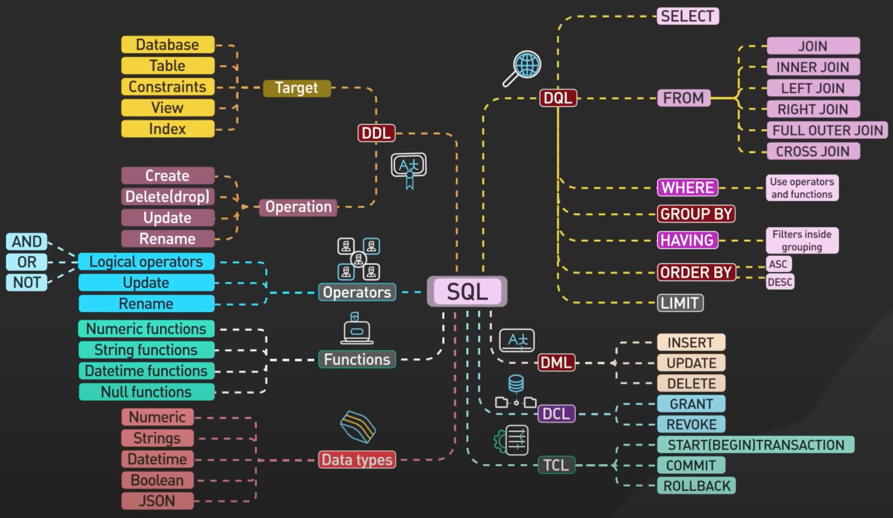

<details><summary style="font-size:20px;color:Orange">SQL, DBMS and RDBMS?</summary>

-   

DBMSs are software applications that help you build and maintain databases. RDBMS is a subset of DBMS, and it is a database management system based on the relational model of the DBMS.

<details><summary style="font-size:15px;color:red">The Terms and Concepts of SQL</summary>

A Relational Database Management System (RDBMS) is a software system that manages and organizes data in a structured manner using the principles of the relational model. It's designed to store, retrieve, and manage large amounts of data while ensuring data integrity, consistency, and security. Here's an in-depth explanation of the terms and concepts associated with RDBMS:

-   `Database`: A collection of related data organized in tables, schemas, and other structures for efficient storage and retrieval.

-   **Schema**: A schema is a logical container or namespace that holds a collection of database objects, including tables, views, indexes, functions, and procedures. Defining the structure, relationships, and constraints of the database, it provides a way to organize and manage these objects within a database. If you have an e-commerce database, you might have schemas like "Sales," "Products," and "Customers", each containing tables and other objects relevant to those areas.

-   `Table`: A fundamental structure in an RDBMS that represents a collection of related data. It consists of rows (records) and columns (fields). In the "Sales" schema of an e-commerce database, you might have a "Orders" table, a "Customers" table, and a "Products" table to store information about orders, customers, and products, respectively.

-   `Row (Record)`: A single data entry within a table, representing a specific entity or instance. Each column stores a specific attribute of the entity.

-   `Column (Field)`: A single data element within a table that represents an attribute of the entity. Columns have a specified data type and store values.

-   `Primary Key`: A column or set of columns that uniquely identifies each row in a table. It enforces entity integrity and ensures data uniqueness.

-   `Foreign Key`: A column that establishes a link between two tables by referencing the primary key of another table. It enforces referential integrity, maintaining data consistency.

-   `Backup and Recovery`: Processes and strategies to create copies of the database and restore it in case of data loss, corruption, or system failures.

</details>

<details><summary style="font-size:15px;color:red">The subsets of SQL</summary>

SQL (Structured Query Language) is a standardized programming language used for managing and manipulating relational databases. SQL encompasses a wide range of operations and statements, but we can categorize it into several subsets, each serving a specific purpose. Here are the key subsets of SQL, explained in detail:

-   `Data Query Language (DQL)`: DQL is used to retrieve data from a database. It includes SQL SELECT statements that allow you to query data based on specified criteria.

    ```sql
    SELECT first_name, last_name FROM employees WHERE department = 'HR';
    ```

-   `Data Definition Language (DDL)`: In the context of SQL, data definition or data description language (DDL) is a syntax for creating and modifying database objects such as tables, indices, and users. DDL statements are similar to a computer programming language for defining data structures, especially database schemas. Common examples of DDL statements include `CREATE`, `ALTER`, and `DROP`. DDL is used for defining and managing the structure of a database. It includes statements for creating, altering, and deleting database objects like tables, indexes, and views.

    ```sql
    CREATE TABLE customers (
        customer_id INT PRIMARY KEY,
        first_name VARCHAR(50),
        last_name VARCHAR(50)
    );
    ```

-   `Data Manipulation Language (DML)`: DML includes the most common SQL statements to store, modify, delete, and retrieve data. They are SELECT, UPDATE, INSERT, and DELETE. DML is used for adding, modifying, and deleting data within a database. It includes statements such as INSERT, UPDATE, and DELETE.

    -   Inserting data:

        ```sql
        INSERT INTO employees (first_name, last_name) VALUES ('John', 'Doe');
        ```

    -   Updating data:

        ```sql
        UPDATE products SET price = 25.99 WHERE product_id = 101;
        ```

    -   Deleting data:

        ```sql
        DELETE FROM orders WHERE order_id = 123;
        ```

-   `Data Control Language (DCL)`: DCL statements are used for managing access to data within a database. They include commands like `GRANT` (to provide permissions) and `REVOKE` (to revoke permissions).

    -   `GRANT`: The GRANT command is used to provide specific privileges or permissions to database users. It allows users to perform certain operations on specified database objects.

        ```sql
        GRANT SELECT, INSERT ON table_name TO user_name;
        ```

    -   `REVOKE`: The REVOKE command is used to revoke previously granted privileges from a user. It takes away specific permissions that were granted using the GRANT command.

        ```sql
        REVOKE SELECT ON table_name FROM user_name;
        ```

-   `Transaction Control Language (TCL)`: TCL statements are used to manage transactions within a database. They include commands like COMMIT (to save changes) and ROLLBACK (to undo changes).

    -   `COMMIT`: The COMMIT command is used to permanently save the changes made during the current transaction. Once a COMMIT is issued, the changes become permanent and visible to other transactions.

        ```sql
        BEGIN TRANSACTION;
        -- SQL statements here
        COMMIT;
        ```

    -   `ROLLBACK`: The ROLLBACK command is used to undo the changes made during the current transaction. It rolls back the database to the state it was in before the transaction started.

        ```sql
        ROLLBACK;
        ```

    -   `SAVEPOINT`: The SAVEPOINT command is used to set a point within a transaction to which you can later roll back. It allows for partial rollback of a transaction.

        ```sql
        SAVEPOINT savepoint_name;
        ```

    -   `ROLLBACK TO SAVEPOINT`: The ROLLBACK TO SAVEPOINT command is used to undo the changes made since a specific savepoint was set within the current transaction.

        ```sql
        ROLLBACK TO SAVEPOINT savepoint_name;
        ```

    -   `SET TRANSACTION`: The SET TRANSACTION command is used to set properties for a transaction, such as isolation level and access mode.

        ```sql
        SET TRANSACTION isolation_level;
        ```

-   `Data Query and Manipulation Functions`:

    -   `Purpose`: SQL includes a wide range of built-in functions that can be used within SELECT and DML statements. These functions perform operations on data, such as mathematical calculations, string manipulations, date/time operations, and more.

    -   Mathematical function:

        ```sql
        SELECT AVG(salary) FROM employees;
        ```

    -   String function:

        ```sql
        SELECT CONCAT(first_name, ' ', last_name) AS full_name FROM customers;
        ```

-   `Database System-Specific Extensions`:

    -   Purpose: Different database management systems (e.g., MySQL, PostgreSQL, Oracle) often provide their own extensions and functionalities that are not part of the SQL standard. These extensions are used for database-specific tasks.

    -   MySQL-specific extension for auto-incrementing columns:

        ```sql
        CREATE TABLE products (
        product_id INT AUTO_INCREMENT PRIMARY KEY,
        product_name VARCHAR(100)
        );
        ```

-   `Data Definition Extensions (e.g., Triggers, Constraints)`:

    -   `Purpose`: SQL allows the creation of advanced database structures, such as triggers and constraints, to enforce data integrity rules and automate actions in response to data changes.

    -   Creating a trigger that fires when a row is updated:

        ```sql
        CREATE TRIGGER update_log
        AFTER UPDATE ON employees
        FOR EACH ROW
        INSERT INTO change_log (employee_id, change_description)
        VALUES (OLD.employee_id, 'Employee data updated');
        ```

</details>

</details>

---

<details><summary style="font-size:20px;color:Orange">ACID Properties</summary>

ACID properties are a set of four characteristics that every transaction in RDBMS adhere to for reliability, consistency and integrity of data in the database.

ACID properties are the foundation of ensuring reliable data manipulation in RDBMS. They act as a set of guarantees that every transaction (a group of database operations) adheres to, safeguarding the consistency and integrity of your data.

ACID is an acronym that represents a set of four characteristics that guarantee the reliability, consistency and integrity of transactions in a database. These properties are crucial for maintaining data integrity and ensuring that database transactions occur in a predictable and reliable manner. The ACID properties are:

-   **Atomicity**: Atomicity ensures that each transaction is treated as a single unit of operation, meaning it either completes entirely or not at all. In other words, a transaction cannot be partially completed; it must be executed in its entirety. If any part of the transaction fails, the entire transaction is rolled back, and the database is left unchanged, maintaining data integrity.

    -   Atomicity ensures that a transaction is treated as a single, indivisible unit of work.
    -   If any part of the transaction fails, the entire transaction is rolled back to its initial state.
    -   Transactions are either fully completed, leaving the database in a consistent state, or fully rolled back, leaving no trace of changes.

-   **Consistency**: Consistency ensures that the database remains in a valid state before and after the execution of a transaction. This means that transactions must adhere to all integrity constraints, such as foreign key constraints, unique key constraints, and other rules defined in the database schema. If a transaction violates any of these constraints, it will not be allowed to proceed, preserving the overall consistency of the database.

    -   Consistency ensures that a transaction brings the database from one consistent state to another.
    -   The database must satisfy a set of integrity constraints before and after the transaction.
    -   If a transaction violates any integrity constraints, it is rolled back, preserving the consistency of the database.

-   **Isolation**: Isolation ensures that the execution of transactions concurrently does not lead to data inconsistency or conflicts. Each transaction appears to execute independently of others, even when multiple transactions are executed simultaneously. Isolation is achieved through various concurrency control mechanisms, such as locking, multiversion concurrency control (MVCC), and transaction isolation levels (e.g., READ COMMITTED, REPEATABLE READ, SERIALIZABLE). These mechanisms prevent interference between transactions and maintain the illusion that each transaction is executed in isolation.

    -   Isolation ensures that concurrent execution of transactions does not interfere with each other.
    -   Each transaction appears to execute in isolation, as if it were the only transaction in the system.
    -   Transactions are protected from the effects of other transactions that are in progress but have not yet been committed.

    -   Isolation can be violated due to various concurrency-related phenomena, which can lead to data inconsistency or incorrect results.

        -   `Dirty Read`: A dirty read occurs when a transaction reads data that has been modified by another transaction but has not yet been committed. If the other transaction rolls back its changes, the data read by the first transaction becomes invalid. This violates the isolation property because the first transaction is exposed to uncommitted changes made by other transactions.
        -   `Non-Repeatable Read`: A non-repeatable read happens when a transaction reads the same data multiple times within the same transaction, but the data changes between reads due to commits made by other transactions. As a result, the transaction may observe different values for the same data, leading to inconsistency.
        -   `Phantom Read`: Phantom reads occur when a transaction executes a query multiple times within the same transaction, and the result set changes between executions due to inserts or deletes performed by other transactions. This phenomenon violates the isolation property because the transaction may see different sets of rows each time it executes the query.

-   **Durability**: Durability guarantees that once a transaction is committed, its effects are permanently saved and persisted in the database, even in the event of a system failure or crash. This means that once the database acknowledges the successful completion of a transaction, the changes made by that transaction become permanent and will not be lost, regardless of any subsequent failures. Durability is typically achieved through mechanisms like write-ahead logging (WAL) and periodic database backups.

    -   Durability guarantees that once a transaction is committed, its effects are permanent and survive system failures, crashes, or restarts.
    -   The changes made by a committed transaction are stored in non-volatile memory, such as disk storage.
    -   Durability ensures that even in the event of a power outage or system crash, the database can recover and maintain its consistent state.

These ACID properties provide a framework for designing reliable and robust database systems. They are essential for applications where data consistency and reliability are critical, such as financial systems, airline reservations, and other scenarios where the correctness of data is paramount.

</details>

---

<details><summary style="font-size:20px;color:Orange">SQL Constraints</summary>

In relational database management systems (RDBMS), constraints are rules that enforce data integrity and maintain consistency within the database. There are several types of constraints commonly used in RDBMS:

-   **PRIMARY KEY** Constraint: Ensures that each row in a table has a unique identifier, and no two rows can have the same primary key value.
-   **FOREIGN KEY** Constraint: Establishes a relationship between two tables by ensuring that values in a column (or columns) in one table match values in a referenced column (or columns) in another table.
-   **UNIQUE** Constraint: Ensures that values in one or more columns (or combination of columns) are unique across all rows in a table, similar to a primary key constraint but without the requirement of being a primary key.
-   **CHECK** Constraint: Validates the values entered into a column against a specific condition or expression, ensuring that only acceptable data is stored in the database.
-   **NOT NULL** Constraint: Specifies that a column cannot contain null values, ensuring that every row must have a value for that column.
-   **DEFAULT** Constraint: Specifies a default value for a column when no value is explicitly provided during an insert operation.
-   **INDEX** Constraint: the INDEX keyword in MySQL is used to create indexes on columns of a table, improving the performance of data retrieval operations. Different types of indexes, such as single-column indexes, multi-column indexes, unique indexes, and full-text indexes, can be created using the INDEX keyword to suit different querying requirements.
-   **CONSTRAINT** Constraint: the `CONSTRAINT` keyword is used to define constraints within a `CREATE TABLE` statement. Constraints are rules that enforce data integrity and consistency within a database. The `CONSTRAINT` keyword is typically followed by a constraint name and the type of constraint being defined, such as `PRIMARY KEY`, `UNIQUE`, `FOREIGN KEY`, or `CHECK`.
-   **ON DELETE**: In MySQL, the `ON DELETE` clause is used within a `FOREIGN KEY` constraint to specify the action to be taken when a referenced row in the parent table is deleted. This clause allows you to define the behavior of child records in other tables that reference the deleted parent record. MySQL provides several options for the `ON DELETE` clause, each with its own significance:

    -   `ON DELETE RESTRICT` / `ON DELETE NO ACTION`:

        -   This is the default behavior if `ON DELETE` is not explicitly specified.
        -   It prevents the deletion of a parent row if there are any child rows referencing it.
        -   Attempting to delete a parent row with child rows results in a foreign key constraint violation error.

    -   `ON DELETE CASCADE`:

        -   When a parent row is deleted, all corresponding child rows are also automatically deleted.
        -   This ensures referential integrity by automatically removing dependent child records when the parent record is deleted.
        -   It's useful when you want dependent records to be deleted along with the parent record.

    -   `ON DELETE SET NULL`:

        -   When a parent row is deleted, the foreign key column(s) in the child rows are set to `NULL`.
        -   This allows child records to exist independently of the parent records.
        -   It's commonly used for optional relationships where a child record can exist without a parent record.

    -   `ON DELETE SET DEFAULT`:

        -   Similar to `SET NULL`, but the foreign key column(s) in the child rows are set to their default values instead of `NULL`.
        -   Requires that the foreign key columns have default values defined.

-   Create Employees table with constraints

    ```sql
    CREATE TABLE Employees (
        Employee_ID INT PRIMARY KEY,
        First_Name VARCHAR(50) NOT NULL,
        Last_Name VARCHAR(50) NOT NULL,
        Age INT CHECK (Age >= 18),
        Department_ID INT,
        Email VARCHAR(100) UNIQUE,
        Salary DECIMAL(10, 2) DEFAULT 50000.00,
        CONSTRAINT fk_department FOREIGN KEY (Department_ID) REFERENCES Departments(Department_ID) ON DELETE CASCADE,
        INDEX idx_department (Department_ID) -- Creating INDEX constraint
    );
    ```

    ```sql
    CREATE TABLE Employees (
        employee_id INT,
        First_Name VARCHAR(100),
        age INT,
        CONSTRAINT pk_employee PRIMARY KEY (employee_id)
    );
    ```

    ```sql
    CREATE TABLE Employees (
        employee_id INT,
        CONSTRAINT chk_age CHECK (age >= 18)
    );
    ```

    ```sql
    CREATE TABLE Products (
        product_id INT,
        product_name VARCHAR(100),
        UNIQUE INDEX uk_product_id (product_id)
    );
    ```

    ```sql
    CREATE TABLE Orders (
        order_id INT,
        customer_id INT,
        order_date DATE,
        INDEX idx_customer_order (customer_id, order_date)
    );
    ```

</details>

---

<details><summary style="font-size:20px;color:Orange">Data Integrity</summary>

Data integrity refers to the accuracy, consistency, and reliability of data stored in a database. It ensures that the data remains trustworthy and usable throughout its lifecycle, from creation and storage to retrieval and analysis. Maintaining data integrity is crucial for ensuring that the information stored in the database is trustworthy and reflects the real-world entities it represents. RDBMS enforces data integrity through various mechanisms::

-   **Entity Integrity**:

    -   Entity integrity ensures that each row (or record) in a table is uniquely identified by a primary key, and that the primary key column does not contain null values.
    -   Primary keys uniquely identify each record in a table, and foreign keys establish relationships between tables.

-   **Domain Integrity**:

    -   Domain integrity ensures that the values stored in a database column adhere to the specified data type, format, and range.
    -   For example, a column defined as an integer should only contain integer values, and date columns should store valid date formats.

-   **Referential Integrity**:

    -   Referential integrity ensures that if a foreign key (a field in one table that references the primary key in another table) exists in a table, it must reference an existing row in the referenced table. This prevents orphaned records (records that reference non-existent primary key values) and maintains the integrity of the data.
    -   For example, consider two tables: "Orders" and "Customers". If there is a foreign key "customer_id" in the "Orders" table that references the primary key "customer_id" in the "Customers" table, referential integrity ensures that every "customer_id" value in the "Orders" table corresponds to a valid customer in the "Customers" table.

-   **Constraints**:

    -   Constraints are rules defined on columns or tables to enforce data integrity.
    -   Common constraints include UNIQUE, CHECK, and DEFAULT constraints, which ensure that values meet specific criteria or provide default values when not explicitly provided.

-   **Business Rules and Validation**:

    -   Data integrity may involve enforcing business rules and validation logic to ensure that data conforms to specific requirements.
    -   This can include custom checks, validation against external data sources, or complex business rules defined at the application level.

-   **Transaction Integrity**:

    -   Transaction integrity ensures that database transactions adhere to the principles of ACID (Atomicity, Consistency, Isolation, Durability).
    -   Transactions must be executed in a way that maintains the consistency of the database, and any errors or failures during a transaction should not compromise data integrity.

-   **Data Quality**:

    -   Ensuring data quality involves preventing and correcting errors in the data.
    -   This may include methods for identifying and handling duplicate records, ensuring accurate data entry, and maintaining data consistency over time.

Data integrity mechanisms play a fundamental role in building reliable and accurate database systems. They contribute to the overall quality and trustworthiness of the data, supporting the effective functioning of applications and decision-making processes that rely on the information stored in the database.

</detsils>

---

<details><summary style="font-size:20px;color:Orange">Horizontal vs Vertical Scaling</details>

Horizontal and vertical scaling are two different approaches to increasing the capacity or performance of a database system:

-   **Horizontal Scaling (Scale-Out)**:

    -   `Definition`: Horizontal scaling involves adding more machines or nodes to distribute the load across multiple servers.
    -   `Method`: In a horizontally scaled database architecture, data is partitioned and distributed across multiple servers, each handling a subset of the overall workload.
    -   `Advantages`:
        -   `Improved scalability`: As the workload increases, you can add more servers to handle the increased traffic.
        -   `Increased fault tolerance`: If one server fails, the remaining servers can continue to handle requests.
        -   `Lower cost`: Horizontal scaling can often be more cost-effective because it allows you to use commodity hardware.
    -   `Disadvantages`:
        -   `Complexity`: Designing a horizontally scalable architecture requires careful partitioning of data and coordination among distributed components.
        -   `Data consistency`: Maintaining consistency across distributed nodes can be challenging and may require additional mechanisms such as distributed transactions or eventual consistency models.
        -   `Network overhead`: Communication between distributed nodes can introduce latency and network overhead.

-   **Vertical Scaling (Scale-Up)**:

        -   `Definition`: Vertical scaling involves increasing the capacity of a single server by adding more resources such as CPU, memory, or storage.
        -   `Method`: In a vertically scaled database architecture, a single server handles the entire workload, but with upgraded hardware.
        -   `Advantages`:
            -   `Simplicity`: Vertical scaling is simpler to implement because it involves upgrading the existing hardware without changing the architecture.
            -   `Better performance for single transactions`: Since all data resides on a single server, operations that require access to the entire dataset can be faster.
            -   `Easier data consistency`: With all data stored on a single server, maintaining consistency is generally simpler compared to distributed systems.
        -   `Disadvantages`:
            -   `Limited scalability`: Vertical scaling has practical limits in terms of how much you can scale a single server before hitting hardware constraints.
            -   `Higher cost`: Upgrading hardware components can be expensive, especially for high-end servers.
            -   `Single point of failure`: If the single server fails, the entire system becomes unavailable until the server is repaired or replaced.

</details>

---

<details><summary style="font-size:20px;color:Orange">Relationship</summary>

In a relational database management system (RDBMS), relationships define how tables are connected or related to each other. These relationships help maintain the integrity and structure of the data. There are three main types of relationships in an RDBMS:

-   **One-to-One (1:1) Relationship**:

    -   In a one-to-one relationship, each record in one table is related to only one record in another table, and vice versa.
    -   It is less common than other types of relationships but is useful when the data is naturally divided into distinct parts.
    -   Example:

        ```sql
        CREATE TABLE Employee (
            EmployeeID INT PRIMARY KEY,
            EmployeeName VARCHAR(100),
            ContactID INT UNIQUE,
            FOREIGN KEY (ContactID) REFERENCES Contact(ContactID)
        );

        CREATE TABLE Contact (
            ContactID INT PRIMARY KEY,
            Phone VARCHAR(15),
            Email VARCHAR(100)
        );
        ```

    -   In this example, each employee has a unique contact information record.

-   **One-to-Many (1:N) Relationship**:

    -   In a one-to-many relationship, a record in one table can be related to multiple records in another table, but each record in the second table is related to only one record in the first table.
    -   It is the most common type of relationship in relational databases.
    -   Example:

        ```sql
        CREATE TABLE Department (
            Department_ID INT PRIMARY KEY,
            DepartmentName VARCHAR(100)
        );

        CREATE TABLE Employee (
            EmployeeID INT PRIMARY KEY,
            EmployeeName VARCHAR(100),
            Department_ID INT,
            FOREIGN KEY (Department_ID) REFERENCES Department(Department_ID)
        );
        ```

    -   In this example, each department can have multiple employees, but each employee belongs to only one department.

-   **Many-to-Many (N:M) Relationship**:

    -   In a many-to-many relationship, records in both tables can be related to multiple records in the other table.
    -   It is implemented using a junction or associative table that connects the two related tables.
    -   Example:

        ```sql
        CREATE TABLE Student (
            StudentID INT PRIMARY KEY,
            StudentName VARCHAR(100)
        );

        CREATE TABLE Course (
            CourseID INT PRIMARY KEY,
            CourseName VARCHAR(100)
        );

        CREATE TABLE Enrollment (
            StudentID INT,
            CourseID INT,
            PRIMARY KEY (StudentID, CourseID),
            FOREIGN KEY (StudentID) REFERENCES Student(StudentID),
            FOREIGN KEY (CourseID) REFERENCES Course(CourseID)
        );
        ```

    -   In this example, students can enroll in multiple courses, and each course can have multiple enrolled students.

Understanding and properly defining relationships between tables are crucial for designing a well-structured relational database. It ensures data integrity and helps in efficient querying and retrieval of information.

</details>

---

<details><summary style="font-size:20px;color:Orange">JOIN, UNION, MERGE in SQL</summary>

-   

A join is used to query data from multiple tables based on the relationship between the fields. There are four types of joins:

-   <b style="font-size:18px;color:#C71585">Inner Join</b>: An inner join returns only the rows from both tables that satisfy the join condition.

    -   The `INNER JOIN` is a more general type of join that requires an explicit condition to be specified for joining rows from two tables.
    -   The join condition is explicitly specified after the `ON` keyword, and it can involve any comparison or combination of columns from both tables.
    -   `INNER JOIN` returns only the rows for which there is a match based on the specified condition.
    -   `INNER JOIN` provides more flexibility, allowing for custom join conditions, but it requires explicit declaration.

    ```sql
    SELECT e.employee_id, e.first_name, e.last_name, e.department, e.salary
    FROM Employee e
    INNER JOIN Department d ON e.department = d.department_id;
    ```

-   <b style="font-size:18px;color:#C71585">Natural Join</b>: The `NATURAL JOIN` is a type of join that automatically matches and combines columns with the same name from the two tables.

    -   The join condition is determined based on the columns with matching names in both tables.
    -   Columns with the same name but different data types may cause unexpected behavior, and it's important to ensure data consistency.
    -   `NATURAL JOIN` does not require the explicit declaration of the join condition; it is inferred based on column names.

    ```sql
    SELECT *
    FROM Employee
    NATURAL JOIN Department;
    ```

-   <b style="font-size:18px;color:#C71585">Self Join</b>: A self-join in MySQL is a type of join operation where a table is joined with itself. This is useful when you want to compare rows within the same table or when you need to create relationships between different rows in the same table.

    ```sql
    SELECT e1.first_name AS employee_first_name,
        e1.last_name AS employee_last_name,
        e2.first_name AS manager_first_name,
        e2.last_name AS manager_last_name
    FROM Employee e1
    INNER JOIN Employee e2 ON e1.manager_id = e2.employee_id;
    ```

-   <b style="font-size:18px;color:#C71585">Left Join</b>: `LEFT JOIN` returns all rows from the left table (the first table specified in the join) and the matched rows from the right table. If there is no match, NULL values are returned for columns from the right table.

    ```sql
    SELECT e.employee_id, e.first_name, e.last_name, e.department, e.salary
    FROM Employee e
    LEFT JOIN Department d ON e.department = d.department_id;
    ```

-   <b style="font-size:18px;color:#C71585">Right Join</b>: `RIGHT JOIN` returns all rows from the right table and those which are shared between the tables. If there are no matching rows in the left table, it will still return all the rows from the right table.

    ```sql
    SELECT e.employee_id, e.first_name, e.last_name, e.department, e.salary
    FROM Employee e
    RIGHT JOIN Department d ON e.department = d.department_id;
    ```

-   <b style="font-size:18px;color:#C71585">Full Join</b>: `FULL JOIN` returns all rows from both tables. If there is no match, NULL values are returned for columns from the table that lacks a matching row.

    ```sql
    SELECT e.employee_id, e.first_name, e.last_name, e.department, e.salary
    FROM Employee e
    FULL JOIN Department d ON e.department = d.department_id;
    ```

-   <b style="font-size:18px;color:#C71585">Cross Join</b>: A `CROSS JOIN`, also known as a Cartesian join, is a type of join operation in SQL that returns the Cartesian product of two tables. This means that each row from the first table is combined with every row from the second table, resulting in a combination of all possible pairs of rows.

    ```sql
    Copy code
    SELECT *
    FROM table1
    CROSS JOIN table2;
    ```

-   <b style="font-size:18px;color:#C71585">Outer Join</b>: There are three types of outer joins: left outer join, right outer join, and full outer join. These joins allow you to retrieve records from one table even if there are no matching records in the other table.Let's demonstrate each type of outer join using the Employee table along with another table called Department.

    -   **Left Outer Join (LEFT JOIN)**: A left outer join returns all rows from the left table (the first table specified in the JOIN clause), along with matching rows from the right table (the second table specified in the JOIN clause). If there are no matching rows in the right table, NULL values are returned for the columns from the right table.

        ```sql
        SELECT *
        FROM Employee
        LEFT JOIN Department ON Employee.department_id = Department.department_id;
        ```

    -   **Right Outer Join (RIGHT JOIN)**: A right outer join returns all rows from the right table (the second table specified in the JOIN clause), along with matching rows from the left table (the first table specified in the JOIN clause). If there are no matching rows in the left table, NULL values are returned for the columns from the left table.

        ```sql
        SELECT *
        FROM Employee
        RIGHT JOIN Department ON Employee.department_id = Department.department_id;
        ```

    -   **Full Outer Join (FULL JOIN)**: A full outer join returns all rows from both tables, matching rows from both tables where available. If there is no match, NULL values are returned for the columns from the table that does not have a matching row. MySQL does not support full outer joins directly, but you can simulate it using a combination of left and right outer joins with UNION DISTINCT.

        ```sql
        SELECT *
        FROM Employee
        LEFT JOIN Department ON Employee.department_id = Department.department_id
        UNION DISTINCT
        SELECT *
        FROM Employee
        RIGHT JOIN Department ON Employee.department_id = Department.department_id
        WHERE Employee.department_id IS NULL;
        ```

##### Nested Joins:

Nested joins in SQL, also known as subquery joins, involve using one or more subqueries within the join conditions of a query. This technique allows for more complex and specific join criteria, enabling the retrieval of data based on conditions derived from other tables or result sets. Here's a breakdown of how nested joins work:

-   **Main Query**: The outer query selects the final result set that you want to obtain.
-   **Subqueries**: Inside the main query, one or more subqueries are embedded within the join conditions. These subqueries can be correlated or non-correlated.
    -   `Correlated Subquery`: A correlated subquery references columns from the outer query, making it dependent on the outer query's results. It executes once for each row processed by the outer query.
    -   `Non-Correlated Subquery`: A non-correlated subquery operates independently of the outer query and executes only once. It returns a result set that is used by the outer query's join condition.
-   **Join Conditions**: The join conditions of the main query include references to the subqueries, allowing for complex filtering and matching logic.
-   **Execution**: When the SQL query is executed, the database engine first processes the subqueries to obtain intermediate result sets. These intermediate results are then used in conjunction with the main query's join conditions to produce the final result set.
-   **Example**: Suppose you have three tables: employees, departments, and salaries. The employees table contains information about employees, the departments table contains information about departments, and the salaries table contains information about employee salaries.

    -   You want to retrieve the names of employees along with their department names, but only for employees who earn a salary higher than a certain threshold. Additionally, you want to include only those employees who belong to departments with a certain budget.You can achieve this using nested joins as follows:

        ```sql
        SELECT e.name AS employee_name, d.name AS department_name
        FROM employees e
        JOIN (
            SELECT * FROM departments WHERE budget > 1000000
        ) d ON e.department_id = d.id
        JOIN (
            SELECT * FROM salaries WHERE amount > 50000
        ) s ON e.id = s.employee_id;
        ```

        -   The innermost subquery selects departments with a budget greater than 1000000.
        -   The middle subquery selects salaries higher than 50000.
        -   The outer query joins the employees table with the result of the subqueries based on the appropriate foreign keys (department_id and employee_id).
        -   Finally, the query selects the employee names (e.name) and department names (d.name) based on the join conditions.

#### Union

In MySQL, the `UNION` operator is used to combine the result sets of two or more `SELECT` queries into a single result set. Although it removes duplicate rows from the combined result set by default, `UNION ALL` can be used to keep duplicates in the reselt set. There are three types of UNION operations: **UNION**, **UNION ALL**, and **UNION DISTINCT**. Let's explore each type in detail and demonstrate their usage with the Employee table.

1. **UNION**: The `UNION` operation combines the result sets of two or more SELECT statements and removes duplicate rows from the combined result set.

    ```sql
    SELECT first_name, last_name
    FROM Employee
    UNION
    SELECT first_name, last_name
    FROM AnotherTable;
    ```

2. **UNION ALL**: `The UNION ALL` operation combines the result sets of two or more SELECT statements, including all rows from each SELECT statement, without removing duplicate rows.

    ```sql
    SELECT first_name, last_name
    FROM Employee
    UNION ALL
    SELECT first_name, last_name
    FROM AnotherTable;
    ```

3. **UNION DISTINCT**: The `UNION DISTINCT` operation is similar to UNION, but it explicitly specifies that duplicate rows should be removed from the combined result set. This is the default behavior of UNION.

    ```sql
    SELECT first_name, last_name
    FROM Employee
    UNION DISTINCT
    SELECT first_name, last_name
    FROM AnotherTable;
    ```

#### MERGE

In the context of MySQL, "MERGE" refers to the MERGE storage engine and the MERGE table type.

The MERGE storage engine allows developers to create a collection of identical MyISAM tables that can be addressed as a single entity. It enables data from multiple tables to be logically combined and presented as a single table for querying purposes. Here are some key points about MERGE tables in MySQL:

-   **Table Management**: MERGE tables provide a way to manage a set of MyISAM tables as a single entity. Developers can create a MERGE table that represents a logical view of multiple underlying tables.

-   **Querying Simplicity**: With MERGE tables, developers can simplify querying by treating multiple tables as a single table. Queries against the MERGE table will transparently access data from all the underlying tables.

-   **Partitioning**: MERGE tables can be used to implement simple partitioning strategies by splitting data across multiple MyISAM tables based on criteria such as ranges of values. Each underlying MyISAM table can represent a partition of the data.

-   **Data Distribution**: MERGE tables provide flexibility in distributing data across multiple physical tables. This can be useful for applications that require horizontal scaling or data sharding.

-   **Performance Considerations**: While MERGE tables offer flexibility and convenience, they may not provide the same level of performance and scalability as other partitioning solutions, such as MySQL partitioning or sharding with InnoDB tables.

-   **Maintenance**: Developers need to be mindful of maintenance tasks when using MERGE tables. For example, adding or removing underlying tables from a MERGE table requires careful management to ensure data consistency and query performance.

Overall, MERGE tables in MySQL offer a convenient way to manage and query data distributed across multiple MyISAM tables. They can be useful in certain scenarios where partitioning or data distribution is required, but developers should also consider the performance and maintenance implications when choosing to use MERGE tables.

In MySQL, the MERGE statement isn't used for combining data like in other databases; instead, it's used for two different operations: the MERGE storage engine and the MERGE table handler.

-   **MERGE Storage Engine**:
    -   MySQL used to support a MERGE storage engine, but it was deprecated and removed in later versions.
    -   The MERGE storage engine allowed multiple MyISAM tables to be treated as a single table for query and DML operations.
    -   Each underlying table in a MERGE table had identical column definitions and indexes.
    -   When performing queries or DML operations on the MERGE table, MySQL would distribute the operation to the appropriate underlying table.
-   **MERGE Table Handler**:

    -   MySQL supports the MERGE table handler, which is used to create a collection of identical MyISAM tables that can be referenced as a single table.
    -   This allows for horizontal partitioning of large tables, where each underlying table represents a partition of the data.
    -   The MERGE table itself doesn't contain any data; it's simply a collection of pointers to the underlying tables.
    -   Queries and DML operations on the MERGE table are distributed to the appropriate underlying tables based on the partitioning criteria.

-   **Creating a MERGE Table**: Since the MERGE storage engine has been deprecated and removed, the focus here will be on the MERGE table handler.

    ```sql
    CREATE TABLE merge_table (
        id INT NOT NULL AUTO_INCREMENT,
        name VARCHAR(100),
        age INT,
        PRIMARY KEY (id)
    ) ENGINE=MRG_MyISAM UNION=(table1, table2, table3);
    ```

</details>

---

<details><summary style="font-size:20px;color:Orange"> Subquery</summary>

In SQL, a subquery (also known as an inner query or nested query) is a query nested within another SQL query. It allows you to use the result of one query as the input for another query. Subqueries are enclosed within parentheses and can be used in various parts of a SQL statement, such as SELECT, INSERT, UPDATE, or DELETE statements. There are two main types of subqueries:

-   **Single-row subquery**: A single-row subquery returns only one row of result. It can be used wherever a single value is expected, such as in the SELECT list, WHERE clause, or HAVING clause. Here's an example:

    ```sql
    SELECT column1
    FROM table1
    WHERE column2 = (SELECT column3 FROM table2 WHERE condition);
    ```

    In this example, (SELECT column3 FROM table2 WHERE condition) is a single-row subquery that returns a single value, which is compared with column2 in the outer query.

-   **Multi-row subquery**: A multi-row subquery returns multiple rows of result. It can be used wherever a list of values is expected, such as in the IN or EXISTS operators. Here's an example:

    ```sql
    SELECT column1
    FROM table1
    WHERE column2 IN (SELECT column3 FROM table2 WHERE condition);
    ```

    In this example, (SELECT column3 FROM table2 WHERE condition) is a multi-row subquery that returns multiple values, which are used to filter column2 in the outer query.

-   **Correlated Subquery:**: Subqueries can also be correlated, meaning they reference columns from the outer query within the inner query. Correlated subqueries are often used when you need to filter the inner query based on values from the outer query.

    ```sql
    SELECT column1
    FROM table1 t1
    WHERE column2 = (SELECT MAX(column3) FROM table2 t2 WHERE t2.foreignKey = t1.primaryKey);
    ```

    In this example, the inner query (SELECT MAX(column3) FROM table2 t2 WHERE t2.foreignKey = t1.primaryKey) is correlated to the outer query by referencing t1.primaryKey. It calculates the maximum value of column3 for each row in table1.

</details>

---

<details><summary style="font-size:20px;color:Orange"> Views</summary>

Views in MySQL are virtual tables that are created based on the result set of a SELECT query. They provide a way to present data stored in one or more tables in a structured format, similar to a table, without actually storing the data physically. Here are some vivid details about views in MySQL:

-   **Virtual Nature**: Views are virtual in the sense that they do not contain any data themselves. Instead, they act as a "window" through which users can query the underlying tables. When a query is executed against a view, MySQL executes the underlying SELECT statement and returns the result set to the user.

-   **Classification of Views**: Views in MySQL can be classified based on their purpose, accessibility, and updatability:

    -   `Simple Views`:
        -   Simple views are basic views that are defined using a single SELECT statement.
        -   They can consist of one or more tables and may include WHERE, ORDER BY, GROUP BY, and JOIN clauses.
        -   Simple views are read-only and cannot contain aggregate functions or subqueries in the SELECT statement.
    -   `Complex Views`:
        -   Complex views are views that involve more complex SQL operations such as UNION, subqueries, or aggregate functions.
        -   They may require more computation and are often used to provide a specific subset of data or perform data transformations.
    -   `Updatable Views`:
        -   Updatable views allow users to perform INSERT, UPDATE, and DELETE operations directly on the view.
        -   The underlying tables must meet certain criteria for the view to be updatable, such as having a unique key and not containing certain constructs like subqueries or joins.
    -   `Materialized Views`: A materialized view is a database object that stores the result of a query physically on disk. Unlike a regular view, which dynamically generates data on-the-fly from underlying tables, a materialized view saves a snapshot of the query's result, allowing faster access to complex data. This snapshot can be refreshed periodically or on demand to stay updated with the source data. Materialized views are especially useful for improving query performance in scenarios where data doesn’t need to be real-time.
        -   Materialized views are physical copies of the underlying data stored as tables.
        -   They are updated periodically to reflect changes in the underlying data.
        -   Materialized views can improve query performance by pre-computing and storing the results of complex queries.
        -   While `MySQL` does not support materialized views natively, users can simulate their behavior by periodically refreshing the view's data. This involves dropping and recreating the view or using stored procedures to update the view's data based on changes in the underlying tables.

-   **Usefulness of View**:

    1. `Simplifying Complex Queries`: Views allow users to encapsulate complex joins, filters, and aggregations into a single query, making it easier to retrieve frequently accessed data without rewriting complex SQL.
    2. `Data Security and Access Control`: Views can restrict access to sensitive data by exposing only certain columns or rows from underlying tables. Users can be granted permission to access the view without direct access to the base tables.
    3. `Abstraction and Encapsulation`: Views provide an abstraction layer, meaning that underlying tables can change (e.g., column names or table structure) without affecting applications that rely on the view. This encapsulation allows for greater flexibility and maintainability.
    4. `Reuse and Consistency`: By defining views, organizations can enforce consistency across different applications or users querying the database, as they all see the same formatted data from the view.
    5. `Improving Readability`: Views can improve the readability of the database schema by presenting commonly used datasets in an organized format. This is helpful for developers and analysts to understand and work with data more easily.
    6. `Performance Optimization (for Materialized Views)`: While standard views do not directly improve performance, materialized views physically store query results and can drastically reduce response time for expensive, frequently-run queries.

</details>

---

<details><summary style="font-size:20px;color:Orange">CTE (Common Table Expression)</summary>

In the context of a RDBMS, a CTE (Common Table Expression) is a temporary result set that you can reference within a `SELECT`, `INSERT`, `UPDATE`, or `DELETE` statement. It is particularly useful for breaking down complex queries, improving readability, and making queries easier to manage and understand.

-   A CTE is defined within the execution of a single SQL statement and only exists for the duration of that statement.
-   Unlike a derived table or subquery, a CTE can be referenced multiple times within the same query, which can lead to better performance and easier query writing.
-   CTEs are defined using the `WITH` keyword, followed by the name of the CTE, and then a query that defines the result set of the CTE.

    ````sql
    WITH cte_name AS (
        -- SQL query that defines the CTE
        SELECT column1, column2
        FROM some_table
        WHERE some_condition
    )
    -- Main query that references the CTE
    SELECT *
    FROM cte_name
    WHERE another_condition;
        ```
    ````

-   **Non-Recursive CTE**: It is the most common type of CTE, which is simply a way to structure a query. Imagine you have a table `employees` and you want to find all employees who have a salary greater than the average salary of the company.

    ```sql
    WITH AverageSalary AS (
        SELECT AVG(salary) AS avg_salary
        FROM employees
    )
    SELECT employee_id, name, salary
    FROM employees
    WHERE salary > (SELECT avg_salary FROM AverageSalary);
    ```

-   **Recursive CTE**: It is a special type of CTE that references itself within the CTE definition. Recursive CTEs are useful for hierarchical or tree-structured data, like organizational charts or file directories. Suppose you have a table `employees` with `employee_id`, `name`, and `manager_id`, where `manager_id` references the `employee_id` of the employee's manager. You want to find the hierarchy of employees starting from a particular manager.

    ```sql
    WITH EmployeeHierarchy AS (
        -- Anchor member: Select the manager
        SELECT employee_id, name, manager_id
        FROM employees
        WHERE employee_id = 1  -- Assuming employee_id = 1 is the top-level manager

        UNION ALL

        -- Recursive member: Select employees managed by the manager in the anchor member
        SELECT e.employee_id, e.name, e.manager_id
        FROM employees e
        INNER JOIN EmployeeHierarchy eh ON e.manager_id = eh.employee_id
    )
    SELECT * FROM EmployeeHierarchy;
    ```

-   **Usefulness of CTEs**:

    1. `Simplifying Complex Queries`: CTEs break down complex queries by allowing you to define intermediate result sets that can be referenced multiple times within a query, making the code easier to read and manage.
    2. `Improving Readability and Reusability`: Since CTEs can be defined once and referenced multiple times, they enhance query readability by allowing developers to reuse query logic without duplicating code.
    3. `Recursive Queries`: CTEs support recursion, making it possible to write recursive queries for hierarchical or tree-structured data (such as organizational charts or folder structures) more effectively and cleanly.
    4. `Easier Debugging and Maintenance`: By isolating parts of the query into separate CTEs, it's easier to identify and troubleshoot specific parts of the logic, which makes queries easier to debug and maintain.
    5. `Temporary Scope Without Data Persistence`: CTEs only exist for the duration of the query in which they are defined, avoiding the need to create and manage temporary tables or views in the database.
    6. `Improved Query Optimization`: In some cases, the RDBMS optimizer can handle CTEs in a way that results in more efficient execution plans compared to complex subqueries or joins directly in the main query.

-   <b style="color:#C71585">View vs CTE</b>:

    1. **Definition and Persistence**:

        - `View`: A view is a saved, named query stored in the database schema as a virtual table. Once created, it exists in the database until explicitly dropped.
        - `CTE`: A CTE is a temporary, named result set defined within a single SQL query using the `WITH` keyword. It only exists for the duration of that query and doesn’t persist beyond it.

    2. **Scope and Usage**:

        - `View`: A view can be queried as a standalone object (e.g., `SELECT * FROM view_name`), and it can also be joined with other tables or views in various queries.
        - `CTE`: A CTE is specific to the query in which it’s defined and cannot be directly queried independently. Each CTE only exists within its query context.

    3. **Performance Optimization**:
        - `View`: Standard views do not store data, so each time they are queried, the underlying SQL is re-executed. However, `materialized views` (a special type of view) store query results and can improve performance for costly computations.
        - `CTE`: CTEs are re-evaluated every time the query runs, though SQL optimizers often handle them efficiently. Recursive CTEs are useful for hierarchical data but can be performance-intensive for large datasets.

</details>

---

<details><summary style="font-size:20px;color:Orange">Index</summary>

An index in MySQL is a data structure that improves the speed of data retrieval operations on database tables by providing quick access to rows based on the values of certain columns. It acts like a pointer to the actual data in the table and speeds up query execution by allowing the database engine to locate rows more efficiently.

```sql
CREATE INDEX idx_department ON Employee(department);

SELECT * FROM Employee WHERE department = 'IT';
```

When executing this query, MySQL can utilize the `idx_department` index to quickly locate all rows in the `Employee` table where the `department` column equals `IT`, resulting in faster query execution compared to scanning the entire table. Indexes can significantly improve the performance of `SELECT`, `UPDATE`, `DELETE`, and `MERGE` statements that filter or sort data based on indexed columns. However, keep in mind that indexes also consume storage space and can slow down data modification operations (`INSERT`, `UPDATE`, `DELETE`) because MySQL needs to update the index as well.

---

-   `Performance Improvement`: Indexes significantly speed up data retrieval operations, such as `SELECT` queries, by reducing the number of rows that need to be scanned.
-   `Quick Lookups`: Indexes help in quickly locating data without having to search every row in a table.
-   `Selectivity`: Indexes are more effective on columns with high selectivity (unique values).
-   `Indexing Frequently Queried Columns`: Index columns that are frequently used in `WHERE` clauses, `JOIN` conditions, `ORDER BY`, and `GROUP BY` clauses.
-   `Index Maintenance`: Indexes need to be maintained, as they consume additional storage and can slow down `INSERT`, `UPDATE`, and `DELETE` operations.
-   `Over-Indexing`: Avoid over-indexing, as too many indexes can degrade write performance and increase storage usage.
-   `Index Column Width`: Use shorter column widths for indexing whenever possible to reduce storage and improve performance.

</details>

---

<details><summary style="font-size:20px;color:Orange">Partition</summary>

Partitioning in RDBMS (Relational Database Management System) refers to the process of splitting a large table into smaller, more manageable pieces called partitions. Each partition is treated as a separate table by the database system, and may be stored on different disk drives or even on different servers, depending on the partitioning strategy.
Partitioning is a useful technique for managing large tables in an RDBMS, but it requires careful consideration of the partitioning strategy, as well as ongoing monitoring and maintenance to ensure that partitions continue to perform as expected.

-   Partitioning has several benefits, including:

    -   `Increased query performance`: By partitioning a large table into smaller pieces, queries that access only a subset of the data can be processed more quickly.

    -   `Improved manageability`: Partitioning makes it easier to manage large tables by breaking them into smaller, more manageable pieces.

    -   `Reduced downtime`: By partitioning a table, database maintenance operations, such as backups and index rebuilds, can be performed on individual partitions rather than on the entire table, reducing downtime.

    -   `Enhanced scalability`: Partitioning allows for easier scaling of a database by allowing new partitions to be added as needed.

-   There are different types of partitioning techniques available in RDBMS, including:

    -   `Range partitioning`': This involves partitioning a table based on a range of values in a particular column, such as dates or numeric values.

    -   `List partitioning`': This involves partitioning a table based on a list of discrete values in a particular column.

    -   `Hash partitioning`': This involves partitioning a table based on the results of applying a hash function to the values in a particular column.

    -   `Composite partitioning`': This involves partitioning a table using a combination of range, list, and/or hash partitioning techniques.

Partitioning in MySQL involves splitting large tables into smaller, more manageable pieces called partitions, which can improve query performance, simplify maintenance, and provide better data organization. Here's how you can demonstrate partitioning a table in a MySQL database:

1. **Create a Sample Table**: Let's create a sample table named sales with columns id, date, amount, and region.

    ```sql
    CREATE TABLE sales (
        id INT AUTO_INCREMENT PRIMARY KEY,
        date DATE,
        amount DECIMAL(10, 2),
        region VARCHAR(50)
    );
    ```

2. **Enable Partitioning**: First, ensure that the partitioning feature is enabled in your MySQL server configuration (my.cnf or my.ini file). You can enable it by adding or uncommenting the following line:

3. **Partition the Table**: Let's partition the sales table by date column using the RANGE partitioning method. We'll partition it by year.

    ```sql
    CREATE TABLE sales_partitioned (
        id INT AUTO_INCREMENT,
        date DATE,
        amount DECIMAL(10, 2),
        region VARCHAR(50),
        PRIMARY KEY (id, date) -- Note: Primary key must include the partitioning column(s)
    ) PARTITION BY RANGE(YEAR(date)) (
        PARTITION p2019 VALUES LESS THAN (2020),
        PARTITION p2020 VALUES LESS THAN (2021),
        PARTITION p2021 VALUES LESS THAN (2022)
    );
    ```

4. **Insert Data**: Insert some sample data into the partitioned table.

    ```sql
    INSERT INTO sales_partitioned (date, amount, region) VALUES
    ('2019-01-01', 100.00, 'North'),
    ('2020-05-15', 150.00, 'South'),
    ('2020-08-20', 200.00, 'East'),
    ('2021-03-10', 120.00, 'West');
    ```

5. **Query the Partitioned Table**: You can query the partitioned table like any other table. The MySQL optimizer will automatically route the query to the appropriate partition(s) based on the partitioning criteria.

    ```sql
    SELECT *
    FROM sales_partitioned
    WHERE date BETWEEN '2020-01-01' AND '2021-12-31';
    ```

6. **Clean Up**: Don't forget to clean up the sample tables if you no longer need them.

    ```sql
    DROP TABLE sales_partitioned;
    ```

**Notes**:

-   Partitioning can significantly improve query performance for large tables, especially when dealing with time-based data or data that is frequently queried based on certain criteria.
-   There are various partitioning methods supported by MySQL, such as RANGE, LIST, HASH, and KEY partitioning. Choose the appropriate method based on your data and query patterns.
-   Be cautious when partitioning tables, as it can affect other operations such as backups, maintenance, and data manipulation. Test thoroughly before implementing partitioning in a production environment.

</details>

---

<details><summary style="font-size:20px;color:Orange">Sharding</summary>

Sharding in databases is a method of distributing data across multiple machines to improve performance, scalability, and manageability. It involves breaking up a large database into smaller, more manageable pieces called shards, each of which can be stored on a different server. Here's a more detailed explanation:

#### Key Concepts of Sharding:

1. **Shard**: A shard is a horizontal partition of data in a database. Each shard is a separate database that holds a subset of the total data.
2. **Shard Key**: The shard key is a field or set of fields in the data that is used to determine how the data is distributed across the shards. It is essential for balancing the data evenly and ensuring that queries can be directed to the appropriate shard.
3. **Horizontal Partitioning**: Unlike vertical partitioning, which divides data by columns, horizontal partitioning (sharding) divides data by rows. Each shard contains the same schema but different rows.

#### Benefits of Sharding:

1. **Scalability**: By distributing data across multiple servers, sharding allows a database to scale out horizontally. This means you can add more machines to handle increased load rather than upgrading a single machine.
2. **Performance**: Sharding can improve performance by distributing queries across multiple servers, reducing the load on each server and allowing parallel processing.
3. **Manageability**: Smaller, more manageable shards can make it easier to back up, restore, and maintain data.
4. **Fault Tolerance**: Sharding can increase fault tolerance by isolating failures to individual shards rather than affecting the entire database.

#### Challenges of Sharding:

1. **Complexity**: Sharding introduces complexity in terms of data distribution, query routing, and maintaining consistency across shards.
2. **Data Rebalancing**: As data grows, shards may become unbalanced, requiring data to be redistributed. This rebalancing can be complex and resource-intensive.
3. **Cross-Shard Queries**: Queries that need to access data across multiple shards can be more complicated and slower than those that access a single shard.
4. **Consistency and Transactions**: Ensuring data consistency and supporting transactions across multiple shards can be challenging and may require additional mechanisms like distributed transactions.

#### Example Use Case:

Consider an online retailer with a large customer base and extensive transaction data. Rather than storing all this data in a single database, the retailer could use sharding to distribute customer data across multiple databases based on a shard key, such as customer ID. This way, queries for a specific customer's data can be directed to the appropriate shard, reducing load and improving query performance.

#### Implementation:

-   **Hash Sharding**: A common approach where a hash function is applied to the shard key to determine which shard to store the data in.
-   **Range Sharding**: Data is divided into ranges based on the shard key. Each range is assigned to a different shard.
-   **Directory-Based Sharding**: A lookup service maintains a mapping between keys and shards. When a query is made, it consults the directory to determine the correct shard.

In summary, sharding is a powerful technique for scaling databases horizontally and managing large datasets, but it comes with its own set of complexities and challenges that need to be carefully managed.

</details>

---

<details><summary style="font-size:20px;color:Orange">Normalization</summary>

Normalization is a process in database design to minimize data redundancy and dependency. The database is divided into two or more tables, and relationships are defined between them.

-   **First Normal Form (1NF)**: It is a property of a relational database table that ensures the table adheres to certain structural rules. A table is in 1NF if:

    -   `Atomicity`: Each column contains only indivisible, atomic values (i.e., no repeating groups or arrays).
    -   `Uniqueness`: Each row must be unique, identifiable by a primary key.
    -   `Single Value per Field`: Each field contains only one value from its column's domain.

    | StudiD | Name  | Phonenum              |
    | :----- | :---- | :-------------------- |
    | 1      | John  | 9176612345,9176645698 |
    | 2      | Susie | 9176645789            |
    | 3      | Jim   | 9176696325            |

    -   In the above table the field ‘phonenum’ is a multi-valued attribute, so it is not in 1NF.
    -   Below Table is in 1NF as there is no multi-valued attribute

    | StudiD | Name  | Phonenum   |
    | :----- | :---- | :--------- |
    | 1      | John  | 9176612345 |
    | 1      | John  | 9176645698 |
    | 2      | Susie | 9176645789 |
    | 3      | Jim   | 9176696325 |

-   `Second Normal Form`: Second Normal Form (2NF) in SQL builds upon First Normal Form (1NF) and adds the requirement of eliminating partial dependencies. A table is in 2NF if:

    -   `It is already in 1NF`: The table must meet all the requirements of First Normal Form.
    -   `No Partial Dependencies`: Every non-key column must depend on the entire primary key, not just a part of it. This means that if a table has a composite primary key, each non-key column must be related to the whole primary key, not just part of it.

    -   To bring the above table in 2NF we split the table into two tables

    | StudiD | Name  |
    | :----- | :---- |
    | 1      | John  |
    | 2      | Susie |
    | 2      | Jim   |

    | StudiD | Phonenum   |
    | ------ | ---------- |
    | 1      | 9176612345 |
    | 1      | 9176645698 |
    | 2      | 9176645789 |
    | 3      | 9176696325 |

-   `Third Normal Form`: Third Normal Form (3NF) in SQL builds upon Second Normal Form (2NF) by removing transitive dependencies. A table is in 3NF if:

    -   `It is already in 2NF`: The table must meet all the requirements of Second Normal Form.
    -   `No Transitive Dependencies`: Non-key columns must depend only on the primary key. There should be no dependency between non-key columns. In other words, a non-key column should not depend on another non-key column.

    -   Consider the `EMPLOYEE_DETAIL` table: This table is not in the third normal form because the fields `emp_state` and `emp_city` depend on `emp_zip` and not on the primary key `emp_id`.

        | EMP_ID | EMP_NAME | EMP_ZIP | EMP_STATE | EMP_CITY |
        | ------ | -------- | ------- | --------- | -------- |
        | 222    | Harry    | 201010  | CT        | Monroe   |
        | 333    | Stephan  | 02228   | TX        | Dallas   |
        | 444    | Lan      | 060007  | IL        | Chicago  |

    -   The above table is split into 2 tables and now the tables are in the third normal form.

    -   EMPLOYEE table:

        | EMP_ID | EMP_NAME | EMP_ZIP |
        | ------ | -------- | ------- |
        | 222    | Harry    | 201010  |
        | 333    | Stephan  | 02228   |
        | 444    | Lan      | 060007  |

    -   EMPLOYEE_ZIP table:

        | EMP_ZIP | EMP_STATE | EMP_CITY |
        | ------- | --------- | -------- |
        | 201010  | CT        | Monroe   |
        | 02228   | TX        | Dallas   |
        | 060007  | IL        | Chicago  |

<details><summary style="font-size:18px;color:#C71585"> What is de-normalization, and when do you go for it?</summary>

De-normalization is a technique sometimes used to improve performance so the table design allows redundant data to avoid complex joins. If the application involves heavy read operations, then de-normalization is used at the expense of the write operations performance.

</details>
</details>

---

<details><summary style="font-size:20px;color:Orange">Transactions</summary>

In the context of Relational Database Management Systems (RDBMS), a transaction is a logical unit of work that consists of one or more SQL operations (queries, updates, inserts, deletes) executed as a single, atomic unit. Transactions are used to ensure the integrity, consistency, and reliability of data within a database. They follow the principles of the ACID properties: Atomicity, Consistency, Isolation, and Durability. Here's an explanation of the key aspects of transactions in terms of RDBMS:

-   `Atomicity`: The atomicity property ensures that a transaction is treated as a single, indivisible unit of work. All the operations within a transaction are either completed successfully, making all changes permanent, or none of them are applied at all. If any part of a transaction fails, the entire transaction is rolled back, ensuring that the database remains in a consistent state.

-   `Consistency`: The consistency property ensures that a transaction brings the database from one valid state to another. This means that the database must satisfy all integrity constraints and business rules before and after the transaction. In other words, the transaction should not violate any predefined rules or constraints.

-   `Isolation`: The isolation property ensures that transactions execute independently and in isolation from each other. Even if multiple transactions are executed concurrently, their effects should not interfere with each other. Isolation prevents one transaction from accessing or modifying data being processed by another transaction until it's complete.

-   `Durability`: The durability property guarantees that once a transaction is successfully completed, its changes are permanent and will survive system failures or crashes. The changes made by committed transactions are stored in non-volatile storage (usually disk) and remain even after the system restarts.

-   Transactions are crucial in maintaining data integrity and preventing anomalies that might arise due to concurrent access and updates to the database. Without transactions, databases could end up in inconsistent states or lost data due to system failures.

-   In practical terms, using transactions involves starting a transaction (BEGIN), executing one or more SQL statements, and then either committing the changes (COMMIT) to make them permanent or rolling back (ROLLBACK) the entire transaction if any part of it fails.

-   Example of a simple transaction using SQL:

    ```sql
    BEGIN; -- Start the transaction
    UPDATE Accounts SET Balance = Balance - 100 WHERE AccountID = 123; -- Deduct $100
    UPDATE Transactions SET Status = 'Completed' WHERE TransactionID = 456; -- Mark the transaction as completed

    COMMIT; -- Commit the changes
    ```

##### How to save RDBM Transactions for later use?

Saving RDBMS transactions for later use involves capturing the SQL statements and data changes within a transaction and then storing them in a persistent form, such as a file or a separate table, for future execution. Here's how you can do it:

-   `Capture SQL Statements`: As you execute SQL statements within a transaction, capture those statements in a script or a data structure in your programming language.

-   `Data Serialization`: Serialize the captured data into a format that can be stored and later deserialized for execution. Common formats include JSON, XML, or plain text.

-   `File Storage`: Save the serialized data into a file on your file system. Choose an appropriate naming convention to identify the file as a stored transaction.

-   `Database Table`: Create a separate table in your database to store transaction scripts. This table can have columns for transaction ID, timestamp, and the serialized script.

-   `Logging and Auditing`: Optionally, you can log the fact that a transaction script was saved, along with metadata like the user who initiated the transaction. Ensure that saved transacton scripts are stored securely and only accessible to authorized users to prevent unauthorized changes.

-   `Indexing and Retrieval`: If you're storing scripts in a database table, consider adding indexes to facilitate retrieval based on criteria like transaction ID or timestamp.

-   `Execution Mechanism`: To execute a saved transaction, you'll need a mechanism to deserialize the script and execute the SQL statements within it using the appropriate database connection.

-   `Example`:

    ```python
    import json
    import sqlite3

    # Simulated captured SQL statements
    transaction_data = {
        "transaction_id": 123,
        "timestamp": "2023-08-01 10:00:00",
        "sql_statements": [
            "INSERT INTO Orders (CustomerID, OrderDate) VALUES (456, '2023-08-01')",
            "INSERT INTO OrderItems (OrderID, ProductID, Quantity) VALUES (LAST_INSERT_ROWID(), 789, 2)"
        ]
    }

    # Serialize data to JSON
    serialized_data = json.dumps(transaction_data)

    # Save to a file
    with open("saved_transaction.json", "w") as f:
        f.write(serialized_data)

    # Later, retrieve and execute the saved transaction
    with open("saved_transaction.json", "r") as f:
        retrieved_data = json.load(f)

    # Execute the SQL statements using SQLite connection
    conn = sqlite3.connect("your_database.db")
    for sql_statement in retrieved_data["sql_statements"]:
        conn.execute(sql_statement)
    conn.commit()
    conn.close()

    ```

</details>

---

<details><summary style="font-size:20px;color:Orange">PL/SQL (Procedural Language/Structured Query Language)</summary>

PL/SQL (Procedural Language/Structured Query Language) is an extension of SQL (Structured Query Language) used in Oracle databases. It combines the data manipulation capabilities of SQL with the procedural features of programming languages, allowing developers to write complex programs to interact with an Oracle database.

#### Key Concepts of PL/SQL

1. **Procedural Language**:

    - While SQL is a declarative language used for querying and manipulating data, PL/SQL adds procedural constructs like variables, loops, conditionals (IF statements), and exception handling, enabling more complex and powerful database operations.

2. **Blocks Structure**:

    - PL/SQL programs are organized into blocks. Each block can be anonymous or named and typically consists of three sections:
        - **Declaration**: Used to define variables, constants, and cursors.
        - **Execution**: Contains the actual PL/SQL code that performs operations like querying the database, modifying data, and implementing business logic.
        - **Exception Handling**: Handles runtime errors or exceptions that occur during the execution of the PL/SQL block.

    Here's a basic structure of a PL/SQL block:

    ```sql
    DECLARE
        -- Declarations (variables, constants, cursors, etc.)
    BEGIN
        -- Executable statements (SQL queries, assignments, etc.)
    EXCEPTION
        -- Exception handling statements
    END;
    ```

3. **Integration with SQL**:

    - PL/SQL is tightly integrated with SQL, meaning you can execute SQL statements directly within PL/SQL blocks. This integration allows for efficient data manipulation and retrieval, making it easy to embed SQL queries within procedural code.

4. **Control Structures**:

    - PL/SQL includes control structures such as:
        - **Conditional Statements**: IF-THEN-ELSE, CASE statements.
        - **Loops**: FOR loops, WHILE loops, and simple loops.
        - **Error Handling**: EXCEPTION blocks that allow developers to define actions in case of errors.

5. **Procedures and Functions**:

    - **Stored Procedures**: Named PL/SQL blocks that perform specific tasks. They can accept parameters, perform actions, and return results.
    - **Functions**: Similar to procedures but specifically designed to return a single value.

    Example:

    ```sql
    CREATE OR REPLACE PROCEDURE Increase_Salary(p_emp_id IN NUMBER, p_increase IN NUMBER) AS
    BEGIN
        UPDATE employees
        SET salary = salary + p_increase
        WHERE employee_id = p_emp_id;
    END;
    ```

6. **Triggers**:

    - Triggers are special types of stored procedures that automatically execute (or "fire") in response to certain events on a table or view, such as INSERT, UPDATE, or DELETE operations. They are often used for enforcing business rules or maintaining data integrity.

7. **Packages**:

    - A package is a collection of related procedures, functions, variables, and other PL/SQL types grouped together as a single unit. Packages provide modularity, easier maintenance, and improved performance by allowing related code to be stored and executed together.

8. **Cursors**:

    - Cursors in PL/SQL are pointers that allow you to process query results row by row. They are essential when you need to perform operations on each row returned by a query.

    Example:

    ```sql
    DECLARE
        CURSOR emp_cursor IS
            SELECT employee_id, salary FROM employees;
        v_emp_id employees.employee_id%TYPE;
        v_salary employees.salary%TYPE;
    BEGIN
        OPEN emp_cursor;
        LOOP
            FETCH emp_cursor INTO v_emp_id, v_salary;
            EXIT WHEN emp_cursor%NOTFOUND;
            -- Process each row
        END LOOP;
        CLOSE emp_cursor;
    END;
    ```

9. **Exception Handling**:

    - PL/SQL provides robust exception handling to manage errors that occur during program execution. Developers can define actions for specific exceptions or catch any error using the `WHEN OTHERS` clause.

    Example:

    ```sql
    BEGIN
        -- Code that might raise an error
    EXCEPTION
        WHEN NO_DATA_FOUND THEN
            -- Handle no data found error
        WHEN OTHERS THEN
            -- Handle all other errors
    END;
    ```

#### Advantages of PL/SQL

-   **Enhanced SQL**: Allows the combination of SQL's powerful data manipulation capabilities with procedural logic, enabling more complex operations directly within the database.
-   **Performance**: By executing code directly on the server, PL/SQL reduces the need for multiple network round-trips between the application and database, improving performance.
-   **Modularity**: Encourages modular programming with the use of procedures, functions, and packages, making the code easier to maintain and reuse.
-   **Security**: Sensitive operations can be encapsulated within stored procedures and functions, controlling access and reducing the risk of SQL injection attacks.
-   **Error Handling**: Robust error and exception handling mechanisms allow for graceful management of runtime errors.

#### Use Cases for PL/SQL

-   **Data Validation and Integrity**: Implementing complex business rules and data validation logic directly in the database.
-   **Batch Processing**: Efficiently processing large volumes of data, such as updating records or generating reports.
-   **Automation**: Automating repetitive tasks like nightly backups, data transfers, or periodic reporting.
-   **Application Logic**: Implementing application logic within the database layer, particularly for data-intensive applications.

#### Conclusion

PL/SQL extends the capabilities of SQL by adding procedural constructs, making it a powerful tool for Oracle database developers. It enables the creation of complex, efficient, and maintainable database applications, where the logic is executed close to the data, reducing latency and improving performance. By leveraging PL/SQL, developers can build robust, scalable, and secure database-driven applications.

</details>

---

<details><summary style="font-size:20px;color:Orange">Database Administrations</summary>

Administering a Relational Database Management System (RDBMS) involves various tasks to ensure the smooth operation, security, and performance of the database. Below is a comprehensive list of RDBMS admin-related tasks:

-   **Database Installation and Configuration**:

    -   Install the RDBMS software on the server.
    -   Configure database parameters such as memory allocation, buffer sizes, and file locations.

-   **Database Creation**:

    -   Create new databases within the RDBMS.
    -   Set up initial database parameters, such as collation and character set.

-   **User Management**:

    -   Create and manage user accounts with appropriate permissions.
    -   Assign roles and privileges to users based on their responsibilities.
    -   Enforce strong password policies.

-   **Security Management**:

    -   Implement encryption for data in transit and at rest.
    -   Configure firewalls and access controls to restrict unauthorized access.
    -   Regularly review and audit user permissions.

-   **Backup and Recovery**:

    -   Set up regular automated backups of databases.
    -   Implement a backup retention policy.
    -   Test and document the restore process to ensure data recoverability.

-   **Database Monitoring**:

    -   Monitor database performance using tools and logs.
    -   Identify and address performance bottlenecks.
    -   Set up alerts for abnormal behavior or resource usage.

-   **Database Tuning**:

    -   Optimize SQL queries for improved performance.
    -   Fine-tune database parameters based on workload.
    -   Monitor and manage indexes for efficient data retrieval.

-   **High Availability and Disaster Recovery**:

    -   Implement strategies such as clustering or replication for high availability.
    -   Set up disaster recovery plans and mechanisms.

-   **Patch Management**:

    -   Regularly apply patches and updates to the RDBMS software.
    -   Test patches in a non-production environment before applying to production.

-   **Capacity Planning**:

    -   Monitor resource usage trends and plan for future capacity needs.
    -   Scale the infrastructure to accommodate growth.

-   **Data Integrity**:

    -   Enforce referential integrity constraints.
    -   Regularly check and repair data inconsistencies.

-   **Query Optimization**:

    -   Analyze and optimize SQL queries for better performance.
    -   Use query execution plans to identify bottlenecks.

-   **Logging and Auditing**:

    -   Enable database logging for tracking changes and activities.
    -   Regularly review audit logs for security and compliance.

-   **Data Archiving and Purging**:

    -   Implement data archiving and purging strategies for historical data.
    -   Manage the lifecycle of data to prevent database bloat.

-   **Database Decommissioning**:

    -   Plan and execute the decommissioning of databases that are no longer needed.
    -   Archive or migrate data as necessary.

-   **Documentation**:

    -   Maintain comprehensive documentation for database configurations, schemas, and procedures.
    -   Document troubleshooting steps and resolutions.

-   **Training and Knowledge Transfer**:

    -   Train database administrators and other relevant staff.
    -   Ensure knowledge transfer for critical database processes and configurations.

-   **Compliance and Regulations**:

    -   Ensure the RDBMS complies with industry regulations and standards.
    -   Regularly review and update security practices to meet compliance requirements.

-   **Database Connectivity**:

    -   Manage connection pools and configure connection settings.
    -   Troubleshoot and resolve connectivity issues.

-   **Vendor Relations**:

    -   Communicate with the RDBMS vendor for support and issue resolution.
    -   Stay informed about updates, patches, and new features.

-   **Performance Testing**:

    -   Conduct performance testing to simulate real-world scenarios.
    -   Identify and address performance issues proactively.

-   **Database Mirroring and Replication**:

    -   Set up and manage mirroring or replication for distributing data.
    -   Monitor and troubleshoot replication issues.

-   **Resource Utilization Management**:

    -   Optimize server resources, including CPU, memory, and disk space.
    -   Monitor and manage resource consumption.

-   **Middleware Integration**:

    -   Integrate the RDBMS with middleware solutions.
    -   Configure and optimize middleware components for database interactions.

-   **Database Version Upgrades**:

    -   Plan and execute version upgrades for the RDBMS.
    -   Validate application compatibility after upgrades.

-   **Database Virtualization**:

    -   Implement and manage database virtualization solutions.
    -   Optimize virtualized environments for performance.

-   **Collaboration with Developers**:

    -   Collaborate with application developers for database design and optimization.
    -   Provide support for database-related development activities.

-   **Incident Response**:

    -   Develop and document incident response plans for database-related incidents.
    -   Conduct post-incident reviews for continuous improvement.

-   **Knowledge Sharing**:

    -   Facilitate knowledge sharing sessions among database administrators.
    -   Document and share best practices within the team.

-   **Automation**:

    -   Implement automation for routine tasks, backups, and monitoring.
    -   Use scripting and tools for efficient management.

    RDBMS administrators play a crucial role in maintaining the health and integrity of the database systems they oversee. The tasks mentioned above cover a broad range of responsibilities that are essential for the effective administration of an RDBMS.

</details>
