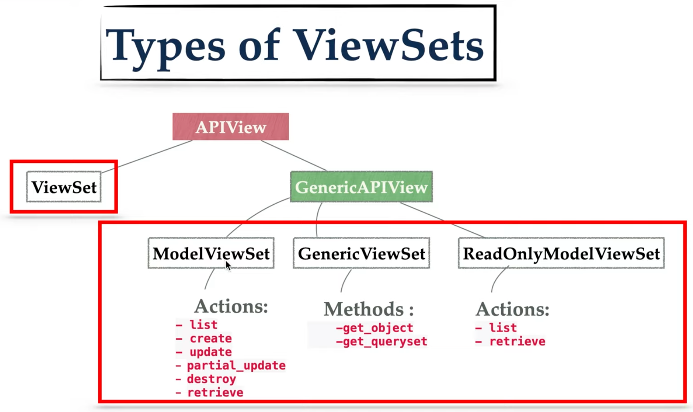

<details><summary><a  style="font-size:25px;color:#FF1493" href="https://www.django-rest-framework.org/api-guide/serializers/">Serializer</a></summary>

<details><summary style="font-size:20px;color:Orange">Serializer API (rest_framework.serializers)</summary>

-   <b style="color:#FF00FF">BaseSerializer(rest_framework.fields.Field)</b>

    -   <b style="color:#C71585">.to_internal_value(data)</b>
    -   <b style="color:#C71585">.to_representation(instance)</b>
    -   <b style="color:#C71585">.update(instance, validated_data)</b>
    -   <b style="color:#C71585">.create(validated_data)</b>
    -   <b style="color:#C71585">.save(\*\*kwargs)</b>
    -   <b style="color:#C71585">.is_valid(raise_exception=False)</b>
    -   <b style="color:#C71585">.data()</b>
    -   <b style="color:#C71585">.errors()</b>
    -   <b style="color:#C71585">.validated_data()</b>

-   <b style="color:#FF00FF">Serializer(BaseSerializer, metaclass=SerializerMetaclass)</b>

    -   <b style="color:#C71585">.fields()</b>
    -   <b style="color:#C71585">.get_fields()</b>
    -   <b style="color:#C71585">.get_validators()</b>
    -   <b style="color:#C71585">.get_initial()</b>
    -   <b style="color:#C71585">.get_value(dictionary)</b>
    -   <b style="color:#C71585">.run_validation(data=empty)</b>
    -   <b style="color:#C71585">.run_validators(value)</b>
    -   <b style="color:#C71585">.to_internal_value(data)</b>
    -   <b style="color:#C71585">.to_representation(instance)</b>
    -   <b style="color:#C71585">.validate(attrs)</b>

-   <b style="color:#FF00FF">ListSerializer(BaseSerializer)</b>: The `ListSerializer` in DRF is used to handle serialization and deserialization of multiple objects, typically a list of objects, rather than a single object. It wraps around a single object serializer and applies it to each object in the list.

    -   <b style="color:#C71585">.get_initial()</b>
    -   <b style="color:#C71585">.get_value(dictionary)</b>
    -   <b style="color:#C71585">.run_validation(data=empty)</b>
    -   <b style="color:#C71585">.to_internal_value(data)</b>
    -   <b style="color:#C71585">.to_representation(data)</b>
    -   <b style="color:#C71585">.validate(attrs)</b>
    -   <b style="color:#C71585">.update(instance, validated_data)</b>
    -   <b style="color:#C71585">.create(validated_data)</b>
    -   <b style="color:#C71585">.save(\*\*kwargs)</b>
    -   <b style="color:#C71585">.is_valid(raise_exception=False)</b>
    -   <b style="color:#C71585">.data()</b>
    -   <b style="color:#C71585">.errors()</b>

-   <b style="color:#FF00FF">ModelSerializer(Serializer)</b>: The `ModelSerializer` class in DRF is a shortcut serializer that automatically creates fields based on a Django model. It significantly reduces boilerplate code when you need to create serializers for models because it derives the fields directly from the model's definition.

    -   `.serializer_related_field = PrimaryKeyRelatedField`
    -   `.serializer_related_to_field = SlugRelatedField`
    -   `.serializer_url_field = HyperlinkedIdentityField`
    -   `.serializer_choice_field = ChoiceField`
    -   `.url_field_name = None`

    -   <b style="color:#C71585">.create(validated_data)</b>
    -   <b style="color:#C71585">.update(instance, validated_data)</b>
    -   <b style="color:#C71585">.get_fields()</b>
    -   <b style="color:#C71585">.get_field_names(declared_fields, info)</b>
    -   <b style="color:#C71585">.get_default_field_names(declared_fields, model_info)</b>
    -   <b style="color:#C71585">.build_field(field_name, info, model_class, nested_depth)</b>
    -   <b style="color:#C71585">.build_standard_field(field_name, model_field)</b>
    -   <b style="color:#C71585">.build_relational_field(field_name, relation_info)</b>
    -   <b style="color:#C71585">.build_nested_field(field_name, relation_info, nested_depth)</b>
    -   <b style="color:#C71585">.build_property_field(field_name, model_class)</b>
    -   <b style="color:#C71585">.build_url_field(field_name, model_class)</b>
    -   <b style="color:#C71585">.build_unknown_field(field_name, model_class)</b>
    -   <b style="color:#C71585">.include_extra_kwargs(kwargs, extra_kwargs)</b>
    -   <b style="color:#C71585">.get_extra_kwargs()</b>
    -   <b style="color:#C71585">.get_uniqueness_extra_kwargs(field_names, declared_fields, extra_kwargs)</b>
    -   <b style="color:#C71585">.get_validators()</b>
    -   <b style="color:#C71585">.get_unique_together_validators()</b>
    -   <b style="color:#C71585">.get_unique_for_date_validators()</b>

-   <b style="color:#FF00FF">HyperlinkedModelSerializer(ModelSerializer)</b>: The `HyperlinkedModelSerializer` is a specialized subclass of `ModelSerializer` that represents relationships between models using hyperlinks rather than primary keys (which is the default behavior in `ModelSerializer`). It automatically includes a url field in the serialized output, which points to the resource’s detail endpoint. It's useful when you want to provide hypermedia APIs that are more RESTful and navigable.

    -   <b style="color:#C71585">.get_default_field_names(declared_fields, model_info)</b>
    -   <b style="color:#C71585">.build_nested_field(field_name, relation_info, nested_depth)</b>

</details>

A serializer is a crucial component used to convert complex data types, such as querysets and model instances, into native Python data types that can then be easily rendered into JSON, XML, or other content types for use in HTTP responses. It also performs the reverse operation, deserializing data received in requests into complex data types. Here are some key terms and concepts related to serializers in Django REST Framework:

Serializers in DRF are similar to Django's forms but are used to convert complex data types like Django querysets or model instances into native Python data types. Once serialized, the data can be rendered into JSON, XML, or other content types. They also help in deserializing incoming data, validating it, and converting it back into a usable format, typically saving it in the database.

##### Types of Serializers:

-   **Serializer**: The base class that you can customize. It provides full control over how data is serialized and deserialized.

    ```python
    from rest_framework import serializers

    class BookSerializer(serializers.Serializer):
        title = serializers.CharField(max_length=255)
        author = serializers.CharField(max_length=255)
        published_date = serializers.DateField()
    ```

-   [ModelSerializer](https://www.django-rest-framework.org/api-guide/serializers/#modelserializer): A specialized serializer that automatically generates fields based on a Django model. It reduces boilerplate code by assuming standard behaviors for model instances.

    ```python
    from rest_framework import serializers
    from .models import Book

    class BookModelSerializer(serializers.ModelSerializer):
        class Meta:
            model = Book
            fields = '__all__'
    ```

-   [HyperlinkedModelSerializer](https://www.django-rest-framework.org/api-guide/serializers/#hyperlinkedmodelserializer):

-   [ListSerializer](https://www.django-rest-framework.org/api-guide/serializers/#listserializer):

##### Custom Validation in Serializers:

DRF allows you to add custom validation to your serializer. This can be done at both the **field level** and the **object level**.

-   **Example of field-level validation**:

    ```python
    class BookSerializer(serializers.Serializer):
        title = serializers.CharField(max_length=255)

        def validate_title(self, value):
            if "Django" not in value:
                raise serializers.ValidationError("Book title must contain 'Django'")
            return value
    ```

-   **Example of object-level validation**:

    ```python
    class BookSerializer(serializers.Serializer):
        title = serializers.CharField(max_length=255)
        author = serializers.CharField(max_length=255)

        def validate(self, data):
            if data['title'] == data['author']:
                raise serializers.ValidationError("Title and Author cannot be the same.")
            return data
    ```

##### Serializer's Terms and Concepts

-   `Serialization`: Serialization refers to the process of converting complex data types, such as model instances or querysets, into native Python data types (like dictionaries or lists) that can be easily converted into JSON or other content types for HTTP responses.
-   `Deserialization`: Deserialization is the reverse process of serialization. It involves converting data received in HTTP requests (such as JSON data) into complex data types (like model instances) that can be processed and saved by Django.
-   `ModelSerializer`: ModelSerializer is a serializer class provided by DRF that automatically generates serializer fields based on the fields present in a Django model. It simplifies the process of creating serializers for Django models by reducing the amount of boilerplate code needed.
-   `HyperlinkedModelSerializer`: HyperlinkedModelSerializer is a subclass of ModelSerializer that includes hyperlinks to related resources in the serialized representation. It is commonly used when you want to build RESTful APIs with hypermedia links.
-   `Custom Serializers`: In addition to built-in serializer classes, DRF allows you to create custom serializer classes to handle more complex serialization or deserialization requirements that cannot be achieved with the built-in serializers.
-   `Nested Serializers`: Nested serializers allow you to represent relationships between different models in your API. You can include serializer instances as fields within other serializers to represent related objects or collections of objects.
-   `Validation`: Serializers in DRF also provide built-in support for data validation. You can define validation rules for serializer fields to ensure that the data received in requests meets certain criteria before it is processed further.
-   `Fields`: Serializer fields are used to define the structure of the data that will be serialized or deserialized. DRF provides a variety of field types, such as `CharField`, `IntegerField`, `BooleanField`, `DateTimeField`, `ForeignKey`, `ManyToManyField`, etc., which correspond to different types of data in Django models.
-   `SerializerMethodField`: This field allows you to include custom methods or properties from your Django models in the serialized representation. It is useful when you need to include computed or derived data in your API responses.

##### Notes:

-   You can inspect all the fields in a model serializer instance, by printing its representation. Open the **Django shell** with `python manage.py shell`, then try the following:

    ```python
    from snippets.serializers import SnippetSerializer
    serializer = SnippetSerializer()
    print(repr(serializer))
    # SnippetSerializer():
    #    id = IntegerField(label='ID', read_only=True)
    #    title = CharField(allow_blank=True, max_length=100, required=False)
    #    code = CharField(style={'base_template': 'textarea.html'})
    #    linenos = BooleanField(required=False)
    #    language = ChoiceField(choices=[('Clipper', 'FoxPro'), ('Cucumber', 'Gherkin'), ('RobotFramework', 'RobotFramework'), ('abap', 'ABAP'), ('ada', 'Ada')...
    #    style = ChoiceField(choices=[('autumn', 'autumn'), ('borland', 'borland'), ('bw', 'bw'), ('colorful', 'colorful')...
    ```

</details>

---

<details><summary><a  style="font-size:25px;color:#FF1493" href="">ViewSet</a></summary>

-   [ViewSets & Routers](https://www.django-rest-framework.org/tutorial/6-viewsets-and-routers/)
-   

DRF’s `ViewSet` is a high-level abstraction that groups together logic for handling CRUD operations (Create, Read, Update, Delete) in a single class. This dramatically simplifies API creation.
A ViewSet is a class-based view that provides the logic for handling HTTP requests associated with RESTful APIs. It combines the behavior of multiple individual views (e.g., list, create, retrieve, update, delete) for a particular model into a single class. ViewSets are designed to simplify the implementation of CRUD (Create, Retrieve, Update, Delete) operations on resources. Here are the key terms and concepts associated with ViewSet in DRF:

-   **View**:

    -   In DRF, a view is a Python function or class that receives web requests and returns web responses.
    -   Views are similar to Django views but are designed specifically for handling API requests and responses.
    -   DRF provides generic views that implement common patterns for CRUD operations (Create, Read, Update, Delete) and viewsets for more complex behavior.

-   **Viewset Classes**:

    -   A `ViewSet` class typically inherits from one of the DRF's provided viewset classes, such as `ModelViewSet`, `ReadOnlyModelViewSet`, `GenericViewSet`, or `ViewSet`.
    -   It defines the behavior for handling various HTTP methods (GET, POST, PUT, PATCH, DELETE) on a resource.
    -   A `ViewSet` class encapsulates the logic for processing requests and generating responses for a particular model or resource.
    -   `ReadOnlyModelViewSet`: A viewset that provides read-only access, useful when you only need to support GET requests.
    -   `ModelViewSet`: A full CRUD viewset with built-in behavior for listing, creating, retrieving, updating, and deleting.

In Django Rest Framework (DRF), **ViewSet** classes provide a structured way to handle request routing and actions for RESTful APIs. They abstract away much of the repetitive work in building APIs by providing two types of methods: **handler methods** and **action methods**. Here's an explanation of both in the context of a ViewSet:

#### Handler Methods

Handler methods correspond directly to HTTP request methods (like `GET`, `POST`, `PUT`, `PATCH`, and `DELETE`). They serve as the entry points for processing HTTP requests.

1. **Built-in Defaults**: DRF provides the following default handler methods in `ViewSet` classes:

    - `list(self, request, *args, **kwargs)`: Handles `GET` requests for listing resources.
    - `retrieve(self, request, *args, **kwargs)`: Handles `GET` requests for retrieving a single resource.
    - `create(self, request, *args, **kwargs)`: Handles `POST` requests for creating a new resource.
    - `update(self, request, *args, **kwargs)`: Handles `PUT` requests for updating an entire resource.
    - `partial_update(self, request, *args, **kwargs)`: Handles `PATCH` requests for updating part of a resource.
    - `destroy(self, request, *args, **kwargs)`: Handles `DELETE` requests for deleting a resource.

2. **Tied to HTTP Methods**: These methods map directly to HTTP methods through DRF's router mechanism. For example:

    - A `GET` request to `/items/` calls the `list` method.
    - A `POST` request to `/items/` calls the `create` method.

3. **Automatic Routing**: When you register a ViewSet with a DRF `router`, these methods are automatically routed based on the HTTP method and the URL pattern.

4. **Customization**: You can override these methods in your ViewSet to customize behavior. For example:

    ```python
    class ItemViewSet(viewsets.ViewSet):
        def list(self, request):
            # Custom logic for listing resources
            return Response({'message': 'This is a custom list method!'})
    ```

#### Action Methods

Action methods are user-defined methods in a ViewSet that provide additional functionality beyond the standard CRUD operations. They are often used to handle custom routes.

1. **Decorated with `@action`**: Use the `@action` decorator from `rest_framework.decorators` to define custom actions.

2. **Custom HTTP Methods**: By default, actions use `GET`, but you can specify other methods (like `POST` or `PATCH`) using the `methods` argument.

3. **Routing**: Custom actions can define their own routes. DRF's router automatically maps them to URLs based on the `@action` decorator's `detail` argument:

    - `detail=True`: The action is routed for a single object (e.g., `/items/<pk>/custom_action/`).
    - `detail=False`: The action is routed for the entire collection (e.g., `/items/custom_action/`).

4. **Use Cases**: Action methods are ideal for non-standard operations such as:

    - Collection-level operations (e.g., generating reports, bulk updates).
    - Detail-level operations (e.g., marking an item as favorite, changing status).

5. **Example**:

    ```python
    from rest_framework.decorators import action
    from rest_framework.response import Response
    from rest_framework.viewsets import ViewSet

    class ItemViewSet(ViewSet):
        @action(detail=False, methods=['get'])
        def stats(self, request):
            # Custom logic for collection-level action
            return Response({'total_items': 42})

        @action(detail=True, methods=['post'])
        def mark_as_sold(self, request, pk=None):
            # Custom logic for detail-level action
            return Response({'message': f'Item {pk} marked as sold!'})
    ```

    - `Routing Behavior`:
        - `/items/stats/` → Calls the `stats` method (collection-level).
        - `/items/<pk>/mark_as_sold/` → Calls the `mark_as_sold` method (detail-level).

#### Handler Methods vs. Action Methods

| **Aspect**              | **Handler Methods**                         | **Action Methods**                               |
| ----------------------- | ------------------------------------------- | ------------------------------------------------ |
| **Purpose**             | Handle standard CRUD operations.            | Provide additional or custom functionality.      |
| **Mapped HTTP Methods** | Tied to HTTP methods (`GET`, `POST`, etc.). | Can use custom HTTP methods (`POST`, `GET`).     |
| **Routing**             | Automatically routed by DRF.                | Explicitly routed using the `@action` decorator. |
| **Customization**       | Override existing methods.                  | Define entirely new methods.                     |
| **Examples**            | `list`, `create`, `update`, `destroy`.      | `mark_as_sold`, `generate_report`.               |

#### Example

-   Now, let's see a simple demo of a ModelViewSet in Django REST Framework:

    ```python
    # serializers.py
    from rest_framework import serializers
    from .models import MyModel

    class MyModelSerializer(serializers.ModelSerializer):
        class Meta:
            model = MyModel
            fields = '__all__'

    # views.py
    from rest_framework import viewsets
    from .models import MyModel
    from .serializers import MyModelSerializer

    class MyModelViewSet(viewsets.ModelViewSet):
        queryset = MyModel.objects.all()
        serializer_class = MyModelSerializer

    # urls.py
    from django.urls import path, include
    from rest_framework.routers import DefaultRouter
    from .views import MyModelViewSet

    router = DefaultRouter()
    router.register(r'mymodels', MyModelViewSet)

    urlpatterns = [
        path('', include(router.urls)),
    ]

    # models.py
    from django.db import models

    class MyModel(models.Model):
        name = models.CharField(max_length=100)
        description = models.TextField()

        def __str__(self):
            return self.name
    ```

    -   We define a serializer `MyModelSerializer` to serialize and deserialize `MyModel` instances.
    -   We create a `MyModelViewSet` class that inherits from `ModelViewSet`, providing CRUD functionality for the `MyModel` model.
    -   We register the `MyModelViewSet` with the router and include the generated URL patterns in the project's URL configuration.
    -   With this setup, the `MyModelViewSet` handles requests to create, retrieve, update, and delete `MyModel` instances via HTTP methods like GET, POST, PUT, PATCH, and DELETE.

</details>

---

<details><summary><a  style="font-size:25px;color:#FF1493" href="">Router</a></summary>

A Router is a utility that automatically generates URL patterns for views and simplifies the process of wiring up views to URL patterns. It helps in defining the API URL structure by mapping viewsets or views to their respective URL patterns. This allows developers to create APIs with clean and concise URL configurations. Here are the key terms and concepts associated with routers in Django REST Framework:

-   `Router Class`:

    -   DRF provides two main router classes: `SimpleRouter` and `DefaultRouter`.
    -   `SimpleRouter` generates conventional URL patterns for viewsets, such as `/resource/` for listing and creating resources and `/resource/<pk>/` for retrieving, updating, and deleting individual resources.
    -   `DefaultRouter` extends `SimpleRouter` and additionally generates a root API endpoint and a view for listing all available API endpoints.

-   `URL Patterns`:

    -   URL patterns are generated by the router based on the ViewSet actions and are used to map incoming HTTP requests to the appropriate action methods.
    -   URLs for the ViewSet endpoints typically follow a RESTful convention, such as `/api/resource/` for listing and creating resources and `/api/resource/<pk>/` for retrieving, updating, and deleting individual resources.

-   `Registration`:

    -   Viewsets or views are registered with the router using the `register()` method.
    -   The router inspects the provided viewset or view and generates URL patterns for the associated actions (e.g., list, create, retrieve, update, destroy).

-   `Automatic URL Configuration`:

    -   Routers simplify the process of URL configuration by automatically generating URL patterns for registered viewsets or views.
    -   Developers don't need to manually define URL patterns for each view or viewset, reducing boilerplate code and making the API URL configuration more maintainable.

-   `Usage`:

    -   Routers are typically used in conjunction with viewsets, as they are designed to work seamlessly with viewsets.
    -   After registering viewsets with the router, the generated URL patterns can be included in the project's URL configuration.

-   `Example`:

```python
router = DefaultRouter()
router.register(r'books', BookViewSet)

urlpatterns = [
    path('', include(router.urls)),
]
```

</details>

---

<details><summary style="font-size:25px;color:Orange">Components, Terms & Concepts</summary>

Django REST Framework (DRF) is a powerful toolkit for building Web APIs using Django. It provides a set of tools and libraries that make it easier to develop RESTful APIs in Django applications. Here are some key terms and concepts in Django REST Framework:

#### Authentication

Authentication in DRF determines who the user is. DRF provides several built-in authentication classes to support common authentication mechanisms.

-   **BasicAuthentication**: Uses HTTP Basic Authentication, a simple authentication scheme where the user provides a username and password.
-   **TokenAuthentication**: Uses token-based authentication. A token is generated upon user login and passed with each request for user identification.
-   **SessionAuthentication**: Uses Django’s session framework for managing authenticated users. It relies on session cookies, so it’s useful in browser-based interactions.
-   **Custom Authentication**: You can also define custom authentication schemes by subclassing `BaseAuthentication`.

Example of Token Authentication:

```python
from rest_framework.authentication import TokenAuthentication

class BookViewSet(viewsets.ModelViewSet):
    queryset = Book.objects.all()
    serializer_class = BookSerializer
    authentication_classes = [TokenAuthentication]
```

#### Permissions

Permissions in DRF handle access control, determining what actions a user can perform on specific resources. DRF provides built-in permission classes and allows custom permissions.

-   **IsAuthenticated**: Ensures that only authenticated users can access the view.
-   **IsAdminUser**: Only admin users (staff) have access to the view.
-   **AllowAny**: Allows unrestricted access to the view.
-   **Custom Permission Classes**: You can create custom permission logic by subclassing `BasePermission`.

Example:

```python
from rest_framework.permissions import IsAuthenticated

class BookViewSet(viewsets.ModelViewSet):
    queryset = Book.objects.all()
    serializer_class = BookSerializer
    permission_classes = [IsAuthenticated]
```

#### Pagination

Pagination controls how many records are returned in API responses for list views. DRF offers several built-in pagination classes:

-   **PageNumberPagination**: Simple pagination that splits records into pages.
-   **LimitOffsetPagination**: Allows clients to specify both a limit and an offset, which is more flexible for large datasets.
-   **CursorPagination**: Provides cursor-based pagination, which is more efficient for large datasets but more complex to implement.

Example:

```python
from rest_framework.pagination import PageNumberPagination

class BookPagination(PageNumberPagination):
    page_size = 10
```

#### Request and Response Objects

-   **Request**: DRF’s `Request` object extends Django’s standard `HttpRequest` to add features like data parsing and access to the content type (e.g., JSON, form data).

    Example:

    ```python
    def post(self, request):
        data = request.data  # Access parsed data
    ```

-   **Response**: The `Response` object in DRF is a subclass of Django’s `HttpResponse` that renders the response data into the requested format (e.g., JSON).

    Example:

    ```python
    from rest_framework.response import Response

    def get(self, request):
        return Response({"message": "Hello, World!"})
    ```

#### Terms & Concepts

-   **Validation**: Validation ensures the integrity of the data before it’s saved. DRF’s serializers handle validation, allowing for both field-level and object-level validations. You can create custom validators for complex use cases.

-   **Browsable API**: One of DRF’s most unique features is its **Browsable API**, an interactive, web-based interface that makes API development easier by allowing developers to test endpoints directly from the browser. This automatically-generated interface provides a simple way to interact with the API without using external tools like Postman or curl.

-   **Throttling**: Throttling limits the number of requests a user can make to an API over a specific time period. DRF provides several built-in throttling mechanisms to prevent abuse:

    -   **AnonRateThrottle**: Limits requests for anonymous users.
    -   **UserRateThrottle**: Limits requests for authenticated users.
    -   **Custom Throttling**: Custom throttling strategies can also be implemented.

    Example:

    ```python
    from rest_framework.throttling import UserRateThrottle

    class BookViewSet(viewsets.ModelViewSet):
        queryset = Book.objects.all()
        serializer_class = BookSerializer
        throttle_classes = [UserRateThrottle]
    ```

-   **Renderer**:

    -   A renderer is responsible for converting Python data into a specific content type such as JSON, XML, or HTML.
    -   DRF provides a variety of built-in renderers for common content types and allows developers to define custom renderers as needed.

-   **Read Only Field**: The `read_only_field` attribute is used within serializers to specify fields that should be treated as read-only during serialization and deserialization processes. When a field is marked as read-only, it means that it will be included when serializing data to be sent as a response to a client, but it will be ignored during the deserialization process when receiving data from a client. This is useful when you have fields in your model or serializer that should not be modified by the client, such as auto-generated fields, timestamps, or computed fields.
-   **Write Only Field**: The `write_only_field` attribute is used within a serializer to specify fields that should be included for write operations (such as creating or updating objects), but excluded from read operations (such as retrieving objects). This attribute is particularly useful when you have fields in your serializer that should be provided by the client when creating or updating an object, but should not be included when retrieving the object's representation.

</details>

---

---

<details><summary style="font-size:25px;color:Orange">rest_framework.views</summary>

-   <b style="color:#FF00FF">APIView(django.views.generic.View)</b>

    -   `.renderer_classes = api_settings.DEFAULT_RENDERER_CLASSES`
    -   `.parser_classes = api_settings.DEFAULT_PARSER_CLASSES`
    -   `.authentication_classes = api_settings.DEFAULT_AUTHENTICATION_CLASSES`
    -   `.throttle_classes = api_settings.DEFAULT_THROTTLE_CLASSES`
    -   `.permission_classes = api_settings.DEFAULT_PERMISSION_CLASSES`
    -   `.content_negotiation_class = api_settings.DEFAULT_CONTENT_NEGOTIATION_CLASS`
    -   `.metadata_class = api_settings.DEFAULT_METADATA_CLASS`
    -   `.versioning_class = api_settings.DEFAULT_VERSIONING_CLASS`
    -   `.settings = api_settings`
    -   `.schema = DefaultSchema()`

    -   <b style="color:#C71585">.as_view(cls, \*\*initkwargs)</b>
    -   <b style="color:#C71585">.force_evaluation()</b>
    -   <b style="color:#C71585">.allowed_methods(self)</b>
    -   <b style="color:#C71585">.default_response_headers(self)</b>
    -   <b style="color:#C71585">.http_method_not_allowed(self, request, \*args, \*\*kwargs)</b>
    -   <b style="color:#C71585">.permission_denied(self, request, message=None, code=None)</b>
    -   <b style="color:#C71585">.throttled(self, request, wait)</b>
    -   <b style="color:#C71585">.get_authenticate_header(self, request)</b>
    -   <b style="color:#C71585">.get_parser_context(self, http_request)</b>
    -   <b style="color:#C71585">.get_renderer_context(self)</b>
    -   <b style="color:#C71585">.get_exception_handler_context(self)</b>
    -   <b style="color:#C71585">.get_view_name(self)</b>
    -   <b style="color:#C71585">.get_view_description(self, html=False)</b>
    -   <b style="color:#C71585">.get_format_suffix(self, \*\*kwargs)</b>
    -   <b style="color:#C71585">.get_renderers(self)</b>
    -   <b style="color:#C71585">.get_parsers(self)</b>
    -   <b style="color:#C71585">.get_authenticators(self)</b>
    -   <b style="color:#C71585">.get_permissions(self)</b>
    -   <b style="color:#C71585">.get_throttles(self)</b>
    -   <b style="color:#C71585">.get_content_negotiator(self)</b>
    -   <b style="color:#C71585">.get_exception_handler(self)</b>
    -   <b style="color:#C71585">.perform_content_negotiation(self, request, force=False)</b>
    -   <b style="color:#C71585">.perform_authentication(self, request)</b>
    -   <b style="color:#C71585">.check_permissions(self, request)</b>
    -   <b style="color:#C71585">.check_object_permissions(self, request, obj)</b>
    -   <b style="color:#C71585">.check_throttles(self, request)</b>
    -   <b style="color:#C71585">.determine_version(self, request, \*args, \*\*kwargs)</b>
    -   <b style="color:#C71585">.initialize_request(self, request, \*args, \*\*kwargs)</b>
    -   <b style="color:#C71585">.initial(self, request, \*args, \*\*kwargs)</b>
    -   <b style="color:#C71585">.finalize_response(self, request, response, \*args, \*\*kwargs)</b>
    -   <b style="color:#C71585">.handle_exception(self, exc)</b>
    -   <b style="color:#C71585">.raise_uncaught_exception(self, exc)</b>
    -   <b style="color:#C71585">.dispatch(self, request, \*args, \*\*kwargs)</b>
    -   <b style="color:#C71585">.options(self, request, \*args, \*\*kwargs)</b>

</details>

---

<details><summary style="font-size:25px;color:Orange">rest_framework.generics</summary>

-   <b style="color:#FF00FF">GenericAPIView(views.APIView)</b>

    -   `.queryset = None`
    -   `.serializer_class = None`
    -   `.lookup_field = 'pk'`
    -   `.lookup_url_kwarg = None`
    -   `.filter_backends = api_settings.DEFAULT_FILTER_BACKENDS`
    -   `.pagination_class = api_settings.DEFAULT_PAGINATION_CLASS`
    -   <b style="color:#C71585">.get_queryset(self)</b>
    -   <b style="color:#C71585">.get_object(self)</b>
    -   <b style="color:#C71585">.get_serializer(self, \*args, \*\*kwargs)</b>
    -   <b style="color:#C71585">.get_serializer_class(self)</b>
    -   <b style="color:#C71585">.get_serializer_context(self)</b>
    -   <b style="color:#C71585">.filter_queryset(self, queryset)</b>
    -   <b style="color:#C71585">.paginator(self)</b>
    -   <b style="color:#C71585">.paginate_queryset(self, queryset)</b>
    -   <b style="color:#C71585">.get_paginated_response(self, data)</b>

-   <b style="color:#FF00FF">CreateAPIView(mixins.CreateModelMixin, GenericAPIView)</b>

    -   <b style="color:#C71585">.post(request, \*args, \*\*kwargs)</b>

-   <b style="color:#FF00FF">ListAPIView(mixins.ListModelMixin, GenericAPIView)</b>

    -   <b style="color:#C71585">.get(request, \*args, \*\*kwargs)</b>

-   <b style="color:#FF00FF">RetrieveAPIView(mixins.RetrieveModelMixin, GenericAPIView)</b>

    -   <b style="color:#C71585">.get(request, \*args, \*\*kwargs)</b>

-   <b style="color:#FF00FF">DestroyAPIView(mixins.DestroyModelMixin, GenericAPIView)</b>

    -   <b style="color:#C71585">.delete(request, \*args, \*\*kwargs)</b>

-   <b style="color:#FF00FF">UpdateAPIView(mixins.UpdateModelMixin, GenericAPIView)</b>

    -   <b style="color:#C71585">.put(request, \*args, \*\*kwargs)</b>

    -   <b style="color:#C71585">.patch(request, \*args, \*\*kwargs)</b>

-   <b style="color:#FF00FF">ListCreateAPIView(mixins.ListModelMixin,mixins.CreateModelMixin,GenericAPIView)</b>

    -   <b style="color:#C71585">.get(request, \*args, \*\*kwargs)</b>

    -   <b style="color:#C71585">.post(request, \*args, \*\*kwargs)</b>

-   <b style="color:#FF00FF">RetrieveUpdateAPIView(mixins.RetrieveModelMixin,mixins.UpdateModelMixin, GenericAPIView)</b>

    -   <b style="color:#C71585">.get(request, \*args, \*\*kwargs)</b>

    -   <b style="color:#C71585">.put(request, \*args, \*\*kwargs)</b>

    -   <b style="color:#C71585">.patch(request, \*args, \*\*kwargs)</b>

-   <b style="color:#FF00FF">RetrieveDestroyAPIView(mixins.RetrieveModelMixin, mixins.DestroyModelMixin, GenericAPIView)</b>

    -   <b style="color:#C71585">.get(request, \*args, \*\*kwargs)</b>

    -   <b style="color:#C71585">.delete(request, \*args, \*\*kwargs)</b>

-   <b style="color:#FF00FF">RetrieveUpdateDestroyAPIView(mixins.RetrieveModelMixin,mixins.UpdateModelMixin,mixins.DestroyModelMixin,GenericAPIView)</b>

    -   <b style="color:#C71585">.get(request, \*args, \*\*kwargs)</b>

    -   <b style="color:#C71585">.put(request, \*args, \*\*kwargs)</b>

    -   <b style="color:#C71585">.patch(request, \*args, \*\*kwargs)</b>

    -   <b style="color:#C71585">.delete(request, \*args, \*\*kwargs)</b>

</details>

---

<details><summary style="font-size:25px;color:Orange">rest_framework.mixins</summary>

-   <b style="color:#FF00FF">CreateModelMixin</b>

    -   The `CreateModelMixin` is a mixin class used for handling the creation of new instances of a model. It is commonly used in views that support creating objects.
    -   In most cases, you will want to customize the `perform_create()` method rather than the `create()` method. This separation allows you to intervene in the creation process while keeping the handling of validation and response creation in the `create()` method.

    -   <b style="color:#C71585">.create(self, request, \*args, \*\*kwargs)</b>

        -   This method is called when an HTTP POST request is made to create a new instance.
        -   It is responsible for creating and returning a new object instance.
        -   The default implementation simply calls `serializer.save()` to create and save the instance.
        -   You can override this method to customize the creation process as follows.

        ```python
        def create(self, request, *args, **kwargs):
            serializer = self.get_serializer(data=request.data)
            serializer.is_valid(raise_exception=True)
            self.perform_create(serializer)
            headers = self.get_success_headers(serializer.data)
            return Response(serializer.data, status=status.HTTP_201_CREATED, headers=headers)
        ```

    -   <b style="color:#C71585">.perform_create(self, serializer)</b>

        -   This method is called by the `create()` method.
        -   It is intended to perform the actual creation of the object.
        -   The default implementation calls `serializer.save()`.

        ```python
        def perform_create(self, serializer):
            # serializer.save(user=self.request.user)
            # email = serializer.validated_data.pop('email')
            title = serializer.validated_data.get('title')
            content = serializer.validated_data.get('content') or None
            if content is None: content = title
            serializer.save(content=content)
        ```

    -   <b style="color:#C71585">.get_success_headers(self, data)</b>

-   <b style="color:#FF00FF">ListModelMixin</b>
    -   <b style="color:#C71585">.list(self, request, \*args, \*\*kwargs)</b>
-   <b style="color:#FF00FF">RetrieveModelMixin</b>
    -   <b style="color:#C71585">.retrieve(self, request, \*args, \*\*kwargs)</b>
-   <b style="color:#FF00FF">UpdateModelMixin</b>
    -   <b style="color:#C71585">.update(self, request, \*args, \*\*kwargs)</b>
    -   <b style="color:#C71585">.perform_update(self, serializer)</b>
    -   <b style="color:#C71585">.partial_update(self, request, \*args, \*\*kwargs)</b>
-   <b style="color:#FF00FF">DestroyModelMixin</b>
    -   <b style="color:#C71585">.destroy(self, request, \*args, \*\*kwargs)</b>
    -   <b style="color:#C71585">.perform_destroy(self, instance)</b>

</details>

---

<details><summary style="font-size:25px;color:Orange">rest_framework.viewsets</summary>

</details>

---

<details><summary style="font-size:25px;color:Orange">rest_framework.routers</summary>

</details>

---

<details><summary style="font-size:25px;color:Orange">Imports</summary>

```python
from rest_framework import generics, views, mixins, authentication, permissions, serializers, viewsets
from rest_framework.generics import GenericAPIView, ListAPIView, CreateAPIView, RetrieveAPIView, UpdateAPIView, DestroyAPIView
from rest_framework.mixins import CreateModelMixin, ListModelMixin, RetrieveModelMixin,

from rest_framework.serializers import HyperlinkedIdentityField, SerializerMethodField
from rest_framework.validators import UniqueValidator

from rest_framework.viewsets import GenericViewSet, ModelViewSet
from rest_framework.routers import DefaultRouter

from rest_framework.response import Response
from rest_framework.reverse import reverse
from rest_framework.renderers import JSONRenderer
from rest_framework.decorators import api_view
from rest_framework.parsers import JSONParser

from rest_framework.authentication import TokenAuthentication as BaseTokenAuth
from rest_framework.authtoken.models import Token

from rest_framework.settings import api_settings
```

</details>
