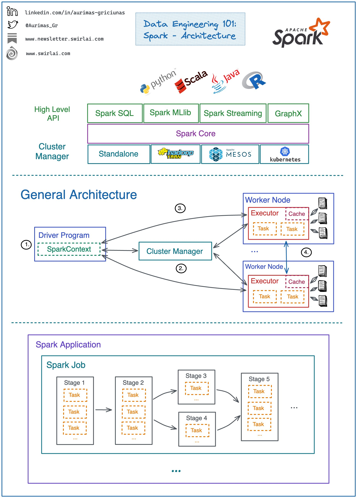
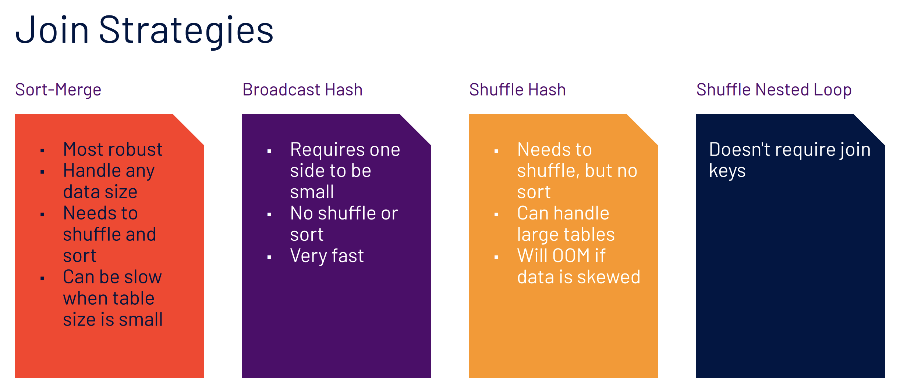
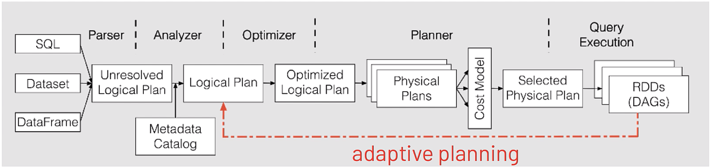

<details><summary style="font-size:20px;color:Orange;text-align:left">Configurations</summary>

-   [API Reference](https://spark.apache.org/docs/latest/api/python/reference/index.html)
-   [Spark Python API Docs](https://spark.apache.org/docs/latest/api/python/index.html#)
-   [Spark SQL](https://spark.apache.org/docs/3.1.1/api/python/reference/pyspark.sql.html#functions)
-   [Spark Core](https://spark.apache.org/docs/latest/api/python/reference/pyspark.html)
-   [Spark Programming Guide](https://spark.apache.org/docs/3.0.1/index.html)
-   [mysql Notes](https://www.tutorialspoint.com/mysql/mysql-select-database.htm)

---

<b style="font-size:20px;color:Red">NOTES:</b>

-   Default partition size is 128 MB
-   Optimal partition size is (1-200) MB
-   `spark.sql.shuffle.partitions = 200` -> Default # of shuffle partitions is 200
-   An Executor contains one or many cores.
-   `spark.sql.join.preferSortMergeJoin` -> the choice of default join strategy.
-   A partition gets processed by a core in an executor.
-   a job gets created whenever a action method is triggered.

---

-   [Installation: Manually Downloading](https://spark.apache.org/docs/latest/api/python/getting_started/install.html#manually-downloading)

-   **Prerequisites**:

    -   Spark requires Java 8 or higher (`java -version`).

#### Installation and Configuration:

-   **Download Apache Spark:**

    -   Go to the Apache Spark download page (https://spark.apache.org/downloads.html) and select the latest version of Spark.
    -   Choose the "Pre-built for Apache Hadoop" version.

    -   `$ mkdir -p /opt/spark`
    -   `$ wget -P /opt/spark/ https://dlcdn.apache.org/spark/spark-3.5.1/spark-3.5.1-bin-hadoop3.tgz`
    -   `$ tar xvf /opt/spark/spark-3.5.1-bin-hadoop3.tgz -C /opt/spark` -→ Untar `spark-3.5.1-bin-hadoop3.tgz` and save it into `/opt/spark` directory.

-   **Extract Spark:**

    -   Extract the downloaded tar file using the follwoing command
    -   `$ tar -xvf spark-<version>-bin-hadoop<version>.tgz`
    -   `$ rm -fr /opt/spark/spark-3.5.1-bin-hadoop3.tgz`

-   **Configure Environment Variables:**

    ```sh
    # Add required environment variable
    echo "export SPARK_HOME=/opt/spark/spark-3.5.1-bin-hadoop3" >> ~/.bash_profile
    # Add Spark into your `PATH` variable
    echo "export PATH=\$SPARK_HOME/bin:\$PATH" >> ~/.bash_profile
    ```

-   **Test Installation**:

    -   TEST 1:
        -   `$ pyspark` --> Start PySpark shell ( `pyspark` needed to be install)
        -   `$ spark-shell` --> Start Spark shell
    -   TEST 2:
        -   `$ spark-submit $SPARK_HOME/examples/src/main/python/pi.py `

-   **Standalone Cluster Configuration:**

    -   In Spark, you can run in a standalone cluster mode. The default configuration file is `spark-defaults.conf` in the conf directory of the Spark installation.
    -   You may want to customize this configuration file for your needs. You can do this by copying the template and making adjustments:
        -   `$ cp $SPARK_HOME/conf/spark-defaults.conf.template $SPARK_HOME/conf/spark-defaults.conf`

#### Run Spark:

-   **Start the Master**:

    -   To start the Spark Master, run the following command in your terminal:
    -   `$SPARK_HOME/sbin/start-master.sh`

-   **Access the Web UI**:

    -   You can access the Spark Master's web UI by opening a web browser and navigating to http://localhost:4040.

-   **Start Worker Nodes**:

    -   If you want to add worker nodes, you can start them by running:

    -   `$SPARK_HOME/sbin/start-worker.sh <master-url>`
        -   Replace <master-url> with the Spark Master's URL, which you can find in the web UI.

-   **Run Spark Applications**:

    -   You can submit Spark applications to your standalone cluster using the `spark-submit` command. For example:
    -   `$SPARK_HOME/bin/spark-submit --class your.spark.app.MainClass --master spark://<master-url> /path/to/your/app.jar`

-   **Stop Spark Cluster**:

    -   To stop the Spark Master and all associated worker nodes, use the following command:
    -   `$SPARK_HOME/sbin/stop-all.sh`

#### Spark with Jupyter Notebook:

-   **Install Jupyter Notebook**:

    -   If you haven't already installed Jupyter Notebook, you can do so using pip. Open your terminal and run the following command:
    -   `$ pip install jupyter`

-   **Install PySpark**:

    -   You need to install PySpark on your Mac. You can use pip to install it:
    -   `$ pip install pyspark`

-   **Set up Environment Variables**:

    -   Before starting a Jupyter Notebook, make sure your Spark environment variables are correctly set. In your terminal, export the following environment variables:

    ```sh
    export PYSPARK_PYTHON="python3"
    export PYSPARK_DRIVER_PYTHON="jupyter"
    ```

#### Submit job to Spark

-   `$ spark-submit --master local your_script.py` --> Run the script locally on your machine
-   `$ spark-submit --master yarn --deploy-mode cluster your_script.py` --> Submit the script to a YARN cluster
-   `$ spark-submit --master yarn --deploy-mode cluster --num-executors 4 --executor-memory 2G --executor-cores 2 your_script.py` --> Submit the script to a YARN cluster with additional resources.
-   `$ spark-submit --master spark://master:7077 --deploy-mode cluster your_script.py` --> Submit the script to a Spark standalone cluster
-   `$ `
-   `$ `
-   `$ `

#### Configuration Notes:

-   `SPARK_HOME`: `SPARK_HOME` is an environment variable that points to the root directory of the Apache Spark installation on your system. It typically contains the Spark runtime libraries, configuration files, and other resources needed to run Spark applications. Setting up `SPARK_HOME` is important for configuring and running Spark applications.

-   `PySpark and SPARK_HOME`: When you install Apache Spark on your system, you set up the `SPARK_HOME` environment variable to point to the Spark installation directory. PySpark interacts with Spark by utilizing the Spark libraries located in the `SPARK_HOME` directory. PySpark automatically detects the `SPARK_HOME` environment variable to locate the Spark installation and access its resources.

-   `PySpark Environment`: To use PySpark, you need to have Apache Spark installed on your system and properly configured with the `SPARK_HOME` environment variable set. PySpark internally uses the pyspark Python package, which provides classes and functions to interact with Spark functionalities using Python. When you import pyspark in your Python script or interactive session, PySpark initializes and establishes a connection with the Spark cluster using the Spark libraries from the SPARK_HOME directory. PySpark requires the same minor version of Python in both driver and workers. It uses the default python version in PATH, you can specify which version of Python you want to use by PYSPARK_PYTHON, for example:

    -   `$ export PYSPARK_PYTHON="python3"`
    -   `$ export PYSPARK_DRIVER_PYTHON="jupyter"`

-   `Configuration Files`:
    -   `code $SPARK_HOME/conf`

#### Configuration Options

Tweaking configuration parameters in Apache PySpark allows you to optimize your Spark application for performance, resource management, and specific use-case requirements. Configuration parameters can be set at different stages, including when initializing the SparkSession, submitting the application, or within the code. Here’s how you can manage these configurations:

1.  **Setting Configuration Parameters in Code** : You can set configuration parameters programmatically when you create the SparkSession. This is the most common and flexible way to configure Spark settings.

    Example:

    ```python
    from pyspark.sql import SparkSession
    from pyspark import SparkConf

    # Create SparkSession with custom configurations
    spark = SparkSession.builder \
        .appName("MyApp") \
        .config("spark.executor.memory", "4g") \
        .config("spark.executor.cores", "4") \
        .config("spark.executor.instances", "5") \
        .config("spark.sql.shuffle.partitions", "50") \
        .getOrCreate()

    ##########################################################
    # Create SparkConf and set custom configurations
    conf = SparkConf() \
        .setAppName("MyPySparkApp") \
        .set("spark.executor.memory", "4g") \
        .set("spark.executor.cores", "4") \
        .set("spark.executor.instances", "5") \
        .set("spark.sql.shuffle.partitions", "50") \
        .set("spark.sql.execution.arrow.enabled", "true")

    # Initialize SparkSession with SparkConf
    spark = SparkSession.builder \
        .config(conf=conf) \
        .getOrCreate()

    # Your PySpark code here

    # Stop the Spark session
    spark.stop()

    ```

2.  **Setting Configuration Parameters in spark-submit** : When submitting a Spark application using spark-submit, you can specify configuration parameters via command-line options.

    Example Command:

    ```sh
    spark-submit \
        --master yarn \
        --deploy-mode cluster \
        --conf spark.executor.memory=4g \
        --conf spark.executor.cores=4 \
        --conf spark.executor.instances=5 \
        --conf spark.sql.shuffle.partitions=50 \
        your_script.py
    ```

3.  **Setting Configuration Parameters in Spark Configuration Files** : Spark can also be configured using configuration files such as `spark-defaults.conf` and `spark-env.sh`. These files are typically used for cluster-wide configurations.

    Example of spark-defaults.conf:

    ```sh
    spark.master                     yarn
    spark.app.name                   MySparkApp
    spark.executor.memory            4g
    spark.executor.cores             4
    spark.executor.instances         5
    spark.sql.shuffle.partitions     50
    ```

#### Common Configuration Parameters

Here are some commonly used configuration parameters you might want to tweak:

-   **General Parameters**
    -   `spark.app.name`: Name of your Spark application.
    -   `spark.master`: The master URL for the cluster (e.g., local, yarn, `spark://host:port`).
-   **Executor and Driver Memory**
    -   `spark.executor.memory`: Amount of memory to use per executor process (e.g., 4g).
    -   `spark.driver.memory`: Amount of memory to use for the driver process (e.g., 2g).
-   **CPU and Parallelism**
    -   `spark.executor.cores`: Number of cores to use on each executor.
    -   `spark.executor.instances`: Number of executor instances.
    -   `spark.default.parallelism`: Default number of partitions in RDDs (e.g., number of tasks to run in parallel).
-   **Shuffle and Join**
    -   `spark.sql.shuffle.partitions`: Number of partitions to use when shuffling data for joins or aggregations.
    -   `spark.sql.autoBroadcastJoinThreshold`: Maximum size (in bytes) for a table that will be broadcast to all worker nodes when performing a join.
-   **Serialization**
    -   `spark.serializer`: Class to use for serializing objects (e.g., `org.apache.spark.serializer.KryoSerializer` for better performance).
    -   `spark.kryoserializer.buffer.max`: Maximum buffer size for Kryo serialization (e.g., 128m).
-   **Dynamic Resource Allocation**
    -   `spark.dynamicAllocation.enabled`: Enable dynamic allocation of executors.
    -   `spark.dynamicAllocation.minExecutors`: Minimum number of executors.
    -   `spark.dynamicAllocation.maxExecutors`: Maximum number of executors.

#### Advanced Configuration Examples

-   **Enabling Kryo Serialization**:

    ```python
    from pyspark.sql import SparkSession

    spark = SparkSession.builder \
        .appName("MyApp") \
        .config("spark.serializer", "org.apache.spark.serializer.KryoSerializer") \
        .config("spark.kryo.registrator", "my.package.MyKryoRegistrator") \
        .getOrCreate()
    ```

-   **Using Dynamic Resource Allocation**:

    ```sh
    spark-submit \
        --master yarn \
        --deploy-mode cluster \
        --conf spark.dynamicAllocation.enabled=true \
        --conf spark.dynamicAllocation.minExecutors=2 \
        --conf spark.dynamicAllocation.maxExecutors=10 \
        your_script.py
    ```

-   **Tips for Tweaking Configuration Parameters**

    -   `Profile and Monitor`: Use Spark’s web UI and logs to understand the current performance and identify bottlenecks.
    -   `Start with Defaults`: Start with default settings and incrementally adjust parameters.
    -   `Resource Balancing`: Balance memory and CPU settings based on your cluster's resources and application requirements.
    -   `Tune for Workload`: Different workloads (e.g., batch processing vs. streaming) might require different configurations.
    -   `Iterative Tuning`: Perform iterative tuning, adjusting one or a few parameters at a time, and observing the impact.

#### PySpark Specific Configuration

-   **Arrow Optimization**:

    -   `spark.sql.execution.arrow.enabled`: Enables Arrow optimization for columnar data transfer between JVM and Python (e.g., true).

    -   Example of Enabling Arrow Optimization: Apache Arrow can significantly improve the performance of PySpark applications that involve data exchange between the JVM and Python by using columnar memory layout.

        ```python
        Copy code
        from pyspark.sql import SparkSession

        # Initialize SparkSession with Arrow optimization enabled
        spark = SparkSession.builder \
            .appName("MyPySparkApp") \
            .config("spark.sql.execution.arrow.enabled", "true") \
            .getOrCreate()

        # Your PySpark code here
        df = spark.createDataFrame([(1, "foo"), (2, "bar")], ["id", "value"])
        pandas_df = df.toPandas()  # This will use Arrow for conversion

        # Stop the Spark session
        spark.stop()
        ```

-   **Advanced Configuration Techniques**

    -   `Using Environment Variables`: You can set Spark configurations using environment variables. This method is useful when you want to set configurations globally or for all sessions without modifying the code.

        ```sh
        Copy code
        export PYSPARK_PYTHON=python3
        export PYSPARK_DRIVER_PYTHON=python3
        export SPARK_HOME=/path/to/spark

        # Example of setting configuration parameters via environment variables
        export SPARK_CONF_DIR=/path/to/spark/conf
        echo "spark.executor.memory=4g" >> $SPARK_CONF_DIR/spark-defaults.conf
        echo "spark.executor.cores=4" >> $SPARK_CONF_DIR/spark-defaults.conf
        ```

</details>

---

<details><summary style="font-size:20px;color:Orange;text-align:left">Spark Terms and Concepts</summary>

<center></center>
<center></center>

1. **Apache Spark**:

    - Apache Spark is an open-source distributed computing system that provides a fast and general-purpose cluster-computing framework for big data processing.
    - Spark is designed for speed and ease of use, supporting various programming languages, including Python through PySpark.

2. **PySpark**:

    - PySpark is the Python API for Apache Spark, allowing developers to write Spark applications using Python.
    - It provides a high-level API for distributed data processing, enabling Python developers to harness the power of Spark for big data analytics.

3. **SparkContext**:

    - SparkContext was the main entry point for Spark applications before Spark 2.0.
    - It represents the connection to the Spark cluster and is responsible for coordinating the execution of operations on that cluster.
    - You create a SparkContext object when you want to interact with a Spark cluster programmatically using the Spark API.
    - It provides access to the functionality available in the Spark core, such as creating RDDs (Resilient Distributed Datasets), broadcasting variables, and accumulating variables.
    - In Spark versions prior to 2.0, Spark applications typically interacted directly with the SparkContext.

4. **SparkSession**:

    - SparkSession is the unified entry point for working with structured data in Spark, introduced in Spark 2.0.
    - It encapsulates the functionality previously provided by SparkContext, SQLContext, HiveContext, and StreamingContext, providing a single entry point for working with various Spark features.
    - SparkSession provides support for DataFrame API, structured data processing, SQL queries, Dataset API, and managing the SparkSession configuration.
    - It simplifies the process of working with Spark by providing a single interface for interacting with different Spark features.
    - SparkSession is typically created using the `SparkSession.builder()` method, and it is the starting point for most Spark applications, especially those involving structured data processing.

5. **Driver Program**: The driver program in Spark is the entry point for Spark applications and serves as the main control hub for Spark applications. It orchestrates the execution of Spark jobs, from setting up the environment to defining tasks and gathering result. Here are key points about the Driver Program:

    - `User Code Execution`:

        - The Spark application code, written by the user, is executed in the Driver Program.
        - This code includes defining transformations and actions on distributed datasets.

    - `Spark Context`: The Driver Program initializes and maintains the Spark Context, which is the entry point for interacting with Spark functionality like creating RDDs, broadcast variables, and perform other Spark-related operations.
    - `Communication`: The Driver Program communicates with the Cluster Manager (e.g., Spark Standalone, Apache Mesos, or Apache YARN) to acquire resources and manage task execution.

    - `Job Submission`:

        - The Driver Program breaks down Spark jobs into stages, and stages into tasks.
        - The Driver Program submits Spark jobs to the cluster for execution.
        - Each job represents a sequence of transformations and actions on the data.

    - `Task Scheduling`: The Spark driver submits tasks to the cluster manager, which then schedules them on available executors.
    - `Results Aggregation`: The Driver Program aggregates and collects results from the tasks executed on the executor nodes for actions, such as `collect()`.
    - `Lifecycle Management`: Driver Program manages the entire lifecycle of the Spark application, from initialization to execution and termination.
    - `Driver UI`: Driver Program provides a web-based user interface (UI) that allows monitoring and tracking the progress of the Spark application.

6. **Cluster Manager**: The cluster manager acts as a supervisor, overseeing the distribution of workloads and resources within a Spark cluster to ensure efficient and reliable execution of Spark applications. It acts as the central conductor, overseeing resource allocation, scheduling workloads, and ensuring efficient utilization of the cluster's computing power. Spark itself is agnostic to the underlying cluster manager, as long as it can acquire worker processes and facilitate communication between them. Here's a breakdown of how a Cluster Manager typically functions in the Spark ecosystem:

    - Allocates resources (CPU, memory) to Spark applications.
    - Schedules tasks on available resources, taking into account workload and resource availability.
    - Handles fault tolerance, restarting failed tasks or reallocating resources as needed.
    - Coordinates communication between Spark drivers and executors.

    - `Spark Driver Connects`: When you submit a Spark application (written in Scala, Python, Java, or R), the driver program establishes a connection with the chosen cluster manager.
    - `Resource Negotiation`: The driver requests resources (CPU, memory) from the cluster manager. It then allocates resources (CPU, memory) to Spark applications based on your application's needs.
    - `Executor Allocation`: The cluster manager allocates worker nodes (executors) to the Spark application based on available resources and application requirements.
    - `Task Scheduling`: The Spark driver submits tasks to the cluster manager, which then schedules them on available resources, taking into account workload and resource availability.
    - `Resource Monitoring and Management`: The cluster manager Monitors the health and status of cluster nodes. It continually monitors resource usage and may adjust allocations dynamically based on application needs and cluster conditions.
    - `Fault Tolerance`: The cluster manager can handle fault tolerance, restarting failed tasks or reallocating resources as needed and reschedule tasks on healthy nodes, ensuring the application's progress even in case of node issues.

    - `Types of Cluster Manager`: There are several cluster managers that Spark can work with, each offering distinct advantages and use cases:

        - `Spark Standalone Cluster Manager`: In standalone mode, Spark comes with its own built-in Cluster Manager. This is a simple, lightweight cluster manager. It's suitable for development or small-scale deployments where ease of use and setup are priorities. However, it may not be ideal for large production environments due to limitations in scalability and fault tolerance.
        - `YARN (Yet Another Resource Negotiator)`: A widely used resource management system initially developed for Hadoop. Spark can leverage YARN's robust features like dynamic resource allocation, multi-tenancy, and high availability, making it a good choice for production environments running Spark alongside other YARN-compatible frameworks.
        - `Mesos`: A popular open-source cluster manager known for its flexibility and resource sharing capabilities. Mesos can manage diverse workloads beyond Spark, making it valuable for heterogeneous clusters or when managing resources for various frameworks.
        - `Kubernetes (K8s)`: A container orchestration platform gaining significant traction. Spark can run on Kubernetes clusters, allowing for integration with existing containerized infrastructure and deployment pipelines.

7. **Spark Master**: The Spark Master is a specific node in the Spark cluster responsible for managing resources and coordinating job execution. It allocates resources to applications, schedules tasks across worker nodes, monitors node health, and provides a central point for administrative tasks. In Spark's standalone mode, the Spark Master acts as both the master node and the resource manager.

    - It's part of the Spark **Standalone Mode** or a component within a **Cluster Management** framework (such as Mesos or YARN).
    - The Spark Master is a node in the Spark cluster responsible for managing resources and coordinating job execution.
    - The Spark Master allocates resources to applications and schedules tasks across worker nodes.
    - It monitors the health of worker nodes, manages fault tolerance, and provides a central point for administrative tasks.

8. **Executor**: Executor in Spark are distributed computing processes responsible for executing tasks on the worker nodes in the cluster. They are launched by the Spark driver program and responsible for running the computations and storing the data that is cached in memory or persisted to disk during the execution of Spark jobs. Executors run computations in parallel and communicate with the driver program to execute tasks as part of Spark applications. Here are some key terms and concepts related to executors in Spark:

    - `Task Execution`: Executors execute tasks assigned to them by the Spark driver. These tasks typically involve processing data partitions, such as applying transformations or performing actions on RDDs (Resilient Distributed Datasets) or DataFrames.
    - `Memory Management`: Executors manage memory for caching and processing data. They maintain a portion of the cluster's memory allocated for caching RDD partitions using in-memory storage levels like `MEMORY_ONLY`, `MEMORY_AND_DISK`, or `MEMORY_ONLY_SER`.
    - `Data Storage`: Executors store cached RDD partitions and shuffle intermediate data on local disk when necessary. They may spill data to disk if the available memory is insufficient to hold all the cached partitions.
    - `Task Isolation`: Executors execute tasks in isolated JVM (Java Virtual Machine) processes to provide fault tolerance and resource isolation. If a task fails due to an exception or error, it only affects the executor running the task, and the Spark application can recover by rerunning the failed task on another executor.
    - `Concurrency`: Executors can run multiple tasks concurrently to utilize the available resources efficiently. Spark dynamically adjusts the number of tasks running on each executor based on the cluster resources and workload characteristics.
    - `Resource Allocation`: Executors are allocated resources such as CPU cores, memory, and disk storage by the cluster manager (e.g., Apache YARN, Apache Mesos, or Kubernetes) based on the application's resource requirements and the available capacity in the cluster.
    - `Driver-Executor Communication`: Executors communicate with the Spark driver to receive task assignments, report task status updates, and fetch data dependencies required for task execution. The driver coordinates the execution across all the executors in the cluster.

9. **RDD (Resilient Distributed Dataset)**: In Apache Spark, Resilient Distributed Datasets (RDDs) are the fundamental data abstraction that represent a distributed collection of elements partitioned across the nodes of a cluster and processed in parallel. RDDs are immutable, fault-tolerant, and resilient to failures, making them a foundational building block for distributed data processing in Spark. Here are the key terms and concepts related to RDDs:

    - `Resilient`: RDDs are resilient because they automatically recover from failures. If a partition of an RDD is lost due to a node failure, Spark can reconstruct the lost partition using the lineage information stored in the RDD's lineage graph.
    - `Distributed`: RDDs are distributed across multiple nodes in a cluster, allowing parallel processing of data. Each RDD partition resides on a different node, and computations are performed in parallel on these partitions.
    - `Dataset`: RDDs represent datasets that can be created from various data sources such as files, databases, or generated programmatically. RDDs can hold any type of Python, Java, or Scala objects, including primitive types, collections, and user-defined classes.
    - `Transformation`: RDDs support two types of operations: transformations and actions. Transformations are operations that produce new RDDs from existing RDDs by applying functions to the elements of the RDD. Examples of transformations include `map`, `filter`, `flatMap`, `reduceByKey`, `join`, `union`, and `sortBy`.
    - `Action`: Actions are operations that trigger the execution of computations on RDDs and return results to the driver program or write data to external storage systems. Examples of actions include `collect`, `count`, `take`, `reduce`, `foreach`, `saveAsTextFile`, `saveAsSequenceFile`, and `saveAsObjectFile`.
    - `Lazy Evaluation`: Spark uses lazy evaluation to optimize the execution of RDD transformations. Transformations are not evaluated immediately when they are called but are instead recorded as a lineage graph of dependencies. Only when an action is invoked on the RDD does Spark execute the transformations in the lineage graph to produce the final result.
    - `Partitioning`: RDDs are divided into partitions, which are units of parallelism that determine how data is distributed and processed across the cluster. Spark operates on individual partitions in parallel, allowing for scalable and efficient distributed processing.
    - `Lineage Graph`: RDDs maintain a directed acyclic graph (DAG) of transformations called the lineage graph. The lineage graph captures the dependencies between RDDs and transformations, enabling fault tolerance and recomputation of lost partitions in case of failures.
    - `Persistence`: RDDs support caching and persistence to optimize performance by storing intermediate results in memory or disk. Cached RDDs can be reused across multiple computations, reducing the need for recomputation and improving overall execution speed.
    - `Fault Tolerance`: RDDs are fault-tolerant because they track the lineage of each partition and can reconstruct lost partitions by reapplying transformations from the original data source. This ensures data reliability and consistency even in the presence of node failures or errors.

10. **DataFrame**:

    - DataFrame is a distributed collection of data organized into named columns, similar to a table in a relational database.
    - It provides a more user-friendly, structured API for data manipulation and analysis compared to RDDs, and it integrates well with Python's Pandas library.

11. **Relationship between RDD and DataFrame**:

    - `RDD as Foundation:`

        - RDDs are the foundational data structure in Spark. All higher-level abstractions, including DataFrame and Dataset, are built upon RDDs.
        - They provide the flexibility to handle any type of data and support custom partitioning and storage strategies.

    - `DataFrame as Structured Abstraction`:

        - DataFrame simplifies the process of working with structured data by providing a high-level API that resembles SQL queries.
        - Under the hood, DataFrames are built on RDDs but hide the complexity of RDD management, offering optimizations for structured data operations.

    - `Interoperability`:

        - RDDs and DataFrames can interoperate seamlessly in Spark applications.
        - DataFrames can be created from RDDs using Spark SQL queries (sqlContext.createDataFrame(rdd)), allowing for the conversion between structured and unstructured data representations.

12. **Transformations**:

    - Transformations are operations on RDDs or DataFrames that produce a new RDD or DataFrame.
    - Transformations are lazily evaluated, and they define the sequence of operations to be performed on the data.
    - Transformations in Spark are categorized into two types based on their behavior.

    - `Narrow Transformations`:

        - Narrow transformations are transformations where each partition of the parent RDD contributes to only one partition of the child RDD.
        - These transformations do not require shuffling of data between partitions. Each partition of the resulting RDD depends on one partition of the parent RDD.
        - Example: `map`, `filter`, `union`, `distinct`, `flatMap`, etc.

    - `Wide Transformations`:

        - Wide transformations are transformations where each partition of the parent RDD can contribute to multiple partitions of the child RDD. They involve shuffling of data across partitions.
        - These transformations require data to be redistributed and shuffled across partitions. They involve a more significant amount of data movement between nodes.
        - Example: `groupByKey`, `reduceByKey`, `sortByKey`, `join`, `cogroup`, distinct after a repartition, etc.

    - `Differences`:

        - Narrow transformations are more efficient as they do not require data shuffling, and the computation can be performed independently on each partition.
        - Wide transformations involve data shuffling, which can be a costly operation in terms of performance.
        - Narrow transformations result in a one-to-one mapping of partitions from the parent to the child RDD.
        - Wide transformations may result in a different number of partitions in the child RDD compared to the parent RDD.

13. **Actions**:

    - Actions are operations on RDDs or DataFrames that trigger the execution of transformations and return a result to the driver program or write data to an external storage system.
    - Actions are the operations that initiate the actual computation and produce results.
    - Here are some common action methods in PySpark: `collect()`, `count()`, `first()`, `take(n)`, `takeSample(withReplacement, num, seed=None)`, `reduce(func)`, `foreach(func)`, `saveAsTextFile(path)`, `saveAsSequenceFile(path)`, `saveAsParquetFile(path)`, `countByKey()`, `countByValue()`

14. **Job**:

    - A job in Spark represents a complete computation with a specific goal.
    - It is a sequence of transformations and actions on data that is executed to produce a result.
    - A Spark application can consist of one or more jobs.

15. **Stage**: In Spark, a stage represents a logical division of a Spark job's execution plan. It consists of a set of tasks that can be executed in parallel on the data partitions within the RDD (Resilient Distributed Dataset). Stages are created during the optimization and planning phase of a Spark job and are based on the dependencies between RDD transformations. Each stage represents a distinct computation phase, such as map or reduce, and is separated by data shuffling operations.

    - A job is divided into stages based on the presence of a shuffle operation (e.g., a reduce operation).
    - A stage represents a set of tasks that can be executed in parallel across multiple nodes.
    - A stage consists of tasks that perform the same computation but on different partitions of the data.

16. **Task**:

    - A task is the smallest unit of work in Spark and represents the execution of a computation on a single partition of data.
    - Tasks are the actual computations that are performed on the executor nodes.
    - Each stage is divided into tasks, and tasks within a stage can be executed in parallel.

17. **Ingestion**: Ingestion refers to the process of loading data from external sources such as files, databases, streams, or other distributed storage systems into Spark for processing. It is the first step in the data processing pipeline and is crucial for performing analytics, machine learning, or other computations.

</details>

---

<details><summary style="font-size:20px;color:Orange;text-align:left">Broadcast Variables and Accumulator</summary>

In Apache Spark, Broadcast and Accumulator are two important concepts used for efficient and distributed data processing. They serve distinct purposes in Spark applications. Let's delve into each of them in detail:

#### Broadcast Variable:

A Broadcast Variable in Apache Spark is a read-only, distributed variable that is efficiently shared across all tasks within a Spark job. It allows you to efficiently distribute large, read-only datasets or objects to all worker nodes in a Spark cluster, minimizing data transfer costs and improving performance.

Broadcast variables are particularly useful when you have a large dataset or object that needs to be accessed by multiple tasks in a Spark job. Instead of sending a separate copy of the dataset or object to each task, Spark broadcasts the variable once and caches it in memory on each worker node. This way, all tasks can access the variable locally without incurring the overhead of data transfer over the network.

-   `Creation`: You create a Broadcast variable from a driver program by calling the SparkContext.broadcast() method. The variable is typically an immutable data structure.

-   `Distribution`: Spark distributes the Broadcast variable to all worker nodes in the cluster. It ensures that each worker has a copy of the variable in its memory.

-   `Task Access`: Tasks running on worker nodes can access the Broadcast variable locally, as it's already available in their memory. This eliminates the need to send the data over the network repeatedly.

-   `Efficiency`: Broadcast variables help in optimizing performance by reducing data transfer overhead, especially when the same data is needed across multiple tasks.

-   `Use Cases`: Common use cases for Broadcast variables include sharing reference data, dictionaries, lookup tables, or any large read-only data that's used by multiple tasks.

-   `Example`:

    ```python
    from pyspark import SparkContext

    # Create a SparkContext
    sc = SparkContext("local", "Broadcast Example")

    # Define the large dataset to be broadcasted
    data = range(1000)
    broadcast_data = sc.broadcast(data)

    # Use the broadcast variable in a Spark transformation
    result = sc.parallelize(range(10)).map(lambda x: x * broadcast_data.value[0])

    # Collect and print the result
    print(result.collect())

    # Stop the SparkContext
    sc.stop()
    ```

#### Accumulator

An Accumulator is a distributed (shared) data stracture (variable) designed for accumulating values in parallel across worker nodes. Accumulators are typically used for implementing counters and aggregations in a distributed and fault-tolerant manner. They can only be **added** to and are initialized on the driver, but the value can be read by the driver at any point.

-   `Creation`: You create an Accumulator on the driver program using the `SparkContext.accumulator()` method. The initial value is set at this stage.

-   `Distribution`: The Accumulator is distributed to worker nodes, but workers can only "add" values to it. They cannot read or modify the accumulator's value directly.

-   `Task Updates`: During the execution of tasks on worker nodes, the tasks can update the Accumulator by adding values to it. These updates are automatically merged in a distributed and fault-tolerant manner.

-   `Driver Access`: The driver can read the final value of the Accumulator once all tasks are complete. This final value reflects the accumulated result from all tasks.

-   `Use Cases`: Accumulators are suitable for tasks that require distributed aggregation, such as counting occurrences of events across a large dataset.

-   `Example`:

    ```python
    from pyspark import SparkContext

    # Create a SparkSession
    spark = SparkSession.builder \
        .appName("ImmutableAccumulatorDemo") \
        .getOrCreate()

    # Create a SparkContext
    sc = spark.SparkContext("local", "Accumulator Example")

    # Create an Accumulator to count occurrences
    counter = sc.accumulator(0)
    accumulator = sc.accumulator(0)

    # Define a function to update the mutable accumulator.
    def count_occurrences(x):
        global counter
        if x == 5:
            counter += 1

    # Define a function to update the immutable accumulator
    def process_number(x):
        # Increment the accumulator by the current value
        accumulator.add(x)

    # Apply the function to each element in the RDD
    rdd = sc.parallelize(range(10))
    rdd.foreach(count_occurrences)
    rdd.foreach(process_number)

    # Print the final count
    print("Occurrences of 5:", counter.value)

    # Output the final value of the accumulator
    print("Final value of the accumulator:", accumulator.value)

    # Stop the SparkContext
    sc.stop()
    ```

There are mutable accumulators (can be read and written to) and immutable accumulators (can only be read from).
The distinction between mutable and immutable accumulators is not in the mutability of the accumulator variable itself, but rather in how the accumulator's value can be updated during job execution. Let's clarify the difference:

-   **Mutable Accumulator**:

    -   In a mutable accumulator, worker tasks can directly modify the accumulator's value during job execution.
    -   This means that worker tasks can perform operations that change the accumulator's value, and those changes are reflected immediately in the accumulator.

-   **Immutable Accumulator**:
    -   In an immutable accumulator, worker tasks cannot directly modify the accumulator's value.
    -   Instead, worker tasks contribute updates to the accumulator's value through an associative and commutative operation, such as addition for a counter accumulator.
    -   These updates are then aggregated and propagated back to the driver program, where the final value of the accumulator is accessible.

In summary, Broadcast variables are used for efficiently sharing read-only data across worker nodes, while Accumulators are used for accumulating values across tasks in a distributed and fault-tolerant manner. Both Broadcast and Accumulator are essential tools for performing distributed data processing and aggregation in Spark applications, enhancing efficiency and performance.

</details>

---

<details><summary style="font-size:20px;color:Orange;text-align:left">Grouping, Aggregating and Joining</summary>

-   How does the grouping and aggregating works in a cluster mode Spark operation is done simultaniously?

In Apache Spark, grouping and aggregating operations in cluster mode are designed to work simultaneously through a process known as parallel processing. Let's break down how this happens:

**Partitioned Processing**: Spark divides the data into partitions, and each partition is processed independently on different nodes in the cluster. This is the foundation of parallel processing.

**Grouping within Partitions**: Within each partition, Spark performs the grouping operation based on the specified key or keys. This step is done independently in each partition.

**Aggregation within Partitions**: After grouping, if there are aggregation functions specified (e.g., counting, summing), Spark performs these aggregations within each partition. Again, this is done in parallel for each partition.

**Combining Results**: The intermediate results (grouped and aggregated data within each partition) are then combined. If the grouping involved a shuffle operation (repartitioning the data based on keys), Spark takes care of redistributing the data so that records with the same key end up in the same partition.

**Final Aggregation (if needed)**: Once the data is reshuffled, Spark performs a final aggregation step if there are global aggregations across all partitions.

#### Joining

-   [Databricks | Pyspark | Interview Question: Sort-Merge Join (SMJ)](https://www.youtube.com/watch?v=DFtvA5O58X4&list=PLgPb8HXOGtsQeiFz1y9dcLuXjRh8teQtw&index=71)

<center></center>

In Apache Spark, joining operations are fundamental for combining data from multiple datasets based on common keys. There are several types of joining operations available, each with its own characteristics and performance implications. The choice of join algorithm depends on factors such as the size of the datasets, the distribution of data, and the available resources in the cluster. Let's explore the different types of joining operations in Spark along with demonstrations:

-   **Shuffle Hash Join**(Default Join Algorithm): Also known as the partitioned hash join, this algorithm involves partitioning both datasets based on their join keys and then redistributing the partitions across the worker nodes. The partitions with the same join keys are shuffled to the same worker node, where the actual join operation takes place. This method is efficient for large datasets but requires shuffling data across the network, which can incur overhead.

    -   `Shuffling Phase`: The data is partitioned and shuffled across the nodes based on the join keys.
    -   `Hashing Phase`: Each node builds a hash table for one of the datasets (typically the smaller one) and then probes this hash table with the other dataset to find matches.

    ```python
    # Regular join
    joined_df = df1.join(df2, 'key')
    ```

-   **Sort Merge Join**: Both datasets are sorted based on their join keys, and then the sorted datasets are merged together. This approach works well when both datasets are already sorted or can be sorted efficiently. It is commonly used for large datasets with evenly distributed join keys.

    -   Both datasets are sorted based on the join keys, and then the sorted datasets are merged together.
    -   Sort merge join is efficient when both datasets are large and sorted.
    -   Sort-Merge Join is generally used for equi-joins (joins on equality conditions)

    ```python
    # Sort merge join
    joined_df = df1.join(df2, 'key').sort('key')
    ```

-   **Broadcast Join**:

    -   Broadcast join is a variant of the join operation where one of the datasets is small enough to fit in memory on each worker node (broadcasted).
    -   The smaller dataset is broadcasted to all worker nodes, and the join operation is performed locally on each node.
    -   This type of join is efficient when one dataset is significantly smaller than the other.

    ```python
    # Broadcast join
    from pyspark.sql.functions import broadcast
    joined_df = df1.join(broadcast(df2), 'key')
    ```

-   **Broadcast Nested Loop Join**: Similar to the nested loop join, this algorithm involves broadcasting one of the datasets to all worker nodes and then performing a nested loop join locally on each node. It is suitable for cases where one dataset is small enough to fit in memory but cannot be efficiently partitioned for hash join.
-   **Broadcast Hash Join**: In this algorithm, one of the datasets is small enough to fit in memory, and its entire contents are broadcasted to all worker nodes. The other dataset is partitioned, and each partition is joined with the broadcasted dataset locally on each worker node. This method is efficient when one dataset is significantly smaller than the other.
-   **Cartesian Join (Cross Join)**: In this algorithm, every row from the first dataset is combined with every row from the second dataset, resulting in a Cartesian product of the datasets. This method can be resource-intensive and is typically used cautiously due to the potential for generating a large number of output rows.

-   **Choosing the Right Join Algorithm**: The choice of join algorithm depends on the size of the datasets and the nature of the join condition:

    -   Small and Large Dataset: Use Broadcast Hash Join for better performance.
    -   Large Datasets: Use Sort-Merge Join, especially for equi-joins.
    -   Very Large Datasets: Default to Shuffle Hash Join if no other optimization is applicable.
    -   Non-Equi Joins: Use Broadcast Nested Loop Join.

-   **Join Hints**: You can provide join hints to Spark to influence the join algorithm selection:

    ```python
    df1.join(df2.hint("broadcast"), "join_key")
    df1.join(df2.hint("shuffle_hash"), "join_key")
    df1.join(df2.hint("merge"), "join_key")
    ```

These are the different types of joining operations available in Apache Spark, each with its own characteristics and suitable for different use cases. It's essential to choose the appropriate join type based on the size of the datasets, their distribution, and the available resources in the cluster to achieve optimal performance.

</details>

---

<details><summary style="font-size:20px;color:Orange;text-align:left">Shuffle Operations</summary>

In Apache Spark, a "shuffle" operation refers to the process of redistributing and reorganizing data across the partitions of a Resilient Distributed Dataset (RDD) or DataFrame. Shuffling is a critical operation in distributed data processing, especially when certain transformations require data to be rearranged or grouped differently. Shuffling involves substantial data movement across the nodes of a Spark cluster and is generally considered an expensive operation. Followings are key Concepts Related to Shuffle Operations:

-   **Stages**:

    -   Shuffling often occurs as part of a Spark job during the transition between stages.
    -   A stage is a set of parallel tasks that can be executed without data exchange, and shuffling typically separates different stages.

-   **Map and Reduce**: The shuffle process is often divided into two main phases: **map** and **reduce**.

    -   <b style="color:#C71585">Map Phase</b>: In the map phase, data is locally processed on each executor to prepare it for the shuffle.

        -   In Spark, transformations like `map`, `filter`, `flatMap`, etc., are applied to each partition of the input data independently. This phase is often referred to as the "map phase."
        -   Data is serialized for transmission to the reducers.
        -   Map output records are written to local disk or memory, typically in the form of map output files.

    -   <b style="color:#C71585">Shuffle Phase</b>: The shuffle phase involves redistributing data across the cluster based on keys. This phase is necessary for operations like joins, groupByKey, and reduceByKey, which require data to be grouped or aggregated by keys.

        -   After the map phase, when certain operations like `groupByKey`, `reduceByKey`, or `aggregateByKey` are performed, Spark needs to reshuffle and redistribute the data across partitions based on keys.

        -   **Combiner**: The combine phase involves combining intermediate results on each node before shuffling the data. This phase helps to reduce the amount of data transferred over the network and improve performance.

            -   The combiner function is applied locally within each partition before the shuffle, which allows for the partial aggregation of data with the same key within each partition.
            -   By aggregating data locally before shuffling, the amount of data transferred across the network is reduced.
            -   The output of the combiner function serves as input to the shuffle phase, where further aggregation or merging can occur across partitions.

        -   Compression can be applied to reduce the amount of data transferred during the shuffle phase, minimizing network overhead.
        -   Data is partitioned and sent to different nodes based on the key.
        -   This phase involves significant network communication, which can be costly in terms of performance.

    -   <b style="color:#C71585">Reduce Phase</b>: The reduce phase involves aggregating the combined results from different nodes to produce the final output. This phase is used for operations like reduceByKey and aggregateByKey.

        -   Shuffled data is deserialized for further processing.
        -   The combined results are aggregated to produce the final result.
        -   This phase usually involves minimal data movement since most of the aggregation has already been done locally during the combine phase.

-   **Shuffle Manager**: The Shuffle Manager in Apache Spark is a critical component responsible for managing the shuffle operations within the Spark execution engine. The Shuffle Manager orchestrates the entire shuffle process, ensuring data is correctly transferred between executors (nodes) in the cluster.

    -   Data is serialized before being transferred over the network and deserialized upon receipt.
    -   Shuffle data is temporarily stored in files on disk. The Shuffle Manager handles the creation, writing, reading, and cleanup of these shuffle files.

    -   `Shuffle Write`: Handles the writing of map output data to disk or memory for transmission.

        -   Map output files are transferred to the nodes where the reducers are running.
        -   These files are stored in the shuffle manager's directory, which is accessible by all nodes in the cluster.
        -   Data is sorted and partitioned according to the partitioning function.

    -   `Shuffle Fetch`: Manages the retrieval of shuffled data by reducers.

        -   Reducers pull the relevant map output data from the shuffle manager's directory.
        -   This involves a network transfer of data from multiple nodes to the reducers.

    -   `shuffle manager's directory`: The shuffle manager's directory is the location on the local file system where Spark stores intermediate shuffle data during the shuffle phase of data processing. It's typically a configurable location specified by the spark.local.dir configuration property in Spark's configuration file (usually spark-defaults.conf). If this property is not set, Spark uses the default temporary directory provided by the operating system.

-   **Common Operations Triggering Shuffling**

    -   `GroupByKey`: When using the groupByKey transformation, data with the same key needs to be grouped together, requiring shuffling.
    -   `ReduceByKey`: Similar to groupByKey, reduceByKey involves shuffling data to perform reduction operations.
    -   `Join` Operations: Joining two RDDs or DataFrames based on a common key involves shuffling data between nodes.
    -   `Aggregations`: Operations like reduce or aggregate that require combining data across partitions trigger shuffling.

Shuffling is a fundamental aspect of distributed data processing in Apache Spark. While it is necessary for certain operations, developers should be mindful of its performance implications and employ optimization strategies to minimize its impact on job execution time and resource utilization.

</details>

---

<details><summary style="font-size:20px;color:Orange;text-align:left">Pertitions</summary>

-   [Partitioning For High Performance Data Processing](https://www.youtube.com/watch?v=fZndmQasykk&list=PLWAuYt0wgRcLCtWzUxNg4BjnYlCZNEVth&index=5)
-   [Dynamic Partitioning Pruning](https://www.youtube.com/watch?v=s8Z8Gex7VFw&list=PLWAuYt0wgRcLCtWzUxNg4BjnYlCZNEVth&index=8)

partitions play a crucial role in parallelizing data processing across a cluster. Partitions are the basic units of parallelism, and they represent the smaller chunks of data distributed across the worker nodes in a cluster. Understanding when and how to leverage partitions is essential for optimizing Spark jobs.

#### When to Partition:

-   `Large Datasets`: Partitioning becomes especially important when dealing with large datasets that cannot fit into memory on a single machine. By partitioning data, Spark can distribute the workload across multiple nodes in a cluster, allowing for parallel processing and efficient use of available resources.

-   `Performance Optimization`: Partitioning can significantly improve the performance of operations like joins, aggregations, and transformations, as it reduces data shuffling and minimizes the movement of data across the network. Proper partitioning ensures that related data resides in the same partition, minimizing the need for inter-node communication.

-   `Skewed Data`: Partitioning is crucial for handling skewed data distributions, where certain keys or values are disproportionately represented in the dataset. By partitioning data based on skewed keys and employing strategies like salting or bucketing, you can mitigate the impact of data skew and prevent performance bottlenecks.

-   `Repartitioning and Coalescing`: Spark provides methods like `repartition()` and `coalesce()` to adjust the number of partitions in a DataFrame or RDD. You can use these methods to redistribute data across partitions or merge small partitions to reduce overhead.
-   `Optimizing Joins and Aggregations`: For operations like joins and aggregations, it's essential to ensure that data is partitioned appropriately to minimize data shuffling and maximize parallelism. Choosing the right partitioning strategy and key columns can significantly improve the performance of these operations.

#### Why Partition:

-   `Parallelism`: Partitioning enables parallel processing by distributing data across multiple nodes in a cluster. Each partition can be processed independently, allowing Spark to leverage the full computational power of the cluster and execute tasks in parallel.

-   `Data Locality`: Partitioning ensures that data processing tasks are executed close to where the data resides, minimizing data movement across the network. This maximizes data locality and reduces the overhead associated with reading and writing data over the network.

-   `Resource Utilization`: Proper partitioning ensures that computational resources are utilized efficiently, as tasks are evenly distributed across nodes. This prevents resource contention and ensures that all nodes contribute to the overall processing throughput.

#### How to Partition:

-   **Default Partitioning**:Spark provides default partitioning strategies when reading data from various sources like HDFS, S3, or JDBC. However, you can override these defaults by explicitly specifying the number of partitions or using custom partitioning logic.

    -   `Reading data from external storage`: By default, Spark creates one partition for each block of the file being read. The block size typically defaults to 128MB in HDFS (Hadoop Distributed File System). You can override this by specifying a desired number of partitions during the read operation.

    -   `Creating DataFrames/RDDs`: There's no strict default partitioning here. The number of partitions can be influenced by factors like:

        -   `Number of cores`: Spark might create partitions matching the total number of cores on your cluster for parallel processing.
        -   `Shuffle operations`: Operations like groupBy or joins that shuffle data might use a configurable number of partitions (defaulting to **200** by Spark SQL).

-   **Hash Partitioning**:Hash partitioning involves distributing data based on the hash value of a specific key or column. Spark's `repartition()` or `partitionBy()` functions can be used to perform hash partitioning.

-   **Range Partitioning**:Range partitioning divides data into partitions based on the range of values in a specific key or column. This is useful for ordered data, such as timestamps or numeric values.

-   **Round Robin Partitioning**:In round-robin partitioning, data is evenly distributed across partitions in a round-robin fashion. Spark assigns records to partitions sequentially, cycling through the available partitions. This can be useful for evenly distributing workload across executors, especially when the data distribution is unknown or uneven.

-   **Custom Partitioning**:Spark allows you to implement custom partitioning logic by extending the Partitioner class. This gives you fine-grained control over how data is partitioned based on your specific requirements.

-   **Demo**: Let's consider a simple example where we partition a DataFrame using hash partitioning:

    ```python
    from pyspark.sql import SparkSession

    spark = SparkSession.builder \
        .appName("PartitioningDemo") \
        .getOrCreate()

    df = spark.read.csv("data.csv", header=True, inferSchema=True)
    partitioned_df = df.repartition("partition_column")
    partitioned_df.write.mode("overwrite").partitionBy("partition_column").parquet("output_path")

    spark.stop()
    ```

    -   In this demo, we read data from a CSV file, repartition the DataFrame based on a specific column (partition_column), perform operations on the partitioned DataFrame, and then write the partitioned DataFrame to output in Parquet format. Adjust the partitioning strategy and column as per your specific use case and data characteristics.

By partitioning data effectively, you can optimize performance, improve resource utilization, and handle large-scale data processing tasks more efficiently in Apache Spark.

#### Partitioning interface in Spark

In Apache Spark, both repartition() and coalesce() are used to control the partitioning of RDDs (Resilient Distributed Datasets) or DataFrames. However, they have different behaviors and are used in different scenarios:

-   **repartition(numPartitions: Int)**:

    -   `repartition()` is an operation that shuffles the data across the cluster and creates a new set of partitions based on the specified number of partitions (numPartitions).
    -   It is an expensive operation as it involves a full shuffle of the data across the cluster.
    -   Use `repartition()` when you want to increase or decrease the number of partitions and are willing to pay the cost of shuffling the data.

    ```python
    df
    .repartition(3)
    .write
    .mode("overwrite")
    .partitionBy("listen_date")
    .parquet(DATA_DIR + "/partitioning/partitioned/listening_activity_pt_4")
    ```

-   **coalesce(numPartitions: Int, shuffle: Boolean = false)**:

    -   `coalesce()` is also used to control the partitioning of data, but it tries to minimize data movement by merging partitions whenever possible.
    -   By default, shuffle is set to false, meaning that it tries to minimize shuffling. However, if you set shuffle to true, it behaves like `repartition()` and performs a full shuffle.
    -   It is a less expensive operation compared to `repartition()` when shuffle is set to false since it does not involve a full shuffle of the data.
    -   Use `coalesce()` when you want to decrease the number of partitions and are interested in minimizing data movement across the cluster.

    ```python
    df
    .coalesce(3)
    .write
    .mode("overwrite")
    .partitionBy("listen_date")
    .parquet(DATA_DIR + "/partitioning/partitioned/listening_activity_pt_5")
    ```

In summary, `repartition()` is more suitable when you need to increase or decrease the number of partitions and are willing to pay the cost of shuffling, while `coalesce()` is preferred when you want to decrease the number of partitions and want to minimize data movement, especially when shuffle is set to false.

Overall, understanding how Spark partitions data and when to customize partitioning strategies is crucial for optimizing performance and resource utilization in Spark applications. It requires careful consideration of your data characteristics, workload patterns, and cluster resources.

</details>

---

<details><summary style="font-size:20px;color:Orange;text-align:left">Bucketing</summary>

Bucketing in Apache Spark is a technique used for organizing data within partitions to optimize certain types of operations, such as joins and aggregations. It involves dividing the data into a fixed number of buckets based on the values of one or more columns, ensuring that rows with similar values for the specified column(s) are colocated in the same bucket. This colocation facilitates efficient processing by reducing data shuffling and improving data locality during certain operations. Here's a detailed explanation of bucketing in Spark:

```python
df_orders
.write.bucketBy(4, col="product_id")
.mode("overwrite")
.saveAsTable("orders_bucketed")

df_orders_bucketed = spark.table("orders_bucketed")
```

```python
df_orders
.write.partitionBy("order_date")
.bucketBy(4, "product_id")
.saveAsTable("orders_2_bucketed")

df_orders_bucketed_2 = spark.read.table("orders_2_bucketed")
```

-   **Partitioning**: Before bucketing, the data is partitioned into a set of partitions based on a partitioning key. Each partition contains a subset of the data, and Spark performs operations within partitions in parallel across the cluster.

-   **Bucketing Columns**: Users specify one or more columns based on which the data should be bucketed. These columns should have a relatively small number of distinct values to ensure that each bucket contains a reasonable amount of data.

In Apache Spark, bucketing is a technique used to organize and optimize data storage, which can lead to more efficient data retrieval and joins. By dividing the data into a fixed number of buckets, Spark ensures that data with the same bucket id goes into the same bucket, allowing for optimizations such as efficient joins and improved query performance.

#### Bucketing Strategy

Bucketing involves dividing each partition into a fixed number of buckets and assigning each row to a specific bucket based on the value of one or more bucketing columns. The number of buckets is specified by the user and remains constant across all partitions. Different bucketing algorithms are employed based on the specific needs and the nature of the data. Here’s a detailed explanation of different bucketing algorithms in Spark:

1. **Hash Bucketing**: Hash bucketing is the most common bucketing algorithm used in Spark. In this method, the hash value of the bucket column(s) is computed, and the data is divided into buckets based on these hash values.

    - `Algorithm`:

        - Compute the hash value of the bucket column.
        - Apply the modulo operation with the total number of buckets to determine the bucket id.
        - Place the row in the corresponding bucket.

    - `Usage`:

        ```python
        df.write
        .bucketBy(10, "column_name")
        .sortBy("another_column")
        .saveAsTable("bucketed_table")
        ```

    - `Example`: If you have a table with 100 buckets and you bucket by a column user_id, Spark computes hash(user_id) % 100 to assign each record to a specific bucket.

2. **Range Bucketing**: Range bucketing is another technique where the data is divided into buckets based on specific ranges of values in the bucket column(s). This method is particularly useful when the data is skewed or when certain ranges of values are more frequently queried.

    - `Algorithm`:
        - Define ranges for the bucket column(s).
        - Assign each row to a bucket based on the value range it falls into.
    - `Usage`: This is less commonly used directly in Spark compared to hash bucketing, but can be achieved through custom partitioning logic.

    - `Example`: If you are bucketing a column age, you might define ranges such as 0-10, 11-20, 21-30, etc., and place each row in the bucket corresponding to its age range.

Bucketing in Apache Spark is a powerful technique for optimizing data storage and query performance. Hash bucketing is the most commonly used algorithm, providing efficient joins and data retrieval by dividing data based on hash values of the bucketing column. Range bucketing, though less commonly used directly, offers another approach for data organization based on value ranges. Understanding and applying these bucketing algorithms can lead to significant performance improvements in Spark applications, especially when dealing with large datasets and complex queries.

#### Advantages of Bucketing

-   `Efficient Joins`: Bucketing is particularly useful for optimizing join operations. When joining two datasets that are bucketed on the same columns and have the same number of buckets, Spark can perform a partition-wise join, which avoids shuffling data across the network and improves performance significantly.
-   `Optimized Queries`: Queries that filter on the bucketing column can quickly locate relevant buckets, leading to faster data retrieval.
-   `Improved Performance`: Bucketing can significantly reduce the amount of data read and processed, especially for large datasets.
-   `Colocation`: Rows with similar values for the bucketing columns are colocated in the same bucket across partitions. This colocation improves the efficiency of certain operations, such as joins and aggregations, as rows with the same bucketing key are likely to be processed together on the same executor node.
-   `Bucketing Maintenance`: When writing data to bucketed tables in Spark, the data is partitioned and sorted within each partition based on the bucketing columns. Spark ensures that rows are inserted into the correct buckets, and it maintains bucketing integrity during insertions, updates, and deletions.

#### Configuration and Best Practices

-   `Number of Buckets`: Choosing the right number of buckets is crucial. Too few buckets can lead to large bucket sizes, negating the benefits of bucketing. Too many buckets can result in small files, increasing overhead.
-   `Partitioning vs. Bucketing`: Partitioning is another technique where data is divided based on specific column values. While partitioning reduces the amount of data scanned, bucketing further optimizes query execution by ensuring uniform data distribution and efficient joins.

#### Combining Bucketing with Partitioning

Bucketing can be combined with partitioning to achieve better data organization and query performance. This combination allows you to partition data based on high-cardinality columns and bucket it based on columns frequently used in joins.

Example:

```python
Copy code
df.write
.partitionBy("country")
.bucketBy(10, "user_id")
.sortBy("user_id")
.saveAsTable("partitioned_and_bucketed_table")
```

</details>

---

<details><summary style="font-size:20px;color:Orange;text-align:left">Caching and Persistence</summary>

In Spark, caching and persistence are optimization techniques designed to accelerate your data processing pipelines by intelligently storing intermediate results. Both approaches aim to reduce redundant computations and improve the overall performance of your Spark applications, especially when working with iterative or interactive workloads.

Here's a detailed breakdown of caching and persistence, along with their key differences and use cases:

-   **Caching (using cache() method)**:

    -   `Default Behavior`: When you call `cache()` on a DataFrame, Dataset, or RDD (Resilient Distributed Dataset), Spark stores a copy of the data in memory (by default).
    -   `On-Demand Storage`: Spark only materializes (creates an in-memory copy) the cached data when it's actually needed for subsequent operations. This minimizes memory usage, especially for large datasets.
    -   `Automatic Eviction`: If memory pressure arises, Spark automatically evicts cached data from memory using a Least Recently Used (LRU) eviction policy. This ensures that the most recently used cached data remains available.
    -   `Use Cases`: Caching is ideal for frequently accessed intermediate results within a single Spark application, especially when the data size fits comfortably in your cluster's memory.

-   **Persistence (using persist() method)**:

    -   `Flexible Storage`: While caching prioritizes memory, `persist()` offers greater control over storage locations. You can specify different storage levels using the StorageLevel class, allowing you to persist data in memory, disk, or a combination of both.
    -   `Explicit Persistence`: Unlike caching, `persist()` always materializes the entire dataset when it's first persisted. This can consume more memory upfront but ensures the data is readily available for subsequent operations.
    -   `Storage Levels`: Here are some commonly used storage levels in Spark:
        -   `MEMORY_ONLY`: Stores data entirely in memory (similar to caching)
        -   `MEMORY_AND_DISK`: Stores data in memory (if space is available) and spills to disk when memory fills up.
        -   `MEMORY_ONLY_SER`: Stores data in serialized format in memory (can be more memory-efficient but slower to access)
        -   `MEMORY_AND_DISK_SER`: Similar to MEMORY_AND_DISK but uses serialization.
        -   `DISK_ONLY`: Stores data only on disk (suitable for very large datasets that don't fit in memory)
    -   `Use Cases`: Persistence is beneficial for:
        -   Frequently accessed datasets that might not always fit in memory entirely.
        -   Datasets needed across multiple Spark applications or sessions.
        -   Reusing intermediate results in iterative algorithms where the data needs to be persisted between iterations.

-   **Key Differences and When to Use Which**:

    | Feature         | Caching (`cache()`)      | Persistence (`persist()`)   |
    | :-------------- | :----------------------- | :-------------------------- |
    | Default Storage | MEMORY_ONLY              | User-defined Storage Levels |
    | Materialization | On-demand                | Explicit (entire dataset)   |
    | Eviction Policy | LRU automatic eviction   | No automatic eviction       |
    | Use Cases       | Frequently accessed data | Large datasets, reusability |

-   **General Guidelines**:

    -   Start with caching for frequently accessed intermediate results within a single application if they fit in memory.
    -   Use persistence with MEMORY_AND_DISK or similar levels for larger datasets that might require spilling to disk.
    -   Consider serialization (e.g., MEMORY_ONLY_SER) for memory efficiency when data size is a concern, but be aware of potential performance trade-offs.
    -   Persist data on disk (e.g., DISK_ONLY) for very large datasets that don't fit in memory or for reusability across applications.

-   **Additional Considerations**:

    -   Cluster memory configuration plays a crucial role in caching effectiveness. Ensure sufficient memory allocation for Spark applications to leverage caching benefits.
    -   Monitor memory usage to avoid excessive caching or persistence that could lead to out-of-memory errors.
    -   Persisting data on disk can impact performance compared to in-memory storage. Evaluate the trade-off between speed and data availability.
    -   By effectively utilizing caching and persistence techniques, you can significantly improve the performance and efficiency of your Spark applications, especially when dealing with large-scale data processing tasks.

</details>

---

<details><summary style="font-size:20px;color:Orange;text-align:left">Optimization Techniques</summary>

Apache Spark employs several optimization techniques to enhance the performance of distributed data processing tasks. These techniques are applied at various stages of query execution and leverage the distributed nature of Spark to achieve efficient processing. Here's an overview of some common optimization techniques used in Spark:

-   **Catalyst Optimizer**: The Catalyst optimizer is a rule-based optimizer that applies transformations and optimizations to logical and physical execution plans. It leverages techniques like predicate pushdown, constant folding, and join reordering to generate efficient query execution plans.

-   **Predicate Pushdown**: Predicate pushdown involves pushing filter conditions (predicates) as close to the data source as possible. By applying filters early in the query execution process, Spark can reduce the amount of data shuffled across the network and processed by subsequent stages.

-   **Partitioning**: Spark allows users to partition data across cluster nodes based on a specified partitioning scheme. Partitioning data strategically can improve query performance by minimizing data shuffling during operations like joins and aggregations. Spark provides several built-in partitioning strategies, such as hash partitioning and range partitioning.

-   **Partition Pruning**: For partitioned datasets, Spark leverages predicate pushdown to determine which partitions need to be scanned based on the query predicates. Instead of scanning all partitions, Spark intelligently prunes partitions that don't satisfy the query predicates, significantly reducing the amount of data that needs to be processed.

    -   `Static Partition Pruning`:

        -   Static partition pruning is performed at compile time or during query optimization.
        -   In this approach, the query optimizer statically analyzes the query and determines which partitions are necessary to satisfy the query predicates based on the static information available at compile time.
        -   It relies on metadata information available in the Spark catalog to identify the partitions that need to be scanned during query execution.
        -   Static partition pruning is more efficient for simple queries where partition pruning decisions can be made based on static query structures without the need for dynamic evaluation of runtime conditions.

    -   `Dynamic Partition Pruning`:

        -   Dynamic partition pruning, also known as runtime partition pruning, occurs at runtime during query execution.
        -   Unlike static partition pruning, dynamic partition pruning evaluates runtime conditions and dynamically determines which partitions to include in query processing based on the actual data and runtime values.
        -   It leverages runtime information such as filter predicates, join conditions, and other runtime variables to make partition pruning decisions.
        -   Dynamic partition pruning is more flexible and effective for complex queries where partition pruning decisions depend on runtime conditions that cannot be determined statically.

-   **Broadcast Joins**: Broadcast joins are a type of join optimization where smaller datasets are broadcasted to all executor nodes and joined with larger datasets locally. This technique is effective when one of the datasets is small enough to fit in memory across all nodes, reducing the amount of data shuffled over the network during join operations.

-   **Shuffle Optimization**: Spark minimizes data shuffling during operations like group by, aggregation, and join by optimizing the shuffle process. Techniques like partition pruning, shuffle block compression, and speculative execution help reduce network traffic and improve overall performance.

-   **Data Caching and Persistence**: Spark allows users to cache intermediate data or persist it to disk to avoid recomputation. By caching frequently accessed datasets or persisting intermediate results, Spark reduces the need to recompute data during iterative or interactive processing, leading to performance improvements.

-   **Vectorized Execution**: Spark SQL can leverage vectorized execution mode for certain operations, where it processes multiple rows at once using CPU vector instructions. This technique improves CPU efficiency and reduces overhead by processing data in batches rather than row-by-row.

-   **Query Planning and Code Generation**: Spark generates optimized query execution plans and, in some cases, custom code for specific operations. Techniques like code generation and expression tree optimization are used to generate efficient bytecode for data processing tasks, resulting in faster execution.

</details>

---

<details><summary style="font-size:20px;color:Orange;text-align:left">Catalyst Optimizer</summary>

-   [Catalyst Optimizer](https://medium.com/@ojasviharsola/apache-spark-catalyst-optimizer-ce6ceafe9668)

The Catalyst Optimizer in Apache Spark is a query optimization framework responsible for transforming DataFrame and SQL query plans to improve performance and efficiency. It applies a series of rule-based optimizations, including predicate pushdown, constant folding, and join reordering, to generate an optimized query execution plan. Catalyst leverages an extensible and modular architecture, allowing developers to plug in custom optimization rules and support for various data sources and query languages. Overall, the Catalyst Optimizer plays a crucial role in accelerating query processing in Spark by optimizing data access and computation.

The Catalyst Optimizer is a powerful component at the heart of Apache Spark SQL. Its primary function is to optimize the execution of queries written in SQL or built using the DataFrame/Dataset APIs. By optimizing these queries, Catalyst aims to reduce the time it takes to process them, ultimately saving computational resources. Here's a breakdown of Catalyst Optimizer in detail:

#### Core Functionalities

-   `Translation`: Catalyst acts as a translator, taking user-written queries and transforming them into a series of executable steps. It achieves this through a multi-stage process involving logical and physical planning.
-   `Optimization Techniques`: During this translation process, Catalyst applies various optimization techniques to improve query efficiency. These techniques include:
    -   `Predicate Pushdown`: Pushes filtering operations closer to the data source, minimizing the amount of data needing to be transferred and processed.
    -   `Constant Folding`: Replaces expressions involving constants with their pre-computed values, eliminating unnecessary calculations.
    -   `Projection Pruning`: Identifies and selects only the columns required for the final result, reducing data movement and processing needs.

#### How Catalyst Works



Imagine you write a Spark SQL query to filter a large dataset based on a specific criteria. Here's a simplified breakdown of how Catalyst might work:

-   **Parsed Logical Plan**: The parsed logical plan represents the initial structured representation of a DataFrame or SQL query after parsing the input query string. It captures the syntactic structure of the query, including the sequence of operations and their parameters, but does not yet include semantic analysis or optimization.

    -   This is the initial stage of query processing where Spark parses the SQL or DataFrame API query and converts it into an abstract syntax tree (AST).
    -   The parsed logical plan represents the query in a structured form, capturing the sequence of operations specified by the user.

-   **Analyzed Logical Plan**: The analyzed logical plan is the result of semantic analysis applied to the parsed logical plan. It includes additional metadata and resolves references to database objects such as tables, columns, and functions. The analyzed logical plan ensures that the query adheres to the rules and constraints of the underlying data schema and catalog.

    -   `Semantic Analysis`: Analyzing begins with the parsed logical plan to understand the semantics of DataFrame operations. It resolves references to tables, columns, and functions, ensuring that they exist and are used correctly.
    -   `Type Checking`: It performs type checking to ensure that DataFrame operations are performed on compatible data types.
    -   `Column Pruning`: Catalyst analyzes the logical plan to determine which columns are needed for the query and eliminates unnecessary columns from the physical plan. This optimization reduces the amount of data shuffled between nodes during execution.
    -   The analyzed logical plan represents a validated and semantically correct representation of the query.

-   **Logical Plan Optimization**: Logical plan optimization involves refining and enhancing the logical plan of DataFrame or SQL operations to improve query performance and resource utilization. This optimization process focuses on rearranging and restructuring the operations in the logical plan to minimize data movement, reduce computational overhead, and leverage parallel execution wherever possible.

    -   `Predicate Pushdown`: Catalyst pushes down filters as close to the data source as possible to minimize the amount of data read during query execution. This optimization reduces I/O and improves query performance.
    -   `Projection Pushdown`: It pushes down projections to select only the required columns from the data source, further reducing the amount of data read and processed.
    -   `Join Reordering`: Catalyst explores different join orderings to find the most efficient join strategy based on factors such as data distribution, join predicates, and available resources.

-   **Physical Plan Generation**: Physical plan generation in Apache Spark involves transforming the optimized logical plan into a set of executable tasks that can be distributed and executed across the Spark cluster. This process translates the high-level operations defined in the logical plan into lower-level physical operations that can be executed efficiently on the underlying data.

    -   During physical plan generation, Spark determines how to partition and distribute data across the cluster, how to schedule and coordinate task execution, and how to optimize resource utilization. It involves selecting appropriate data partitioning strategies, task scheduling policies, and data movement techniques to ensure efficient execution of the query.

    -   `Cost-Based Optimization`: Catalyst estimates the cost of different physical execution plans and selects the one with the lowest cost. It considers factors such as data distribution, available memory, and parallelism to make optimal decisions.
    -   `Code Generation`: Catalyst generates optimized Java bytecode for executing DataFrame operations. This bytecode can be compiled and executed efficiently by the JVM, resulting in improved performance compared to interpreted execution.

-   **Execution Phase**:

    -   `Query Execution`: Catalyst executes the optimized physical plan by orchestrating tasks across the Spark cluster. It leverages Spark's distributed computing capabilities to parallelize data processing and optimize resource utilization.
    -   `Incremental Execution`: Catalyst supports incremental execution, allowing it to cache intermediate results and reuse them in subsequent query executions. This optimization reduces redundant computations and improves overall performance.

-   **Runtime Code Generation**:

    -   `Expression Code Generation`: Catalyst generates specialized code for evaluating expressions and predicates at runtime. This code is compiled and executed on each executor, eliminating the overhead of interpreting expressions repeatedly.
    -   `Whole-Stage Code Generation`: It combines multiple DataFrame operations into a single optimized code block, known as a "whole-stage code generation" (WSCG) stage. This approach minimizes data serialization and deserialization overhead, leading to significant performance improvements.

-   **Modular Architecture**:

    -   `Pluggable System`: A key strength of Catalyst is its modular design. This allows developers to introduce custom optimization strategies by adding new rules or modifying existing ones. This flexibility enables users to tailor Spark SQL to their specific workloads and data processing needs.

#### Adaptive Query Execution

Adaptive Query Execution (AQE) is a feature introduced in Apache Spark to improve query performance by dynamically optimizing the execution plan based on runtime statistics and environmental conditions. It allows Spark to adapt its execution strategy during query execution, leading to better performance and resource utilization. Here's a detailed explanation of Adaptive Query Execution in Spark:

-   **Dynamic Optimization**: Traditional query optimizers generate a static execution plan based on the available statistics at compile time. However, in dynamic optimization, Spark continuously monitors the execution progress and adjusts the execution plan dynamically based on the actual runtime statistics.
-   **Runtime Statistics**: AQE leverages runtime statistics, such as data distribution, data skewness, and resource availability, to make informed decisions about the optimal execution plan. This includes information about the size of intermediate data, the number of distinct values in columns, and the processing time of different stages.
-   **Adaptive Stage Reordering**: AQE can dynamically reorder the stages of a query based on the data characteristics and resource availability. For example, if a shuffle operation is detected to be a bottleneck, AQE may prioritize its execution to avoid stragglers.
-   **Dynamic Partition Pruning**: AQE enables dynamic partition pruning, which allows Spark to skip unnecessary partitions during query execution based on runtime filters and statistics. This reduces the amount of data processed and improves query performance.
-   **Adaptive Skew Join Handling**: AQE can detect data skewness during join operations and dynamically adjust the join strategy to handle skewed data more efficiently. This may involve using different join algorithms or redistributing data to balance the workload.
-   **Resource Management**: AQE considers the available cluster resources, such as memory and CPU, to optimize the execution plan accordingly. It may decide to spill intermediate data to disk or increase/decrease the degree of parallelism based on resource availability.
-   **Configuration and Tuning**: AQE provides various configuration options and tuning parameters to control its behavior, such as enabling/disabling specific adaptive features, setting thresholds for dynamic optimizations, and adjusting resource allocation policies.
-   **Compatibility and Integration**: AQE seamlessly integrates with existing Spark APIs and query execution frameworks, allowing users to leverage its benefits without making significant code changes. It is compatible with DataFrame and Dataset APIs, as well as SQL queries executed via Spark SQL.

In summary, Adaptive Query Execution in Spark is a powerful optimization mechanism that leverages runtime statistics and environmental conditions to dynamically adapt the execution plan during query execution. By continuously optimizing the execution strategy based on actual runtime characteristics, AQE improves query performance, resource utilization, and overall system efficiency in Spark applications.

#### Catalog

The Catalog of the Catalyst Optimizer in Apache Spark is a metadata repository that stores information about tables, views, functions, and other metadata objects used in DataFrame and SQL queries. It provides a centralized location for managing and querying metadata, allowing Spark applications to access information about available data sources, schema structures, and query plans. The Catalog enables optimizations such as query planning, schema inference, and query compilation by providing a unified view of the underlying data and metadata objects within the Spark ecosystem.

The Catalyst optimizer relies on a metadata store called the Catalog to manage information about the data stored in the cluster and the available operations that can be performed on that data. The Catalog serves as a central repository for metadata, schema information, and other relevant details about tables, views, functions, and databases within a Spark application. Here are the key components and functionalities of the Spark Catalog:

-   `Database`:

    -   A database in the Spark Catalog is a namespace that groups related tables, views, and functions together.
    -   It provides a way to organize and manage the data and operations within a logical grouping.
    -   Each database has its own namespace, allowing for isolation and separation of data and operations.

-   `Table`:

    -   A table represents structured data stored in a distributed storage system, such as HDFS, S3, or any other supported storage.
    -   Tables have schemas that define the structure of the data, including column names, data types, and other attributes.
    -   The Catalog maintains metadata about tables, including their schemas, storage locations, and other properties.

-   `View`:

    -   A view is a virtual table defined by a SQL query.
    -   It provides a way to encapsulate complex queries or transformations and make them accessible as if they were regular tables.
    -   Views are metadata objects stored in the Catalog, along with information about the underlying SQL query.

-   `Function`:

    -   Functions represent user-defined operations that can be invoked within SQL queries or DataFrame transformations.
    -   They include built-in functions provided by Spark as well as custom user-defined functions (UDFs).
    -   Functions registered in the Catalog can be used across different queries and applications.

-   `Metadata`:

    -   The Catalog stores various metadata about databases, tables, views, and functions, including their names, schemas, properties, and dependencies.
    -   This metadata is used by the Catalyst optimizer during query planning and optimization to generate efficient execution plans.

Overall, the Spark Catalog serves as a centralized repository for metadata and schema information, enabling efficient management and access to data and operations within a Spark application. It plays a crucial role in query planning, optimization, and execution, helping Spark applications achieve high performance and scalability.

</details>

---

<details><summary style="font-size:20px;color:Orange;text-align:left">Data Skew</summary>

Data skew refers to an uneven distribution of data across partitions or nodes in a distributed computing system like Apache Spark. It occurs when certain keys or values in the dataset have significantly more records compared to others. This imbalance can lead to performance issues, longer processing times, and resource inefficiency, ultimately affecting the overall performance of the Spark job.

Data skew can manifest in various scenarios:

-   **Partition Skew**: If the data is not evenly distributed among partitions, some partitions may have much more data than others, leading to partition skew. This can occur due to a skewed distribution of keys in the dataset or inefficient partitioning strategies.
-   **Join Skew**: Join operations in Spark involve combining data from multiple datasets based on a common key. If certain keys have a disproportionately large number of records compared to others, it can result in join skew. This often happens when joining tables with a foreign key that is highly skewed, causing one side of the join to dominate the processing.
-   **Aggregation Skew**: Aggregation operations such as `groupByKey()`, `reduceByKey()`, or `aggregateByKey()` can also suffer from skew if the keys being aggregated have imbalanced data distribution. This can lead to uneven workloads across executor nodes, with some nodes processing much larger amounts of data than others.

Data skew can have several negative impacts on Spark job performance:

-   **Uneven Workloads**: Executor nodes with skewed partitions or keys may be overloaded, leading to slower processing times and resource contention.
-   **Increased Shuffle Overhead**: Skewed data distribution can result in a large amount of data shuffling between nodes during join or aggregation operations, increasing network traffic and reducing performance.
-   **Resource Wastage**: Skewed partitions may consume more memory and CPU resources, leaving other partitions underutilized and leading to resource wastage.
-   **Job Failures**: In extreme cases, data skew can cause out-of-memory errors, executor timeouts, or job failures, especially in large-scale production environments.

To mitigate data skew in Spark, several strategies can be employed:

-   **Preprocessing and Filtering**: Preprocess your data to identify and filter out skewed values or partitions. This may involve redistributing data, removing outliers, or splitting skewed partitions into smaller, more manageable chunks.
-   **Partitioning Strategies**: Use appropriate partitioning strategies (e.g., hash partitioning, range partitioning) to evenly distribute data across partitions.

    -   `Hash Partitioning`: Use hash partitioning to evenly distribute data across partitions based on a hash of the key. This helps prevent skew by spreading data evenly.
    -   `Range Partitioning`: Partition data based on a range of key values to ensure even distribution across partitions. This is particularly useful for datasets with natural ordering.

-   **Salting**: Introduce randomness into keys by adding a random or hashed prefix (salt) to keys. This helps distribute data more evenly across partitions, reducing the impact of skew.
-   **Sampling Techniques**: Use sampling techniques to analyze and understand the distribution of data. This can help identify skewed partitions or values and guide mitigation strategies.
-   **Custom Partitioning Logic**: Implement custom partitioning logic based on domain knowledge or specific data characteristics to redistribute skewed data more evenly.
-   **Adjust Spark Configuration**: Tune Spark configuration parameters, such as `spark.sql.shuffle.partitions`, to control the number of partitions used during shuffle operations. Adjusting these parameters can help distribute data more evenly and mitigate skew.
-   **Optimize Data Storage**: Ensure that your data is stored efficiently and evenly distributed across storage systems. Avoid hotspots or bottlenecks in storage that could exacerbate data skew.
-   **Monitoring and Profiling**: Monitor job execution and profile data skew using Spark UI or other monitoring tools. Identify hotspots or skewed partitions during data processing and refine mitigation strategies based on observed patterns.

By addressing data skew effectively, Spark users can improve job performance, resource utilization, and overall system stability in distributed data processing workflows.

</details>

---

<details><summary style="font-size:20px;color:Orange;text-align:left">Spark Interview Questions</summary>

<details><summary style="font-size:18px;color:#C71585">What is Apache Spark, and how does it differ from Hadoop MapReduce?</summary>

Apache Spark is an open-source distributed computing framework designed for big data processing and analytics. It provides a unified and flexible platform for various data processing tasks, including batch processing, real-time stream processing, interactive querying, machine learning, and graph processing.

Here are some key differences between Apache Spark and Hadoop MapReduce:

-   **Processing Model**:
    -   `Hadoop MapReduce`: Hadoop MapReduce follows a two-stage processing model, consisting of a Map phase for data processing and a Reduce phase for aggregation and final computation. Each stage involves writing data to disk, which can result in high I/O overhead.
    -   `Apache Spark`: Apache Spark, on the other hand, introduces the concept of Resilient Distributed Datasets (RDDs) and a directed acyclic graph (DAG) execution engine. Spark performs computations in-memory whenever possible, reducing the need for disk I/O and improving overall processing speed.
-   **Execution Speed**:
    -   `Hadoop MapReduce`: Hadoop MapReduce processes data primarily from disk, which can lead to slower execution times, especially for iterative algorithms and interactive queries.
    -   `Apache Spark`: Apache Spark processes data in-memory, which significantly improves execution speed compared to Hadoop MapReduce. Spark's in-memory computing capability makes it suitable for iterative algorithms, real-time analytics, and interactive data exploration.
-   **Ease of Use**:
    -   `Hadoop MapReduce`: Writing and managing Hadoop MapReduce jobs often requires writing complex Java code and managing low-level details such as serialization, deserialization, and data distribution.
    -   `Apache Spark`: Apache Spark provides higher-level APIs and abstractions, including APIs in multiple languages like Java, Scala, Python, and R. Spark's high-level APIs make it easier for developers to write complex data processing applications without needing to manage low-level details.
-   **Advanced Analytics**:
    -   `Hadoop MapReduce`: Hadoop MapReduce primarily focuses on batch processing and is less suitable for advanced analytics tasks such as machine learning, graph processing, and real-time stream processing.
    -   `Apache Spark`: Apache Spark offers higher-level libraries and APIs for advanced analytics tasks, including MLlib for machine learning, GraphX for graph processing, and Structured Streaming for real-time stream processing. These libraries are built on top of Spark's core engine, making it a versatile platform for various analytics tasks.
-   **Fault Tolerance**:
    -   `Hadoop MapReduce`: Hadoop MapReduce achieves fault tolerance through data replication across multiple nodes, which can lead to increased storage overhead.
    -   `Apache Spark`: Apache Spark achieves fault tolerance through lineage information, which tracks the lineage of each RDD or DataFrame transformation. This lineage information allows Spark to recompute lost data partitions efficiently in case of node failures, without the need for costly data replication.

Overall, Apache Spark offers several advantages over Hadoop MapReduce, including faster execution speed, ease of use, support for advanced analytics, and improved fault tolerance. It has become the preferred choice for big data processing and analytics in many organizations due to its flexibility, scalability, and performance.

</details>

<details><summary style="font-size:18px;color:#C71585">What are the advantages of using Apache Spark over traditional MapReduce?</summary>

Apache Spark offers several advantages over Hadoop, making it a preferred choice for many big data processing and analytics tasks:

-   **Speed**: One of the most significant advantages of Apache Spark over Hadoop is its speed. Spark performs computations in-memory, which is much faster than the disk-based processing used in Hadoop MapReduce. This in-memory processing capability significantly reduces the overall processing time for complex data analytics tasks.
-   **Ease of Use**: Apache Spark provides higher-level APIs and abstractions compared to Hadoop MapReduce, making it easier for developers to write complex data processing applications. Spark offers APIs in multiple languages like Java, Scala, Python, and R, allowing developers to work in their preferred programming language.
-   **Versatility**: Apache Spark is not limited to batch processing like Hadoop MapReduce. It supports various data processing paradigms, including batch processing, real-time stream processing, interactive querying (SQL), machine learning, and graph processing. This versatility makes Spark suitable for a wide range of use cases, from simple ETL (Extract, Transform, Load) tasks to complex analytics and machine learning workflows.
-   **In-Memory Computing**: Spark stores intermediate data in memory, allowing for faster data access and processing. This in-memory computing capability enables Spark to handle iterative algorithms and interactive data exploration tasks more efficiently than Hadoop MapReduce, which relies heavily on disk I/O.
-   **Advanced Analytics**: Spark provides higher-level libraries and APIs for advanced analytics tasks, such as machine learning (MLlib), graph processing (GraphX), and streaming analytics (Structured Streaming). These libraries are built on top of Spark's core engine, allowing users to perform complex analytics tasks without needing to integrate separate tools or frameworks.
-   **Fault Tolerance**: Similar to Hadoop MapReduce, Apache Spark also offers fault tolerance. However, Spark achieves fault tolerance through lineage information, which tracks the lineage of each RDD or DataFrame transformation. This lineage information allows Spark to recompute lost data partitions efficiently in case of node failures, without the need for costly data replication.

Overall, Apache Spark's speed, ease of use, versatility, in-memory computing, advanced analytics capabilities, and fault tolerance make it a powerful and preferred choice for big data processing and analytics over traditional Hadoop MapReduce.

</details>

<details><summary style="font-size:18px;color:#C71585">Explain the key components of Apache Spark architecture.</summary>

</details>

<details><summary style="font-size:18px;color:#C71585">What are the various deployment modes available in Apache Spark? Explain each briefly.</summary>

Apache Spark supports several deployment modes that determine how the Spark driver and executors are launched and interact with the cluster. These modes cater to different use cases, ranging from local development to large-scale distributed processing. Here are the various deployment modes available in Apache Spark:

-   **Local Mode**

    -   `Description`:

        -   This mode runs Spark on a single machine without requiring a cluster manager.
        -   It is mainly used for testing, debugging, and local development.

    -   `Usage`:

        -   Useful for development and testing purposes where distributed computing is not needed.
        -   Simplifies setup as no cluster configuration is required.

    -   Example:
        -   `$ spark-submit --master local your_script.py`
        -   Variants: local, local[N] (N threads), local[*] (all available cores).

-   **Standalone Mode**

    -   `Description`:

        -   A simple cluster manager included with Spark that makes it easy to set up a Spark cluster.
        -   Supports running Spark applications across multiple nodes.

    -   `Usage`:

        -   Suitable for small to medium-sized clusters.
        -   Easy to set up and manage compared to other cluster managers.

    -   Example: `$ spark-submit --master spark://master:7077 your_script.py`

-   **Apache Mesos**

    -   `Description`:

        -   A general-purpose cluster manager that can manage a wide range of distributed systems.

    -   `Usage`:

        -   Suitable for environments where Mesos is already in use for managing other distributed applications.
        -   Provides fine-grained resource sharing and isolation.

    -   Example: `$ spark-submit --master mesos://master:5050 your_script.py`

-   **Hadoop YARN**

    -   `Description`:

        -   The resource manager for the Hadoop ecosystem.
        -   Allows Spark applications to share resources with other Hadoop applications.

    -   `Usage`:

        -   Ideal for large-scale deployments where Hadoop YARN is used for resource management.
        -   Integrates well with Hadoop's ecosystem, allowing Spark to run alongside MapReduce jobs.

    -   Example: `$ spark-submit --master yarn --deploy-mode cluster your_script.py`
    -   `Modes`: client and cluster deploy modes.

-   **Kubernetes**

    -   `Description`:

    -   An open-source system for automating deployment, scaling, and management of containerized applications.
    -   Spark can run on Kubernetes by using Docker containers.

    -   `Usage`:

        -   Suitable for cloud-native environments where Kubernetes is used for container orchestration.
        -   Provides benefits like containerization, isolation, and easy scaling.

    -   Example: `$ spark-submit --master k8s://https://<k8s-apiserver>:<port> --deploy-mode cluster --conf spark.kubernetes.container.image=<spark-image> your_script.py`

#### Deployment Modes in Detail

-   **Client Mode**

    -   `Description`:

        -   The driver runs on the machine where spark-submit is executed.
        -   Executors run on the worker nodes.

    -   `Usage`:
        -   Suitable for interactive and debugging scenarios.
        -   Provides quick feedback since the driver runs locally.
    -   Example: `$ spark-submit --master yarn --deploy-mode client your_script.py`

-   **Cluster Mode**

    -   `Description`:

        -   The driver runs on one of the worker nodes in the cluster.
        -   Executors also run on the worker nodes.

    -   `Usage`:
        -   Ideal for production jobs where resilience and fault tolerance are important.
        -   The driver is more resilient to network issues between the client and the cluster.
    -   Example: `$ spark-submit --master yarn --deploy-mode cluster your_script.py`

-   **Summary**
    `Local Mode`: For development and testing on a single machine.
    `Standalone Mode`: Easy setup for small to medium clusters using Spark's built-in cluster manager.
    `Apache Mesos`: For environments already using Mesos for managing resources.
    `Hadoop YARN`: For large-scale environments integrated with the Hadoop ecosystem.
    `Kubernetes`: For cloud-native, containerized environments.

</details>

<details><summary style="font-size:18px;color:#C71585">Describe the different ways of running Apache Spark jobs (local mode, standalone mode, YARN, Mesos).</summary>

</details>

<details><summary style="font-size:18px;color:#C71585">Explain the concept of broadcast variables and accumulators in Apache Spark.</summary>

</details>

<details><summary style="font-size:18px;color:#C71585">Describe the stages of optimizing Apache Spark jobs for performance.</summary>

Optimizing Apache Spark jobs for performance involves multiple stages, each focusing on different aspects of the job execution process. These stages include understanding the application, optimizing the code, tuning Spark configurations, and efficient resource management. Here's a detailed overview of the stages:

#### Understanding the Application

-   **Profiling and Monitoring**
    -   `Use Spark UI`: The Spark web UI provides a detailed view of job execution, including stages, tasks, and resource usage. Analyze job and stage timings, shuffle operations, and task distribution.
    -   `Logging`: Enable detailed logging to capture more information about job execution. Use log4j.properties to configure logging levels.

#### Optimizing the Code

-   **Data Structures and Algorithms**
    -   `Efficient Data Structures`: Use appropriate data structures (e.g., DataFrame over RDD) to leverage Spark’s optimization capabilities.
    -   `Algorithm Choice`: Choose efficient algorithms for data processing. Avoid complex transformations that can be simplified.
-   **Transformations and Actions**
    -   `Reduce Shuffles`: Minimize data shuffling by using partitioning techniques and avoiding wide transformations like groupByKey. Use reduceByKey or aggregateByKey instead.
    -   `Combine Transformations`: Chain narrow transformations (e.g., map, filter) together to avoid intermediate shuffles and reduce the number of stages.
    -   `Avoid UDFs`: Where possible, use Spark’s built-in functions instead of user-defined functions (UDFs), which are less optimized.

#### Data Partitioning

-   **Proper Partitioning**
    -   `Input Partitioning`: Ensure data is partitioned correctly at the source (e.g., HDFS, S3). The number of partitions should match the cluster's resources.
    -   `Custom Partitioning`: Use custom partitioners if the default partitioning is not optimal for your workload.
-   **Partition Size**
    -   `Optimal Partition Size`: Aim for partition sizes of 128MB to 256MB. Too few partitions can lead to underutilized resources, while too many can increase overhead.
    -   `Repartition and Coalesce`: Use repartition() to increase and coalesce() to decrease the number of partitions as needed during different stages of the job.

#### Caching and Persistence

-   **Cache Frequently Used Data**
    -   `Caching`: Use cache() or persist() to store frequently accessed data in memory. This reduces recomputation and speeds up iterative algorithms.
    -   `Persistence Levels`: Choose the appropriate persistence level (e.g., MEMORY_ONLY, MEMORY_AND_DISK) based on memory availability and data size.

#### Tuning Spark Configurations

-   **Executor and Driver Settings**
    -   `Executor Memory`: Set executor memory (spark.executor.memory) based on your cluster’s capacity and the application’s needs.
    -   `Executor Cores`: Adjust the number of cores per executor (spark.executor.cores) to balance between parallelism and task execution time.
    -   `Driver Memory`: Allocate sufficient driver memory (spark.driver.memory) to handle the application’s control flow and metadata.
-   **Parallelism**
    -   `Default Parallelism`: Set the default parallelism (spark.default.parallelism) to a high enough value to utilize the cluster’s resources effectively.
    -   `SQL Shuffle Partitions`: Adjust the number of shuffle partitions (spark.sql.shuffle.partitions) to match the workload size and cluster capacity.
-   **Serialization**
    -   `Efficient Serialization`: Use Kryo serialization (spark.serializer=org.apache.spark.serializer.KryoSerializer) for better performance compared to the default Java serializer.

#### Resource Management

-   **Dynamic Allocation**
    -   `Enable Dynamic Allocation`: Use dynamic resource allocation (spark.dynamicAllocation.enabled=true) to adjust the number of executors based on the workload.
    -   `Resource Scheduling`: Configure resource scheduling and isolation (e.g., YARN or Kubernetes) to ensure fair resource distribution among jobs.

#### Optimizing Data Sources

-   **Data Formats**
    -   `Use Efficient Formats`: Choose columnar formats like Parquet or ORC over row-based formats like CSV for better performance and compression.
    -   `Pruning and Predicate Pushdown`: Ensure the data source supports pruning and predicate pushdown to reduce the amount of data read from the source.

#### Advanced Optimizations

-   **Broadcast Joins**
    -   `Broadcast Small Tables`: Use broadcast joins (broadcast(table)) for joining small tables with large tables to reduce shuffle overhead.
-   **Speculative Execution**
    -   `Enable Speculative Execution`: Turn on speculative execution (spark.speculation=true) to re-run slow tasks and mitigate straggler effects.

#### Monitoring and Iterative Optimization

-   **Continuous Monitoring**
    -   `Monitor Jobs`: Continuously monitor job performance using Spark UI, Ganglia, or other monitoring tools.
    -   `Iterative Tuning`: Iterate on the profiling results to continuously tune and optimize the Spark job configurations and code.

</details>

<details><summary style="font-size:18px;color:#C71585">Describe the RDD (Resilient Distributed Dataset) in Apache Spark and its significance.</summary>

</details>

<details><summary style="font-size:18px;color:#C71585">What is lazy evaluation in Apache Spark? How does it benefit the execution of Spark jobs?</summary>

</details>

<details><summary style="font-size:18px;color:#C71585">Explain the difference between transformations and actions in Apache Spark.</summary>

</details>

<details><summary style="font-size:18px;color:#C71585">How does Apache Spark handle fault tolerance? Explain the role of lineage.</summary>

Apache Spark handles fault tolerance through a mechanism known as lineage along with the use of resilient distributed datasets (RDDs). Here’s a detailed explanation of how Spark ensures fault tolerance and the crucial role lineage plays in this process:

#### Fault Tolerance in Apache Spark

**Resilient Distributed Datasets (RDDs)**:

RDDs are the fundamental data structure in Spark that provide fault tolerance.
They are immutable, distributed collections of objects that can be processed in parallel.

**Lineage Information**:

Lineage is the sequence of transformations (e.g., map, filter, join) that were applied to the base RDDs to derive the current RDD.
Spark keeps track of these transformations rather than the data itself, forming a Directed Acyclic Graph (DAG) of operations.

#### Role of Lineage in Fault Tolerance

**Tracking Transformations**:

Each RDD contains metadata about how it was derived from other RDDs using transformations.
This metadata forms a lineage graph, which Spark uses to reconstruct lost data.

**Recomputing Partitions**:

When a partition of an RDD is lost due to a node failure, Spark uses the lineage graph to recompute the lost partition from the original dataset.
Only the necessary part of the dataset is recomputed, minimizing the work required to recover from the failure.

#### Example of Lineage and Fault Tolerance

Consider an example where we have an RDD created from a text file, and we apply a series of transformations:

```python
Copy code
from pyspark import SparkContext

sc = SparkContext("local", "Fault Tolerance Example")

# Create an RDD from a text file
lines = sc.textFile("hdfs://path/to/file")

# Perform a series of transformations
words = lines.flatMap(lambda line: line.split(" "))
pairs = words.map(lambda word: (word, 1))
word_counts = pairs.reduceByKey(lambda a, b: a + b)

# Collect the result
result = word_counts.collect()
```

##### Lineage Graph for the Example

**Initial RDD**:

-   `lines`: Created from textFile method, which reads the data from HDFS.

**Transformation 1**:

-   `words`: Result of flatMap, which splits each line into words.

**Transformation 2**:

-   `pairs`: Result of map, which converts each word into a pair (word, 1).

**Transformation 3**:

-   `word_counts`: Result of reduceByKey, which reduces the pairs by key to count the occurrences of each word.

#### Handling Faults with Lineage

**Node Failure**:

Suppose a node storing a partition of word_counts fails.

**Recomputation Using Lineage**:

Spark uses the lineage graph to identify that word_counts can be recomputed by applying reduceByKey on pairs.
To recompute the lost partition of pairs, Spark uses the lineage to trace back to words and then to lines.
Finally, lines is read from the original text file, and the necessary transformations are reapplied to recover the lost data.

#### Additional Fault Tolerance Mechanisms

**Checkpointing**:

For very long lineage chains, recomputation can become expensive.
Spark supports checkpointing, where RDDs are materialized to reliable storage (e.g., HDFS) to truncate the lineage graph.
This way, in the event of a failure, Spark can recover from the checkpointed data rather than recomputing from scratch.

**Task Speculation**:

Speculative execution can run multiple copies of slow tasks (stragglers) on different nodes.
The first completed copy is used, mitigating the impact of slow nodes.

**Replication**:

For the driver and critical metadata, Spark relies on the underlying cluster manager (like YARN, Mesos, or Kubernetes) to replicate and manage redundancy.

Summary
Apache Spark handles fault tolerance primarily through the use of lineage information. By tracking the transformations applied to RDDs, Spark can efficiently recompute lost partitions of data in case of node failures. This lineage-based approach ensures that Spark can recover from faults with minimal overhead, maintaining data integrity and consistency across distributed systems. Checkpointing and speculative execution further enhance Spark's fault tolerance capabilities.

</details>

<details><summary style="font-size:18px;color:#C71585">What is the significance of a SparkSession in Apache Spark?</summary>

</details>

<details><summary style="font-size:18px;color:#C71585">Differentiate between DataFrame and RDD in Apache Spark.</summary>

Apache Spark provides two main abstractions for handling and processing data: RDD (Resilient Distributed Dataset) and DataFrame. While both serve the purpose of distributed data processing, they have distinct features, advantages, and use cases. Here's a detailed differentiation between DataFrame and RDD:

-   **DataFrame**

    -   `Definition`: A DataFrame is a distributed collection of data organized into named columns, conceptually similar to a table in a relational database or a data frame in R/Pandas.
    -   `Schema`: DataFrames have a schema associated with them, which defines the structure of the data, including column names and data types.
    -   `API Level`: DataFrames provide a higher-level API compared to RDDs. They support domain-specific language (DSL) operations and SQL queries.
    -   `Optimization`: DataFrames benefit from Spark’s Catalyst optimizer, which performs logical and physical query optimizations, and the Tungsten execution engine, which enhances execution performance through advanced memory and CPU optimizations.
    -   `Ease of Use`: DataFrames offer more expressive and concise syntax, making it easier to perform complex data transformations and aggregations.
    -   `Interoperability`: DataFrames can be easily integrated with Spark SQL, allowing for seamless execution of SQL queries. They also provide better integration with various data sources like JSON, Parquet, Avro, JDBC, etc.
    -   `Performance`: DataFrames generally perform better than RDDs due to optimizations like predicate pushdown, columnar storage, and efficient execution plans.
    -   `Serialization`: DataFrames use optimized serialization formats like Arrow, improving performance for data transfer and processing.
    -   `Operations`: DataFrames support both transformations and actions, similar to RDDs, but with additional higher-level operations such as groupBy, aggregate, join, and window functions.

-   **RDD (Resilient Distributed Dataset)**

    -   `Definition`: An RDD is a distributed collection of objects that can be processed in parallel. It is the fundamental data structure in Spark.
    -   `Schema`: RDDs do not have a schema. They are just distributed collections of Java, Python, or Scala objects, and thus, do not enforce any structure.
    -   `API Level`: RDDs provide a lower-level API, with transformations and actions to perform data operations. They are more flexible but require more lines of code to achieve complex data manipulations.
    -   `Optimization`: RDDs do not benefit from the Catalyst optimizer or the Tungsten execution engine. Optimizations need to be manually implemented by the user.
    -   `Ease of Use`: RDDs require more boilerplate code and detailed handling of data transformations. They are less intuitive compared to DataFrames for most data processing tasks.
    -   `Interoperability`: RDDs do not integrate as seamlessly with SQL as DataFrames do. They are more suited for low-level transformations and computations.
    -   `Performance`: RDDs typically have lower performance compared to DataFrames due to lack of query optimization and advanced execution engine benefits.
    -   `Serialization`: RDDs use Java serialization or Kryo serialization, which are less efficient compared to the serialization methods used by DataFrames.
    -   `Operations`: RDDs support transformations (e.g., map, filter, flatMap) and actions (e.g., collect, count, reduce). They require more explicit handling of data processing logic.

-   **Summary Table**

| Feature           | DataFrame                                    | RDD                                         |
| :---------------- | :------------------------------------------- | :------------------------------------------ |
| Abstraction Level | Higher-level API                             | Lower-level API                             |
| Schema            | Schema with column names and types           | No schema                                   |
| Optimizations     | Catalyst optimizer, Tungsten engine          | No built-in optimizations                   |
| Performance       | Generally better due to optimizations        | Generally lower without manual optimization |
| Ease of Use       | More expressive and concise                  | Requires more boilerplate code              |
| SQL Integration   | Seamless integration with Spark SQL          | Limited SQL integration                     |
| Data Sources      | Better integration with various data sources | Basic integration with data sources         |
| Serialization     | Optimized serialization (e.g., Arrow)        | Java serialization, Kryo serialization      |
| Operations        | High-level DSL operations, SQL queries       | Transformations and actions                 |

</details>

<details><summary style="font-size:18px;color:#C71585">What are the advantages of using DataFrame over RDD in Apache Spark?</summary>

Apache Spark provides two main abstractions for working with data: RDD (Resilient Distributed Dataset) and DataFrame. While RDDs were the original Spark abstraction, DataFrames were introduced later and offer several advantages over RDDs. Here are the key advantages of using DataFrame over RDD in Apache Spark:

1. **Performance Optimization**:

    - `Catalyst Optimizer`: DataFrames benefit from Spark’s Catalyst optimizer, which performs advanced query optimization techniques such as predicate pushdown, constant folding, and logical plan optimization. This results in more efficient execution plans and faster query performance.
    - `Tungsten Execution Engine`: DataFrames leverage the Tungsten execution engine, which includes efficient memory management and code generation techniques, reducing the overhead of serialization and deserialization and improving CPU efficiency.

2. **Ease of Use and Expressiveness**:

    - `High-level API`: DataFrames provide a higher-level API compared to RDDs, allowing users to perform complex data operations using domain-specific language (DSL) functions similar to SQL. This makes it easier to write and understand data processing logic.
    - `SQL Integration`: DataFrames can be seamlessly integrated with Spark SQL, allowing users to run SQL queries on DataFrames and mix SQL and DataFrame API calls in the same application.

3. **Schema and Data Types**:

    - `Schema Enforcement`: DataFrames have a schema that defines the structure and data types of the columns, providing more predictable data handling and reducing runtime errors related to type mismatches.
    - `Automatic Data Type Inference`: When creating DataFrames from JSON, Parquet, or other data sources, Spark automatically infers the schema and data types, simplifying data ingestion and processing.

4. **Optimization Techniques**:

    - `Columnar Storage`: DataFrames store data in a columnar format, which is more efficient for read-heavy operations and enables optimizations such as vectorized processing and efficient compression.
    - `Predicate Pushdown`: DataFrames support predicate pushdown, allowing filters to be applied as early as possible in the data reading process, reducing the amount of data read and processed.

5. **Interoperability**:

    - `Integration with Data Sources`: DataFrames provide built-in support for various data sources like Parquet, ORC, Avro, Hive, JDBC, and more, making it easier to read and write data from/to different storage systems.
    - `Interoperability with Other Libraries`: DataFrames can be easily converted to and from Pandas DataFrames, enabling seamless integration with Python’s data analysis ecosystem.

6. **Structured and Semi-Structured Data Handling**:

    - `Handling of Structured Data`: DataFrames are well-suited for handling structured and semi-structured data. Operations like grouping, aggregation, and joins are more intuitive and performant with DataFrames.
    - `Support for Nested Data`: DataFrames support complex types and nested structures, allowing users to work with JSON, XML, and other semi-structured data formats efficiently.

7. **Catalyst Optimizations and Planning**:

    - `Logical and Physical Plans`: DataFrames go through a logical plan, optimization, and physical plan generation stages, ensuring that the most efficient execution strategies are chosen for the given data operations.
    - `Optimized Join Strategies`: DataFrames use optimized join strategies, such as broadcast joins, shuffle hash joins, and sort-merge joins, based on the data size and join conditions.

8. **Compatibility and Future-Proofing**:

    - `API Stability`: DataFrame API is more stable and less likely to change compared to RDD API, ensuring better compatibility and future-proofing for Spark applications.
    - `Community and Ecosystem`: DataFrames are the recommended API for Spark, receiving more attention and improvements from the community and the core development team.

Using DataFrame over RDD in Apache Spark offers numerous advantages, including performance optimization, ease of use, schema enforcement, advanced optimization techniques, better interoperability, and structured data handling. These benefits make DataFrames the preferred abstraction for data processing in Spark, enabling users to write efficient, maintainable, and scalable data processing applications.

</details>

<details><summary style="font-size:18px;color:#C71585">Explain the concept of partitioning in Apache Spark.</summary>

</details>

<details><summary style="font-size:18px;color:#C71585">Describe the process of persisting RDDs in Apache Spark. What are the different storage levels?</summary>

</details>

<details><summary style="font-size:18px;color:#C71585">What is shuffle in Apache Spark? When does it occur?</summary>

</details>

<details><summary style="font-size:18px;color:#C71585">How does Apache Spark handle data skewness issues during shuffle?</summary>

</details>

<details><summary style="font-size:18px;color:#C71585">Explain the role of Executors and Driver in Apache Spark architecture.</summary>

</details>

<details><summary style="font-size:18px;color:#C71585">What is the significance of Spark SQL in Apache Spark? How does it relate to DataFrame?</summary>

</details>

<details><summary style="font-size:20px;color:Orange;text-align:left">10 recently asked Pyspark Interview Questions | Big Data Interview</summary>

-   [Youtube](https://www.youtube.com/watch?v=An-IiIRqFhk)
-   [50 PySpark Interview Questions and Answers For 2024](https://www.projectpro.io/article/pyspark-interview-questions-and-answers/520)

<details><summary style="font-size:18px;color:#C71585">what is the difference between partition and bucketing.</summary>
</details>

1. Difference between client mode and cluster mode
2. what is partition skew, reasons for it. How to solve partition skew issues?
3. what is a broadcast join in apache spark.
4. What are different types of joins in Spark
5. why count when used with group by is a transformation else its an action.
6. If your spark job is running slow how would you approach to debug it.
7. Difference between managed table & external table. When do you go about creating exernal tables.
8. Why we are not using mapreduce these days. what are similarities between spark and mapReduce.
9. How do you handle your pyspark code deployment, Explain about the CICD process.
10. Have you used caching in your project, when & where do you consider using it.
11. Explain about memory management in Apache spark.
12. difference between narrow and wide transformation
13. difference between dataframe and dataset
14. If some job failed with out of memory error in production, what will be you approach to debug that
15. what is DAG & how that helps.

</details>

<details><summary style="color:magenta">What is a SparkSession in PySpark? How is it different from the SparkContext?</summary>

Introduced in Spark 2.0, SparkSession is the preferred entry point for creating PySpark applications. It acts as a unified interface, streamlining development by integrating and simplifying access to Spark's core functionalities:

-   `Structured Data Processing`: Work with DataFrames and Datasets, which offer higher-level abstractions for data manipulation compared to RDDs (Resilient Distributed Datasets) used in SparkContext.
-   `Spark SQL`: Execute SQL queries on structured data for efficient data analysis.
-   `Spark Streaming`: Process real-time data streams effectively.
-   `Machine Learning (MLlib)`: Leverage built-in machine learning algorithms and tools on your distributed data.

-   **Key Advantages of SparkSession**:

    -   `Unified Entry Point`: No need to create separate contexts (SparkContext, SQLContext, HiveContext) as in older Spark versions. This reduces boilerplate code and simplifies application structure.
    -   `Higher-Level APIs`: Structured data (DataFrames, Datasets) provide a more intuitive and SQL-like way to interact with your data, enhancing readability and maintainability.
    -   `Improved Efficiency`: SparkSession optimizes resource utilization and can perform some operations more efficiently under the hood.

-   **Differences from SparkContext**:

    -   `Lower Level vs. Higher Level`: SparkContext offers low-level access to Spark's internals, allowing for fine-grained control over RDDs and cluster management. SparkSession, on the other hand, provides a higher-level abstraction, focusing on working with structured data in a more user-friendly manner.
    -   `Focus`: SparkContext emphasizes working with RDDs for distributed data processing. SparkSession prioritizes DataFrames and Datasets, making it better suited for structured data analysis and machine learning tasks.
    -   `Use Cases`: While SparkSession is generally recommended, SparkContext might still be useful in a few scenarios:
        -   Advanced RDD operations or low-level optimizations not readily available with DataFrames/Datasets.
        -   Backward compatibility with older PySpark applications that relied on SparkContext.

-   **When to Use SparkSession vs. SparkContext**: In most cases, use SparkSession for modern PySpark development. It simplifies application development, offers higher-level abstractions, and is generally more efficient for structured data processing. However, if you have specific requirements involving RDDs or need to maintain compatibility with older code, SparkContext might be necessary.

</details>

1.  <b style="color:magenta">What is PySpark?</b>

    -   PySpark is the Python API for Apache Spark, an open-source distributed computing system. It allows Python developers to leverage the power of Spark for large-scale data processing, machine learning, and analytics.

2.  <b style="color:magenta">Explain RDD in PySpark.</b>

    -   Resilient Distributed Datasets (RDDs) are the fundamental data structures in PySpark. They are fault-tolerant, immutable collections of objects distributed across a cluster, allowing parallel processing.

3.  <b style="color:magenta">What is the difference between DataFrame and RDD in PySpark?</b>

    -   RDDs are low-level abstractions representing distributed collections, while DataFrames are higher-level abstractions providing a more structured and optimized API for data manipulation.

4.  <b style="color:magenta">How to create a DataFrame in PySpark?</b>

    -   You can create a DataFrame from an existing RDD or by reading data from various sources like CSV, JSON, or Parquet files. Example:

        ```python
        from pyspark.sql import SparkSession
        spark = SparkSession.builder.appName("example").getOrCreate()
        df = spark.read.csv("file.csv", header=True, inferSchema=True)
        ```

5.  <b style="color:magenta">What is SparkContext in PySpark?</b>

    -   SparkContext is the entry point for any Spark functionality. It coordinates the execution of Spark jobs and provides access to the cluster.

6.  <b style="color:magenta">What is Lazy Evaluation in PySpark?</b>

    -   Lazy Evaluation means that the execution of operations is delayed until the result is actually needed. It helps optimize the execution plan and improve performance.

7.  <b style="color:magenta">Explain the concept of Partitions in PySpark.</b>

    -   Partitions are the basic units of parallelism in RDDs. They represent smaller, distributed subsets of data that can be processed independently across a cluster.

8.  <b style="color:magenta">How can you optimize PySpark jobs for better performance?</b>

    -   Optimization techniques include using broadcast variables, appropriate data partitioning, caching, and avoiding unnecessary shuffling operations.

9.  <b style="color:magenta">What is a Broadcast Variable in PySpark?</b>

    -   A broadcast variable is a read-only variable cached on each machine rather than shipping a copy of it with tasks. It is useful for efficiently sharing large, read-only variables across tasks.

10. <b style="color:magenta">Explain the concept of Shuffling in PySpark.</b>

    -   Shuffling is the process of redistributing data across partitions, typically during operations that require data exchange between partitions, such as grouping or joining.

11. <b style="color:magenta">What is a SparkSession in PySpark?</b>

    -   SparkSession is the entry point for reading data and executing SQL queries in Spark. It consolidates the functionalities of SparkContext, SQLContext, and HiveContext.

12. <b style="color:magenta">How can you run SQL queries on a DataFrame in PySpark?</b>

    -   You can register a DataFrame as a temporary SQL table and then run SQL queries on it. Example:

        ```python
        df.createOrReplaceTempView("my_table")
        result = spark.sql("SELECT \* FROM my_table WHERE age > 21")
        ```

13. <b style="color:magenta">Explain the concept of UDF (User-Defined Function) in PySpark.</b>

    -   UDFs allow you to define your own functions and apply them to columns in DataFrames. They enable custom processing of data within PySpark transformations.

14. <b style="color:magenta">How does PySpark handle missing or null values?</b>

    -   PySpark provides functions like dropna() to remove rows with null values and fillna() to fill null values with specified values. Handling null values depends on the use case.

15. <b style="color:magenta">What is Caching in PySpark and why is it important?</b>

    -   Caching involves storing the intermediate or final results of transformations in memory, reducing the need to recompute them. It improves the performance of iterative algorithms.

16. <b style="color:magenta">What is the purpose of the `repartition()` and `coalesce()` operations in PySpark?</b>

    -   `repartition()` and `coalesce()` are used to change the number of partitions in an RDD or DataFrame. `repartition()` reshuffles the data, while `coalesce()` tries to minimize data movement.

17. <b style="color:magenta">Explain the concept of Window Functions in PySpark.</b>

    -   Window functions allow you to perform calculations across a specified range of rows related to the current row. They are useful for tasks like ranking and cumulative sums.

18. <b style="color:magenta">What is the purpose of the collect() action in PySpark?</b>

    -   The collect() action retrieves all elements of an RDD or DataFrame from the cluster to the driver program. It should be used cautiously with large datasets as it brings data to the driver.

19. <b style="color:magenta">How can you handle schema evolution in PySpark?</b>

    -   PySpark supports schema evolution by allowing you to specify options like mergeSchema when reading data. It helps accommodate changes in the structure of data over time.

20. <b style="color:magenta">Explain the significance of the Catalyst optimizer in PySpark.</b>

    -   Catalyst is the query optimizer in PySpark that performs query analysis, logical optimization, and physical planning. It helps generate an optimized execution plan for Spark jobs.

21. <b style="color:magenta">How can you perform a join operation between two DataFrames in PySpark?</b>

    -   You can perform joins using the join() method. Example:

        ```python
        result = df1.join(df2, df1["key"] == df2["key"], "inner")
        ```

22. <b style="color:magenta">What is the purpose of the `repartitionByRange()` operation in PySpark?</b>

    -   `repartitionByRange()` is used to repartition data based on a specified range of values. It is particularly useful for optimizing range-based queries.

23. <b style="color:magenta">Explain the concept of Broadcast Hash Join in PySpark.</b>

    -   Broadcast Hash Join is an optimization technique where smaller tables are broadcasted to all worker nodes, reducing the need for shuffling during join operations.

24. <b style="color:magenta">How can you handle large files in PySpark?</b>

    -   PySpark supports reading and processing large files by distributing

</details>

---
