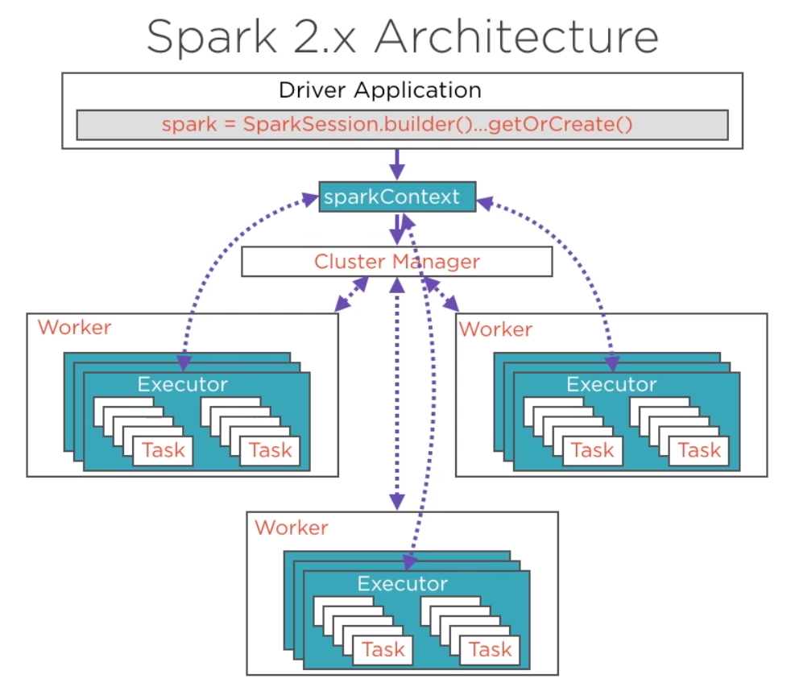

-   [Multinode Hadoop installation in AWS | Hadoop Cluster Setup](https://www.youtube.com/watch?v=FFK8HvgMZec)

<details><summary style="font-size:20px;color:Orange">Configurations</summary>

-   [How to Run a Spark Cluster with Multiple Workers Locally Using Docker](https://www.youtube.com/watch?v=FteThJ-YvXk)
-   [API Reference](https://spark.apache.org/docs/latest/api/python/reference/index.html)
-   [Spark Python API Docs](https://spark.apache.org/docs/latest/api/python/index.html#)
-   [Spark SQL](https://spark.apache.org/docs/3.1.1/api/python/reference/pyspark.sql.html#functions)
-   [Spark Core](https://spark.apache.org/docs/latest/api/python/reference/pyspark.html)
-   [Spark Programming Guide](https://spark.apache.org/docs/3.0.1/index.html)
-   [mysql Notes](https://www.tutorialspoint.com/mysql/mysql-select-database.htm)

---

<b style="font-size:20px;color:Red">NOTES:</b>

-   Default partition size is 128 MB
-   Optimal partition size is (1-200) MB
-   `spark.sql.shuffle.partitions = 200` -> Default # of shuffle partitions is 200
-   An Executor contains one or many cores.
-   `spark.sql.join.preferSortMergeJoin` -> the choice of default join strategy.
-   A partition gets processed by a core in an executor.
-   a job gets created whenever a action method is triggered.

---

-   [Installation: Manually Downloading](https://spark.apache.org/docs/latest/api/python/getting_started/install.html#manually-downloading)

-   **Prerequisites**:

    -   Spark requires Java 8 or higher (`java -version`).

#### Installation and Configuration:

-   **Download Apache Spark:**

    -   Go to the Apache Spark download page (https://spark.apache.org/downloads.html) and select the latest version of Spark.
    -   Choose the "Pre-built for Apache Hadoop" version.

    -   `$ mkdir -p /opt/spark`
    -   `$ wget -P /opt/spark/ https://dlcdn.apache.org/spark/spark-3.5.1/spark-3.5.1-bin-hadoop3.tgz`
    -   `$ tar xvf /opt/spark/spark-3.5.1-bin-hadoop3.tgz -C /opt/spark` -→ Untar `spark-3.5.1-bin-hadoop3.tgz` and save it into `/opt/spark` directory.

-   **Extract Spark:**

    -   Extract the downloaded tar file using the follwoing command
    -   `$ tar -xvf spark-<version>-bin-hadoop<version>.tgz`
    -   `$ rm -fr /opt/spark/spark-3.5.1-bin-hadoop3.tgz`

-   **Configure Environment Variables:**

    ```sh
    # Add required environment variable
    echo "export SPARK_HOME=/opt/spark/spark-3.5.1-bin-hadoop3" >> ~/.bash_profile
    # Add Spark into your `PATH` variable
    echo "export PATH=\$SPARK_HOME/bin:\$PATH" >> ~/.bash_profile
    ```

-   **Test Installation**:

    -   TEST 1:
        -   `$ pyspark` --> Start PySpark shell ( `pyspark` needed to be install)
        -   `$ spark-shell` --> Start Spark shell
    -   TEST 2:
        -   `$ spark-submit $SPARK_HOME/examples/src/main/python/pi.py `

-   **Standalone Cluster Configuration:**

    -   In Spark, you can run in a standalone cluster mode. The default configuration file is `spark-defaults.conf` in the conf directory of the Spark installation.
    -   You may want to customize this configuration file for your needs. You can do this by copying the template and making adjustments:
        -   `$ cp $SPARK_HOME/conf/spark-defaults.conf.template $SPARK_HOME/conf/spark-defaults.conf`

#### Run Spark:

-   **Start the Master**:

    -   To start the Spark Master, run the following command in your terminal:
    -   `$SPARK_HOME/sbin/start-master.sh`

-   **Start Worker Nodes**:

    -   If you want to add worker nodes, you can start them by running:

    -   `$SPARK_HOME/sbin/start-worker.sh <master-url>`
        -   Replace <master-url> with the Spark Master's URL, which you can find in the web UI.

-   **Run Spark Applications**:

    -   You can submit Spark applications to your standalone cluster using the `spark-submit` command. For example:
    -   `$SPARK_HOME/bin/spark-submit --class your.spark.app.MainClass --master spark://<master-url> /path/to/your/app.jar`

-   **Access the Web UI**:

    -   You can access the Spark Master's web UI by opening a web browser and navigating to http://localhost:4040.

-   **Stop Spark Cluster**:

    -   To stop the Spark Master and all associated worker nodes, use the following command:
    -   `$SPARK_HOME/sbin/stop-all.sh`

#### Spark with Jupyter Notebook:

-   **Install Jupyter Notebook**:

    -   If you haven't already installed Jupyter Notebook, you can do so using pip. Open your terminal and run the following command:
    -   `$ pip install jupyter`

-   **Install PySpark**:

    -   You need to install PySpark on your Mac. You can use pip to install it:
    -   `$ pip install pyspark`

-   **Set up Environment Variables**:

    -   Before starting a Jupyter Notebook, make sure your Spark environment variables are correctly set. In your terminal, export the following environment variables:

    ```sh
    export PYSPARK_PYTHON="python3"
    export PYSPARK_DRIVER_PYTHON="jupyter"
    ```

#### How to submit job to Spark

-   `$ spark-submit --master local your_script.py` --> Run the script locally on your machine
-   `$ spark-submit --master yarn --deploy-mode cluster your_script.py` --> Submit the script to a YARN cluster
-   `$ spark-submit --master yarn --deploy-mode cluster --num-executors 4 --executor-memory 2G --executor-cores 2 your_script.py` --> Submit the script to a YARN cluster with additional resources.
-   `$ spark-submit --master spark://master:7077 --deploy-mode cluster your_script.py` --> Submit the script to a Spark standalone cluster
-   `$ `

#### Configuration Options

-   `Configuration Files`:

    -   `code $SPARK_HOME/conf`

-   `SPARK_HOME`: `SPARK_HOME` is an environment variable that points to the root directory of the Apache Spark installation on your system. It typically contains the Spark runtime libraries, configuration files, and other resources needed to run Spark applications. Setting up `SPARK_HOME` is important for configuring and running Spark applications.

-   `PySpark and SPARK_HOME`: When you install Apache Spark on your system, you set up the `SPARK_HOME` environment variable to point to the Spark installation directory. PySpark interacts with Spark by utilizing the Spark libraries located in the `SPARK_HOME` directory. PySpark automatically detects the `SPARK_HOME` environment variable to locate the Spark installation and access its resources.

-   `PySpark Environment`: To use PySpark, you need to have Apache Spark installed on your system and properly configured with the `SPARK_HOME` environment variable set. PySpark internally uses the pyspark Python package, which provides classes and functions to interact with Spark functionalities using Python. When you import pyspark in your Python script or interactive session, PySpark initializes and establishes a connection with the Spark cluster using the Spark libraries from the SPARK_HOME directory. PySpark requires the same minor version of Python in both driver and workers. It uses the default python version in PATH, you can specify which version of Python you want to use by PYSPARK_PYTHON, for example:

    -   `$ export PYSPARK_PYTHON="python3"`
    -   `$ export PYSPARK_DRIVER_PYTHON="jupyter"`

Tweaking configuration parameters in Apache PySpark allows you to optimize your Spark application for performance, resource management, and specific use-case requirements. Configuration parameters can be set at different stages, including when initializing the SparkSession, submitting the application, or within the code. Here’s how you can manage these configurations:

1.  **Setting Configuration Parameters in Code** : You can set configuration parameters programmatically when you create the SparkSession. This is the most common and flexible way to configure Spark settings.

    Example:

    ```python
    from pyspark.sql import SparkSession
    from pyspark import SparkConf

    # Create SparkSession with custom configurations
    spark = SparkSession.builder \
        .appName("MyApp") \
        .config("spark.executor.memory", "4g") \
        .config("spark.executor.cores", "4") \
        .config("spark.executor.instances", "5") \
        .config("spark.sql.shuffle.partitions", "50") \
        .config("spark.serializer", "org.apache.spark.serializer.KryoSerializer") \
        .config("spark.kryo.registrator", "my.package.MyKryoRegistrator") \
        .getOrCreate()

    ##########################################################
    # Create SparkConf and set custom configurations
    conf = SparkConf() \
        .setAppName("MyPySparkApp") \
        .set("spark.executor.memory", "4g") \
        .set("spark.executor.cores", "4") \
        .set("spark.executor.instances", "5") \
        .set("spark.sql.shuffle.partitions", "50") \
        .set("spark.sql.execution.arrow.enabled", "true")

    # Initialize SparkSession with SparkConf
    spark = SparkSession.builder \
        .config(conf=conf) \
        .getOrCreate()

    # Your PySpark code here

    # Stop the Spark session
    spark.stop()

    ```

2.  **Setting Configuration Parameters in spark-submit** : When submitting a Spark application using spark-submit, you can specify configuration parameters via command-line options.

    Example Command:

    ```sh
    spark-submit \
        --master yarn \
        --deploy-mode cluster \
        --conf spark.executor.memory=4g \
        --conf spark.executor.cores=4 \
        --conf spark.executor.instances=5 \
        --conf spark.sql.shuffle.partitions=50 \
        your_script.py
    ```

    ```sh
    spark-submit \
        --master yarn \
        --deploy-mode cluster \
        --conf spark.dynamicAllocation.enabled=true \
        --conf spark.dynamicAllocation.minExecutors=2 \
        --conf spark.dynamicAllocation.maxExecutors=10 \
        your_script.py
    ```

3.  **Setting Configuration Parameters in Spark Configuration Files** : Spark can also be configured using configuration files such as `spark-defaults.conf` and `spark-env.sh`. These files are typically used for cluster-wide configurations.

    Example of spark-defaults.conf:

    ```sh
    spark.master                     yarn
    spark.app.name                   MySparkApp
    spark.executor.memory            4g
    spark.executor.cores             4
    spark.executor.instances         5
    spark.sql.shuffle.partitions     50
    ```

4.  **Advanced Configuration Techniques**

    -   `Using Environment Variables`: You can set Spark configurations using environment variables. This method is useful when you want to set configurations globally or for all sessions without modifying the code.

        ```sh
        export PYSPARK_PYTHON=python3
        export PYSPARK_DRIVER_PYTHON=python3
        export SPARK_HOME=/path/to/spark

        # Example of setting configuration parameters via environment variables
        export SPARK_CONF_DIR=/path/to/spark/conf
        echo "spark.executor.memory=4g" >> $SPARK_CONF_DIR/spark-defaults.conf
        echo "spark.executor.cores=4" >> $SPARK_CONF_DIR/spark-defaults.conf
        ```

5.  **PySpark Specific Configuration**

    -   **Arrow Optimization**:

        -   `spark.sql.execution.arrow.enabled`: Enables Arrow optimization for columnar data transfer between JVM and Python (e.g., true).

        -   Enabling Arrow Optimization: Apache Arrow can significantly improve the performance of PySpark applications that involve data exchange between the JVM and Python by using columnar memory layout.

            ```python
            from pyspark.sql import SparkSession

            # Initialize SparkSession with Arrow optimization enabled
            spark = SparkSession.builder \
                .appName("MyPySparkApp") \
                .config("spark.sql.execution.arrow.enabled", "true") \
                .getOrCreate()

            # Your PySpark code here
            df = spark.createDataFrame([(1, "foo"), (2, "bar")], ["id", "value"])
            pandas_df = df.toPandas()  # This will use Arrow for conversion

            # Stop the Spark session
            spark.stop()
            ```

#### Common Configuration Parameters

1. **Application and Spark Context**

    | **Parameter**                   | **Default Value** | **Description**                                                 |
    | ------------------------------- | ----------------- | --------------------------------------------------------------- |
    | `spark.app.name`                | `(none)`          | Name of the application.                                        |
    | `spark.master`                  | `(none)`          | Cluster manager to connect to (`local`, `yarn`, `mesos`, etc.). |
    | `spark.submit.deployMode`       | `client`          | Deployment mode (`client` or `cluster`).                        |
    | `spark.ui.port`                 | `4040`            | Port for Spark Web UI.                                          |
    | `spark.driver.extraJavaOptions` | `(none)`          | Extra Java options for the driver.                              |

2. **Memory and Execution**

    | **Parameter**                  | **Default Value** | **Description**                                            |
    | ------------------------------ | ----------------- | ---------------------------------------------------------- |
    | `spark.driver.memory`          | `1g`              | Memory for driver process.                                 |
    | `spark.executor.memory`        | `1g`              | Memory per executor process.                               |
    | `spark.driver.cores`           | `1`               | Number of cores to use for the driver process.             |
    | `spark.executor.cores`         | `(none)`          | Number of cores per executor.                              |
    | `spark.executor.instances`     | `(none)`          | Number of executors for YARN mode.                         |
    | `spark.memory.fraction`        | `0.6`             | Fraction of JVM heap space used for execution and storage. |
    | `spark.memory.storageFraction` | `0.5`             | Fraction of heap space allocated for storage/caching.      |

3. **Shuffle and Parallelism**

    | **Parameter**                   | **Default Value**     | **Description**                                         |
    | ------------------------------- | --------------------- | ------------------------------------------------------- |
    | `spark.default.parallelism`     | `2 * number of cores` | Default parallelism for RDDs.                           |
    | `spark.sql.shuffle.partitions`  | `200`                 | Number of partitions for shuffling data in SQL queries. |
    | `spark.reducer.maxSizeInFlight` | `48m`                 | Maximum size of map output to fetch per reduce task.    |
    | `spark.shuffle.compress`        | `true`                | Whether to compress map output files.                   |
    | `spark.shuffle.file.buffer`     | `32k`                 | Buffer size for shuffle file output.                    |

4. **Networking and I/O**

    | **Parameter**                | **Default Value** | **Description**                            |
    | ---------------------------- | ----------------- | ------------------------------------------ |
    | `spark.network.timeout`      | `120s`            | Default network timeout.                   |
    | `spark.rpc.message.maxSize`  | `128m`            | Maximum size of messages exchanged in RPC. |
    | `spark.blockManager.port`    | `(random)`        | Port for Block Manager to use.             |
    | `spark.sql.broadcastTimeout` | `300s`            | Timeout for broadcasting variables.        |

5. **Caching and Serialization**

    | **Parameter**                 | **Default Value**                            | **Description**                                |
    | ----------------------------- | -------------------------------------------- | ---------------------------------------------- |
    | `spark.serializer`            | `org.apache.spark.serializer.JavaSerializer` | Class used for serializing objects.            |
    | `spark.kryoserializer.buffer` | `64k`                                        | Initial buffer size for Kryo serialization.    |
    | `spark.kryo.registrator`      | `(none)`                                     | Custom registrator for Kryo serialization.     |
    | `spark.rdd.compress`          | `false`                                      | Whether to compress serialized RDD partitions. |
    | `spark.broadcast.compress`    | `true`                                       | Whether to compress broadcast variables.       |

6. **Data Source and SQL**

    | **Parameter**                          | **Default Value** | **Description**                                         |
    | -------------------------------------- | ----------------- | ------------------------------------------------------- |
    | `spark.sql.execution.arrow.enabled`    | `false`           | Enable Apache Arrow for fast data transfers in PySpark. |
    | `spark.sql.autoBroadcastJoinThreshold` | `10MB`            | Maximum size for automatic broadcast join.              |
    | `spark.sql.orc.filterPushdown`         | `true`            | Enable filter pushdown for ORC files.                   |
    | `spark.sql.parquet.filterPushdown`     | `true`            | Enable filter pushdown for Parquet files.               |

7. **Checkpointing and Fault Tolerance**

    | **Parameter**                  | **Default Value** | **Description**                                      |
    | ------------------------------ | ----------------- | ---------------------------------------------------- |
    | `spark.checkpoint.compress`    | `false`           | Whether to compress checkpoint data.                 |
    | `spark.speculation`            | `false`           | Enable speculative task execution.                   |
    | `spark.speculation.interval`   | `100ms`           | How often to check for speculative tasks.            |
    | `spark.speculation.multiplier` | `1.5`             | How much slower a task should be before speculation. |

8. **Dynamic Allocation (for Cluster Mode)**

    | **Parameter**                                 | **Default Value** | **Description**                                     |
    | --------------------------------------------- | ----------------- | --------------------------------------------------- |
    | `spark.dynamicAllocation.enabled`             | `false`           | Enable dynamic allocation of executors.             |
    | `spark.dynamicAllocation.initialExecutors`    | `(none)`          | Initial number of executors.                        |
    | `spark.dynamicAllocation.minExecutors`        | `(none)`          | Minimum number of executors.                        |
    | `spark.dynamicAllocation.maxExecutors`        | `(none)`          | Maximum number of executors.                        |
    | `spark.dynamicAllocation.executorIdleTimeout` | `60s`             | Timeout for idle executors before they are removed. |

9. **Logging and Debugging**

    | **Parameter**                  | **Default Value**        | **Description**                    |
    | ------------------------------ | ------------------------ | ---------------------------------- |
    | `spark.eventLog.enabled`       | `false`                  | Enable event logging.              |
    | `spark.eventLog.dir`           | `file:/tmp/spark-events` | Directory for event logs.          |
    | `spark.logConf`                | `false`                  | Log Spark configurations on start. |
    | `spark.ui.showConsoleProgress` | `true`                   | Show task progress in the console. |

10. **Security**

    | **Parameter**                 | **Default Value** | **Description**                 |
    | ----------------------------- | ----------------- | ------------------------------- |
    | `spark.authenticate`          | `false`           | Enable Spark authentication.    |
    | `spark.authenticate.secret`   | `(none)`          | Secret key for authentication.  |
    | `spark.ssl.enabled`           | `false`           | Enable SSL for communication.   |
    | `spark.io.encryption.enabled` | `false`           | Enable encryption for data I/O. |

11. **Advanced Settings**

    | **Parameter**                  | **Default Value** | **Description**                                      |
    | ------------------------------ | ----------------- | ---------------------------------------------------- |
    | `spark.locality.wait`          | `3s`              | Time to wait for launching tasks on preferred nodes. |
    | `spark.task.maxFailures`       | `4`               | Maximum number of failures before a task is aborted. |
    | `spark.blacklist.enabled`      | `false`           | Enable blacklisting of bad nodes or executors.       |
    | `spark.sql.codegen.wholeStage` | `true`            | Enable whole-stage code generation for SQL queries.  |

</details>

---

<details><summary style="font-size:20px;color:Orange">Spark Terms and Concepts</summary>

<center></center>
<center></center>

1. **Apache Spark**:

    - Apache Spark is an open-source distributed computing system that provides a fast and general-purpose cluster-computing framework for big data processing.
    - Spark is designed for speed and ease of use, supporting various programming languages, including Python through PySpark.

2. **PySpark**:

    - PySpark is the Python API for Apache Spark, allowing developers to write Spark applications using Python.
    - It provides a high-level API for distributed data processing, enabling Python developers to harness the power of Spark for big data analytics.

3. **Driver Program**: The driver program in Spark is the entry point for Spark applications and serves as the main control hub for Spark applications. It orchestrates the execution of Spark jobs, from setting up the environment to defining tasks and gathering result. Here are key points about the Driver Program:

    - `Spark Context`: The Driver Program initializes and maintains the Spark Context, which is the entry point for interacting with Spark functionality like creating RDDs, broadcast variables, and perform other Spark-related operations.

    - `User Code Execution`:

        - The Spark application code, written by the user, is executed in the Driver Program.
        - This code includes defining transformations and actions on distributed datasets.

    - `Job Submission`:

        - The Driver Program breaks down Spark jobs into stages, and stages into tasks.
        - The Driver Program submits Spark jobs to the cluster for execution.

    - `Coordination with Cluster Manager`:

        - `Spark Driver Connects`: The Driver Program communicates with the Cluster Manager (e.g., `Spark Standalone`, `Apache Mesos`, or `Apache YARN`) to acquire resources and manage task execution.
        - `Resource Negotiation`: The driver requests resources (CPU, memory) from the cluster manager. It then allocates worker nodes (executors) with resources to Spark applications based on your application's needs.
        - `Task Scheduling`: The Spark driver submits tasks to the cluster manager, which then schedules them on available executors.

    - `Results Aggregation`: The Driver Program aggregates and collects results from the tasks executed on the executor nodes for actions, such as `collect()`.
    - `Driver UI`: Driver Program provides a web-based user interface (UI) that allows monitoring and tracking the progress of the Spark application.
    - `Lifecycle Management`: Driver Program manages the entire lifecycle of the Spark application, from initialization to execution and termination.

4. **SparkSession**:

    - SparkSession is the unified entry point for working with structured data in Spark, introduced in Spark 2.0.
    - It encapsulates the functionality previously provided by `SparkContext`, `SQLContext`, `HiveContext`, and `StreamingContext`, providing a single entry point for working with various Spark features.
    - SparkSession provides support for `DataFrame` API, structured data processing, SQL queries, Dataset API, and managing the SparkSession configuration.
    - It simplifies the process of working with Spark by providing a single interface for interacting with different Spark features.
    - SparkSession is typically created using the `SparkSession.builder()` method, and it is the starting point for most Spark applications, especially those involving structured data processing.

5. **SparkContext**:

    - SparkContext was the main entry point for Spark applications before Spark 2.0.
    - It represents the connection to the Spark cluster and is responsible for coordinating the execution of operations on that cluster.
    - You create a SparkContext object when you want to interact with a Spark cluster programmatically using the Spark API.
    - It provides access to the functionality available in the Spark core, such as creating RDDs (Resilient Distributed Datasets), broadcasting variables, and accumulating variables.
    - In Spark versions prior to 2.0, Spark applications typically interacted directly with the SparkContext.

6. **Cluster Manager**: The cluster manager acts as a supervisor, overseeing the distribution of workloads and resources within a Spark cluster to ensure efficient and reliable execution of Spark applications. It acts as the central conductor, overseeing resource allocation, scheduling workloads, and ensuring efficient utilization of the cluster's computing power. Spark itself is agnostic to the underlying cluster manager, as long as it can acquire worker processes and facilitate communication between them. Here's a breakdown of how a Cluster Manager typically functions in the Spark ecosystem:

    - Allocates resources (CPU, memory) to Spark applications.
    - Schedules tasks on available resources, taking into account workload and resource availability.
    - Handles fault tolerance, restarting failed tasks or reallocating resources as needed.
    - Coordinates communication between Spark drivers and executors.

    - `Spark Driver Connects`: When you submit a Spark application (written in Scala, Python, Java, or R), the driver program establishes a connection with the chosen cluster manager.
    - `Resource Negotiation`: The driver requests resources (CPU, memory) from the cluster manager. It then allocates worker nodes (executors) with resources to Spark applications based on your application's needs.
    - `Task Scheduling`: The Spark driver submits tasks to the cluster manager, which then schedules them on available resources, taking into account workload and resource availability.

    - `Resource Monitoring and Management`: The cluster manager Monitors the health and status of cluster nodes. It continually monitors resource usage and may adjust allocations dynamically based on application needs and cluster conditions.
    - `Fault Tolerance`: The cluster manager can handle fault tolerance, restarting failed tasks or reallocating resources as needed and reschedule tasks on healthy nodes, ensuring the application's progress even in case of node issues.

    - `Types of Cluster Manager`: There are several cluster managers that Spark can work with, each offering distinct advantages and use cases:

        - `Spark Standalone Cluster Manager`: In standalone mode, Spark comes with its own built-in Cluster Manager. This is a simple, lightweight cluster manager. It's suitable for development or small-scale deployments where ease of use and setup are priorities. However, it may not be ideal for large production environments due to limitations in scalability and fault tolerance.
        - `YARN (Yet Another Resource Negotiator)`: A widely used resource management system initially developed for Hadoop. Spark can leverage YARN's robust features like dynamic resource allocation, multi-tenancy, and high availability, making it a good choice for production environments running Spark alongside other YARN-compatible frameworks.
        - `Mesos`: A popular open-source cluster manager known for its flexibility and resource sharing capabilities. Mesos can manage diverse workloads beyond Spark, making it valuable for heterogeneous clusters or when managing resources for various frameworks.
        - `Kubernetes (K8s)`: A container orchestration platform gaining significant traction. Spark can run on Kubernetes clusters, allowing for integration with existing containerized infrastructure and deployment pipelines.

7. **Spark Master**: The Spark Master is a specific node in the Spark cluster responsible for managing resources and coordinating job execution. It allocates resources to applications, schedules tasks across worker nodes, monitors node health, and provides a central point for administrative tasks. In Spark's standalone mode, the Spark Master acts as both the master node and the resource manager.

    - It's part of the Spark **Standalone Mode** or a component within a **Cluster Management** framework (such as Mesos or YARN).
    - The Spark Master is a node in the Spark cluster responsible for managing resources and coordinating job execution.
    - The Spark Master allocates resources to applications and schedules tasks across worker nodes.
    - It monitors the health of worker nodes, manages fault tolerance, and provides a central point for administrative tasks.

8. **Executor**: Executor in Spark are distributed computing processes responsible for executing tasks on the worker nodes in the cluster. They are launched by the Spark driver program and responsible for running the computations and storing the data that is cached in memory or persisted to disk during the execution of Spark jobs. Executors run computations in parallel and communicate with the driver program to execute tasks as part of Spark applications. Here are some key terms and concepts related to executors in Spark:

    - `Task Execution`: Executors execute tasks assigned to them by the Spark driver. These tasks typically involve processing data partitions, such as applying transformations or performing actions on RDDs (Resilient Distributed Datasets) or DataFrames.
    - `Memory Management`: Executors manage memory for caching and processing data. They maintain a portion of the cluster's memory allocated for caching RDD partitions using in-memory storage levels like `MEMORY_ONLY`, `MEMORY_AND_DISK`, or `MEMORY_ONLY_SER`.
    - `Data Storage`: Executors store cached RDD partitions and shuffle intermediate data on local disk when necessary. They may spill data to disk if the available memory is insufficient to hold all the cached partitions.
    - `Task Isolation`: Executors execute tasks in isolated JVM (Java Virtual Machine) processes to provide fault tolerance and resource isolation. If a task fails due to an exception or error, it only affects the executor running the task, and the Spark application can recover by rerunning the failed task on another executor.
    - `Concurrency`: Executors can run multiple tasks concurrently to utilize the available resources efficiently. Spark dynamically adjusts the number of tasks running on each executor based on the cluster resources and workload characteristics.
    - `Resource Allocation`: Executors are allocated resources such as CPU cores, memory, and disk storage by the cluster manager (e.g., Apache YARN, Apache Mesos, or Kubernetes) based on the application's resource requirements and the available capacity in the cluster.
    - `Driver-Executor Communication`: Executors communicate with the Spark driver to receive task assignments, report task status updates, and fetch data dependencies required for task execution. The driver coordinates the execution across all the executors in the cluster.

9. **RDD (Resilient Distributed Dataset)**: In Apache Spark, Resilient Distributed Datasets (RDDs) are the fundamental data abstraction that represent a distributed collection of elements partitioned across the nodes of a cluster and processed in parallel. RDDs are immutable, fault-tolerant, and resilient to failures, making them a foundational building block for distributed data processing in Spark. Here are the key terms and concepts related to RDDs:

    - `Resilient`: RDDs are resilient because they automatically recover from failures. If a partition of an RDD is lost due to a node failure, Spark can reconstruct the lost partition using the lineage information stored in the RDD's lineage graph.
    - `Distributed`: RDDs are distributed across multiple nodes in a cluster, allowing parallel processing of data. Each RDD partition resides on a different node, and computations are performed in parallel on these partitions.
    - `Dataset`: RDDs represent datasets that can be created from various data sources such as files, databases, or generated programmatically. RDDs can hold any type of Python, Java, or Scala objects, including primitive types, collections, and user-defined classes.
    - `Transformation`: RDDs support two types of operations: transformations and actions. Transformations are operations that produce new RDDs from existing RDDs by applying functions to the elements of the RDD. Examples of transformations include `map`, `filter`, `flatMap`, `reduceByKey`, `join`, `union`, and `sortBy`.
    - `Action`: Actions are operations that trigger the execution of computations on RDDs and return results to the driver program or write data to external storage systems. Examples of actions include `collect`, `count`, `take`, `reduce`, `foreach`, `saveAsTextFile`, `saveAsSequenceFile`, and `saveAsObjectFile`.
    - `Lazy Evaluation`: Spark uses lazy evaluation to optimize the execution of RDD transformations. Transformations are not evaluated immediately when they are called but are instead recorded as a lineage graph of dependencies. Only when an action is invoked on the RDD does Spark execute the transformations in the lineage graph to produce the final result.
    - `Partitioning`: RDDs are divided into partitions, which are units of parallelism that determine how data is distributed and processed across the cluster. Spark operates on individual partitions in parallel, allowing for scalable and efficient distributed processing.
    - `Lineage Graph`: RDDs maintain a directed acyclic graph (DAG) of transformations called the lineage graph. The lineage graph captures the dependencies between RDDs and transformations, enabling fault tolerance and recomputation of lost partitions in case of failures.
    - `Persistence`: RDDs support caching and persistence to optimize performance by storing intermediate results in memory or disk. Cached RDDs can be reused across multiple computations, reducing the need for recomputation and improving overall execution speed.
    - `Fault Tolerance`: RDDs are fault-tolerant because they track the lineage of each partition and can reconstruct lost partitions by reapplying transformations from the original data source. This ensures data reliability and consistency even in the presence of node failures or errors.

10. **DataFrame**:

    - DataFrame is a distributed collection of data organized into named columns, similar to a table in a relational database.
    - It provides a more user-friendly, structured API for data manipulation and analysis compared to RDDs, and it integrates well with Python's Pandas library.

11. **Relationship between RDD and DataFrame**:

    - `RDD as Foundation:`

        - RDDs are the foundational data structure in Spark. All higher-level abstractions, including DataFrame and Dataset, are built upon RDDs.
        - They provide the flexibility to handle any type of data and support custom partitioning and storage strategies.

    - `DataFrame as Structured Abstraction`:

        - DataFrame simplifies the process of working with structured data by providing a high-level API that resembles SQL queries.
        - Under the hood, DataFrames are built on RDDs but hide the complexity of RDD management, offering optimizations for structured data operations.

    - `Interoperability`:

        - RDDs and DataFrames can interoperate seamlessly in Spark applications.
        - DataFrames can be created from RDDs using Spark SQL queries (sqlContext.createDataFrame(rdd)), allowing for the conversion between structured and unstructured data representations.

12. **Transformations**:

    - Transformations are operations on RDDs or DataFrames that produce a new RDD or DataFrame.
    - Transformations are lazily evaluated, and they define the sequence of operations to be performed on the data.
    - Transformations in Spark are categorized into two types based on their behavior.

    - `Narrow Transformations`:

        - Narrow transformations are transformations where each partition of the parent RDD contributes to only one partition of the child RDD.
        - These transformations do not require shuffling of data between partitions. Each partition of the resulting RDD depends on one partition of the parent RDD.
        - Example: `map`, `filter`, `union`, `distinct`, `flatMap`, etc.

    - `Wide Transformations`:

        - Wide transformations are transformations where each partition of the parent RDD can contribute to multiple partitions of the child RDD. They involve shuffling of data across partitions.
        - These transformations require data to be redistributed and shuffled across partitions. They involve a more significant amount of data movement between nodes.
        - Example: `groupByKey`, `reduceByKey`, `sortByKey`, `join`, `cogroup`, distinct after a repartition, etc.

    - `Differences`:

        - Narrow transformations are more efficient as they do not require data shuffling, and the computation can be performed independently on each partition.
        - Wide transformations involve data shuffling, which can be a costly operation in terms of performance.
        - Narrow transformations result in a one-to-one mapping of partitions from the parent to the child RDD.
        - Wide transformations may result in a different number of partitions in the child RDD compared to the parent RDD.

13. **Actions**:

    - Actions are operations on RDDs or DataFrames that trigger the execution of transformations and return a result to the driver program or write data to an external storage system.
    - Actions are the operations that initiate the actual computation and produce results.
    - Here are some common action methods in PySpark: `collect()`, `count()`, `first()`, `take(n)`, `takeSample(withReplacement, num, seed=None)`, `reduce(func)`, `foreach(func)`, `saveAsTextFile(path)`, `saveAsSequenceFile(path)`, `saveAsParquetFile(path)`, `countByKey()`, `countByValue()`

14. **Job**:

    - A job in Spark represents a complete computation with a specific goal.
    - It is a sequence of transformations and actions on data that is executed to produce a result.
    - A Spark application can consist of one or more jobs.

15. **Stage**: In Spark, a stage represents a logical division of a Spark job's execution plan. It consists of a set of tasks that can be executed in parallel on the data partitions within the RDD (Resilient Distributed Dataset). Stages are created during the optimization and planning phase of a Spark job and are based on the dependencies between RDD transformations. Each stage represents a distinct computation phase, such as map or reduce, and is separated by data shuffling operations.

    - A job is divided into stages based on the presence of a shuffle operation (e.g., a reduce operation).
    - A stage represents a set of tasks that can be executed in parallel across multiple nodes.
    - A stage consists of tasks that perform the same computation but on different partitions of the data.

16. **Task**:

    - A task is the smallest unit of work in Spark and represents the execution of a computation on a single partition of data.
    - Tasks are the actual computations that are performed on the executor nodes.
    - Each stage is divided into tasks, and tasks within a stage can be executed in parallel.

17. **Ingestion**: Ingestion refers to the process of loading data from external sources such as files, databases, streams, or other distributed storage systems into Spark for processing. It is the first step in the data processing pipeline and is crucial for performing analytics, machine learning, or other computations.

</details>

---

<details><summary style="font-size:20px;color:Orange">Spark's Mode of Operations</summary>

Apache Spark operates in multiple **modes** to suit different environments and deployment requirements. The mode refers to how and where Spark applications are executed and resources are managed. Each mode represents a different cluster manager or deployment option that Spark can leverage. Here are the key modes of Apache Spark's operation:

#### 1. **Local Mode**

In **local mode**, Spark runs on a single machine, making it ideal for development, testing, or small-scale data processing tasks. It does not require a cluster manager or distributed setup. Instead, the entire Spark application, including the driver and executors, runs on the same machine in separate threads.

-   **Single Machine**: Spark operates locally without requiring a distributed cluster.
-   **Multiple Threads**: The user can specify the number of threads to parallelize tasks (e.g., `local[2]` uses two threads).
-   **Good for Development**: Best for development, debugging, and testing since it avoids the overhead of a cluster setup.
-   `$ spark-submit --master local[4] my_spark_app.py`

    -   **`local[4]`**: This specifies that Spark should use four cores (or threads) for execution.

-   **Use Cases**:

    -   Development and testing on a single machine.
    -   Small-scale data processing that doesn’t require a cluster.

#### 2. **Standalone Mode**

In **standalone mode**, Spark manages its own cluster, which consists of a **master node** and multiple **worker nodes**. The master node is responsible for managing the cluster and scheduling resources, while the worker nodes run the actual Spark tasks (executors).

-   **Cluster Manager Built-in**: The standalone mode uses Spark's built-in cluster manager, so no external cluster manager like YARN or Mesos is required.
-   **High Availability**: The master can be configured for high availability to avoid single points of failure.
-   **Flexible Resource Allocation**: Executors are distributed across multiple worker nodes to parallelize the workload.
-   `$ spark-submit --master spark://master-url:7077 my_spark_app.py`
-   **`spark://master-url:7077`**: Specifies the master node where Spark is managing the cluster.

-   `Use Cases`:

    -   When you want to deploy Spark in a cluster with its built-in resource manager.
    -   Ideal for small to medium-sized Spark clusters without complex resource management needs.

#### 3. **YARN Mode (Hadoop Cluster Mode)**

In **YARN (Yet Another Resource Negotiator) mode**, Spark runs on top of a Hadoop cluster, leveraging Hadoop’s resource manager, **YARN**, for cluster management. This is a common mode in production environments where Hadoop is already being used. There are two sub-modes under YARN:

a. **YARN Client Mode**:

-   The **driver** program runs on the client machine (where you submit the job), while **executors** run on the worker nodes within the YARN cluster.
-   The client must remain connected until the job completes because the driver is running locally.
-   `$ spark-submit --master yarn --deploy-mode client my_spark_app.py`

-   **Use Cases**:
    -   For development and interactive use, especially when monitoring the driver program is necessary.
    -   Running Spark jobs from an edge node in the cluster.

b. **YARN Cluster Mode**:

-   The **driver** runs inside the YARN cluster (on one of the worker nodes), not on the client machine.
-   The job is submitted to the YARN resource manager, which handles everything, including driver and executor management.
-   `$ spark-submit --master yarn --deploy-mode cluster my_spark_app.py`

-   **Integration with Hadoop**: Works well in Hadoop ecosystems, leveraging YARN for resource scheduling and management.
-   **Security**: YARN provides security features like Kerberos for authentication and authorization.
-   **Fault Tolerance**: YARN handles resource allocation, and in cluster mode, the job can continue even if the client disconnects.

-   **Use Cases**:

    -   Best for production jobs since the driver is managed inside the cluster, making the job more resilient to client machine failures.
    -   Long-running batch jobs.

#### 4. **Kubernetes Mode**

In **Kubernetes mode**, Spark runs on a **Kubernetes cluster**, a popular container orchestration platform. Spark leverages Kubernetes as its cluster manager, where both the driver and executors are launched in containers (pods).

-   **Containerized Execution**: Spark applications are executed in Kubernetes pods, providing isolation, scalability, and easy deployment.
-   **Dynamic Scaling**: Kubernetes automatically manages the allocation and scaling of resources for the Spark application based on demand.
-   **Cloud-Native**: Ideal for cloud environments where Kubernetes is widely used for managing containerized workloads.
-   **Resource Isolation**: Kubernetes ensures proper resource isolation through containers, making it suitable for running multiple concurrent Spark jobs in a multitenant environment.
-   `$ spark-submit --master k8s://kubernetes-cluster-url --deploy-mode cluster --conf spark.kubernetes.container.image=spark:latest my_spark_app.py`

-   **Use Cases**:

    -   Cloud-native environments where Kubernetes is the preferred platform for deploying and managing containerized applications.
    -   Running Spark applications in a fully containerized and scalable environment.

---

#### 5. **Mesos Mode**

In **Mesos mode**, Spark runs on top of **Apache Mesos**, a general-purpose resource manager that can also run other distributed frameworks like `Hadoop`, `Kafka`, or `Cassandra`. Mesos handles the allocation of resources, and Spark runs its tasks on the available resources.

-   **General Resource Manager**: Unlike YARN, Mesos is not tied to Hadoop and can manage resources across a variety of distributed systems.
-   **Fine-Grained or Coarse-Grained Modes**: Mesos supports both fine-grained and coarse-grained modes for resource allocation.
    -   **Fine-grained**: Tasks can be allocated dynamically, allowing multiple frameworks to share resources efficiently.
    -   **Coarse-grained**: Resources are allocated to Spark executors for the entire duration of the job.
-   `$ spark-submit --master mesos://mesos-master-url:5050 my_spark_app.py`

-   **Use Cases**: When running a diverse set of applications and services (beyond Spark) in a unified cluster environment using Mesos.

#### Summary of Apache Spark Modes:

| Mode                | Description                                                                    | Use Cases                                                                                          |
| ------------------- | ------------------------------------------------------------------------------ | -------------------------------------------------------------------------------------------------- |
| **Local Mode**      | Runs Spark on a single machine using threads.                                  | Development, testing, small-scale processing.                                                      |
| **Standalone Mode** | Uses Spark’s built-in cluster manager for managing resources in a cluster.     | Small to medium-sized Spark clusters without complex external resource managers.                   |
| **YARN Mode**       | Runs on Hadoop YARN for resource management.                                   | Production environments in Hadoop ecosystems.                                                      |
| **Kubernetes Mode** | Runs Spark on Kubernetes clusters using containers for resource isolation.     | Cloud-native environments with container orchestration and dynamic resource management.            |
| **Mesos Mode**      | Uses Apache Mesos for resource management across multiple distributed systems. | Multi-framework clusters where Spark coexists with other distributed systems like Kafka or Hadoop. |

Each mode of Spark operation is tailored for different use cases, from small-scale development on a local machine to large-scale, multi-tenant environments with complex resource management needs.

</details>

---

<details><summary style="font-size:20px;color:Orange">Broadcast Variables and Accumulator</summary>

In Apache Spark, Broadcast and Accumulator are two important concepts used for efficient and distributed data processing. They serve distinct purposes in Spark applications. Let's delve into each of them in detail:

#### Broadcast Variable:

A Broadcast variable in Spark is a read-only variable that is cached and available on all nodes in a cluster. It allows the program to efficiently distribute large, read-only data values to all worker nodes, preventing the need to send this data with every task.

**Key Points**:

-   Used to cache read-only data.
-   Efficiently distributes large data to all nodes.
-   Improves performance by reducing data transfer overhead.

A Broadcast Variable in Apache Spark is a read-only, distributed variable that is efficiently shared across all tasks within a Spark job. It allows you to efficiently distribute large, read-only datasets or objects to all worker nodes in a Spark cluster, minimizing data transfer costs and improving performance.
Broadcast variables are particularly useful when you have a large dataset or object that needs to be accessed by multiple tasks in a Spark job. Instead of sending a separate copy of the dataset or object to each task, Spark broadcasts the variable once and caches it in memory on each worker node. This way, all tasks can access the variable locally without incurring the overhead of data transfer over the network.

-   `Creation`: You create a Broadcast variable from a driver program by calling the `SparkContext.broadcast()` method. The variable is typically an immutable data structure.
-   `Distribution`: Spark distributes the Broadcast variable to all worker nodes in the cluster. It ensures that each worker has a copy of the variable in its memory.
-   `Task Access`: Tasks running on worker nodes can access the Broadcast variable locally, as it's already available in their memory. This eliminates the need to send the data over the network repeatedly.
-   `Efficiency`: Broadcast variables help in optimizing performance by reducing data transfer overhead, especially when the same data is needed across multiple tasks.
-   `Use Cases`: Common use cases for Broadcast variables include sharing reference data, dictionaries, lookup tables, or any large read-only data that's used by multiple tasks.

-   `Example`:

    ```python
    from pyspark.sql import SparkSession

    # Create a SparkSession
    spark = SparkSession.builder.appName("BroadcastVariableDemo").getOrCreate()

    # Create a SparkContext
    sc = spark.sparkContext

    # Define the large dataset to be broadcasted
    data = range(1000)
    broadcast_data = sc.broadcast(data)

    # Use the broadcast variable in a Spark transformation
    result = sc.parallelize(range(10)).map(lambda x: x * broadcast_data.value[2])

    # Collect and print the result
    print(result.collect()) # Output: [0, 2, 4, 6, 8, 10, 12, 14, 16, 18]

    # Stop the SparkContext
    sc.stop()
    ```

#### Accumulator

An Accumulator is a distributed (shared) data stracture (variable) designed for accumulating values in parallel across worker nodes. Accumulators are typically used for implementing counters and aggregations in a distributed and fault-tolerant manner. They can only be **added** to and are initialized on the driver, but the value can be read by the driver at any point.

-   `Creation`: You create an Accumulator on the driver program using the `SparkContext.accumulator()` method. The initial value is set at this stage.
-   `Distribution`: The Accumulator is distributed to worker nodes, but workers can only "add" values to it. They cannot read or modify the accumulator's value directly.
-   `Task Updates`: During the execution of tasks on worker nodes, the tasks can update the Accumulator by adding values to it. These updates are automatically merged in a distributed and fault-tolerant manner.
-   `Driver Access`: The driver can read the final value of the Accumulator once all tasks are complete. This final value reflects the accumulated result from all tasks.
-   `Use Cases`: Accumulators are suitable for tasks that require distributed aggregation, such as counting occurrences of events across a large dataset.

-   `Example`:

    ```python
    from pyspark.accumulators import AccumulatorParam

    # Define a custom accumulator for a set of strings
    class StringSetAccumulator(AccumulatorParam):
        def zero(self, initial_value): return set()
        def addInPlace(self, v1, v2): return v1.union(v2)

    # Create a SparkSession
    spark = SparkSession.builder \
        .appName("Custom Mutable Accumulator Example") \
        .master("local") \
        .getOrCreate()

    # Create the custom accumulator
    sc = spark.sparkContext
    string_set_acc = sc.accumulator(set(), StringSetAccumulator())

    # Parallelize a collection
    rdd = sc.parallelize(["a", "b", "c", "a", "b", "d"])

    # Use the accumulator in an action
    rdd.foreach(lambda x: string_set_acc.add(set([x])))

    # Print the value of the accumulator
    print(string_set_acc.value) # Output: 'b', 'a', 'c', 'd'}

    # Stop the SparkSession
    spark.stop()
    ```

There are mutable accumulators (can be read and written to) and immutable accumulators (can only be read from).
The distinction between mutable and immutable accumulators is not in the mutability of the accumulator variable itself, but rather in how the accumulator's value can be updated during job execution. Let's clarify the difference:

-   **Mutable Accumulator**:

    -   In a mutable accumulator, worker tasks can directly modify the accumulator's value during job execution.
    -   This means that worker tasks can perform operations that change the accumulator's value, and those changes are reflected immediately in the accumulator.

-   **Immutable Accumulator**:
    -   In an immutable accumulator, worker tasks cannot directly modify the accumulator's value.
    -   Instead, worker tasks contribute updates to the accumulator's value through an associative and commutative operation, such as addition for a counter accumulator.
    -   These updates are then aggregated and propagated back to the driver program, where the final value of the accumulator is accessible.

In summary, Broadcast variables are used for efficiently sharing read-only data across worker nodes, while Accumulators are used for accumulating values across tasks in a distributed and fault-tolerant manner. Both Broadcast and Accumulator are essential tools for performing distributed data processing and aggregation in Spark applications, enhancing efficiency and performance.

</details>

---

<details><summary style="font-size:20px;color:Orange">Grouping, Aggregating and Joining</summary>

#### Grouping and Aggregation

In Apache Spark, grouping and aggregating operations in cluster mode are designed to work simultaneously through a process known as parallel processing. Let's break down how this happens:

-   **Partitioned Processing**: Spark divides the data into partitions, and each partition is processed independently on different nodes in the cluster. This is the foundation of parallel processing.

-   **Grouping within Partitions**: Within each partition, Spark performs the grouping operation based on the specified key or keys. This step is done independently in each partition.

-   **Aggregation within Partitions**: After grouping, if there are aggregation functions specified (e.g., counting, summing), Spark performs these aggregations within each partition. Again, this is done in parallel for each partition.

-   **Combining Results**: The intermediate results (grouped and aggregated data within each partition) are then combined. If the grouping involved a shuffle operation (repartitioning the data based on keys), Spark takes care of redistributing the data so that records with the same key end up in the same partition.

-   **Final Aggregation (if needed)**: Once the data is reshuffled, Spark performs a final aggregation step if there are global aggregations across all partitions.

-   **Hash Aggregation** in Apache Spark is a technique used to efficiently perform aggregation operations, such as sums, averages, counts, or other aggregate functions, by utilizing hash-based methods to group and compute results. This approach is especially useful for handling large datasets and optimizing the performance of aggregation tasks.

    -   **How Hash Aggregation Works**: By default, Spark try to use hash-based aggregation for `groupBy()` operations if possible.

        1. **Hash Map for Aggregation**: In hash aggregation, Spark uses hash maps (or hash tables) to group and aggregate data. During the aggregation process, Spark creates a hash map where the keys are the group-by columns, and the values are aggregates like sums or counts. As data is processed, Spark inserts records into the hash map based on the hash of the key column.

        2. **Two Phases of Aggregation**:
            - **Shuffle Phase**: In distributed settings, the shuffle phase involves redistributing data across nodes to ensure that all records with the same key end up on the same node. During this phase, data is partitioned and shuffled based on the hash of the key column, allowing each partition to handle a subset of the data.
            - **Aggregation Phase**: After data is shuffled, each partition processes its subset of data and performs the aggregation using the hash map. This involves iterating through the data and updating the hash map with aggregate values.

    -   **Benefits of Hash Aggregation**

        1. **Efficiency**: Hash aggregation can be very efficient, especially when dealing with large datasets, because it reduces the amount of data that needs to be shuffled and processed. The hash-based grouping enables fast lookups and updates during the aggregation phase.

        2. **Reduced Shuffle Overhead**: Hash aggregation helps in minimizing the shuffle overhead by localizing the aggregation process within each partition, reducing the need to move large amounts of data between nodes.

-   **Sort-Based Aggregation**:

    -   Used when the data is large or does not fit into memory, requiring sorting before aggregation.
    -   More suitable for large datasets that involve disk-based operations to avoid memory overflow.

-   **Specification of Aggregation**:

    ```python
    # Enable hash aggregation (default)
    spark.conf.set("spark.sql.execution.useObjectHashAggregateExec", "true")

    # If set to true, Spark will favor sort-based aggregation over hash-based, even if hash aggregation is feasible.
    spark.conf.set("spark.sql.execution.useSortBasedAggregation", "true")  # Force sort-based aggregation

    # Perform a groupBy aggregation
    df.groupBy("name").agg({"score": "sum"}).show()

    # Perform the same groupBy aggregation with sort-based
    df.groupBy("name").agg({"score": "sum"}).show()
    ```

#### Joining

-   [Databricks | Pyspark | Interview Question: Sort-Merge Join (SMJ)](https://www.youtube.com/watch?v=DFtvA5O58X4&list=PLgPb8HXOGtsQeiFz1y9dcLuXjRh8teQtw&index=71)

<center></center>

In Apache Spark, joining operations are fundamental for combining data from multiple datasets based on common keys. There are several types of joining operations available, each with its own characteristics and performance implications. The choice of join algorithm depends on factors such as the size of the datasets, the distribution of data, and the available resources in the cluster. Let's explore the different types of joining operations in Spark along with demonstrations:

-   **Partitioned Hash Join**/**Shuffle Hash Join**: It is the default join algorithm. This algorithm involves partitioning both datasets based on their join keys and then redistributing the partitions across the worker nodes. The partitions with the same join keys are shuffled to the same worker node, where the actual join operation takes place. This method is efficient for large datasets but requires shuffling data across the network, which can incur overhead. It is particularly useful when one of the datasets is small enough to fit into memory but is not broadcastable (in cases where Broadcast Hash Join cannot be used). Here's a detailed explanation of how Shuffle Hash Join works in the context of Spark:

    1. **Data Partitioning and Shuffling**:

        - Spark first **partitions** the two datasets based on the join keys.
        - To ensure that matching rows are in the same partition, Spark **shuffles** the data (i.e., redistributes rows across the cluster) based on the join key. This ensures that rows with the same key end up in the same partition.

    2. **Building a Hash Table**:

        - In each partition, Spark builds an **in-memory hash table** for one of the datasets (typically the smaller one). This hash table maps the join key to the rows that contain that key.
        - The smaller dataset is chosen to minimize memory usage, and it is hashed based on the join key.

    3. **Probing and Joining**:
        - After building the hash table, Spark scans through the rows of the larger dataset in the same partition and **probes** the hash table using the join key.
        - For each row in the larger dataset, Spark checks if the join key exists in the hash table. If a match is found, it performs the join by combining the row from the larger dataset with the corresponding row(s) from the smaller dataset.

    ```python
    # Regular join
    joined_df = df1.join(df2, 'key')
    ```

-   **Sort Merge Join**: This approach works well when both datasets are already sorted or can be sorted efficiently. It is commonly used for large datasets with evenly distributed join keys.

    -   How Sort Merge Join Works:

        1. **Data Partitioning**: Spark divides the data into multiple partitions. For a Sort Merge Join, the two datasets to be joined are assumed to be partitioned in such a way that the corresponding data for the join keys is in the same partition on both sides (this is ensured by using a shuffle operation).

        2. **Sorting Within Partitions**: After partitioning, each partition in both datasets is sorted based on the join key. Spark ensures that the join keys within each partition are ordered (hence "sort").

        3. **Merge**:

            - After sorting, Spark performs a "merge" step, where it iterates over both partitions in a linear scan. It compares the rows from both datasets based on the join key and merges the matching rows together (hence "merge").
            - If the join is an equi-joins (joins on equality conditions), it will only join rows that have equal join key values.

        4. **Execution**: The merge phase is efficient because the datasets are already sorted, meaning a linear scan (O(n)) can be done to perform the join rather than a nested loop or hash-based operation.

-   **Broadcast Join**:

    -   Broadcast join is a variant of the join operation where one of the datasets is small enough to fit in memory on each worker node (broadcasted).
    -   The smaller dataset is broadcasted to all worker nodes, and the join operation is performed locally on each node.
    -   This type of join is efficient when one dataset is significantly smaller than the other.

    ```python
    # Broadcast join
    from pyspark.sql.functions import broadcast
    joined_df = df1.join(broadcast(df2), 'key')
    ```

-   **Broadcast Nested Loop Join**: Similar to the nested loop join, this algorithm involves broadcasting one of the datasets to all worker nodes and then performing a nested loop join locally on each node. It is suitable for cases where one dataset is small enough to fit in memory but cannot be efficiently partitioned for hash join.
-   **Broadcast Hash Join**: In this algorithm, one of the datasets is small enough to fit in memory, and its entire contents are broadcasted to all worker nodes. The other dataset is partitioned, and each partition is joined with the broadcasted dataset locally on each worker node. This method is efficient when one dataset is significantly smaller than the other.
-   **Cartesian Join (Cross Join)**: In this algorithm, every row from the first dataset is combined with every row from the second dataset, resulting in a Cartesian product of the datasets. This method can be resource-intensive and is typically used cautiously due to the potential for generating a large number of output rows.

-   **Choosing the Right Join Algorithm**: The choice of join algorithm depends on the size of the datasets and the nature of the join condition:

    -   Small and Large Dataset: Use Broadcast Hash Join for better performance.
    -   Large Datasets: Use Sort-Merge Join, especially for equi-joins.
    -   Very Large Datasets: Default to Shuffle Hash Join if no other optimization is applicable.
    -   Non-Equi Joins: Use Broadcast Nested Loop Join.

-   **Join Hints**: You can provide join hints to Spark to influence the join algorithm selection:

    ```python
    df1.join(df2.hint("broadcast"), "join_key")
    df1.join(df2.hint("shuffle_hash"), "join_key")
    df1.join(df2.hint("merge"), "join_key")
    ```

</details>

---

<details><summary style="font-size:20px;color:Orange">How Shuffling Operations Works</summary>

In Apache Spark, a "shuffle" operation refers to the process of redistributing and reorganizing data across the partitions of a Resilient Distributed Dataset (RDD) or DataFrame. Shuffling is a critical operation in distributed data processing, especially when certain transformations require data to be rearranged or grouped differently. Shuffling involves substantial data movement across the nodes of a Spark cluster and is generally considered an expensive operation. Followings are key Concepts Related to Shuffle Operations:

-   **Stages**:

    -   Shuffling often occurs as part of a Spark job during the transition between stages.
    -   A stage is a set of parallel tasks that can be executed without data exchange, and shuffling typically separates different stages.

-   **Map and Reduce**: The shuffle process is often divided into two main phases: **map** and **reduce**.

    -   <b style="color:#C71585">Map Phase</b>: In the map phase, data is locally processed on each executor to prepare it for the shuffle.

        -   Transformations like `map`, `filter`, `flatMap` are applied to each partition of the input data independently. This phase is often referred to as the "map phase."
        -   Data is serialized for transmission to the reducers.
        -   Map output records are written to local disk or memory, typically in the form of map output files.

    -   <b style="color:#C71585">Shuffle Phase</b>: The shuffle phase involves redistributing data across the cluster based on keys. This phase is necessary for operations like `join`, `groupByKey`, and `reduceByKey`, which require data to be grouped or aggregated by keys.

        -   After the map phase, when certain operations like `groupByKey`, `reduceByKey`, or `aggregateByKey` are performed, Spark needs to reshuffle and redistribute the data across partitions based on keys.

        -   **Combiner**: The combine phase involves combining intermediate results on each node before shuffling the data. This phase helps to reduce the amount of data transferred over the network and improve performance.

            -   The combiner function is applied locally within each partition before the shuffle, which allows for the partial aggregation of data with the same key within each partition.
            -   By aggregating data locally before shuffling, the amount of data transferred across the network is reduced.
            -   The output of the combiner function serves as input to the shuffle phase, where further aggregation or merging can occur across partitions.

        -   Compression can be applied to reduce the amount of data transferred during the shuffle phase, minimizing network overhead.
        -   Data is partitioned and sent to different nodes based on the key.
        -   This phase involves significant network communication, which can be costly in terms of performance.

    -   <b style="color:#C71585">Reduce Phase</b>: The reduce phase involves aggregating the combined results from different nodes to produce the final output. This phase is used for operations like `reduceByKey` and `aggregateByKey`.

        -   Shuffled data is deserialized for further processing.
        -   The combined results are aggregated to produce the final result.
        -   This phase usually involves minimal data movement since most of the aggregation has already been done locally during the combine phase.

-   **Shuffle Manager**: The Shuffle Manager in Apache Spark is a critical component responsible for managing the shuffle operations within the Spark execution engine. The Shuffle Manager orchestrates the entire shuffle process, ensuring data is correctly transferred between executors (nodes) in the cluster.

    -   Data is serialized before being transferred over the network and deserialized upon receipt.
    -   Shuffle data is temporarily stored in files on disk. The Shuffle Manager handles the creation, writing, reading, and cleanup of these shuffle files.

    -   `Shuffle Write`: Handles the writing of map output data to disk or memory for transmission.

        -   Map output files are transferred to the nodes where the reducers are running.
        -   These files are stored in the shuffle manager's directory, which is accessible by all nodes in the cluster.
        -   Data is sorted and partitioned according to the partitioning function.

    -   `Shuffle Fetch`: Manages the retrieval of shuffled data by reducers.

        -   Reducers pull the relevant map output data from the shuffle manager's directory.
        -   This involves a network transfer of data from multiple nodes to the reducers.

    -   `shuffle manager's directory`: The shuffle manager's directory is the location on the local file system where Spark stores intermediate shuffle data during the shuffle phase of data processing. It's typically a configurable location specified by the spark.local.dir configuration property in Spark's configuration file (usually spark-defaults.conf). If this property is not set, Spark uses the default temporary directory provided by the operating system.

</details>

---

<details><summary style="font-size:20px;color:Orange">Pertitions</summary>

-   [Partitioning For High Performance Data Processing](https://www.youtube.com/watch?v=fZndmQasykk&list=PLWAuYt0wgRcLCtWzUxNg4BjnYlCZNEVth&index=5)
-   [Dynamic Partitioning Pruning](https://www.youtube.com/watch?v=s8Z8Gex7VFw&list=PLWAuYt0wgRcLCtWzUxNg4BjnYlCZNEVth&index=8)

In Apache Spark, partitioning refers to the process of dividing a large dataset into smaller, manageable chunks called partitions. Each partition is a subset of the data and can be processed independently of the others. This approach is fundamental to Spark’s distributed computing model and has several implications:

Partitions play a crucial role in parallelizing data processing across a cluster. Partitions are the basic units of parallelism, and they represent the smaller chunks of data distributed across the worker nodes in a cluster. Understanding when and how to leverage partitions is essential for optimizing Spark jobs.

#### Why Partition:

-   **Parallelism**: Partitioning enables parallel processing by distributing data across multiple nodes in a cluster. Each partition can be processed independently, allowing Spark to leverage the full computational power of the cluster and execute tasks in parallel.

-   **Performance**: Proper partitioning can significantly impact performance. For instance, it helps to reduce data shuffling (moving data between nodes) by ensuring that related data is co-located on the same partition. This can lead to faster computation times and more efficient resource utilization.

-   **Data Locality**: Partitioning ensures that data processing tasks are executed close to where the data resides, minimizing data movement across the network. This maximizes data locality and reduces the overhead associated with reading and writing data over the network.

-   **Resource Utilization**: Proper partitioning ensures that computational resources are utilized efficiently, as tasks are evenly distributed across nodes. This prevents resource contention and ensures that all nodes contribute to the overall processing throughput.

-   **Custom Partitioning**: Spark allows developers to define custom partitioning schemes to optimize the performance for specific use cases. This can be done using the `partitionBy` method in DataFrames or the `Partitioner` class in RDDs (Resilient Distributed Datasets). Custom partitioning can help in scenarios where you want to group data based on a specific key to optimize subsequent operations like joins or aggregations.

#### When to Partition:

-   `Large Datasets`: Partitioning becomes especially important when dealing with large datasets that cannot fit into memory on a single machine. By partitioning data, Spark can distribute the workload across multiple nodes in a cluster, allowing for parallel processing and efficient use of available resources.

-   `Performance Optimization`: Partitioning can significantly improve the performance of operations like joins, aggregations, and transformations, as it reduces data shuffling and minimizes the movement of data across the network. Proper partitioning ensures that related data resides in the same partition, minimizing the need for inter-node communication.

-   `Skewed Data`: Partitioning is crucial for handling skewed data distributions, where certain keys or values are disproportionately represented in the dataset. By partitioning data based on skewed keys and employing strategies like salting or bucketing, you can mitigate the impact of data skew and prevent performance bottlenecks.

-   `Repartitioning and Coalescing`: Spark provides methods like `repartition()` and `coalesce()` to adjust the number of partitions in a DataFrame or RDD. You can use these methods to redistribute data across partitions or merge small partitions to reduce overhead.

-   `Optimizing Joins and Aggregations`: For operations like joins and aggregations, it's essential to ensure that data is partitioned appropriately to minimize data shuffling and maximize parallelism. Choosing the right partitioning strategy and key columns can significantly improve the performance of these operations.

#### How to Partition:

-   **Default Partitioning**:Spark provides default partitioning strategies when reading data from various sources like HDFS, S3, or JDBC. However, you can override these defaults by explicitly specifying the number of partitions or using custom partitioning logic.

    -   `Reading data from external storage`: By default, Spark creates one partition for each block of the file being read. The block size typically defaults to 128MB in HDFS (Hadoop Distributed File System). You can override this by specifying a desired number of partitions during the read operation.

    -   `Creating DataFrames/RDDs`: There's no strict default partitioning here. The number of partitions can be influenced by factors like:

        -   `Number of cores`: Spark might create partitions matching the total number of cores on your cluster for parallel processing.
        -   `Shuffle operations`: Operations like groupBy or joins that shuffle data might use a configurable number of partitions (defaulting to **200** by Spark SQL).

-   **Hash Partitioning**:Hash partitioning involves distributing data based on the hash value of a specific key or column. Spark's `repartition()` or `partitionBy()` functions can be used to perform hash partitioning.

-   **Range Partitioning**:Range partitioning divides data into partitions based on the range of values in a specific key or column. This is useful for ordered data, such as timestamps or numeric values.

-   **Round Robin Partitioning**:In round-robin partitioning, data is evenly distributed across partitions in a round-robin fashion. Spark assigns records to partitions sequentially, cycling through the available partitions. This can be useful for evenly distributing workload across executors, especially when the data distribution is unknown or uneven.

-   **Custom Partitioning**:Spark allows you to implement custom partitioning logic by extending the Partitioner class. This gives you fine-grained control over how data is partitioned based on your specific requirements.

#### Partitioning interface in Spark

```python
df_repartitioned = df.repartition(3)

df_coalesced = df.repartition(4).coalesce(2)

df_transactions.repartition(5).write.mode("overwrite").option("header", "true").csv("/TNX_test.csv")

df_transactions.coalesce(1).write.mode('overwrite').option("header", "true").csv("TNX_test.csv")

df.repartition(3).write.mode("overwrite").partitionBy("listen_date").parquet("path/to/write")

## Write Partitioned Data
df.write.partitionBy("column").parquet("path/to/output")
```

-   **repartition(numPartitions: Int)**:

    -   `repartition()` is an operation that shuffles the data across the cluster and creates a new set of partitions based on the specified number of partitions (numPartitions).
    -   It is an expensive operation as it involves a full shuffle of the data across the cluster.
    -   Use `repartition()` when you want to increase or decrease the number of partitions and are willing to pay the cost of shuffling the data.

-   **coalesce(numPartitions: Int, shuffle: Boolean = false)**:

    -   `coalesce()` is also used to control the partitioning of data, but it tries to minimize data movement by merging partitions whenever possible.
    -   By default, shuffle is set to false, meaning that it tries to minimize shuffling. However, if you set shuffle to true, it behaves like `repartition()` and performs a full shuffle.
    -   It is a less expensive operation compared to `repartition()` when shuffle is set to false since it does not involve a full shuffle of the data.
    -   Use `coalesce()` when you want to decrease the number of partitions and are interested in minimizing data movement across the cluster.

</details>

---

<details><summary style="font-size:20px;color:Orange">Data Skew</summary>

Data skew refers to an uneven distribution of data across partitions or nodes in a distributed computing system like Apache Spark. It occurs when certain keys or values in the dataset have significantly more records compared to others. This imbalance can lead to performance issues, longer processing times, and resource inefficiency, ultimately affecting the overall performance of the Spark job.

#### Manifestation of Data Skew:

-   **Partition Skew**: If the data is not evenly distributed among partitions, some partitions may have much more data than others, leading to partition skew. This can occur due to a skewed distribution of keys in the dataset or inefficient partitioning strategies.
-   **Join Skew**: Join operations in Spark involve combining data from multiple datasets based on a common key. If certain keys have a disproportionately large number of records compared to others, it can result in join skew. This often happens when joining tables with a foreign key that is highly skewed, causing one side of the join to dominate the processing.
-   **Aggregation Skew**: Aggregation operations such as `groupByKey()`, `reduceByKey()`, or `aggregateByKey()` can also suffer from skew if the keys being aggregated have imbalanced data distribution. This can lead to uneven workloads across executor nodes, with some nodes processing much larger amounts of data than others.

#### Negative Impact of Data Skew:

-   **Uneven Workloads**: Executor nodes with skewed partitions or keys may be overloaded, leading to slower processing times and resource contention.
-   **Increased Shuffle Overhead**: Skewed data distribution can result in a large amount of data shuffling between nodes during join or aggregation operations, increasing network traffic and reducing performance.
-   **Resource Wastage**: Skewed partitions may consume more memory and CPU resources, leaving other partitions underutilized and leading to resource wastage.
-   **Job Failures**: In extreme cases, data skew can cause out-of-memory errors, executor timeouts, or job failures, especially in large-scale production environments.

#### Mitigation of Data Skew:

-   **Preprocessing and Filtering**: Preprocess your data to identify and filter out skewed values or partitions. This may involve redistributing data, removing outliers, or splitting skewed partitions into smaller, more manageable chunks.
-   **Partitioning Strategies**: Use appropriate partitioning strategies (e.g., hash partitioning, range partitioning) to evenly distribute data across partitions.

    -   `Hash Partitioning`: Use hash partitioning to evenly distribute data across partitions based on a hash of the key. This helps prevent skew by spreading data evenly.
    -   `Range Partitioning`: Partition data based on a range of key values to ensure even distribution across partitions. This is particularly useful for datasets with natural ordering.

-   **Salting**: Introduce randomness into keys by adding a random or hashed prefix (salt) to keys. This helps distribute data more evenly across partitions, reducing the impact of skew.
-   **Sampling Techniques**: Use sampling techniques to analyze and understand the distribution of data. This can help identify skewed partitions or values and guide mitigation strategies.
-   **Custom Partitioning Logic**: Implement custom partitioning logic based on domain knowledge or specific data characteristics to redistribute skewed data more evenly.
-   **Adjust Spark Configuration**: Tune Spark configuration parameters, such as `spark.sql.shuffle.partitions`, to control the number of partitions used during shuffle operations. Adjusting these parameters can help distribute data more evenly and mitigate skew.
-   **Optimize Data Storage**: Ensure that your data is stored efficiently and evenly distributed across storage systems. Avoid hotspots or bottlenecks in storage that could exacerbate data skew.
-   **Monitoring and Profiling**: Monitor job execution and profile data skew using Spark UI or other monitoring tools. Identify hotspots or skewed partitions during data processing and refine mitigation strategies based on observed patterns.

By addressing data skew effectively, Spark users can improve job performance, resource utilization, and overall system stability in distributed data processing workflows.

</details>

---

<details><summary style="font-size:20px;color:Orange">Salting</summary>

**Salting** in the context of Apache Spark is a technique used to handle **data skew** during operations like joins or aggregations. Data skew occurs when the distribution of data across partitions is uneven, which leads to some partitions being significantly larger than others. This imbalance can cause performance issues because tasks that handle large partitions (called "hot" partitions) take much longer to complete, causing bottlenecks and reducing parallelism.

Salting helps mitigate this problem by adding randomness to the keys of skewed data, redistributing it more evenly across partitions.

#### Why Salting is Needed

In distributed systems like Apache Spark, operations like **joins** and **groupBy** are heavily dependent on the key columns. If a specific key (or set of keys) appears disproportionately more often than others (for example, a specific customer ID or category), Spark may assign an entire partition or task to process that key, which leads to uneven data distribution. This causes:

-   **Data Skew**: Some tasks take much longer to process because they have more data, while others finish quickly with less data.
-   **Reduced Parallelism**: Because of the skew, the overall job execution time increases, as the job cannot complete until the slowest task (processing the skewed data) finishes.

#### How Salting Works

Salting involves adding a random element to the key, so that the data with the same original key is spread across multiple partitions instead of being concentrated in a single partition.

##### Steps in Salting:

1. **Create a Salted Key**:

    - For each record, you append or prepend a "salt" (random number or value) to the key, transforming the original key into multiple "salted" keys.
    - This distributes records that previously had the same key across multiple partitions.

2. **Perform the Operation**:

    - After salting the keys, you can perform the join, aggregation, or groupBy operation. Since the data is now more evenly distributed, tasks will handle more balanced workloads.

3. **Post-Processing (De-Salting)**:
    - After performing the operation, you may need to **de-salt** the keys by removing the random component to restore the original key structure.
    - For example, after a join, you can aggregate the results back based on the original (non-salted) key.

#### Example of Salting in Apache Spark

##### Scenario: Join two datasets, one of which has skewed data.

Let’s say we have two datasets:

-   **Large dataset `A`**: Contains customer orders.
-   **Small dataset `B`**: Contains customer details.

If one particular customer (e.g., customer ID `123`) appears very frequently in dataset `A`, joining these datasets on `customer_id` will lead to data skew.

##### Without Salting (Traditional Join):

```python
df_A.join(df_B, "customer_id")
```

-   Spark will assign all records with `customer_id = 123` to a single partition, causing data skew.

##### With Salting:

1. **Step 1: Add Salt to the Key in Skewed Dataset (`A`)**:
    - Add a random number (salt) to the skewed `customer_id` column in `df_A`.
    - For example, you could add a number between 0 and 9 as salt.

```python
import pyspark.sql.functions as F

# Add a salt column to dataset A
df_A_salted = df_A.withColumn("salt", F.expr("floor(rand() * 10)"))
df_A_salted = df_A_salted.withColumn("customer_id_salted", F.concat(F.col("customer_id"), F.col("salt")))
```

2. **Step 2: Replicate the Key in the Smaller Dataset (`B`)**:
    - To handle the salted key, replicate the keys in the smaller dataset `B` for all possible salt values.

```python
# Create a new DataFrame with customer_id replicated for all salt values in dataset B
salt_values = spark.range(0, 10).toDF("salt")
df_B_salted = df_B.crossJoin(salt_values)
df_B_salted = df_B_salted.withColumn("customer_id_salted", F.concat(F.col("customer_id"), F.col("salt")))
```

3. **Step 3: Perform the Join on Salted Keys**:
    - Now, perform the join on the salted keys.

```python
df_joined = df_A_salted.join(df_B_salted, "customer_id_salted")
```

4. **Step 4: De-Salt the Key (If Needed)**:
    - If you need the original key after the operation, you can extract it by removing the salt.

```python
df_joined = df_joined.withColumn("customer_id", F.col("customer_id_salted").substr(0, F.length("customer_id_salted") - 1))
```

#### Advantages of Salting

-   **Even Data Distribution**: Salting helps distribute skewed data more evenly across partitions, reducing the impact of data skew.
-   **Improved Parallelism**: Since data is better distributed, Spark can process the data in parallel more effectively, reducing the overall job execution time.
-   **Scalability**: Salting allows Spark jobs to scale better as it ensures that no single task becomes a bottleneck due to uneven data distribution.

#### When to Use Salting

-   **Data Skew in Joins**: When performing joins where one dataset has highly skewed keys, leading to slow joins.
-   **Skewed GroupBy Operations**: When aggregating or grouping data and certain keys dominate the data distribution.
-   **Repartitioning Doesn't Solve Skew**: When repartitioning doesn't solve the problem because the skew is within partitions (e.g., one or a few keys dominate within a partition).

#### Challenges of Salting

-   **Increased Data Volume**: Salting increases the amount of data during certain operations because you're replicating keys in the smaller dataset to match the salted keys in the larger dataset.
-   **Complexity**: Salting adds complexity to the data pipeline since you need to modify the keys, and you may need to de-salt them after the operation.
-   **Not Always Necessary**: Salting is an optimization technique that should only be applied in cases where data skew is causing significant performance problems. In many cases, repartitioning or adjusting the number of shuffle partitions may be enough to solve performance bottlenecks.

#### Conclusion

Salting is an effective technique to address data skew in Apache Spark by adding randomness to keys, redistributing skewed data across partitions. It is commonly used in situations where operations like joins and groupBy lead to uneven partitioning and slow performance due to highly skewed key distributions. While salting increases complexity, it can significantly improve parallelism and overall job execution time in Spark.

</details>

---

<details><summary style="font-size:20px;color:Orange">Bucketing</summary>

In Apache Spark, Bucketing is a technique used to optimize data storage and query performance by dividing a dataset into a fixed number of equally-sized, discrete "buckets." This is particularly useful for improving the efficiency of certain operations, like joins and aggregations, by organizing data in a way that aligns with these operations' requirements.

#### How Bucketing Works

-   **Definition**: Bucketing involves partitioning the data into a specified number of buckets based on the hash of one or more columns. Unlike simple partitioning, where the dataset is divided into a number of partitions based on a particular criteria, bucketing distributes the data into a set number of buckets, regardless of the data’s natural distribution.

-   **Bucket Column**: When bucketing, you specify one or more columns to be used as the bucket key. The hash of the bucket column's value determines which bucket a particular row belongs to. This hash function distributes rows into buckets uniformly.

-   **Fixed Number of Buckets**: Unlike partitioning, where the number of partitions can dynamically change based on the data, bucketing creates a fixed number of buckets. This means the bucketing is a more static approach and is defined when the data is written.

-   **Partitioning**: Before bucketing, the data is partitioned into a set of partitions based on a partitioning key. Each partition contains a subset of the data, and Spark performs operations within partitions in parallel across the cluster.

Bucketing in Apache Spark is a technique used for organizing data within partitions to optimize certain types of operations, such as joins and aggregations. It involves dividing the data into a fixed number of buckets based on the values of one or more columns, ensuring that rows with similar values for the specified column(s) are colocated in the same bucket. This colocation facilitates efficient processing by reducing data shuffling and improving data locality during certain operations. Here's a detailed explanation of bucketing in Spark:

```python
    df_orders
    .write.bucketBy(4, col="product_id")
    .mode("overwrite")
    .saveAsTable("orders_bucketed")

    df_orders_bucketed = spark.table("orders_bucketed")
```

```python
    df_orders
    .write.partitionBy("order_date")
    .bucketBy(4, "product_id")
    .saveAsTable("orders_2_bucketed")

    df_orders_bucketed_2 = spark.read.table("orders_2_bucketed")
```

#### Bucketing Strategy

Bucketing involves dividing each partition into a fixed number of buckets and assigning each row to a specific bucket based on the value of one or more bucketing columns. The number of buckets is specified by the user and remains constant across all partitions. Different bucketing algorithms are employed based on the specific needs and the nature of the data. Here’s a detailed explanation of different bucketing algorithms in Spark:

1. **Hash Bucketing**: Hash bucketing is the most common bucketing algorithm used in Spark. In this method, the hash value of the bucket column(s) is computed, and the data is divided into buckets based on these hash values.

    - `Algorithm`:

        - Compute the hash value of the bucket column.
        - Apply the modulo operation with the total number of buckets to determine the bucket id.
        - Place the row in the corresponding bucket.

    - `Usage`:

        ```python
        df.write
        .bucketBy(10, "column_name")
        .sortBy("another_column")
        .saveAsTable("bucketed_table")
        ```

    - `Example`: If you have a table with 100 buckets and you bucket by a column user_id, Spark computes hash(user_id) % 100 to assign each record to a specific bucket.

2. **Range Bucketing**: Range bucketing is another technique where the data is divided into buckets based on specific ranges of values in the bucket column(s). This method is particularly useful when the data is skewed or when certain ranges of values are more frequently queried.

    - `Algorithm`:
        - Define ranges for the bucket column(s).
        - Assign each row to a bucket based on the value range it falls into.
    - `Usage`: This is less commonly used directly in Spark compared to hash bucketing, but can be achieved through custom partitioning logic.

    - `Example`: If you are bucketing a column `age`, you might define ranges such as 0-10, 11-20, 21-30, etc., and place each row in the bucket corresponding to its age range.

Bucketing in Apache Spark is a powerful technique for optimizing data storage and query performance. Hash bucketing is the most commonly used algorithm, providing efficient joins and data retrieval by dividing data based on hash values of the bucketing column. Range bucketing, though less commonly used directly, offers another approach for data organization based on value ranges. Understanding and applying these bucketing algorithms can lead to significant performance improvements in Spark applications, especially when dealing with large datasets and complex queries.

#### Advantages of Bucketing

-   `Efficient Joins`: Bucketing is particularly useful for optimizing join operations. When joining two datasets that are bucketed on the same columns and have the same number of buckets, Spark can perform a partition-wise join, which avoids shuffling data across the network and improves performance significantly.
-   `Optimized Queries`: Queries that filter on the bucketing column can quickly locate relevant buckets, leading to faster data retrieval.
-   `Colocation`: Rows with similar values for the bucketing columns are colocated in the same bucket across partitions. This colocation improves the efficiency of certain operations, such as joins and aggregations, as rows with the same bucketing key are likely to be processed together on the same executor node.
-   `Efficient Aggregations`: When performing aggregations on bucketed columns, Spark can efficiently process data within each bucket, reducing the amount of data that needs to be shuffled across the network.
-   `Improved Performance`: Bucketing can significantly reduce the amount of data read and processed, especially for large datasets.
-   `Bucketing Maintenance`: When writing data to bucketed tables in Spark, the data is partitioned and sorted within each partition based on the bucketing columns. Spark ensures that rows are inserted into the correct buckets, and it maintains bucketing integrity during insertions, updates, and deletions.

#### Limitations of Bucketing:

-   Bucketing is static, meaning that once a dataset is bucketed, adding or deleting records requires re-bucketing the entire dataset.
-   Requires careful planning: the number of buckets should be chosen carefully based on the data size and expected load to avoid too many or too few partitions.
-   Bucketing can only be applied to disk-based tables, not to in-memory DataFrames. It is most commonly used with Spark SQL and Hive tables.

#### Configuration and Best Practices

-   `Number of Buckets`: Choosing the right number of buckets is crucial. Too few buckets can lead to large bucket sizes, negating the benefits of bucketing. Too many buckets can result in small files, increasing overhead.
-   `Partitioning vs. Bucketing`: Partitioning is another technique where data is divided based on specific column values. While partitioning reduces the amount of data scanned, bucketing further optimizes query execution by ensuring uniform data distribution and efficient joins.

#### Partitioning vs Bucketing

In Apache Spark, bucketing and partitioning are both techniques used to optimize data processing, but they serve different purposes. Here's how bucketed data is partitioned for parallelism in Spark, along with an explanation of the concepts involved.

-   **Partitioning**: This refers to the way data is split into partitions based on a specific column(s). Each partition is a subset of the data that can be processed in parallel. In Spark, partitioning is primarily done at the file level (e.g., in Parquet, ORC, etc.) or through the use of DataFrames. When you read data from a partitioned source, Spark will automatically create corresponding partitions based on the values in the partitioning columns.
-   **Bucketing**: Bucketing divides data into a fixed number of buckets based on the hash of a specific column. Unlike partitioning, which can create a variable number of partitions based on the unique values in a column, bucketing creates a consistent number of buckets, regardless of the data distribution. Each bucket is like a mini-table that can be processed in parallel.

1. **Combining Bucketing with Partitioning**

    - Bucketing can be combined with partitioning to achieve better data organization and query performance. This combination allows you to partition data based on high-cardinality columns and bucket it based on columns frequently used in joins.
    - While bucketing optimizes specific join operations, combining it with partitioning strategies can lead to better performance. Partitioning should be based on the most common query patterns.

    ```python
    df.write
    .partitionBy("country")
    .bucketBy(10, "user_id")
    .sortBy("user_id")
    .saveAsTable("partitioned_and_bucketed_table")
    ```

1. **How Bucketing Affects Parallelism**

    - **Data Organization**:

        - When you bucket a DataFrame or table, you specify a certain number of buckets. For example, if you bucket a DataFrame into 4 buckets based on a specific column, Spark organizes the data such that all records with the same hash value (modulo the number of buckets) are stored in the same bucket.

    - **Processing Parallelism**:
        - Each bucket can be processed in parallel by different tasks in a Spark job. For example, if you have 4 buckets and a Spark job with 4 tasks, each task can operate on a separate bucket simultaneously, enhancing parallelism.
        - Since each bucket contains similar records (based on the bucketing column), operations like joins and aggregations can be performed more efficiently. When you perform a join on two bucketed tables that use the same bucketing column and number of buckets, Spark can skip the shuffle operation because it knows that corresponding records will be in the same buckets.

1. **Parallelism Example with Bucketing**: Let’s consider an example where we have a large dataset of employees, and we want to bucket this data by the department they belong to.

    1. **Bucketing the Data**:

        ```python
        df.write.bucketBy(4, "department").saveAsTable("employees_bucketed")
        ```

        - Here, the data is divided into 4 buckets based on the hash of the `department` column.

    2. **Reading and Processing**:

        - When you read from `employees_bucketed`, Spark automatically knows that there are 4 buckets to read. If you perform a query that involves aggregating or joining based on the `department` column, Spark will:
            - Directly access the relevant buckets for the operation.
            - Process each bucket in parallel using separate tasks.

    3. **Parallel Task Execution**:
        - If you have a cluster with multiple executors, Spark will distribute the processing of the buckets across these executors. For instance:
            - Executor 1 processes Bucket 1,
            - Executor 2 processes Bucket 2,
            - Executor 3 processes Bucket 3,
            - Executor 4 processes Bucket 4.

</details>

---

<details><summary style="font-size:20px;color:Orange">Caching and Persistence</summary>

In Spark, caching and persistence are optimization techniques designed to accelerate your data processing pipelines by intelligently storing intermediate results. Both approaches aim to reduce redundant computations and improve the overall performance of your Spark applications, especially when working with iterative or interactive workloads.

Here's a detailed breakdown of caching and persistence, along with their key differences and use cases:

-   **Caching (using cache() method)**:

    -   `Default Behavior`: When you call `cache()` on a DataFrame, Dataset, or RDD (Resilient Distributed Dataset), Spark stores a copy of the data in memory (by default).
    -   `On-Demand Storage`: Spark only materializes (creates an in-memory copy) the cached data when it's actually needed for subsequent operations. This minimizes memory usage, especially for large datasets.
    -   `Automatic Eviction`: If memory pressure arises, Spark automatically evicts cached data from memory using a Least Recently Used (LRU) eviction policy. This ensures that the most recently used cached data remains available.
    -   `Use Cases`: Caching is ideal for frequently accessed intermediate results within a single Spark application, especially when the data size fits comfortably in your cluster's memory.

-   **Persistence (using persist() method)**:

    -   `Flexible Storage`: While caching prioritizes memory, `persist()` offers greater control over storage locations. You can specify different storage levels using the StorageLevel class, allowing you to persist data in memory, disk, or a combination of both.
    -   `Explicit Persistence`: Unlike caching, `persist()` always materializes the entire dataset when it's first persisted. This can consume more memory upfront but ensures the data is readily available for subsequent operations.
    -   `Storage Levels`: Here are some commonly used storage levels in Spark:
        -   `MEMORY_ONLY`: Stores data entirely in memory (similar to caching)
        -   `MEMORY_AND_DISK`: Stores data in memory (if space is available) and spills to disk when memory fills up.
        -   `MEMORY_ONLY_SER`: Stores data in serialized format in memory (can be more memory-efficient but slower to access)
        -   `MEMORY_AND_DISK_SER`: Similar to MEMORY_AND_DISK but uses serialization.
        -   `DISK_ONLY`: Stores data only on disk (suitable for very large datasets that don't fit in memory)
    -   `Use Cases`: Persistence is beneficial for:
        -   Frequently accessed datasets that might not always fit in memory entirely.
        -   Datasets needed across multiple Spark applications or sessions.
        -   Reusing intermediate results in iterative algorithms where the data needs to be persisted between iterations.

-   **Key Differences and When to Use Which**:

    | Feature         | Caching (`cache()`)      | Persistence (`persist()`)   |
    | :-------------- | :----------------------- | :-------------------------- |
    | Default Storage | MEMORY_ONLY              | User-defined Storage Levels |
    | Materialization | On-demand                | Explicit (entire dataset)   |
    | Eviction Policy | LRU automatic eviction   | No automatic eviction       |
    | Use Cases       | Frequently accessed data | Large datasets, reusability |

-   **General Guidelines**:

    -   Start with caching for frequently accessed intermediate results within a single application if they fit in memory.
    -   Use persistence with MEMORY_AND_DISK or similar levels for larger datasets that might require spilling to disk.
    -   Consider serialization (e.g., MEMORY_ONLY_SER) for memory efficiency when data size is a concern, but be aware of potential performance trade-offs.
    -   Persist data on disk (e.g., DISK_ONLY) for very large datasets that don't fit in memory or for reusability across applications.

-   **Additional Considerations**:

    -   Cluster memory configuration plays a crucial role in caching effectiveness. Ensure sufficient memory allocation for Spark applications to leverage caching benefits.
    -   Monitor memory usage to avoid excessive caching or persistence that could lead to out-of-memory errors.
    -   Persisting data on disk can impact performance compared to in-memory storage. Evaluate the trade-off between speed and data availability.
    -   By effectively utilizing caching and persistence techniques, you can significantly improve the performance and efficiency of your Spark applications, especially when dealing with large-scale data processing tasks.

</details>

---

<details><summary style="font-size:20px;color:Orange">Optimization Techniques</summary>

Apache Spark employs several optimization techniques to enhance the performance of distributed data processing tasks. These techniques are applied at various stages of query execution and leverage the distributed nature of Spark to achieve efficient processing. Here's an overview of some common optimization techniques used in Spark:

-   **Catalyst Optimizer**: The Catalyst optimizer is a rule-based optimizer that applies transformations and optimizations to logical and physical execution plans. It leverages techniques like predicate pushdown, constant folding, and join reordering to generate efficient query execution plans.

-   **Predicate Pushdown**: Predicate pushdown involves pushing filter conditions (predicates) as close to the data source as possible. By applying filters early in the query execution process, Spark can reduce the amount of data shuffled across the network and processed by subsequent stages.

-   **Partitioning**: Spark allows users to partition data across cluster nodes based on a specified partitioning scheme. Partitioning data strategically can improve query performance by minimizing data shuffling during operations like joins and aggregations. Spark provides several built-in partitioning strategies, such as hash partitioning and range partitioning.

-   **Partition Pruning**: For partitioned datasets, Spark leverages predicate pushdown to determine which partitions need to be scanned based on the query predicates. Instead of scanning all partitions, Spark intelligently prunes partitions that don't satisfy the query predicates, significantly reducing the amount of data that needs to be processed.

    -   `Static Partition Pruning`:

        -   Static partition pruning is performed at compile time or during query optimization.
        -   In this approach, the query optimizer statically analyzes the query and determines which partitions are necessary to satisfy the query predicates based on the static information available at compile time.
        -   It relies on metadata information available in the Spark catalog to identify the partitions that need to be scanned during query execution.
        -   Static partition pruning is more efficient for simple queries where partition pruning decisions can be made based on static query structures without the need for dynamic evaluation of runtime conditions.

    -   `Dynamic Partition Pruning`:

        -   Dynamic partition pruning, also known as runtime partition pruning, occurs at runtime during query execution.
        -   Unlike static partition pruning, dynamic partition pruning evaluates runtime conditions and dynamically determines which partitions to include in query processing based on the actual data and runtime values.
        -   It leverages runtime information such as filter predicates, join conditions, and other runtime variables to make partition pruning decisions.
        -   Dynamic partition pruning is more flexible and effective for complex queries where partition pruning decisions depend on runtime conditions that cannot be determined statically.

-   **Broadcast Joins**: Broadcast joins are a type of join optimization where smaller datasets are broadcasted to all executor nodes and joined with larger datasets locally. This technique is effective when one of the datasets is small enough to fit in memory across all nodes, reducing the amount of data shuffled over the network during join operations.

-   **Shuffle Optimization**: Spark minimizes data shuffling during operations like group by, aggregation, and join by optimizing the shuffle process. Techniques like partition pruning, shuffle block compression, and speculative execution help reduce network traffic and improve overall performance.

-   **Data Caching and Persistence**: Spark allows users to cache intermediate data or persist it to disk to avoid recomputation. By caching frequently accessed datasets or persisting intermediate results, Spark reduces the need to recompute data during iterative or interactive processing, leading to performance improvements.

-   **Vectorized Execution**: Spark SQL can leverage vectorized execution mode for certain operations, where it processes multiple rows at once using CPU vector instructions. This technique improves CPU efficiency and reduces overhead by processing data in batches rather than row-by-row.

-   **Query Planning and Code Generation**: Spark generates optimized query execution plans and, in some cases, custom code for specific operations. Techniques like code generation and expression tree optimization are used to generate efficient bytecode for data processing tasks, resulting in faster execution.

<details><summary style="font-size:18px;color:Tomato">Catalyst Optimizer</summary>

-   [Catalyst Optimizer](https://medium.com/@ojasviharsola/apache-spark-catalyst-optimizer-ce6ceafe9668)

The Catalyst Optimizer in Apache Spark is a query optimization framework responsible for transforming DataFrame and SQL query plans to improve performance and efficiency. It applies a series of rule-based optimizations, including predicate pushdown, constant folding, and join reordering, to generate an optimized query execution plan. Catalyst leverages an extensible and modular architecture, allowing developers to plug in custom optimization rules and support for various data sources and query languages. Overall, the Catalyst Optimizer plays a crucial role in accelerating query processing in Spark by optimizing data access and computation.

The Catalyst Optimizer is a powerful component at the heart of Apache Spark SQL. Its primary function is to optimize the execution of queries written in SQL or built using the DataFrame/Dataset APIs. By optimizing these queries, Catalyst aims to reduce the time it takes to process them, ultimately saving computational resources. Here's a breakdown of Catalyst Optimizer in detail:

#### Core Functionalities

-   `Translation`: Catalyst acts as a translator, taking user-written queries and transforming them into a series of executable steps. It achieves this through a multi-stage process involving logical and physical planning.
-   `Optimization Techniques`: During this translation process, Catalyst applies various optimization techniques to improve query efficiency. These techniques include:
    -   `Predicate Pushdown`: Pushes filtering operations closer to the data source, minimizing the amount of data needing to be transferred and processed.
    -   `Constant Folding`: Replaces expressions involving constants with their pre-computed values, eliminating unnecessary calculations.
    -   `Projection Pushdown/Pruning`: Identifies and selects only the columns required for the final result, reducing data movement and processing needs.

#### How Catalyst Works


Imagine you write a Spark SQL query to filter a large dataset based on a specific criteria. Here's a simplified breakdown of how Catalyst might work:

-   **Parsed Logical Plan**: The parsed logical plan represents the initial structured representation of a DataFrame or SQL query after parsing the input query string. It captures the syntactic structure of the query, including the sequence of operations and their parameters, but does not yet include semantic analysis or optimization.

    -   This is the initial stage of query processing where Spark parses the SQL or DataFrame API query and converts it into an abstract syntax tree (AST).
    -   The parsed logical plan represents the query in a structured form, capturing the sequence of operations specified by the user.

-   **Analyzed Logical Plan**: The analyzed logical plan is the result of semantic analysis applied to the parsed logical plan. It includes additional metadata and resolves references to database objects such as tables, columns, and functions. The analyzed logical plan ensures that the query adheres to the rules and constraints of the underlying data schema and catalog.

    -   `Semantic Analysis`: Analyzing begins with the parsed logical plan to understand the semantics of DataFrame operations. It resolves references to tables, columns, and functions, ensuring that they exist and are used correctly.
    -   `Type Checking`: It performs type checking to ensure that DataFrame operations are performed on compatible data types.
    -   `Column Pruning`: Catalyst analyzes the logical plan to determine which columns are needed for the query and eliminates unnecessary columns from the physical plan. This optimization reduces the amount of data shuffled between nodes during execution.
    -   The analyzed logical plan represents a validated and semantically correct representation of the query.

-   **Logical Plan Optimization**: Logical plan optimization involves refining and enhancing the logical plan of DataFrame or SQL operations to improve query performance and resource utilization. This optimization process focuses on rearranging and restructuring the operations in the logical plan to minimize data movement, reduce computational overhead, and leverage parallel execution wherever possible.

    -   `Predicate Pushdown`: Catalyst pushes down filters as close to the data source as possible to minimize the amount of data read during query execution. This optimization reduces I/O and improves query performance.
    -   `Projection Pushdown`: It pushes down projections to select only the required columns from the data source, further reducing the amount of data read and processed.
    -   `Join Reordering`: Catalyst explores different join orderings to find the most efficient join strategy based on factors such as data distribution, join predicates, and available resources.

-   **Physical Plan Generation**: Physical plan generation in Apache Spark involves transforming the optimized logical plan into a set of executable tasks that can be distributed and executed across the Spark cluster. This process translates the high-level operations defined in the logical plan into lower-level physical operations that can be executed efficiently on the underlying data.

    -   During physical plan generation, Spark determines how to partition and distribute data across the cluster, how to schedule and coordinate task execution, and how to optimize resource utilization. It involves selecting appropriate data partitioning strategies, task scheduling policies, and data movement techniques to ensure efficient execution of the query.

    -   `Cost-Based Optimization`: Catalyst estimates the cost of different physical execution plans and selects the one with the lowest cost. It considers factors such as data distribution, available memory, and parallelism to make optimal decisions.
    -   `Code Generation`: Catalyst generates optimized Java bytecode for executing DataFrame operations. This bytecode can be compiled and executed efficiently by the JVM, resulting in improved performance compared to interpreted execution.

-   **Execution Phase**:

    -   `Query Execution`: Catalyst executes the optimized physical plan by orchestrating tasks across the Spark cluster. It leverages Spark's distributed computing capabilities to parallelize data processing and optimize resource utilization.
    -   `Incremental Execution`: Catalyst supports incremental execution, allowing it to cache intermediate results and reuse them in subsequent query executions. This optimization reduces redundant computations and improves overall performance.

-   **Runtime Code Generation**:

    -   `Expression Code Generation`: Catalyst generates specialized code for evaluating expressions and predicates at runtime. This code is compiled and executed on each executor, eliminating the overhead of interpreting expressions repeatedly.
    -   `Whole-Stage Code Generation`: It combines multiple DataFrame operations into a single optimized code block, known as a "whole-stage code generation" (WSCG) stage. This approach minimizes data serialization and deserialization overhead, leading to significant performance improvements.

-   **Modular Architecture**:

    -   `Pluggable System`: A key strength of Catalyst is its modular design. This allows developers to introduce custom optimization strategies by adding new rules or modifying existing ones. This flexibility enables users to tailor Spark SQL to their specific workloads and data processing needs.

#### Catalog

The Catalog of the Catalyst Optimizer in Apache Spark is a metadata repository that stores information about tables, views, functions, and other metadata objects used in DataFrame and SQL queries. It provides a centralized location for managing and querying metadata, allowing Spark applications to access information about available data sources, schema structures, and query plans. The Catalog enables optimizations such as query planning, schema inference, and query compilation by providing a unified view of the underlying data and metadata objects within the Spark ecosystem.

The Catalyst optimizer relies on a metadata store called the Catalog to manage information about the data stored in the cluster and the available operations that can be performed on that data. The Catalog serves as a central repository for metadata, schema information, and other relevant details about tables, views, functions, and databases within a Spark application. Here are the key components and functionalities of the Spark Catalog:

-   `Database`:

    -   A database in the Spark Catalog is a namespace that groups related tables, views, and functions together.
    -   It provides a way to organize and manage the data and operations within a logical grouping.
    -   Each database has its own namespace, allowing for isolation and separation of data and operations.

-   `Table`:

    -   A table represents structured data stored in a distributed storage system, such as HDFS, S3, or any other supported storage.
    -   Tables have schemas that define the structure of the data, including column names, data types, and other attributes.
    -   The Catalog maintains metadata about tables, including their schemas, storage locations, and other properties.

-   `View`:

    -   A view is a virtual table defined by a SQL query.
    -   It provides a way to encapsulate complex queries or transformations and make them accessible as if they were regular tables.
    -   Views are metadata objects stored in the Catalog, along with information about the underlying SQL query.

-   `Function`:

    -   Functions represent user-defined operations that can be invoked within SQL queries or DataFrame transformations.
    -   They include built-in functions provided by Spark as well as custom user-defined functions (UDFs).
    -   Functions registered in the Catalog can be used across different queries and applications.

-   `Metadata`:

    -   The Catalog stores various metadata about databases, tables, views, and functions, including their names, schemas, properties, and dependencies.
    -   This metadata is used by the Catalyst optimizer during query planning and optimization to generate efficient execution plans.

Overall, the Spark Catalog serves as a centralized repository for metadata and schema information, enabling efficient management and access to data and operations within a Spark application. It plays a crucial role in query planning, optimization, and execution, helping Spark applications achieve high performance and scalability.

</details>

<details><summary style="font-size:18px;color:Tomato">Adaptive Query Execution</summary>

Adaptive Query Execution (AQE) is a feature introduced in Apache Spark to improve query performance by dynamically optimizing the execution plan based on runtime statistics and environmental conditions. It allows Spark to adapt its execution strategy during query execution, leading to better performance and resource utilization. Here's a detailed explanation of Adaptive Query Execution in Spark:

-   **Dynamic Optimization**: Traditional query optimizers generate a static execution plan based on the available statistics at compile time. However, in dynamic optimization, Spark continuously monitors the execution progress and adjusts the execution plan dynamically based on the actual runtime statistics.
-   **Runtime Statistics**: AQE leverages runtime statistics, such as data distribution, data skewness, and resource availability, to make informed decisions about the optimal execution plan. This includes information about the size of intermediate data, the number of distinct values in columns, and the processing time of different stages.
-   **Adaptive Stage Reordering**: AQE can dynamically reorder the stages of a query based on the data characteristics and resource availability. For example, if a shuffle operation is detected to be a bottleneck, AQE may prioritize its execution to avoid stragglers.
-   **Dynamic Partition Pruning**: AQE enables dynamic partition pruning, which allows Spark to skip unnecessary partitions during query execution based on runtime filters and statistics. This reduces the amount of data processed and improves query performance.
-   **Adaptive Skew Join Handling**: AQE can detect data skewness during join operations and dynamically adjust the join strategy to handle skewed data more efficiently. This may involve using different join algorithms or redistributing data to balance the workload.
-   **Resource Management**: AQE considers the available cluster resources, such as memory and CPU, to optimize the execution plan accordingly. It may decide to spill intermediate data to disk or increase/decrease the degree of parallelism based on resource availability.
-   **Configuration and Tuning**: AQE provides various configuration options and tuning parameters to control its behavior, such as enabling/disabling specific adaptive features, setting thresholds for dynamic optimizations, and adjusting resource allocation policies.
-   **Compatibility and Integration**: AQE seamlessly integrates with existing Spark APIs and query execution frameworks, allowing users to leverage its benefits without making significant code changes. It is compatible with DataFrame and Dataset APIs, as well as SQL queries executed via Spark SQL.

In summary, Adaptive Query Execution in Spark is a powerful optimization mechanism that leverages runtime statistics and environmental conditions to dynamically adapt the execution plan during query execution. By continuously optimizing the execution strategy based on actual runtime characteristics, AQE improves query performance, resource utilization, and overall system efficiency in Spark applications.

</details>

<details><summary style="font-size:18px;color:Tomato">Catalyst Optimizer vs Adaptive Query Execution</summary>

Catalyst Optimizer and Adaptive Query Execution (AQE) are both essential components of Apache Spark's SQL execution engine, but they serve different purposes and complement each other to enhance query performance. Here's how they are related and how they work together:

#### Catalyst Optimizer

-   **Role:** Catalyst Optimizer is responsible for logical query optimization in Spark SQL.
-   **Functionality:**
    -   **Logical Plan Transformation:** It transforms a logical plan into an optimized logical plan using a series of optimization rules.
    -   **Predicate Pushdown:** Moves filter operations as close to the data source as possible to minimize data processing.
    -   **Constant Folding:** Simplifies expressions by evaluating constant expressions at compile time.
    -   **Subquery Elimination:** Optimizes subqueries by rewriting them into more efficient forms.
    -   **Join Reordering:** Reorders joins to minimize the size of intermediate datasets.
    -   **Projection Pruning:** Eliminates unnecessary columns from intermediate results.
-   **Static Optimization:** The optimizations performed by Catalyst are mostly static and based on the available metadata and statistics at the time of query planning.

#### Adaptive Query Execution (AQE)

-   **Role:** AQE is responsible for dynamic query optimization during query execution.
-   **Functionality:**
    -   **Re-Optimization Based on Runtime Metrics:** AQE can re-optimize the query plan based on runtime statistics and metrics that are not available at the planning phase.
    -   **Dynamic Join Reordering:** Reorders joins during execution based on actual data sizes.
    -   **Dynamic Partition Pruning:** Prunes unnecessary partitions during query execution to reduce data shuffling and processing.
    -   **Dynamic Coalescing:** Adjusts the number of partitions to optimize resource usage based on runtime statistics.
    -   **Handling Skewed Data:** Detects skewed data and applies optimizations to handle it more efficiently.

#### Relationship and Complementarity

-   **Integration:** AQE works on top of the query plans generated by the Catalyst Optimizer. It takes the optimized logical plan from Catalyst and further improves it based on runtime information.
-   **Sequential Optimization:** The process begins with Catalyst performing static optimizations to produce an optimized logical plan. During execution, AQE steps in to make further optimizations based on actual data characteristics and runtime metrics.
-   **Improved Performance:** By combining the static optimization capabilities of Catalyst and the dynamic optimization capabilities of AQE, Spark can achieve significantly better performance for complex queries, especially those with unpredictable data distributions or skew.

#### Summary

-   **Catalyst Optimizer**: Performs static, rule-based optimizations on the logical plan before execution.
-   **Adaptive Query Execution**: Enhances the query plan during execution based on real-time statistics and metrics.

Together, these components ensure that Spark can handle a wide range of queries efficiently, adapting to both the known schema and data characteristics, as well as unexpected runtime conditions.

</details>

</details>

---

<details><summary style="font-size:20px;color:Orange">Use Cases of Spark</summary>

PySpark, the Python API for Apache Spark, is a powerful tool for big data processing and distributed computing. It integrates seamlessly with Python's ecosystem and AWS's data processing services, making it ideal for Data Engineering, Python Engineering, and cloud-based applications. Below is a comprehensive breakdown of use cases and situations where PySpark is highly beneficial:

#### **Big Data Processing and Transformation**: ETL (Extract, Transform, Load) Pipelines

-   **Situation**: Processing large datasets that cannot fit into memory or require distributed computation.
-   **Example**:

    -   Extract data from various sources (e.g., AWS S3, databases).
    -   Transform it by cleaning, aggregating, and reshaping.
    -   Load it back into storage (e.g., AWS Redshift, S3, or DynamoDB).

#### **Streaming Data Processing**: Real-Time Data Analytics

-   **Situation**: Handling continuous streams of data from sources like Kafka, AWS Kinesis, or IoT devices.
-   **Example**:

    -   Process clickstream data from a web application.
    -   Monitor log files for real-time alerts.
    -   Aggregate metrics from IoT devices and store results in AWS S3 or Elasticsearch.

#### **Machine Learning Pipelines**: Distributed Model Training

-   **Situation**: Training machine learning models on massive datasets using distributed computing.
-   **Example**:

    -   Train recommendation systems or fraud detection models using PySpark's MLlib.
    -   Use PySpark with AWS Sagemaker for scalable model training.

#### **Data Aggregation and Summarization**: Business Intelligence and Reporting

-   **Situation**: Aggregating massive transactional data for insights.
-   **Example**:

    -   Compute daily, weekly, and monthly KPIs from terabytes of log data.
    -   Perform group-by operations for customer segmentation.

#### **Integration with AWS**: AWS Data Ecosystem Integration

-   **Situation**: Leveraging PySpark with AWS services for scalable data workflows.
-   **Example**:

    -   Use AWS Glue for PySpark ETL jobs, leveraging its DynamicFrame library for schema inference and transformations.
    -   Process data stored in S3 with PySpark and load results into Amazon Redshift or RDS.
    -   Integrate with AWS EMR to process massive datasets with PySpark clusters.

#### **Data Validation and Quality Checks**: Ensuring Data Accuracy

-   **Situation**: Verifying the integrity of large datasets.
-   **Example**:

    -   Identify and handle null values, duplicates, or outliers in large datasets.
    -   Perform statistical summaries to validate incoming data.

#### **Batch Processing**: Scheduled Data Processing Jobs

-   **Situation**: Periodic processing of large datasets in a distributed manner.
-   **Example**:

    -   Batch-process data ingested into AWS S3 daily and store results in a data warehouse.
    -   Perform transformations on historical data archives for analytics.

#### **Data Migrations**: Moving Large Datasets

-   **Situation**: Migrating datasets between systems, formats, or platforms.
-   **Example**:

    -   Convert data from on-premise databases to AWS services.
    -   Migrate data from CSV files to Parquet format for optimized querying.

#### **Advanced Data Analysis**: Distributed SQL Queries

-   **Situation**: Querying massive datasets interactively using SQL syntax.
-   **Example**:

    -   Query data stored in S3 using SparkSQL and Athena integration.
    -   Combine PySpark and Pandas for hybrid small-scale and large-scale data processing.

#### **Log and Event Analysis**: Infrastructure Monitoring

-   **Situation**: Processing system logs and application event streams.
-   **Example**:

    -   Analyze AWS CloudTrail logs to monitor user activity.
    -   Aggregate and analyze application logs stored in S3.

#### **Handling Semi-Structured or Unstructured Data**: JSON, XML, and Text Processing

-   **Situation**: Processing large-scale semi-structured data.
-   **Example**:
    -   Parse massive JSON files stored in S3.
    -   Extract information from log files or textual data.

</details>

---

<details><summary style="font-size:20px;color:Orange">Spark Interview Questions</summary>

<details><summary style="font-size:18px;color:Orange">10 recently asked Pyspark Interview Questions | Big Data Interview</summary>

-   [Youtube](https://www.youtube.com/watch?v=An-IiIRqFhk)
-   [50 PySpark Interview Questions and Answers For 2024](https://www.projectpro.io/article/pyspark-interview-questions-and-answers/520)

1. Difference between client mode and cluster mode
2. what is partition skew, reasons for it. How to solve partition skew issues?
3. why count when used with group by is a transformation else its an action.
4. If your spark job is running slow how would you approach to debug it.
5. Difference between managed table & external table. When do you go about creating exernal tables.
6. How do you handle your pyspark code deployment, Explain about the CICD process.
7. difference between dataframe and dataset
8. what is DAG & how that helps.

</details>

<details><summary style="font-size:18px;color:#C71585">Explain the concept of partitioning in Apache Spark.</summary>

</details>

<details><summary style="font-size:18px;color:#C71585">Describe the process of persisting RDDs in Apache Spark. What are the different storage levels?</summary>

</details>

<details><summary style="font-size:18px;color:#C71585">What is shuffle in Apache Spark? When does it occur?</summary>

</details>

<details><summary style="font-size:18px;color:#C71585">How does Apache Spark handle data skewness issues during shuffle?</summary>

</details>

<details><summary style="font-size:18px;color:#C71585">Explain about memory management in Apache spark</summary>

</details>

<details><summary style="font-size:18px;color:#C71585">If some job failed with out of memory error in production, what will be you approach to debug that</summary>

</details>

<details><summary style="font-size:18px;color:#C71585">Explain the key components of Apache Spark architecture.</summary>

</details>

<details><summary style="font-size:18px;color:#C71585">Describe the RDD (Resilient Distributed Dataset) in Apache Spark and its significance.</summary>

</details>

<details><summary style="font-size:18px;color:#C71585">What is the significance of a SparkSession in Apache Spark?</summary>

</details>

<details><summary style="font-size:18px;color:#C71585">Explain the role of Executors and Driver in Apache Spark architecture.</summary>

</details>

</details>

---

```

```
